# CKA

# 考试相关信息

- 总共17道题目，考试时间2小时，每道题目的分值不同，根据题目的难易程度。满分100分，通过分数为66分。（2021年3月）
- 考纲参考：curriculum ，题目均为实操题。
- 报名方式，登录linux foundation（有国内版：https://training.linuxfoundation.cn/ ）进行报名，报名费用为300美金，当然有时候会有活动减价。购买成功后会有教程说明如何激活考试和预约考试，预约考试时，网站会提供环境检查，包括扫描你的浏览器配置，摄像头等等。购买一年内均可以预约，有一次的补考机会。
- 考试时浏览器会有一个tag是考试界面，这时我们只被允许再打开另外一个tag，且只能访问以下其中一个：
  - https://kubernetes.io/docs/home/
  - https://github.com/kubernetes
  - https://kubernetes.io/blog/
- 考试开始前监考官会检查你的考试环境，整体还是比较严格的，建议考试地点要找一个安静，且桌面干净的房间。如果你报名的是CKA-CN，也即系中文监考官的考试，那只需要带上身份证即可。


# 考试准备资源

- kubernetes 这个无可置疑，kubernetes的官方文档，里面虽也有中文翻译，但事实不怎么样，会有很多误导性的翻译，如果比较偏向看中文文档，可以看看以下这个网站：https://kuboard.cn/learning/，个人觉得也写的不错，不过还是建议大家结合英文文档一起看。

- Kubernetes-Certified-Administrator（https://github.com/walidshaari/Kubernetes-Certified-Administrator） 这个人整合了许多关于CKA的资源，且非常具有参考性，强烈推荐给大家。
- certified-kubernetes-administrator-with-practice-tests （https://www.udemy.com/course/certified-kubernetes-administrator-with-practice-tests/）该链接也是上面链接里面有提及到的，它是一个课程，非常友好的从零开始介绍Kubernetes，并且当一部分知识介绍完毕后，会提供一个Kubernetes cluster给我们进行练习，非常推荐给大家，当然它有个不好的地方就是没有中文字幕，如果英语比较吃力的同学请三思。
  


# 2022年12月真题

## 第1题 基于角色的访问控制-RBAC

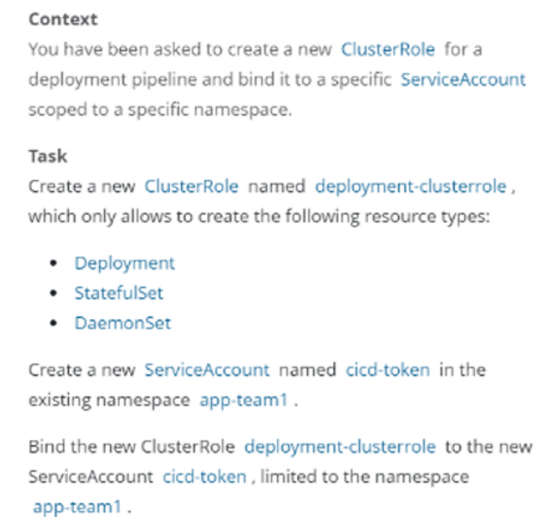

中文解释：
创建一个名为deployment-clusterrole的clusterrole，该clusterrole只允许创建Deployment、Daemonset、Statefulset的create操作
在名字为app-team1的namespace下创建一个名为cicd-token的serviceAccount，并且将上一步创建clusterrole的权限绑定到该serviceAccount。

解题：
可参考：https://kubernetes.io/zh/docs/reference/access-authn-authz/rbac/

https://kubernetes.io/zh/docs/reference/access-authn-authz/rbac/#kubectl-create-clusterrole


答案：

```bash
kubectl create clusterrole deployment-clusterrole --verb=create --resource=deployments,statefulsets,daemonsets

kubectl create namespace app-team1

kubectl create serviceaccount cicd-token -n app-team1

kubectl create rolebinding cicd-token --clusterrole=deployment-clusterrole --serviceaccount=app-team1:cicd-token -n app-team1
# 验证
[root@k8s-m01 ~]# kubectl describe rolebindings -n app-team1 cicd-token
Name:         cicd-token
Labels:       <none>
Annotations:  <none>
Role:
  Kind:  ClusterRole
  Name:  deployment-clusterrole
Subjects:
  Kind            Name        Namespace
  ----            ----        ---------
  ServiceAccount  cicd-token  app-team1

```


## 第2题 节点维护-指定node节点不可用

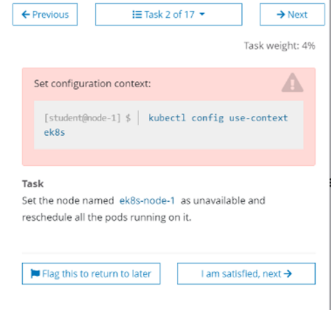

中文解释：
将ek8s-node-1节点设置为不可用，然后重新调度该节点上的所有Pod

参考：https://kubernetes.io/docs/reference/generated/kubectl/kubectl-commands#drain

答案：

```bash
# 设置节点不可调度
kubectl cordon node1
# 恢复节点可调度
kubectl uncordon node1

# 驱逐pod
kubectl drain node1 --ignore-daemonsets --delete-emptydir-data


参数如下：
--delete-emptydir-data 删除emptyDir数据；
--ignore-daemonsets 忽略DeamonSet，否则DeamonSet被删除后，仍会自动重建；
--force 不加force参数只会删除该node节点上的ReplicationController, ReplicaSet, DaemonSet,StatefulSet or Job，加上后所有pod都将删除；
```


## 第3题 K8s版本升级

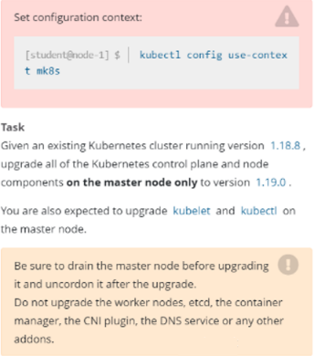

翻译：
现有的 Kubernetes 集群正在运行的版本是 1.20.0，仅将主节点上的所有 kubernetes 控制面板和组件升级到版本 1.20.15 另外，在主节点上升级 kubelet 和 kubectl

解题：
参考：https://kubernetes.io/zh/docs/tasks/administer-cluster/kubeadm/kubeadm-upgrade/

答案：

```bash
kubectl cordon k8s-m01

kubectl drain k8s-m01 --ignore-daemonsets --delete-emptydir-data

yum -y install kubeadm-1.20.15
#验证升级计划
kubeadm upgrade plan
# 开始升级Master节点
kubeadm upgrade apply v1.20.15 --etcd-upgrade=false

# 升级kubectl和kubelet
yum -y install kubelet-1.20.15 kubectl-1.20.15
systemctl daemon-reload
systemctl restart kubelet
kubectl uncordon k8s-m01

```

## 第4题 Etcd数据库备份恢复

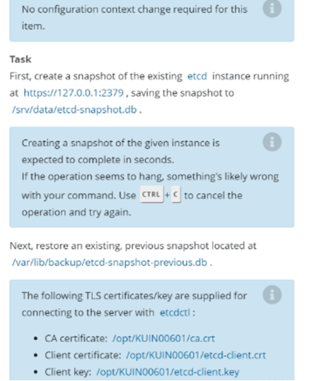

中文解释：
针对etcd实例https://127.0.0.1:2379创建一个快照，保存到/srv/data/etcd-snapshot.db。在创建快照的过程中，如果卡住了，就键入ctrl+c终止，然后重试。
然后恢复一个已经存在的快照： /var/lib/backup/etcd-snapshot-previous.db
执行etcdctl命令的证书存放在：
ca证书：/opt/KUIN00601/ca.crt
客户端证书：/opt/KUIN00601/etcd-client.crt
客户端密钥：/opt/KUIN00601/etcd-client.key

解题：
参考：https://kubernetes.io/zh/docs/tasks/administer-cluster/configure-upgrade-etcd/

```bash
# 注意：需要自己安装etcdctl命令
# 备份
$ export ETCDCTL_API=3  
$ etcdctl --endpoints="https://127.0.0.1:2379" --cacert=/opt/KUIN000601/ca.crt --cert=/opt/KUIN000601/etcd-client.crt --key=/opt/KUIN000601/etcd-client.key  snapshot save /srv/data/etcd-snapshot.db
 
# 还原
$ mkdir /opt/backup/ -p
$ cd /etc/kubernetes/manifests && mv kube-* /opt/backup
$ export ETCDCTL_API=3  
$ etcdctl --endpoints="https://127.0.0.1:2379" --cacert=/opt/KUIN000601/ca.crt --cert=/opt/KUIN000601/etcd-client.crt --key=/opt/KUIN000601/etcd-client.key   snapshot restore /var/lib/backup/etcd-snapshot-previous.db --data-dir=/var/lib/etcd-restore
 
$ vim etcd.yaml
# 将volume配置的path: /var/lib/etcd改成/var/lib/etcd-restore
  volumes:
  - hostPath:
      path: /etc/kubernetes/pki/etcd
      type: DirectoryOrCreate
    name: etcd-certs
  - hostPath:
      path: /var/lib/etcd-restore
 
# 还原k8s组件
$ mv /opt/backup/* /etc/kubernetes/manifests
$ systemctl restart kubelet
```


## 第5题 网络策略NetworkPolicy

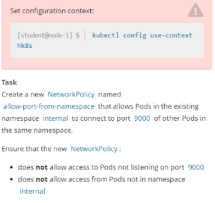

中文解释：
创建一个名字为all-port-from-namespace的NetworkPolicy，这个NetworkPolicy允许internal命名空间下的Pod访问该命名空间下的9000端口。
并且不允许不是internal命令空间的下的Pod访问
不允许访问没有监听9000端口的Pod。

解题：
参考：https://kubernetes.io/zh/docs/concepts/services-networking/network-policies/

```yaml
apiVersion: networking.k8s.io/v1
kind: NetworkPolicy
metadata:
  name: all-port-from-namespace
  namespace: internal
spec:
  ingress:
  - from:
    - podSelector: {}
    ports:
    - port: 9000
      protocol: TCP
  podSelector: {}
  policyTypes:
  - Ingress
```


## 第6题 四层负载均衡service

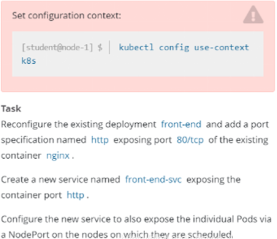


中文解释：
重新配置一个已经存在的deployment  front-end，在名字为nginx的容器里面添加一个端口配置，名字为http，暴露端口号为80，然后创建一个service，名字为front-end-svc，暴露该deployment的http端口，并且service的类型为NodePort。

解题：
本题可以参考：https://kubernetes.io/docs/concepts/services-networking/connect-applications-service/


```bash
spec:
    containers:
    - image: nginx
      imagePullPolicy: IfNotPresent
      name: nginx
      ports:
      - containerPort: 80
        name: http
        protocol: TCP
    
kubectl expose deploy front-end --port=80 --target-port=80 --type=NodePort --name=front-end-svc 

```


## 第7题 七层负载均衡Ingress

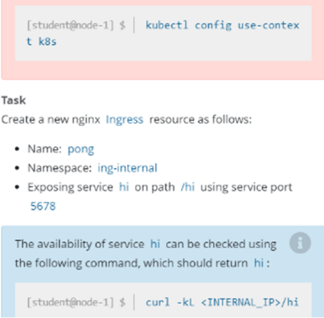

中文解释：
在ing-internal 命名空间下创建一个ingress，名字为pong，代理的service hi，端口为5678，配置路径/hi。
验证：访问curl -kL <INTERNAL_IP>/hi会返回hi

解题：
参考：https://kubernetes.io/zh/docs/concepts/services-networking/ingress/

```bash
vi ingress.yaml

apiVersion: networking.k8s.io/v1
kind: Ingress
metadata:
  name: pong
  namespace: ing-internal
  annotations:
    nginx.ingress.kubernetes.io/rewrite-target: /
spec:
  rules:
  - http:
      paths:
      - path: /hi
        pathType: Prefix
        backend:
          service:
            name: hi
            port:
              number: 5678
            
kubectl apply -f ingress.yaml

curl -kL  xxx/hi

#查看地址信息xxx
kubectl get ingress -o wide 

```


## 第8题 Deployment管理pod扩缩容

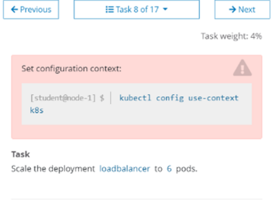

中文解释：
扩容名字为loadbalancer的deployment的副本数为6

解题：

```bash
$ kubectl config use-context k8s
 
$ kubectl scale --replicas=6 deployment loadbalancer
 
或者用$ kubectl edit deployment loadbalancer 直接在线扩容也可以
```


## 第9题 pod指定节点部署

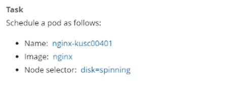

中文解释：
创建一个Pod，名字为nginx-kusc00401，镜像地址是nginx，调度到具有disk=spinning标签的节点上，该题可以参考链接：https://kubernetes.io/zh/docs/tasks/configure-pod-container/assign-pods-nodes/

解题：

```bash
$ vim pod-ns.yaml
apiVersion: v1
kind: Pod
metadata:
  name: nginx-kusc00401
  labels:
    role: nginx-kusc00401
spec:
  nodeSelector:
    disk: spinning
  containers:
    - name: nginx
      image: nginx
$ kubectl create -f pod-ns.yaml
```


## 第10题 检查Node节点的健康状态

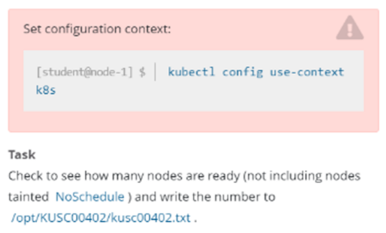

中文解释：
检查集群中有多少节点为Ready状态，并且去除包含NoSchedule污点的节点。之后将数字写到/opt/KUSC00402/kusc00402.txt

解题：

```bash
$ kubectl config use-context k8s
$ kubectl get node | grep -i ready|wc -l   # 记录总数为A
$ kubectl  describe node | grep Taint | grep NoSchedule|wc -l  # 记录总数为B
# 将A减B的值x导入到/opt/KUSC00402/kusc00402.txt
$ echo x >> /opt/KUSC00402/kusc00402.txt
grep -i: 忽略字符大小写的差别。
```


## 第11题 一个Pod封装多个容器

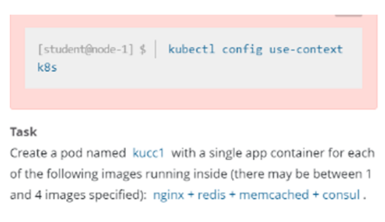

中文解释：
创建一个Pod，名字为kucc1，这个Pod可能包含1-4容器，该题为四个：nginx+redis+memcached+consul

解题：

```yaml
apiVersion: v1
kind: Pod
metadata:
  name: kucc1
spec:
  containers:
  - image: nginx
    name: nginx
  - image: redis
    name: redis
  - image: memchached
    name: memcached
  - image: consul
    name: consul
```


## 第12题 持久化存储卷Persistent、Volume

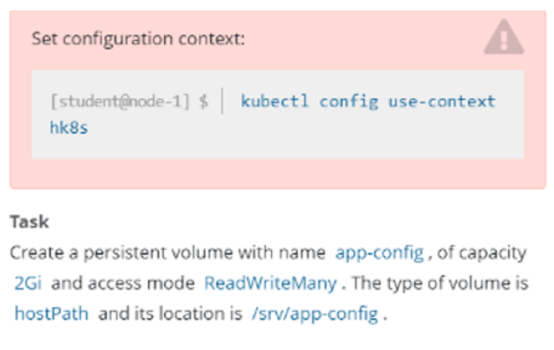

中文解释：
创建一个pv，名字为app-config，大小为2Gi，访问权限为ReadWriteMany。Volume的类型为hostPath，路径为/srv/app-config
解题：
参考：https://kubernetes.io/docs/tasks/configure-pod-container/configure-persistent-volume-storage/

```yaml
apiVersion: v1
kind: PersistentVolume
metadata:
  name: app-config
  labels:
    type: local
spec:
  storageClassName: manual  #可以写也可以不写
  capacity:
    storage: 2Gi
  accessModes:
    - ReadWriteMany
  hostPath:
    path: "/srv/app-config"
```


## 第13题 PersistentVolumeClaim

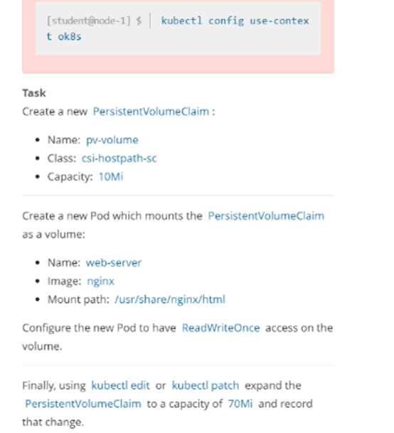

中文文档：
创建一个名字为pv-volume的pvc，指定storageClass为csi-hostpath-sc，大小为10Mi
然后创建一个Pod，名字为web-server，镜像为nginx，并且挂载该PVC至/usr/share/nginx/html，挂载的权限为ReadWriteOnce。之后通过kubectl edit或者kubectl path将pvc改成70Mi，并且记录修改记录。
解题：
参考：https://kubernetes.io/docs/tasks/configure-pod-container/configure-persistent-volume-storage/

```yaml
创建PVC：
apiVersion: v1
kind: PersistentVolumeClaim
metadata:
  name: pv-volume
spec:
  accessModes:
  - ReadWriteOnce
  resources:
    requests:
      storage: 10Mi
  storageClassName: csi-hostpath-sc
创建Pod：
apiVersion: v1
kind: Pod
metadata:
  name: web-server
spec:
  containers:
    - name: nginx
      image: nginx
      volumeMounts:
      - mountPath: "/usr/share/nginx/html"
        name: pv-volume
  volumes:
    - name: pv-volume
      persistentVolumeClaim:
        claimName: pv-volume
扩容：
方式一Patch命令：
kubectl patch pvc pv-volume  -p '{"spec":{"resources":{"requests":{"storage": "70Mi"}}}}' --record
 
方式二edit：
kubectl  edit pvc pv-volume
```


## 第14题 监控Pod日志

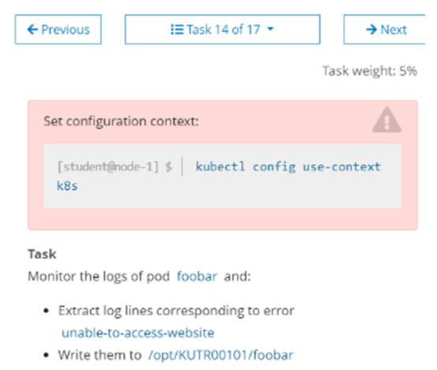


中文解释：
监控名为foobar的Pod的日志，并过滤出具有unable-access-website 信息的行，然后将写入到 /opt/KUTR00101/foobar

解题：

```bash
$ kubectl config use-context k8s
$ kubectl logs foobar | grep unable-access-website > /opt/KUTR00101/foobar
```


## 第15题 Sidecar代理

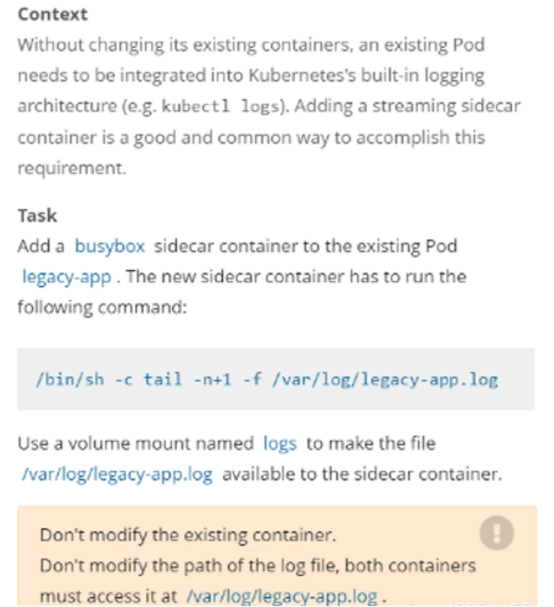

中文解释：
添加一个名为busybox且镜像为busybox的sidecar到一个已经存在的名为legacy-app的Pod上，这个sidecar的启动命令为/bin/sh, -c, 'tail -n+1 -f /var/log/legacy-app.log'。
并且这个sidecar和原有的镜像挂载一个名为logs的volume，挂载的目录为/var/log/

解题：
本题答案：https://kubernetes.io/zh/docs/concepts/cluster-administration/logging/
首先将legacy-app的Pod的yaml导出，大致如下：

```bash
$ kubectl get po legacy-app -oyaml > c-sidecar.yaml
apiVersion: v1
kind: Pod
metadata:
  name: legacy-app
spec:
  containers:
  - name: count
    image: busybox
    args:
    - /bin/sh
    - -c
    - >
      i=0;
      while true;
      do
        echo "$(date) INFO $i" >> /var/log/legacy-ap.log;
        i=$((i+1));
        sleep 1;
      done   
再此yaml中添加sidecar和volume
$ vim c-sidecar.yaml
apiVersion: v1
kind: Pod
metadata:
  name: legacy-app
spec:
  containers:
  - name: count
    image: busybox
    args:
    - /bin/sh
    - -c
    - >
      i=0;
      while true;
      do
        echo "$(date) INFO $i" >> /var/log/legacy-ap.log;
        i=$((i+1));
        sleep 1;
      done      
    volumeMounts:
    - name: logs
      mountPath: /var/log
  - name: busybox
    image: busybox
    args: [/bin/sh, -c, 'tail -n+1 -f /var/log/legacy-ap.log']
    volumeMounts:
    - name: logs
      mountPath: /var/log
  volumes:
  - name: logs
    emptyDir: {}
$ kubectl  delete -f c-sidecar.yaml ; kubectl create -f c-sidecar.yaml
```


## 第16题 监控Pod度量指标

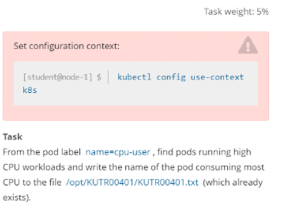

中文解释：
找出具有name=cpu-user的Pod，并过滤出使用CPU最高的Pod，然后把它的名字写在已经存在的/opt/KUTR00401/KUTR00401.txt文件里(注意他没有说指定namespace。所以需要使用-A指定所以namespace)

解题：

```
$ kubectl config use-context k8s
# --sort-by=cpu  按cpu使用率从大到小排序列出
$ kubectl  top po -A -l name=cpu-user --sort-by=cpu

# 注意这里的pod名字以实际名字为准，按照CPU那一列进行选择一个最大的Pod，另外如果CPU的数值是1 2 3这样的。是大于带m这样的，因为1颗CPU等于1000m，注意要用>>而不是>
$ echo "xxx" >> /opt/KUTR00401/KUTR00401.txt
```


## 第17题 集群故障排查 – kubelet故障

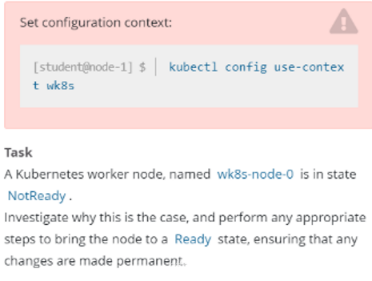

中文解释：
一个名为wk8s-node-0的节点状态为NotReady，让其他恢复至正常状态，并确认所有的更改开机自动完成

解题：

```
# systemctl status kubelet 
# systemctl start kubelet
# systemctl enable kubelet
```


