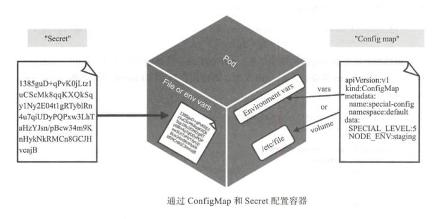

[TOC]


# Secret

Secret对象与ConfigMap对象类似，但它主要用于存储以下敏感信息，例如密码，OAuth token和SSH key等等。将这些信息存储在secret中，或直接存储在Pod的定义中，与Docker镜像定义中相比，更加安全和灵活。


# 1 Secret概述

Secret 以键值方式存储数据，Pod 资源中通过环境变量或存储卷进行数据访问。不同的是， Secret 对象仅会被分发至调用了此对象的 Pod 资源所在的工作节点，且只能由节点将其存储于内存中。另外， Secret对象的数据的存储及打印格式为 Base64 编码的字符串，因此用户在创建 Secret 对象时也要提供此种编码格式的数据。不过，在容器中以环境变量或存储卷的方式访问时，它们会被自动解码为明文格式。

需要注意的是，在 Master 节点上， Secret 对象以非加密的格式存储于 etcd 中，因此管理员必须加以精心管控以确保敏感数据的机密性，必须确保 etcd 集群节点间以及与 API Server 的安全通信，etcd 服务的访问授权，还包括用户访问 API Server 时的授权，因为拥有创建 Pod 资源的用户都可以使用 Secret 资源并能够通过 Pod 中的容器访问其数据。

Secret 对象主要有**两种用途**， 一是作为存储卷注入到 Pod 上由容器应用程序所使用，二是用于 kubelet Pod 里的容器拉取镜像时向私有仓库提供认证信息。不过，后面使用ServiceAccount 资源自建的 Secret 对象是一种更具安全性的方式。

通过 ConfigMap和Secret配置容器方式如下：




**Secret 资源主要由四种类型组成：**

-  `Opaque `：自定义数据内容； base64 编码，用来存储密码、密钥、信息、证书等数据，类型标识符为 generic。
- `kubernetes.io/service-account-token` :用来访问Kubernetes API，由Kubernetes自动创建，并且会自动挂载到Pod的 `/run/secrets/kubernetes.io/serviceaccount `目录中。
- `kubernetes.io/dockerconfigjson` ：用来存储 Docker 镜像仓库的认证信息，类型标识为docker-registry。
- `kubernetes.io/tls ` ：用于为 SSL 通信模式存储证书和私钥文件，命令式创建时类型标识为 tls。

> **==注意：==**base叫编码并非加密机制，其编码的数据可使用`base64 decode` 一 类的命令进行解码。


# 2 创建 Secret 资源

手动创建 Secret 对象的方式有两种通过 kubectl create 命令和使用 Secret 配置文件。


## 2.1 命令行创建

不少场景中， Pod 中的应用需要通过用户名和密码访问其他服务，例如访问数据库系统等。

1) 使用 **--from-literal** 方式来创建（每个 **--from-literal** 对应一个信息条目）：

```bash
kubectl create secret generic mysecret --from-literal=username=admin --from-literal=password=123456
```

2) 使用 **--from-env-file** 方式来创建（文件 **env.txt** 中每行 **Key=Value** 对应一个信息条目）:

```bash
cat << EOF > env.txt
username=admin
password=123456
EOF
 
kubectl create secret generic mysecret --from-env-file=env.txt

```

3) 使用 **--from-file** 方式来创建（每个文件内容对应一个信息条目）：

```bash
echo -n admin > ./username
echo -n 123456 > ./password
kubectl create secret generic mysecret --from-file=./username --from-file=./password
```

创建后查看：

```bash
$ kubectl create secret generic mysecret --from-literal=username=admin --from-literal=password=123456
$ kubectl get secrets |grep mysecret
mysecret                             Opaque                                2      21s
$ kubectl get secrets mysecret -o yaml
apiVersion: v1
data:
  password: MTIzNDU2
  username: YWRtaW4=
kind: Secret
metadata:
  creationTimestamp: "2021-06-15T06:54:17Z"
  managedFields:
  - apiVersion: v1
    fieldsType: FieldsV1
    fieldsV1:
      f:data:
        .: {}
        f:password: {}
        f:username: {}
      f:type: {}
    manager: kubectl
    operation: Update
    time: "2021-06-15T06:54:17Z"
  name: mysecret
  namespace: default
  resourceVersion: "13607664"
  selfLink: /api/v1/namespaces/default/secrets/mysecret
  uid: cf148285-2270-4e3c-8a8c-3c595a7b91ca
type: Opaque

# 解码base64

$ echo MTIzNDU2|base64 -d
123456
$ echo YWRtaW4=|base64 -d
admin

```

若要基于私钥和数字证书文件创建用于 SSL/TLS 通信的 Secret 对象，则需要使用  `kubectl create secret tls <SECRET_NAME> --cert=  --key=`  命令来进行，注意其类型标识符为TLS。


## 2.2 YAML文件创建

Secret 资源是标准的 Kubernetes API 对象 除了标准的 apiVersion、kind、metadata字段，它可用的其他字段具体如下：

- `data<map[string]string>`：“ key:value ”格式的数据，通常是敏感信息，数据格式需是以Base64 格式编码的 符串，因此需要用户事先完成编码。
- `stringData <map[string]string> `：以明文格式（非 Base64 编码）定义的“ key:value“ 数据；是在创建为 Secret 对象时自动进行编码并保存 data 段中； stringData 段中的明文不会被 API Server 输出，不过若是使用“ kubectl apply ”，命令进行的创建，那么注解信息中还是可能会，接输出这些信息的。
- `type <string>` ：仅是为了便于编程方式处理 Secret 数据而提供的类型标识


手动加密，基于base64加密

```javascript
$ echo -n 'admin' | base64
YWRtaW4=
$ echo -n '123456' | base64
MTIzNDU2
```

vim mysecret.yaml

```yaml
apiVersion: v1
kind: Secret
metadata:
  name: mysecret
  type: Opaque
data:
  username: YWRtaW4=
  password: MTIzNDU2
```

创建后查看：

```yaml
$ kubectl create -f  mysecret.yaml
secret/mysecret created
$ kubectl get secrets mysecret
NAME       TYPE     DATA   AGE
mysecret   Opaque   2      8s
$ kubectl get secrets mysecret -o yaml
apiVersion: v1
data:
  password: MTIzNDU2
  username: YWRtaW4=
kind: Secret
metadata:
  creationTimestamp: "2021-06-15T07:23:34Z"
  managedFields:
  - apiVersion: v1
    fieldsType: FieldsV1
    fieldsV1:
      f:data:
        .: {}
        f:password: {}
        f:username: {}
      f:type: {}
    manager: kubectl
    operation: Update
    time: "2021-06-15T07:23:34Z"
  name: mysecret
  namespace: default
  resourceVersion: "13611818"
  selfLink: /api/v1/namespaces/default/secrets/mysecret
  uid: e9552011-2eab-46be-a241-4ac48e9ea97c
type: Opaque

```


# 3 Secret资源使用

secret可以作为数据卷挂载或者作为环境变量暴露给Pod中的容器使用，也可以被系统中的其他资源使用。比如可以用secret导入与外部系统交互需要的证书文件等。


## 3.1 通过环境变量方式

> ==**注意**：==虽然环境变量读取 **Secret** 很方便，但无法支撑 **Secret** 动态更新。


vim mypod-secret.yaml

```yaml
apiVersion: v1
kind: Pod
metadata:
  name: mypod
spec:
  containers:
  - image: busybox
    name: app
    args:
    - /bin/sh
    - -c
    - sleep 10; touch /tmp/healthy; sleep 30000
    env:
      - name: SECRET_USERNAME
        valueFrom:
          secretKeyRef:
            name: mysecret
            key: username
      - name: SECRET_PASSWORD
        valueFrom:
          secretKeyRef:
            name: mysecret
            key: password
```

创建后查看：

```bash
$ kubectl create -f mypod-secret.yaml
pod/mypod created

$ kubectl exec -it mypod -- env|grep SECRET
SECRET_USERNAME=admin
SECRET_PASSWORD=123456

```


## 3.2 通过 Volume 方式

> ==**注意**==：以 **Volume** 方式使用的 **Secret** 支持动态更新。也就是说 **Secret** 更新后，容器中的数据也会更新。

**挂载全部数据：**


vim mypod-secret-v1.yaml


```yaml
apiVersion: v1
kind: Pod
metadata:
  name: mypod
spec:
  containers:
  - image: busybox
    name: app
    volumeMounts:
    - mountPath: /etc/secrets
      name: secrets
      readOnly: true
    args:
    - /bin/sh
    - -c
    - sleep 10; touch /tmp/healthy; sleep 30000
  volumes:
  - name: secrets
    secret:
      secretName: mysecret
```


**挂载部分数据：**

vim mypod-secret-v2.yaml

```yaml
apiVersion: v1
kind: Pod
metadata:
  name: mypod
spec:
  containers:
  - image: busybox
    name: app
    volumeMounts:
    - mountPath: /etc/secrets
      name: secrets
      readOnly: true
    args:
    - /bin/sh
    - -c
    - sleep 10; touch /tmp/healthy; sleep 30000
  volumes:
  - name: secrets
    secret:
      secretName: mysecret
      items:
      - key: username
        path: my-group/my-username
      - key: password
        path: my-group/my-password
```

执行后查看：

```bash
$ kubectl create -f mypod-secret-v2.yaml
pod/mypod created

$ kubectl exec  -it mypod -- ls /etc/secrets/my-group
my-password  my-username

$ kubectl exec  -it mypod -- cat /etc/secrets/my-group/my-password
123456

```

验证热更新：

```bash
echo -n 'root'|base64
cm9vdA==

$ kubectl edit secrets mysecret
secret/mysecret edited

$ kubectl exec  -it mypod -- cat /etc/secrets/my-group/my-username
root

```


​	
