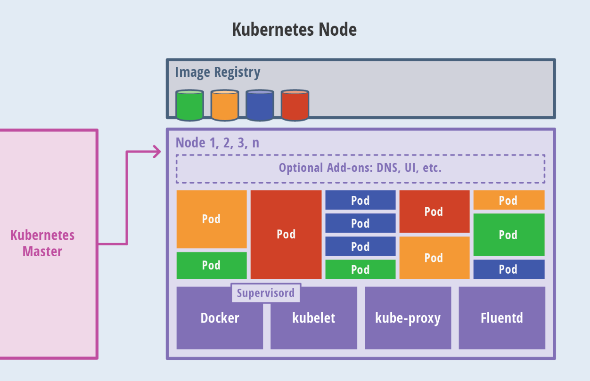
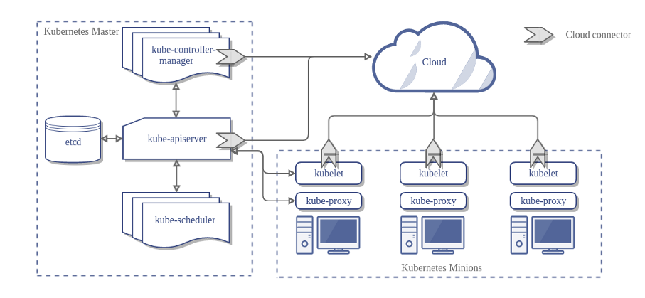
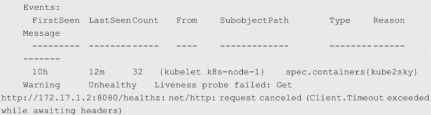
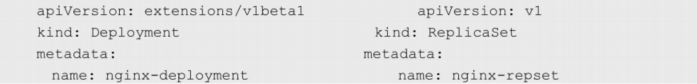
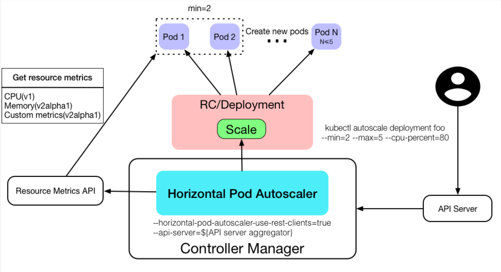
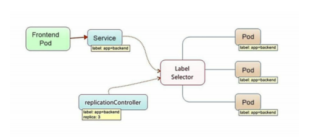
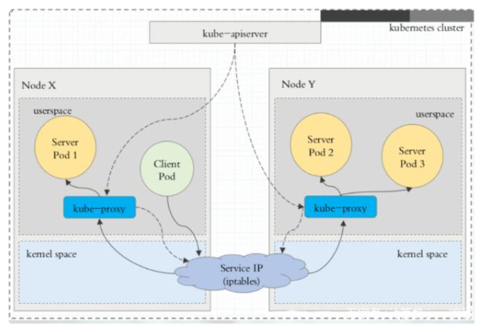
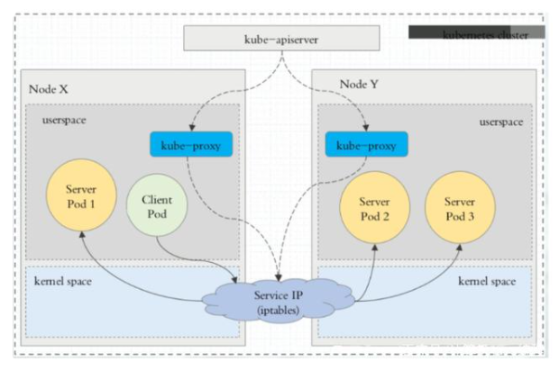
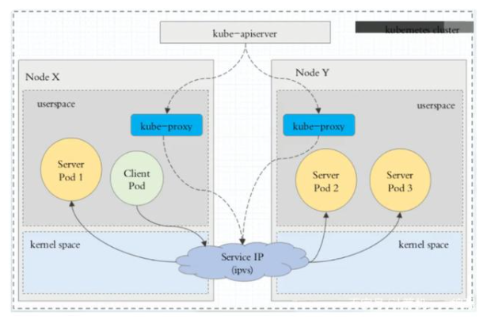

[TOC]


# kubernetes的基本概念

​		Kubernetes中的大部分概念如Node、Pod、Replication Controller、Service等都可以被看作一种资源对象，几乎所有资源对象都可以通过Kubernetes提供的kubectl工具（或者API编程调用）执行增、删、改、查等操作并将其保存在etcd中持久化存储。从这个角度来看Kubernetes其实是一个高度自动化的资源控制系统，它通过跟踪对比etcd库里保存的“资源期望状态”与当前环境中的“实际资源状态”的差异来实现自动控制和自动纠错的高级功能。


# 1 Master

​		Kubernetes里的Master指的是集群控制节点，在每个Kubernetes集群里都需要有一个Master来负责整个集群的管理和控制，基本上 Kubernetes的所有控制命令都发给它，它负责具体的执行过程，我们后面执行的所有命令基本都是在Master上运行的。Master通常会占据一个独立的服务器（高可用部署建议用3台服务器），如果它宕机或者不可用，那么对集群内容器应用的管理都将失效。 

master节点上主要运行四个组件：api-server、scheduler、controller-manager、etcd。


| 组件               | 作用                                                         |
| ------------------ | ------------------------------------------------------------ |
| kube-apiserver     | 提供了HTTP Rest 接口的关键服务进程，是Kubernetes里所有资源的增、删、改、查等 操作的唯一入口；各组件协调者并提供认证、授权、访问控制、API注册和发现等机制。 |
| scheduler          | 负责资源调度 （Pod调度）的进程，相当于公交公司的“调度室”。   |
| controller-manager | Kubernetes里所有资源对象的自动化控制中心，可以将其理解为资源对象的“大总管”。 |
| etcd               | etcd是一个高可用的键值存储系统，Kubernetes使用它来存储所有资源对象的的状态和数据，从而实现了Restful的API。 |


# 2 Node

​		Node是Kubernetes集群中的工作负载节点，每个Node都会被Master分配一些工作负载（Docker容器），当某个Node宕机时，其上的工作负载会被Master自动转移到其他节点上。

​		每个Node节点主要由三个模块组成：kubelet、kube-proxy、Container runtime。



| 组件              | 作用                                                         |
| ----------------- | ------------------------------------------------------------ |
| Container runtime | 负责本机的容器创建和管理工作。                               |
| kube-proxy        | 实现Kubernetes Service的通信与负载均衡机制的重要组件。       |
| kubelet           | 负责Pod对应的容器的创建、启停等任务，同时与 Master密切协作，实现集群管理的基本功能。 |

除了核心组件，还有一些推荐的Add-ons（插件）：

- kube-dns负责为整个集群提供DNS服务
- Ingress Controller为服务提供外网入口
- Heapster提供资源监控
- Dashboard提供GUI
- Federation提供跨可用区的集群
- Fluentd-elasticsearch提供集群日志采集、存储与查询


**master与node关系：**




# 3 Pod

​		**Pod是Kubernetes最重要的基本概念，容器组Pod是最小部署单元，一个Pod有一个或多个容器组成， Pod中容器共享存储和网络，在同一台Docker主机上运行。**


Kubernetes会设计出一个全新的Pod的概念并且有这样特殊的组成结构？ 

1、通过容器组的状态，去解决容器死亡率的问题，更好的判断业务的存活状态；

2、解决多个容器网络通信和文件共享问题；

​		Kubernetes为每个Pod都分配了唯一的IP地址，称之为Pod IP，一个Pod里的多个容器共享Pod IP地址。Kubernetes要求底层网络支持集群内任意两个Pod之间的TCP/IP直接通信，这通常采用虚拟二层网络技术来实现，例如Flannel、OpenvSwitch等，因此我们需要牢记一点：在Kubernetes里，一个Pod里的容器与另外主机上的Pod容器能够直接通信。

Pod有两种类型：**普通的Pod**和**静态Pod**（Static Pod）。静态Pod比较特殊，它并没被存放在Kubernetes的etcd存储里，而是被存放在 某个具体的Node上的一个具体文件中，并且只在此Node上启动、运行。而普通的Pod一旦被创建，就会被放入etcd中存储，随后会被 Kubernetes Master调度到某个具体的Node上并进行绑定（Binding），随后该Pod被对应的Node上的kubelet进程实例化成一组相关的Docker容器并启动。在默认情况下，当Pod里的某个容器停止时，Kubernetes会自动检测到这个问题并且重新启动这个Pod（重启Pod里 的所有容器），如果Pod所在的Node宕机，就会将这个Node上的所有Pod重新调度到其他节点上。

Pod、容器与Node的关系如图所示：


​		每个Pod都可以对其能使用的服务器上的计算资源设置限额，当前可以设置限额的计算资源有CPU与Memory两种，其中CPU的资源单位为CPU（Core）的数量，是一个绝对值而非相对值。

​		Kubernetes里通常以千分之一的CPU配额为最小单位，用m来表示。通常一个容器的CPU配额被定义为100～300m，即占用0.1～0.3个CPU。与CPU配额类似，Memory配额也是一个绝对值，它的单位是内存字节数。 

在Kubernetes里，一个计算资源进行配额限定时需要设定以下两个参数。

- Requests：该资源的最小申请量，系统必须满足要求。 
- Limits：该资源最大允许使用的量，不能被突破，当容器试图使用超过这个量的资源时，可能会被Kubernetes“杀掉”并重启。

示例：

表明MySQL容器申请最少0.25个CPU及64MiB内存，在运行过程中MySQL容器所能使用的资源配额为0.5个CPU及128MiB内存： 

```yml
spec:
  containers:
  - name: db
    image: mysql
    resource:
      requests:
        memory: "64Mi"
        cpu: "250m"
      limits:
        memory: "128Mi"
        cpu: "500m"
```


# 4 Event

Event是一个事件的记录，记录了事件的最早产生时间、最后重现时间、重复次数、发起者、类型，以及导致此事件的原因等众多信息。Event通常会被关联到某个具体的资源对象上，是排查故障的重要参考信息，之前我们看到Node的描述信息包括了Event，而Pod同样有Event记录，当我们发 现某个Pod迟迟无法创建时，可以用`kubectl describe pod xxxx`来查看它的描述信息，以定位问题的成因，比如下面这个Event记录信息表明Pod里的一个容器被探针检测为失败一次： 




# 5 Label

Label（标签）是Kubernetes系统中另外一个核心概念。**一个Label是一个key=value的键值对**，其中key与value由用户自己指定。

Label可以被附加到各种资源对象上，例如Node、Pod、Service、RC 等，一个资源对象可以定义任意数量的Label，同一个Label也可以被添加到任意数量的资源对象上。Label通常在资源对象定义时确定， 也可以在对象创建后动态添加或者删除。**每一个对象可以拥有多个标签，但是，key值必须是唯一的。** 

**作用：**通过对资源对象捆绑一个或多个不同的Label来实现多维度的资源分组管理功能，以便灵活、方便地进行资源分配、调度、配置、部署等管理工作。

例如，部署不同版本的应用到不同的环境中；监控和分析应用（日志记录、监控、告警）等。一些常用的Label示例如下：

- 版本标签："release":"stable"、"release":"canary"。 
- 环境标签："environment":"dev"、"environment":"qa"、"environment":"production"。 
- 架构标签："tier":"frontend"、"tier":"backend"、"tier":"middleware"。 
- 分区标签："partition":"customerA"、"partition":"customerB"。 
- 质量管控标签："track":"daily"、"track":"weekly"。 


给某个资源对象定义一个 Label，就相当于给它打了一个标签，随后可以通过Label Selector（标签选择器）查询和筛选拥有某些Label的资源对象，Label Selector可以被类比为SQL语句中的where查询条件，

当前有两种Label Selector表达式：基于等式的（Equality-based）和基于集合的（Set-based）。

**等式类表达式匹配标签：**

- name=redis-slave：匹配所有具有标签name=redis-slave的资源对象。
- env!=production：匹配所有不具有标签env=production的资源对象，比如env=test就是满足此条件的标签之一。 

**集合操作类表达式匹配标签：**

- name in（redis-master, redis-slave）：匹配所有具有标签name=redis-master或者name=redis-slave的资源对象。 
- name not in（php-frontend）：匹配所有不具有标签name=php-frontend的资源对象。 

通过多个Label Selector表达式的组合实现复杂的条件选择，多个表达式之间用“，”进行分隔即可，几个条件之间是“AND”的关系，即同时满足多个条件，比如下面的例子：

```
name=redis-slave,env!=production
name notin (php-frontend),env!=production
```

matchLabels用于定义一组Label，与直接写在Selector中的作用相同；matchExpressions用于定义一组基于集合的筛选条件，可用的条 件运算符包括In、NotIn、Exists和DoesNotExist。如果同时设置了matchLabels和matchExpressions，则两组条件为AND关系，即需要同时满足所有条件才能完成Selector的筛选。 

要查看每个Pod自动生成的标签，运行`kubectl get pods --show-labels`输出。


# 6 Replication Controller

Replication Controller（简称RC）,是Kubernetes系统中的核心概念之一，即声明某种Pod的副本数量在任意时刻都符合某个预期值，所以RC的定义包括如下几个部分。 

- Pod期待的副本数量
- 用于筛选目标Pod的Label Selector
- 当Pod的副本数量小于预期数量时，用于创建新Pod的Pod模板（template）

示例：

一个完整的RC定义的例子 [frontend-rc.yaml](assets\frontend-rc.yaml) ，即确保拥有tier=frontend标签的这个Pod（运行Tomcat容器）在整个Kubernetes集群中始终只有一个副本：

```yml
apiVersion: v1
kind: ReplicationController
metadata:
  name: frontend
spec:
  replicas: 1
  selector:
    tier: frontend
  template:
    metadata:
      labels:
        app: app-demo
        tier: frontend
    spec:
      containers:
      - name: tomcat-demo
        image: tomcat
        imagePullPolicy: IfNotPresent
        env:
        - name: GET_HOSTS_FROM
          value: dns
        ports:
        - containerPort: 80

```

将RC将其提交到Kubernetes集群中后，Master 上的Controller Manager组件就得到通知，定期巡检系统中当前存活的目标Pod，并确保目标Pod实例的数量刚好等于此RC的期望值，有过多的Pod副本在运行，系统就会停掉一些Pod，少于1个就会自动创建，大大减少了系统管理员在传统IT环境中需要完成的许多手工运维工作（如主机监控脚本、应用监控脚本、故障恢复脚本等）。


`kubectl scale`命令对RC的副本数量进行动态缩放（scaling）：

```bash
kubctl scale rc redis-slave --replicas=3
```

需要注意的是，删除RC并不会影响通过该RC已创建好的Pod。为了删除所有Pod，可以设置replicas的值为0，然后更新该RC。另外，kubectl提供了stop和delete命令来一次性删除RC和RC控制的全部Pod。

**应用场景：**

​		应用升级时，通常会使用一个新的容器镜像版本替代旧版本。我们希望系统平滑升级，比如在当前系统中有10个对应的旧版本的Pod，则最佳的系统升级方式是旧版本的Pod每停止一个，就同时创建一个新版本的Pod，在整个升级过程中此消彼长，而运行中的Pod数量始终是10个，几分钟以后，当所有的Pod都已经是新版本时，系统升级完成。通过RC机制，Kubernetes很容易就实现了这种高级实用的特性，被称为“滚动升级”（Rolling Update）。

**Replica Set和Replication Controller的区别：**

Replica Set与RC当前的唯一区别是，**Replica Sets支持基于集合的Label selector（Set-based selector）**，**而 RC只支持基于等式的Label Selector（equality-based selector）**，这使得Replica Set的功能更强。


# 7 Deployment

Deployment是Kubernetes在1.2版本中引入的新概念，用于更好地解决Pod的编排问题。是一个更高层次的API对象，它管理ReplicaSets和Pod，并提供声明式更新等功能。官方建议使用Deployment管理ReplicaSets，而不是直接使用ReplicaSets。


Deployment的典型使用场景有以下几个。 

- 创建一个Deployment对象来生成对应的Replica Set并完成Pod副本的创建。 
- 检查Deployment的状态来看部署动作是否完成（Pod副本数量是否达到预期的值）。 
- 更新Deployment以创建新的Pod（比如镜像升级）。 
- 如果当前Deployment不稳定，则回滚到一个早先的Deployment版本。 
- 暂停Deployment以便于一次性修改多个PodTemplateSpec的配置项，之后再恢复Deployment，进行新的发布。 
- 扩展Deployment以应对高负载。 
- 查看Deployment的状态，以此作为发布是否成功的指标。 
- 清理不再需要的旧版本ReplicaSets。 

除了API声明与Kind类型等有所区别，Deployment的定义与Replica Set的定义很类似：



示例：

创建一个名为  [frontend-deployment.yaml](assets\frontend-deployment.yaml) 的Deployment描述文件，内容如下： 

```yml
apiVersion: apps/v1
kind: Deployment
metadata:
  name: frontend
spec:
  replicas: 1
  selector:
    matchLabels:
      tier: frontend
    matchExpressions:
      - {key: tier, operator: In, values: [frontend]}
  template:
    metadata:
      labels:
        app: app-demo
        tier: frontend
    spec:
      containers:
      - name: tomcat-demo
        image: tomcat
        imagePullPolicy: IfNotPresent
        ports:
        - containerPort: 8080

```

创建Deployment：

```bash
# kubectl create -f frontend-deployment.yaml
deployment.apps/frontend created
```

查看Deployment的信息

```bash
# kubectl get deployments
NAME       READY   UP-TO-DATE   AVAILABLE   AGE
frontend   1/1     1            1           23m
```

对上述输出中涉及的数量解释如下。 

- `READY` ：1/1左边1是真正运行的副本数，右边1是期望的副本数即replicas定义的副本数。
- `UP-TO-DATE`：显示已更新以实现期望状态的副本数。
- `AVAILABLE`：显示应用程序可供用户使用的副本数。
- `AGE` ：显示应用程序运行的时间量。

要查看Deployment创建的ReplicaSet（rs），运行`kubectl get rs`输出，看到它的命名与Deployment的名称有关系： 

ReplicaSet 命名规则是：[DEPLOYMENT-NAME]-[RANDOM-STRING]

```bash
# kubectl get rs
NAME                  DESIRED   CURRENT   READY   AGE
frontend-797f47d685   1         1         1       44m
```

查看对应的pod：

发现Pod的命名以Deployment对应的Replica Set的名称为前缀。

```bash
# kubectl get pods
NAME                        READY   STATUS    RESTARTS   AGE
frontend-797f47d685-q5zc6   1/1     Running   0          53m
```

运行kubectl describe deployments，可以清楚地看到Deployment控制的Pod的水平扩展过程。


# 8 Horizontal Pod Autoscaler

通过手工执行kubectl scale命令，我们可以实现Pod扩容或缩容。 显然不符合谷歌对Kubernetes的定位目标—自动化、智能化。

Kubernetes有一个Horizontal Pod Autoscaling（Pod横向自动扩容，HPA）的资源，可以根据CPU使用率或应用自定义metrics自动扩展Pod数量。

**注意**：从kubernetes1.11开始Heapster被废弃不在使用，metrics-server 替代了heapster。实现HPA首先需要部署metrics-server，一个集群级别的资源利用率数据的聚合器。

Horizontal Pod Autoscaling可以根据CPU使用率或应用自定义metrics自动扩展Pod数量（支持replication controller、deployment和replica set）。

- 控制管理器每隔30s（可以通过–horizontal-pod-autoscaler-sync-period修改）查询metrics的资源使用情况
- 支持三种metrics类型
  - 预定义metrics（比如Pod的CPU）以利用率的方式计算
  - 自定义的Pod metrics，以原始值（raw value）的方式计算
  - 自定义的object metrics
- 支持两种metrics查询方式：Heapster和自定义的REST API
- 支持多metrics




HPA与之前的RC、Deployment一样，也属于一种Kubernetes资源对象。通过追踪分析指定RC控制的所有目标Pod的负载变化情况，来 确定是否需要调整目标Pod的副本数量，这是HPA的实现原理。

**当前，HPA有以下两种方式作为Pod负载的度量指标：**

- **CPU UtilizationPercentage**：是一个算术平均值，即目标Pod所有副本自身的CPU利用率的平均值。 一个Pod自身的CPU利用率是该Pod当前CPU的使用量除以它的Pod Request的值，比如定义一个Pod的Pod Request为0.4，而当前Pod的CPU使用量为0.2，则它的CPU使用率为 50%，如果目标Pod没有定义Pod Request的值，则无法使用 CPU UtilizationPercentage实现Pod横向自动扩容。
- **应用程序自定义的度量指标**：比如服务在每秒内的相应请求数（TPS或QPS）。 


1、根据CPU进行HPA伸缩过程

```bash
# 创建pod和service
# kubectl run php-apache --image=registry.cn-beijing.aliyuncs.com/crazywjj/hpa-example:V1.0 --requests=cpu=200m --expose --port=80

cat >php-apache.yaml<<EOF
apiVersion: apps/v1
kind: Deployment
metadata:
  name: php-apache
spec:
  selector:
    matchLabels:
      run: php-apache
  replicas: 1
  template:
    metadata:
      labels:
        run: php-apache
    spec:
      containers:
      - name: php-apache
        image: registry.cn-beijing.aliyuncs.com/crazywjj/hpa-example:V1.0
        imagePullPolicy: IfNotPresent
        ports:
        - containerPort: 80
        resources:
          limits:
            cpu: 500m
          requests:
            cpu: 200m
---
apiVersion: v1
kind: Service
metadata:
  name: php-apache
  labels:
    run: php-apache
spec:
  ports:
  - port: 80
  selector:
    run: php-apache
EOF

$ kubectl create -f  php-apache.yaml
service "php-apache" created
deployment "php-apache" created

# 命令行创建autoscaler
$ kubectl autoscale deployment php-apache --cpu-percent=50 --min=1 --max=10
deployment "php-apache" autoscaled
或者
vim hpa.yaml
apiVersion: autoscaling/v1
kind: HorizontalPodAutoscaler
metadata:
  name: php-apache
  namespace: default
spec:
  maxReplicas: 10
  minReplicas: 1
  scaleTargetRef:
    kind: Deployment
    name: php-apache
  targetCPUUtilizationPercentage: 50

$ kubectl get hpa
NAME         REFERENCE               TARGETS   MINPODS   MAXPODS   REPLICAS   AGE
php-apache   Deployment/php-apache   0%/50%    1         10        1          16m

# 增加负载,需要一段时间
$ kubectl run -i --tty load-generator --rm --image=busybox --restart=Never -- /bin/sh -c "while sleep 0.01; do wget -q -O- http://php-apache; done"

# 查看hpa负载
$ kubectl get hpa
NAME         REFERENCE               TARGETS    MINPODS   MAXPODS   REPLICAS   AGE
php-apache   Deployment/php-apache   191%/50%   1         10        1          16m

# 查看hpa详情
$ kubectl describe hpa php-apache

# autoscaler将这个deployment扩展为5个pod
$ kubectl get deployment php-apache
NAME         READY   UP-TO-DATE   AVAILABLE   AGE
php-apache   5/5     5            5           18m

# 删除刚才创建的负载增加pod后会发现负载降低，并且pod数量也自动降回1个（也需要一段时间）
$ kubectl delete pod load-generator
$ kubectl get hpa
NAME         REFERENCE                     TARGET    CURRENT   MINPODS   MAXPODS   AGE
php-apache   Deployment/php-apache/scale   50%       0%        1         10        11m

$ kubectl get deployment php-apache
NAME         READY   UP-TO-DATE   AVAILABLE   AGE
php-apache   1/1     1            1           23m
```


**HPA伸缩过程：**

- 收集HPA控制下所有Pod最近的cpu使用情况（CPU utilization）
- 对比在扩容条件里记录的cpu限额（CPUUtilization） • 调整实例数（必须要满足不超过最大/最小实例数）
- 每隔30s做一次自动扩容的判断 CPU utilization的计算方法是用cpu usage（最近一分钟的平均值，通过metrics可以直接获取到）除以 cpu request（这里cpu request就是我们在创建容器时制定的cpu使用核心数）得到一个平均值，这个 平均值可以理解为：平均每个Pod CPU核心的使用占比。

**HPA进行伸缩算法：**

- 计算公式：TargetNumOfPods = ceil(sum(CurrentPodsCPUUtilization) / Target)
- ceil()表示取大于或等于某数的最近一个整数
- 每次扩容后冷却3分钟才能再次进行扩容，而缩容则要等5分钟后。
- 当前Pod Cpu使用率与目标使用率接近时，不会触发扩容或缩容;
- 触发条件：avg(CurrentPodsConsumption) / Target >1.1 或 <0.9

 2、基于多项度量指标和自定义度量指标进行HPA伸缩

*custom metrics*（自定义度量指标）： 即 Pod 度量指标和 Object 度量指标。 这些度量指标可能具有特定于集群的名称，并且需要更高级的集群监控设置。

使用方法

- 控制管理器开启 `--horizontal-pod-autoscaler-use-rest-clients`
- 控制管理器配置的 `--master` 或者 `--kubeconfig`
- 在 API Server Aggregator 中注册自定义的 metrics API，如 https://github.com/kubernetes-incubator/custom-metrics-apiserver 和 https://github.com/kubernetes/metrics

> 注：可以参考 [k8s.io/metics](https://github.com/kubernetes/metrics) 开发自定义的 metrics API server。

比如 HorizontalPodAutoscaler 保证每个 Pod 占用 50% CPU、1000pps 以及 10000 请求 / s：

```yml
apiVersion: autoscaling/v2beta1
kind: HorizontalPodAutoscaler
metadata:
  name: php-apache
spec:
  scaleTargetRef:
    apiVersion: apps/v1
    kind: Deployment
    name: php-apache
  minReplicas: 1
  maxReplicas: 10
  metrics:
  - type: Resource
    resource:
      name: cpu
      target:
        type: AverageUtilization
        averageUtilization: 50
  - type: Pods
    pods:
      metric:
        name: packets-per-second
      target:
        type: AverageValue
        averageValue: 1k
  - type: Object
    object:
      metric:
        name: requests-per-second
      describedObject:
        apiVersion: networking.k8s.io/v1beta1
        kind: Ingress
        name: main-route
      target:
        kind: Value
        value: 10k
status:
  observedGeneration: 1
  lastScaleTime: <some-time>
  currentReplicas: 1
  desiredReplicas: 1
  currentMetrics:
  - type: Resource
    resource:
      name: cpu
    current:
      averageUtilization: 0
      averageValue: 0
  - type: Object
    object:
      metric:
        name: requests-per-second
      describedObject:
        apiVersion: networking.k8s.io/v1beta1
        kind: Ingress
        name: main-route
      current:
        value: 10k
```

https://kubernetes.io/zh/docs/tasks/run-application/horizontal-pod-autoscale-walkthrough/


# 9 Volume

Volume（存储卷）是Pod中能够被多个容器访问的共享目录。首先，Kubernetes中的Volume被定义在Pod上，被一个Pod里的多个容器挂载到具体的文件目录下；其次，Kubernetes中的Volume与Pod的生命周期相同，但与容器的生命周期无关，当容器终止或者重启时，Volume中的数据也不会丢失。

Volume的使用前，需要Pod指定volume的类型和内容（spec.volume）和挂载点（spec.containers.volumeMounts）两个信息。

**Kubernetes支持Volume类型有：**

- emptyDir
- hostPath
- gcePersistentDisk
- awsElasticBlockStore
- nfs
- iscsi
- fc (fibre channel)
- flocker
- glusterfs
- rbd
- cephfs
- gitRepo
- secret
- persistentVolumeClaim
- downwardAPI
- projected
- azureFileVolume
- azureDisk
- vsphereVolume
- Quobyte
- PortworxVolume
- ScaleIO
- StorageOS
- local

**常用的数据卷：**
• 本地（hostPath，emptyDir）
• 网络（NFS，Ceph，GlusterFS）
• 公有云（AWS EBS）
• K8S资源（configmap，secret）

**1、emptyDir（临时存储卷）**

一个emptyDir Volume是在Pod分配到Node时创建的。初始内容为空，并且无须指定宿主机上对应的目录文件，pod创建时创建，pod移除时移除。注：删除容器不影响emptyDir。

```yml
apiVersion: v1
kind: Pod        #类型是Pod
metadata:
  labels:
    name: redis
    role: master        #定义为主redis
  name: redis-master
spec:
  containers:
    - name: master
      image: redis:latest
      env:        #定义环境变量
        - name: MASTER
          value: "true"
      ports:        #容器内端口
        - containerPort: 6379
      volumeMounts:        #容器内挂载点
        - mountPath: /data
          name: redis-data        #必须有名称
  volumes:
    - name: redis-data        #跟上面的名称对应
      emptyDir: {}        #宿主机挂载点
```

Emptydir创建后，在宿主机上的访问路径为`/var/lib/kubelet/pods/<pod uid>/volumes/kubernetes.io~empty-dir/redis-data`,如果在此目录中创建删除文件，都将对容器中的/data目录有影响。


**2、hostPath（节点存储卷）**

hostPath允许挂载Node上的文件系统到Pod里面去。如果Pod需要使用Node上的文件，可以使用hostPath。

挂载宿主机的/tmp目录到Pod容器的/data目录：

```yml
apiVersion: v1
kind: Pod        #类型是Pod
metadata:
  labels:
    name: redis
    role: master        #定义为主redis
  name: redis-master
spec:
  containers:
    - name: master
      image: redis:latest
      env:        #定义环境变量
        - name: MASTER
          value: "true"
      ports:        #容器内端口
        - containerPort: 6379
      volumeMounts:        #容器内挂载点
        - mountPath: /data
          name: redis-data        #必须有名称
  volumes:
    - name: redis-data        #跟上面的名称对应
      hostPath: 
        path: /data      #宿主机挂载点
```


**3、gcePersistentDisk**

gcePersistentDisk可以挂载GCE上的永久磁盘到容器，需要Kubernetes运行在GCE的VM中。与emptyDir不同，Pod删除时，gcePersistentDisk被删除，但[Persistent Disk](http://cloud.google.com/compute/docs/disks) 的内容任然存在。这就意味着gcePersistentDisk能够允许我们提前对数据进行处理，而且这些数据可以在Pod之间“切换”。

**提示：使用gcePersistentDisk，必须用gcloud或使用GCE API或UI 创建PD**

创建PD

使用GCE PD与pod之前，需要创建它

```
gcloud compute disks create --size=500GB --zone=us-central1-a my-data-disk
```

示例

```yml
apiVersion: v1
kind: Pod
metadata:
  name: test-pd
spec:
  containers:
  - image: gcr.io/google_containers/test-webserver
    name: test-container
    volumeMounts:
    - mountPath: /test-pd
      name: test-volume
  volumes:
  - name: test-volume
    # This GCE PD must already exist.
    gcePersistentDisk:
      pdName: my-data-disk
      fsType: ext4
```


**4、awsElasticBlockStore**

awsElasticBlockStore可以挂载AWS上的EBS盘到容器，需要Kubernetes运行在AWS的EC2上。与emptyDir Pod被删除情况不同，Volume仅被卸载，内容将被保留。这就意味着awsElasticBlockStore能够允许我们提前对数据进行处理，而且这些数据可以在Pod之间“切换”。

提示：必须使用aws ec2 create-volumeAWS API 创建EBS Volume，然后才能使用。

**创建EBS Volume**

在使用EBS Volume与pod之前，需要创建它。

```bash
aws ec2 create-volume --availability-zone eu-west-1a --size 10 --volume-type gp2
```

AWS EBS配置示例

```yml
apiVersion: v1
kind: Pod
metadata:
  name: test-ebs
spec:
  containers:
  - image: gcr.io/google_containers/test-webserver
    name: test-container
    volumeMounts:
    - mountPath: /test-ebs
      name: test-volume
  volumes:
  - name: test-volume
    # This AWS EBS volume must already exist.
    awsElasticBlockStore:
      volumeID: <volume-id>
      fsType: ext4
```


**5、NFS（网络存储卷）**

使用NFS网络文件系统提供的共享目录存储数据时，需要在系统中部署一个NFS Server（建议直接部署到服务器）。

```yml
apiVersion: v1
kind: Pod
metadata:
  name: nfs-web
spec:
  containers:
    - name: web
      image: nginx
      imagePullPolicy: Never        #如果已经有镜像，就不需要再拉取镜像
      ports:
        - name: web
          containerPort: 80
          hostPort: 80        #将容器的80端口映射到宿主机的80端口
      volumeMounts:
        - name : nfs        #指定名称必须与下面一致
          mountPath: "/usr/share/nginx/html"        #容器内的挂载点
  volumes:
    - name: nfs            #指定名称必须与上面一致
      nfs:            #nfs存储
        server: 192.168.66.50        #nfs服务器ip或是域名
        path: "/test"                #nfs服务器共享的目录
```


cephfs、glusterfs、iscsi、rbd、storageos可以参考如下链接：

https://github.com/kubernetes/examples/tree/master/volumes


# 10 PV/PVC/StorageClass

PV/PVC/StorageClass关系图：


**1、 PV和PVC**

**PersistentVolume（PV）：**持久化存储数据卷，PV其实是对底层存储的一种抽象，通常是由集群的管理员进行创建和配置 ，底层存储可以是Ceph，GlusterFS，NFS，hostpath等，都是通过插件机制完成与共享存储的对接。 与普通的Volume不同，PV是Kubernetes中的一个资源对象，创建一个PV相当于创建了一个存储资源对象，这个资源的使用要通过PVC来请求。

**PV作为存储资源：主要包括存储能力、访问模式、存储类型、回收策略、后端存储类型等关键信息的设置。**

之前提到的Volume是被定义在Pod上的，属于计算资源的一部分，而实际上，网络存储是相对独立于计算资源而存在的一种实体资源。比如在使用虚拟机的情况下，我们通常会先定义一个网络存储，然后从中划出一个“网盘”并挂接到虚拟机上。Persistent Volume（PV）和与之相关联的Persistent Volume Claim（PVC）也起到了类似的作用

PV可以被理解成Kubernetes集群中的某个网络存储对应的一块存储，它与Volume类似，但有以下区别。 

- PV只能是网络存储，不属于任何Node，但可以在每个Node上访问。
- PV并不是被定义在Pod上的，而是独立于Pod之外定义的。 
- PV目前支持的类型包括：gcePersistentDisk、 AWSElasticBlockStore、AzureFile、AzureDisk、FC（Fibre Channel）、Flocker、NFS、iSCSI、RBD（Rados Block Device）、 CephFS、Cinder、GlusterFS、VsphereVolume、Quobyte Volumes、 VMware Photon、Portworx Volumes、ScaleIO Volumes和HostPath（仅供单机测试）。

**PersistentVolumeClaim（PVC）：**持久化数据卷声明，PVC 对象通常由开发人员创建，描述 Pod 所希望使用的持久化存储的属性。比如，Volume 存储的大小、可读写权限等等。PVC绑定PV，消耗的PV资源。是用户对存储资源PV的请求。根据PVC中指定的条件Kubernetes动态的寻找系统中的PV资源并进行绑定。目前PVC与PV匹配可以通过StorageClassName、matchLabels或者matchExpressions三种方式。权限要求可以请求特定的大小和访问模式。**主要包括存储空间请求、访问模式、PV选择条件和存储类别等信息的设置。**


(1).使用NFS 测试

```
# 服务端
$ systemctl stop firewalld.service
$ yum -y install nfs-utils rpcbind
$ mkdir -p /data
$ chmod 755 /data
$ vim /etc/exports
/data  10.159.238.0/24(rw,sync,no_root_squash)
$ systemctl enable rpcbind
$ systemctl enable nfs-server
$ systemctl restart rpcbind
$ systemctl restart nfs-server
客户端
$ yum -y install nfs-utils rpcbind
$ mkdir -p /data
$ chmod 755 /data
$ systemctl enable rpcbind
$ systemctl restart rpcbind
$ mount -t nfs 10.159.238.40:/data  /data
```

(2) 创建  [nfs-pv.yaml](assets\nfs-pv.yaml)  文件

```yml
apiVersion: v1
kind: PersistentVolume
metadata:
  name: nfs
spec:
  storageClassName:  manual
  capacity:
    storage: 5Gi
  accessModes:
    - ReadWriteMany
  nfs:
    server: 10.159.238.40
    path: "/data"
```

文件的内容定义如下：

- spec.storageClassName：定义了名称为 manual 的 StorageClass，该名称用来将 PVC请求绑定到该 PV。
- spec.Capacity：定义了当前PV的存储空间为storage=5Gi。
- spec.nfs： 定义了PV的类型为NFS，并指定了该卷位于节点上的 /data目录。
- spec.accessModes：定义了访问模式，可定义的模式如下：
  - ReadWriteMany（RWX）：读写权限，可以被多个节点挂载。
  - ReadWriteOnce（RWO）：读写权限，但是只能被单个节点挂载；
  - ReadWriteMany（ROX）：只读权限，可以被多个节点挂载。

(3) 创建pv

```bash
$ kubectl create -f nfs-pv.yaml
persistentvolume/nfs created
$ kubectl  get pv
NAME   CAPACITY   ACCESS MODES   RECLAIM POLICY   STATUS      CLAIM   STORAGECLASS   REASON   AGE
nfs    5Gi        RWX            Retain           Available           manual                  13s
```

可以看到创建后的PV的Status为Available 可用状态，意味着当前PV还没有被PVC绑定使用。
PV生命周期的不同状态如下：

- Available（可用）：表示可用状态，还未被任何 PVC 绑定
- Bound（已绑定）：表示 PVC 已经被 PVC 绑定
- Released（已释放）：PVC 被删除，但是资源还未被集群重新声明
- Failed（失败）： 表示该 PV 的自动回收失败

另外还有一个RECLAIM POLICY字段输出内容为Retain，这个字段输出的其实是PV的回收策略，目前 PV 支持的策略有三种：

- Retain（保留）：保留数据，需要管理员手工清理数据
- Recycle（回收）：清除 PV 中的数据，效果相当于执行 rm -rf /thevoluem/*
- Delete（删除）：与 PV 相连的后端存储完成 volume 的删除操作，当然这常见于云服务商的存储服务，比如 ASW EBS。

> 注意：目前只有 NFS 和 HostPath 两种类型支持回收策略。


(4) 创建PVC  [nfs-pvc.yaml](assets\nfs-pvc.yaml) 绑定上边的PV

PV 是存储资源，而 PVC 是对 PV 的请求。PVC 跟 Pod 类似：Pod 消费 Node 资源，而 PVC 消费 PV 资源；Pod 能够请求 CPU 和内存资源，而 PVC 请求特定大小和访问模式的数据卷。

```yml
apiVersion: v1
kind: PersistentVolumeClaim
metadata:
  name: nfs-pvc
spec:
  storageClassName:  manual
  accessModes:
  - ReadWriteMany
  resources:
    requests:
      storage: 2Gi
```

```bash
$ kubectl create -f nfs-pvc.yaml
persistentvolumeclaim/nfs-pvc created
$ kubectl  get pv
NAME   CAPACITY   ACCESS MODES   RECLAIM POLICY   STATUS   CLAIM             STORAGECLASS   REASON   AGE
nfs    5Gi        RWX            Retain           Bound    default/nfs-pvc   manual                  8m5s
```

可以看到PV和PVC的状态已经为Bound绑定状态，其中绑定需要检查的条件，包括两部分：

- PV 和 PVC 的 spec 字段。比如，PV 的存储（storage）大小、权限等，必须满足 PVC的要求。
- PV 和 PVC 的 storageClassName 字段必须一样。


(5) 创建pod  [web-front.yaml](assets\web-front.yaml)  调用PVC

PVC使用方式和hostpath类似

```yml
apiVersion: v1
kind: Pod
metadata:
  name: web-front
spec:
  containers:
  - name: web
    image: nginx
    ports:
      - name: web
        containerPort: 80
    volumeMounts:
        - name: nfs
          mountPath: "/usr/share/nginx/html"
  volumes:
  - name: nfs
    persistentVolumeClaim:
      claimName: nfs-pvc
```

Pod将PVC挂载到容器的html目录，我们在PVC的目录下创建一个文件用来验证：

```
echo  "hello nginx" > /data/index.html
```

创建Pod，并验证是否将文件挂载至容器：

```bash
$ kubectl create -f web-front.yaml
$ kubectl exec -it web-front -c web -- curl localhost
hello nginx

```

可以看到输出结果是前面写到PVC卷中的index.html 文件内容。

注意：在创建pod使用nfs的pvc时，node节点必须先挂载nfs，否则会有如下报错


**2、StorageClass**

上面PV对象创建的方式为Static Provisioning（静态资源调配），在大规模的生产环境里，面对集群中大量的PVC，需要提前手动创建好PV来与之绑定，这其实是一个非常麻烦的工作。还好kubernetes提供了Dynamic Provisioning（动态资源调配）的机制，即：StorageClass对象，它的作用其实就是创建 PV 的模板。

StorageClass 对象会定义如下两个部分内容：

- PV 的属性。比如，存储类型、Volume 的大小等等。
- 创建这种 PV 需要用到的存储插件。比如，Ceph 等等。

Kubernetes 有了这样两个信息之后，就能够根据用户提交的 PVC，找到一个对应的StorageClass，然后Kubernetes 就会调用该 StorageClass 声明的存储插件，自动创建出需要的 PV。

（1）创建一个NFS类型的StorageClass，首先需要创建 nfs-client-provisioner（存储插件）：nfs-client 的自动配置程序

 [nfs-client-provisioner.yaml](assets\nfs-client-provisioner.yaml) 

```yml
apiVersion: apps/v1
kind: Deployment
metadata:
  name: nfs-client-provisioner
  labels:
    app: nfs-client-provisioner
spec:
  replicas: 1
  strategy:
    type: Recreate
  selector:
    matchLabels:
      app: nfs-client-provisioner
  template:
    metadata:
      labels:
        app: nfs-client-provisioner
    spec:
      serviceAccountName: nfs-client-provisioner
      containers:
        - name: nfs-client-provisioner
          image: quay.io/external_storage/nfs-client-provisioner:latest
          volumeMounts:
            - name: nfs-client-root
              mountPath: /persistentvolumes
          env:
            - name: PROVISIONER_NAME
              value: fuseim.pri/ifs
            - name: NFS_SERVER
              value: 10.159.238.40 # 修改成自己的 IP
            - name: NFS_PATH
              value: /data
      volumes:
        - name: nfs-client-root
          nfs:
            server: 10.159.238.40 # 修改成自己的 IP
            path: /data

```

(2) 为nfs-client程序绑定相应的集群操作权限 ：

 [nfs-client-sa.yaml](assets\nfs-client-sa.yaml) 

```yml
apiVersion: v1
kind: ServiceAccount
metadata:
  name: nfs-client-provisioner

---
kind: ClusterRole
apiVersion: rbac.authorization.k8s.io/v1
metadata:
  name: nfs-client-provisioner-runner
rules:
  - apiGroups: [""]
    resources: ["persistentvolumes"]
    verbs: ["get", "list", "watch", "create", "delete"]
  - apiGroups: [""]
    resources: ["persistentvolumeclaims"]
    verbs: ["get", "list", "watch", "update"]
  - apiGroups: ["storage.k8s.io"]
    resources: ["storageclasses"]
    verbs: ["get", "list", "watch"]
  - apiGroups: [""]
    resources: ["events"]
    verbs: ["list", "watch", "create", "update", "patch"]
  - apiGroups: [""]
    resources: ["endpoints"]
    verbs: ["create", "delete", "get", "list", "watch", "patch", "update"]

---
kind: ClusterRoleBinding
apiVersion: rbac.authorization.k8s.io/v1
metadata:
  name: run-nfs-client-provisioner
subjects:
  - kind: ServiceAccount
    name: nfs-client-provisioner
    namespace: default
roleRef:
  kind: ClusterRole
  name: nfs-client-provisioner-runner
  apiGroup: rbac.authorization.k8s.io
```

(3) 创建StorageClass： [nfs-storageclass.yaml](assets\nfs-storageclass.yaml) 

```
apiVersion: storage.k8s.io/v1
kind: StorageClass
metadata:
  name: nfs-data-db
provisioner: fuseim.pri/ifs
```

> provisioner 字段的值是：fuseim.pri/ifs，这个是NFS提供的分配器，kubernetes也内置了一些存储的分配器：[https://kubernetes.io/zh/docs/concepts/storage/storage-classes/](https://links.jianshu.com/go?to=https%3A%2F%2Fkubernetes.io%2Fzh%2Fdocs%2Fconcepts%2Fstorage%2Fstorage-classes%2F)

(4) 创建资源对象

```bash
$ kubectl  create -f  nfs-client-provisioner.yaml
$ kubectl  create -f  nfs-client-sa.yaml
$ kubectl  create -f  nfs-storageclass.yaml 
$ kubectl get  storageclasses
NAME         PROVISIONER      RECLAIMPOLICY   VOLUMEBINDINGMODE   ALLOWVOLUMEEXPANSION   AGE
nfs-data-db   fuseim.pri/ifs   Delete          Immediate           false                  5m4s
```

StorageClass创建完成后，开发人员只需要在 PVC 里指定要使用的 StorageClass 名字即可，PV则会根据PVC的属性定义自动创建。

(5) 创建 [nfs-pvc02.yaml](assets\nfs-pvc02.yaml) 

```yml
apiVersion: v1
kind: PersistentVolumeClaim
metadata:
  name: nfs-pvc02
spec:
  accessModes:
    - ReadWriteOnce
  storageClassName: nfs-data-db
  resources:
    requests:
      storage: 1Gi
```

创建PVC并查看是否绑定相应的PV

```bash
$ kubectl  create  -f  nfs-pvc02.yaml
persistentvolumeclaim/nfs-pvc02 created
$ kubectl  get pvc
NAME        STATUS   VOLUME                                     CAPACITY   ACCESS MODES   STORAGECLASS   AGE
nfs-pvc     Bound    nfs                                        5Gi        RWX            manual         46m
nfs-pvc02   Bound    pvc-14781067-3b87-4e5f-950b-4b30807057c5   1Gi        RWO            nfs-data-db    6s
$ kubectl    get pv
NAME  CAPACITY   ACCESS MODES   RECLAIM POLICY   STATUS   CLAIM  STORAGECLASS   REASON   AGE
nfs                                        5Gi        RWX            Retain           Bound    default/nfs-pvc     manual             54m
pvc-14781067-3b87-4e5f-950b-4b30807057c5   1Gi        RWO            Delete           Bound    default/nfs-pvc02   nfs-data-db             15s
$ ls /data/
default-nfs-pvc02-pvc-14781067-3b87-4e5f-950b-4b30807057c5  index.html
```


可以看到创建完PVC后，StorageClass自动为PVC创建并绑定了对应的PV，而且PV的属性是和PVC相同的，在共享卷中也创建了相关的PV目录，这样我们创建Pod时只需要指定PVC的名字即可，不用再去手动的为PVC创建PV。

> **注意：Kubernetes 只会将StorageClass 定义相同的 PVC 和 PV 绑定起来**


**总结：**

1. hostPath：属于单节点集群中的持久化存储，Pod需要绑定集群节点。删除pod后，卷里面的文件会继续保持，但pod被重新调度到其他节点时，就无法访问到原数据。不适合作为存储数据库数据的目录。
2. emptyDir： 用于存储临时数据的简单空目录，生命周期是和pod捆绑的，随着pod创建而创建；删除而销毁，卷的内容将会丢失。emptyDir卷适用于同一个pod中运行的容器之间共享文件。
3. PVC 描述的，是 Pod 想要使用的持久化存储的属性，比如存储的大小、读写权限等。
4. PV 描述的，则是一个具体的 Volume 的属性，比如 Volume 的类型、挂载目录、远程存储服务器地址等。
5. StorageClass 的作用，则是充当 PV 的模板。并且，只有同属于一个 StorageClass 的 PV 和 PVC，才可以绑定在一起。当然，StorageClass 的另一个重要作用，是指定 PV 的 Provisioner（存储插件）。这时候，如果你的存储插件支持 Dynamic Provisioning 的话，Kubernetes 就可以自动为你创建 PV 了。


# 11 StatefulSet

**1、介绍**

statefulset是为了解决**有状态服务**的问题，而产生的一种资源类型（RC、Deployment、replicaSets、DaemonSet 和 Job是解决无状态服务而设计的）。特别是一些复杂的中间件集群，例如MySQL集群、MongoDB 集群、kafka集群、ZooKeeper集群等，这些应用集群有4个共同点。

（1）每个节点都有固定的身份ID，通过这个ID，集群中的成员可以相互发现并通信。 

（2）集群的规模是比较固定的，集群规模不能随意变动。 

（3）集群中的每个节点都是有状态的，通常会持久化数据到永久存储中。 

（4）如果磁盘损坏，则集群里的某个节点无法正常运行，集群功能受损

**2、有状态服务-StatefulSet的应用场景：**

- 稳定的部署次序：有序部署或扩展，需要根据定义的顺序依次进行（即从0到N-1，在下一个Pod运行之前，所有之前的Pod必须都是Running和Ready状态）。
- 稳定的扩展次序：有序收缩或删除，需要根据定义的顺序依次进行（即从N-1到0，在下一个Pod运行之前，所有之前的Pod必须都是Running和Ready状态）。
- 稳定的网络标志：Pod重新调度后其PodName和HostName不变。
- 稳定的持久化存储：基于PVC，Pod重新调度后仍能访问到相同的持久化数据。

从上面的应用场景可以发现，**StatefulSet由以下几个部分组成：**

- 用于定义网络标志（DNS domain）的Headless Service
- 用于创建pvc的volumeClaimTemplates
- 定义具体应用的StatefulSet

StatefulSet中每个Pod的DNS格式为`statefulSetName-{0..N-1}.serviceName.namespace.svc.cluster.local`，其中

- `serviceName`为Headless Service的名字；
- `0..N-1`为Pod所在的序号，从0开始到N-1；
- `statefulSetName`为StatefulSet的名字；
- `namespace`为服务所在的namespace，Headless Servic和StatefulSet必须在相同的namespace；
- `.cluster.local`为Cluster Domain；

**3、StatefulSet的特性：**

- StatefulSet里的每个Pod都有稳定、唯一的网络标识，可以用来发现集群内的其他成员。假设StatefulSet的名称为kafka，那么第1 个Pod叫kafka-0，第2个叫kafka-1，以此类推。 
- StatefulSet控制的Pod副本的启停顺序是受控的，操作第n个Pod时，前n-1个Pod已经是运行且准备好的状态。 
- StatefulSet里的Pod采用稳定的持久化存储卷，通过PV或 PVC来实现，删除Pod时默认不会删除与StatefulSet相关的存储卷（为

**4、部署StatefulSet服务**

前提条件：系统中已经有可用的storageclasses，具体参考上一章节。

```bash
# kubectl get sc
NAME   PROVISIONER      RECLAIMPOLICY   VOLUMEBINDINGMODE   ALLOWVOLUMEEXPANSION   AGE
web    fuseim.pri/ifs   Delete          Immediate           false                  19m
```

StatefulSet的使用方式：通过`volumeClaimTemplates`自动创建PVC及PV。

（1）创建statefulset.yaml文件

```yml
apiVersion: v1
kind: Service
metadata:
  name: nginx
  labels:
    app: nginx
spec:
  ports:
  - port: 80
    name: web
  clusterIP: None
  selector:
    app: nginx
---
apiVersion: apps/v1
kind: StatefulSet
metadata:
  name: web
spec:
  selector:
    matchLabels:
      app: nginx
  serviceName: "nginx"
  replicas: 2
  template:
    metadata:
      labels:
        app: nginx
    spec:
      containers:
      - name: nginx
        image: nginx
        ports:
        - containerPort: 80
          name: web
        volumeMounts:
        - name: nginx
          mountPath: /data
  volumeClaimTemplates:
  - metadata:
      name: nginx
    spec:
      accessModes: [ "ReadWriteOnce" ]
      storageClassName: "web"
      resources:
        requests:
          storage: 20Gi
```

**注意**： 1.`volumeClaimTemplates`：表示一类PVC的模板，系统会根据有状态服务-StatefulSet配置的replicas数量，创建相应数量的PVC。这些PVC除了名字不一样之外其他配置都是一样的。

2.storageClassName值和storage大小，需要符合storageClass。名称不一样或者statefulset中的storage大于storageClass都会创建失败。

（2）执行以下命令，部署StatefulSet服务：

```
kubectl create -f statefulset.yaml
```

（3）同时在另一个窗口中，执行以下命令，查看Pod按照次序部署：

```bash
# kubectl get pod -w -l app=nginx
NAME    READY   STATUS    RESTARTS   AGE
web-0   0/1     Pending       0          0s
web-0   0/1     Pending       0          0s
web-0   0/1     ContainerCreating   0          0s
web-0   1/1     Running             0          3s
web-1   0/1     Pending             0          0s
web-1   0/1     Pending             0          0s
web-1   0/1     ContainerCreating   0          0s
web-1   1/1     Running             0          9s
```

（4）查看最后的结果：

```bash
# kubectl get pod,pv,pvc,sc
NAME                                          READY   STATUS    RESTARTS   AGE
pod/nfs-client-provisioner-7c79ffd999-lscvc   1/1     Running   0          32m
pod/web-0                                     1/1     Running   0          119s
pod/web-1                                     1/1     Running   0          116s

NAME                                                        CAPACITY   ACCESS MODES   RECLAIM POLICY   STATUS      CLAIM                 STORAGECLASS   REASON   AGE
persistentvolume/pvc-4f849d4b-e9aa-4b9f-b84d-927d445300ff   20Gi       RWO            Delete           Bound       default/nginx-web-0   web                     31m
persistentvolume/pvc-ad989c84-8dd7-4188-b4c1-f27cb41cf09d   20Gi       RWO            Delete           Bound       default/nginx-web-1   web                     30m
persistentvolume/web-pv                                     20Gi       RWX            Retain           Available                         web                     30m

NAME                                STATUS    VOLUME                                     CAPACITY   ACCESS MODES   STORAGECLASS   AGE
persistentvolumeclaim/nfs-web-0     Pending                                                                                       4m20s
persistentvolumeclaim/nginx-web-0   Bound     pvc-4f849d4b-e9aa-4b9f-b84d-927d445300ff   20Gi       RWO            web            43m
persistentvolumeclaim/nginx-web-1   Bound     pvc-ad989c84-8dd7-4188-b4c1-f27cb41cf09d   20Gi       RWO            web            30m

NAME                              PROVISIONER      RECLAIMPOLICY   VOLUMEBINDINGMODE   ALLOWVOLUMEEXPANSION   AGE
storageclass.storage.k8s.io/web   fuseim.pri/ifs   Delete          Immediate           false                  31m
```

**5、伸缩StatefulSet服务**

```bash
# kubectl get pods
NAME                                      READY   STATUS    RESTARTS   AGE
nfs-client-provisioner-7c79ffd999-lscvc   1/1     Running   0          37m
web-0                                     1/1     Running   0          6m41s
web-1                                     1/1     Running   0          6m38s
# kubectl scale sts web --replicas=3
statefulset.apps/web scaled
# kubectl get pods
NAME                                      READY   STATUS    RESTARTS   AGE
nfs-client-provisioner-7c79ffd999-lscvc   1/1     Running   0          37m
web-0                                     1/1     Running   0          7m3s
web-1                                     1/1     Running   0          7m
web-2                                     1/1     Running   0          14s
# kubectl scale sts web --replicas=2
statefulset.apps/web scaled
# kubectl get pods
NAME                                      READY   STATUS    RESTARTS   AGE
nfs-client-provisioner-7c79ffd999-lscvc   1/1     Running   0          38m
web-0                                     1/1     Running   0          7m31s
web-1                                     1/1     Running   0          7m28s
# kubectl get  pv,pvc
NAME                                                        CAPACITY   ACCESS MODES   RECLAIM POLICY   STATUS      CLAIM                 STORAGECLASS   REASON   AGE
persistentvolume/pvc-180ad7b3-8dbb-41aa-b464-eb1a48c848ca   20Gi       RWO            Delete           Bound       default/nginx-web-2   web                     7m36s
persistentvolume/pvc-4f849d4b-e9aa-4b9f-b84d-927d445300ff   20Gi       RWO            Delete           Bound       default/nginx-web-0   web                     43m
persistentvolume/pvc-ad989c84-8dd7-4188-b4c1-f27cb41cf09d   20Gi       RWO            Delete           Bound       default/nginx-web-1   web                     41m
persistentvolume/web-pv                                     20Gi       RWX            Retain           Available                         web                     42m

NAME                                STATUS   VOLUME                                     CAPACITY   ACCESS MODES   STORAGECLASS   AGE
persistentvolumeclaim/nginx-web-0   Bound    pvc-4f849d4b-e9aa-4b9f-b84d-927d445300ff   20Gi       RWO            web            54m
persistentvolumeclaim/nginx-web-1   Bound    pvc-ad989c84-8dd7-4188-b4c1-f27cb41cf09d   20Gi       RWO            web            41m
persistentvolumeclaim/nginx-web-2   Bound    pvc-180ad7b3-8dbb-41aa-b464-eb1a48c848ca   20Gi       RWO            web            7m37s

```

发现PVC和PV并没有随Pod一起缩减，扩容后新创建的Pod仍会使用原来的PVC和PV。

**6、StatefulSet服务的持久化存储**

```bash
# kubectl exec web-1 -- ls /data
# kubectl exec web-1 -- touch /data/test.log
# kubectl exec web-1 -- ls /data
test.log
# kubectl delete pod web-1
pod "web-1" deleted

# kubectl exec web-1 -- ls /data
test.log
# kubectl get pods
NAME                                      READY   STATUS    RESTARTS   AGE
nfs-client-provisioner-7c79ffd999-lscvc   1/1     Running   0          69m
web-0                                     1/1     Running   0          38m
web-1                                     1/1     Running   0          27s

```

发现删除pod后，系统会自动拉起一个pod，然后去关联之前pod使用的存储，而测试文件test.log并没有被删除。


**总结**

使用statefulset资源类型的服务通常有以下几点特点

- 有状态服务
- 多节点部署，集群部署
- 节点有主从(备)之分。集群通常是主节点先运行，从节点后续运行并加入集群，这里就用**statefulset资源的有序部署的特性**
- 节点之间数据分片存储，**这里使用到了statefulSet资源的存储隔离的特性，以及保证pod重新调度后还是能访问到相同的持久化数据**

https://kubernetes.io/docs/concepts/workloads/controllers/statefulset/


# 12  Service

**1、Service 出现的原因**

Pod 中的容器很可能因为各种原因发生故障而死掉， Controller 会通过动态创建和销毁 Pod 来保证应用整体的健壮性。而由于每次新 Pod 都会分配到新的 IP 地址，为了能让客户端找到并访问这个服务，Kubernetes 给出了 Service 这个解决方案。

Pod、RC与Service的逻辑关系：



Kubernetes的Service定义了一个服务的访问入口地址，前端的应用（Pod）通过这个入口地址访问其背后的一组由Pod副本组成的集群实例，Service与其后端Pod副本集群之间则是通过Label Selector来实现无缝对接的。RC的作用实际上是保证 Service的服务能力和服务质量始终符合预期标准。


**2、Service 介绍**

Service是kubernetes中最核心的资源对象之一，`service和pod之间是通过Label串起来`，相同的Service的pod的Label是一样的。`同一个service下的所有pod是通过kube-proxy实现负载均衡。而每个service都会分配一个全局唯一的虚拟ip，也就cluster ip。`

在该service整个生命周期内,cluster ip保持不变,而在kubernetes中还有一个dns服务,它会把service的name解析为cluster ip.

Service 可以看作是一组提供相同服务的Pod对外的访问入口。借助Service，可以方便的实现服务发现和负载均衡。

Service 默认只支持4层负载均衡能力，没有7层功能。（可以通过Ingress实现）

**3、Service的负载均衡器kube-proxy**

Kubernetes也遵循了上述常规做法,运行在每个Node上的kube-proxy进程其实就是一个智能的软件负载均衡器,它负责把对Service的请求转发到后端的某个Pod实例上,并在内部实现服务的负载均衡与会话保持机制。但Kubernetes发明了一种很巧妙又影响深远的设计: Service不是共用一个负载均衡器的IP地址,而是每个Service分配了一个全局唯一的虚拟IP地址,这个虚拟IP被称为Cluster IP,这样一来,每个服务就变成了具备唯一IP地址的“通信节点”,服务调用就变成了最基础的TCP网络通信问题.


**4、Cluster IP**

Kubernetes发明了一种很巧妙又影响深远的设计：Service没有共用一个负载均衡器的IP地址，每个Service都被分配了一个全局唯一的虚拟IP地址，这个虚拟IP被称为Cluster IP。这样一来，每个服务就变成了具备唯一IP地址的通信节点，服务调用就变成了最基础的TCP网络通信问题。 

我们知道，Pod的Endpoint地址会随着Pod的销毁和重新创建而发生改变，因为新Pod的IP地址与之前旧Pod的不同。而Service一旦被创 建，Kubernetes就会自动为它分配一个可用的Cluster IP，而且在Service的整个生命周期内，它的Cluster IP不会发生改变。于是，服务发现这个棘手的问题在Kubernetes的架构里也得以轻松解决：只要用Service的Name与Service的Cluster IP地址做一个DNS域名映射即可完美解决问题。


**5、Service的类型**

- **ClusterIp：**提供一个集群内部的虚拟IP以供Pod访问（service默认类型)

  k8s内部流量走向：内部客户端 --> service（ClussterIp:Port）--> endpoint --> 应用pod

- **NodePort：**通过每个 Node 节点上的 IP 和静态端口（NodePort）暴露服务以供外部访问

  NodePort类型的service数据流向：外部用户 --> 外部LB --> nodePort（集群入口）--> service --> endpoint --> 应用pod

- **LoadBalancer：**在NodePort的基础上，借助Cloud Provider创建一个外部负载均衡器，并将请求转发到NodePort以供外部访问

- **ExternalName：**用于实现集群内部pod访问集群外部的服务

  数据流向：内部pod--service--外部服务
  该类型的service没有serviceIP，没有nodeport，没有标签选择器，需要CNAME解析记录


**5、Service的工作模式**

**① userspace 代理模式**



Client Pod要访问Server Pod时,它先将请求发给本机内核空间中的service规则，由它再将请求，转给监听在指定套接字上的kube-proxy，kube-proxy处理完请求，并分发请求到指定Server Pod后,再将请求递交给内核空间中的service,由service将请求转给指定的Server Pod。

由于其需要来回在用户空间和内核空间交互通信，因此效率很差，接着就有了第二种方式。


**② iptables 代理模式**



客户端IP请求时，直接请求本地内核service ip，根据iptables的规则直接将请求转发到到各pod上，因为使用iptable NAT来完成转发，也存在不可忽视的性能损耗。另外，如果集群中存在上万的Service/Endpoint，那么Node上的iptables rules将会非常庞大，性能还会再打折扣。


**③ ipvs 代理模式**



ipvs代理模式中 kube-proxy会监视 Kubernetes Service对象和 Endpoints，调用 netlink接口以相应地创建 ipvs规则并定期与Kubernetes Service对象和 Endpoints对象同步 ipvs规则，以确保 ipvs状态与期望一致。访问服务时，流量将被重定向到其中一个后端 Pod。

与 iptables类似， ipvs于 netfilter的 hook功能，但使用哈希表作为底层数据结构并在内核空间中工作。这意味着 ipvs可以更快地重定向流量，并且在同步代理规则时具有更好的性能。此外， ipvs为负载均衡算法提供了更多选项，例如：

- rr：轮询调度
- lc：最小连接数
- dh：目标哈希
- sh：源哈希
- sed：最短期望延迟
- nq：不排队调度

**注意：**

- 以上三种方式中，kube-proxy通过Watch方式监控kube-Apiserver写入etcd中的Pod信息，一旦Pod资源删除或新建，就会立即修改iptables或Ipvs中 避免出现Clinet Pod请求到Server Pod时找不到Server Pod的情况；
- K8s 1.1版本以前默认为userspace 之后默认是ipvs 如果ipvs没有被激活，则降级使用iptables；
- ipvs模式和iptables模式的区别仅仅是：请求流量的调度功能由ipvs完成，其他功能仍由iptables完成；
- Service 是由 kube-proxy 组件，加上 iptables 来共同实现的；


**6、Service服务发现机制**

① 环境变量方式

使用环境变量作为服务Service 发现的方式，使用起来很简单。
Kubernetes 服务在我们创建Service时，就已经为我们创建好了相应的环境变量；示例如下：

```bash
REDIS_MASTER_SERVICE_PORT=6379
REDIS_MASTER_SERVICE_HOST=10.254.150.249
REDIS_MASTER_PORT_6379_TCP_PROTO=tcp
REDIS_MASTER_PORT_6379_TCP_PORT=6379
REDIS_MASTER_PORT_6379_TCP_ADDR=10.254.150.249
REDIS_MASTER_PORT_6379_TCP=tcp://10.254.150.249:6379
REDIS_MASTER_PORT=tcp://10.254.150.249:6379
```

我们只要在应用服务中引用这些环境变量就可以了。

容器应用使用变量

因为Kubernetes 服务提供了其他的服务发现方式，所以我们最好在Pod创建yaml文件中，设置一个用于制定服务发现方式的变量。示例如下：

```bash
env:
  - name: GET_HOSTS_FROM
    value: env
```

在Pod 应用程序中，我们可以通过GET_HOSTS_FROM 变量，来确定服务发现的方式。

② DNS 服务方式

考虑到通过环境变量获取Service地址的方式仍然不太方便、不够直观，后来Kubernetes通过Add-On增值包引入了DNS系统，把服务名 作为DNS域名，这样程序就可以直接使用服务名来建立通信连接了。目前，Kubernetes上的大部分应用都已经采用了DNS这种新兴的服务发现机制，后面会讲解如何部署DNS系统。 


# 13 Job/CronJob

**1、Job/CronJob介绍**

批处理任务通常并行（或者串行）启动多个计算进程去处理一批工作项（work item），在处理完成后，整个批处理任务结束。

Job: 负责批量处理短暂的一次性任务，仅执行一次，并保证处理的一个或者多个Pod成功结束。

CronJob: 负责定时任务，在指定的时间周期运行指定的任务。

**2、用途**

容器按照持续运行的时间可分为两类：服务类容器和工作类容器

服务类容器通常持续提供服务,需要一直运行,比如HTTPServer、Daemon等。工作类容器则是一次性任务,比如批处理程序,完成后容器就退出。

Kubernetes的Deployment、ReplicaSet和DaemonSet都用于管理服务类容器；对于工作类容器，我们使用Job。

K8S支持以下几种方式:

- 非并行Job:

  - 通常只运行一个Pod，Pod成功结束Job就退出。

- 固定完成次数的并行Job:

  - 并发运行指定数量的Pod，直到指定数量的Pod成功，Job结束。

- 带有工作队列的并行Job:

  - 用户可以指定并行的Pod数量，当任何Pod成功结束后，不会再创建新的Pod
  - 一旦有一个Pod成功结束，并且所有的Pods都结束了，该Job就成功结束。
  - 一旦有一个Pod成功结束，其他Pods都会准备退出。

  

**3、Job Spec**

完整Job字段可以参考Job。Job有几个主要参数配合用于指定完成次数，并发运行，错误重试等操作:

- .spec.completions: 指定job需要成功运行Pods的次数。默认值: 1
- .spec.parallelism: 指定job在任一时刻应该并发运行Pods的数量。默认值: 1
- .spec.activeDeadlineSeconds: 指定job可运行的时间期限，超过时间还未结束，系统将会尝试进行终止。
- .spec.backoffLimit: 指定job失败后进行重试的次数。默认是6次，每次失败后重试会有延迟时间，该时间是指数级增长，最长时间是6min。

> 已知问题 Issue #54870, .spec.template.spec.restartPolicy设置为”Onfailure”时，会与.spec.backoffLimit冲突，可以暂时将restartPolicy设置为”Never”进行规避。
> 注1： .spec.activeDeadlineSeconds要比.spec.backoffLimit优先级高，如果时间到了，但是backoffLimit还未到，该Job也会被强制停止。


**4、CronJob**

CronJob即定时任务，就类似于Linux系统的crontab，在指定的时间周期运行指定的任务。在Kubernetes 1.5，使用CronJob需要开启batch/v2alpha1 API，即–runtime-config=batch/v2alpha1。

CronJob Spec

- .spec.schedule指定任务运行周期，格式同Cron
- .spec.jobTemplate指定需要运行的任务，格式同 Job
- .spec.startingDeadlineSeconds指定任务开始的截止期限
- .spec.concurrencyPolicy指定任务的并发策略，支持Allow、Forbid和Replace三个选项


# 14 Namespace

Namespace（命名空间）是Kubernetes系统中的另一个非常重要的概念，Namespace在很多情况下用于实现多租户的资源隔离。

Namespace通过将集群内部的资源对象“分配”到不同的Namespace中，形成逻辑上分组的不同项目、小组或用户组，便于不同的分组在 共享使用整个集群的资源的同时还能被分别管理。 

Kubernetes集群在启动后会创建一个名为default的Namespace，常见的pods, services, replication controllers和deployments等都是属于某一个namespace的（默认是default），而node, persistentVolumes等则不属于任何namespace。

Namespace操作：

```bash
# 查询
$ kubectl get ns
NAME                   STATUS   AGE
default                Active   21d
kube-node-lease        Active   21d
kube-public            Active   21d
kube-system            Active   21d
kubernetes-dashboard   Active   20d
monitoring             Active   20d
$ kubectl get namespaces
NAME                   STATUS   AGE
default                Active   21d
kube-node-lease        Active   21d
kube-public            Active   21d
kube-system            Active   21d
kubernetes-dashboard   Active   20d
monitoring             Active   20d


# 注意：namespace包含两种状态”Active”和”Terminating”。在namespace删除过程中，namespace状态被设置成”Terminating”。

# 创建
(1) 命令行直接创建
$ kubectl create namespace new-namespace

(2) 通过文件创建
$ cat my-namespace.yaml
apiVersion: v1
kind: Namespace
metadata:
  name: new-namespace

$ kubectl create -f ./my-namespace.yaml
# 注意：命名空间名称满足正则表达式[a-z0-9]([-a-z0-9]*[a-z0-9])?,最大长度为63位


# 删除
$ kubectl delete namespaces new-namespace
# 注意：删除一个namespace会自动删除所有属于该namespace的资源。default和kube-system命名空间不可删除。
```


# 15 Annotation

Annotation（注解）与Label类似，也使用key/value键值对的形式进行定义。不同的是Label具有严格的命名规则，它定义的是 Kubernetes对象的元数据（Metadata），并且用于Label Selector。 Annotation则是用户任意定义的附加信息，以便于外部工具查找。在很多时候，Kubernetes的模块自身会通过Annotation标记资源对象的一些特殊信息。 

通常来说，用Annotation来记录的信息如下。 

- build信息、release信息、Docker镜像信息等，例如时间戳、 release id号、PR号、镜像Hash值、Docker Registry地址等。 
- 日志库、监控库、分析库等资源库的地址信息。 
- 程序调试工具信息，例如工具名称、版本号等。 
- 团队的联系信息，例如电话号码、负责人名称、网址等。


# 16 ConfigMap

**1、ConfigMap介绍**

ConfigMap顾名思义，是用于保存配置数据的键值对，可以用来保存单个属性，也可以保存配置文件。Secret可以为Pod提供密码、Token、私钥等敏感数据；对于一些非敏感数据，比如应用的配置信息，则可以使用ConfigMap。

> ConfigMap的创建和使用方式与Secret非常类似，主要的不同是以明文的形式存放。

**典型用法：**

（1）生成为容器内的环境变量。 

（2）设置容器启动命令的启动参数（需设置为环境变量）。 

（3）以Volume的形式挂载为容器内部的文件或目录。 


**2、ConfigMap创建**

可以使用 `kubectl create configmap` 从文件、目录或者 key-value 字符串创建等创建 ConfigMap。也可以通过 `kubectl create -f`从描述文件创建。

**（1）通过yaml / json文件创建（推荐）**

这种是我比较推荐的方式，创建configmap.yaml:

```yaml
apiVersion: v1
kind: ConfigMap
metadata: 
  name: test-conf
  namespace: test
data:
  test-conf: |+
    SESSION_LIFETIME: 3600
    URL: "http://test-server:8080"
```

执行命令：

```bash
kubectl create -f configmap.yaml
```

若报错："namespace 'test' not found"，则需要先创建namespace：

```sh
kubectl create namespace test
```

**（2）通过--from-file**

分别指定单个文件和目录，指定目录可以创建一个包含该目录中所有文件的configmap：

```sh
kubectl create configmap --from-file=/path
```

将--from-file指定为单个文件就可以从单个文件中创建：

```bash
kubectl create configmap --from-file=file1
```

其中，--from-file可以使用多次，比如：

```bash
kubectl create configmap  --from-file=file1 --from-file=file2
```

**（3）通过key-value字符串创建**

```bash
kubectl create configmap --from-literal=config1=123 --from-literal=config2=234
```

**（4）通过env文件创建**

通过环境文件创建：

```bash
kubectl create configmap --from-env-file=env.txt
```

其中，env.txt的文件格式为:

```text
config1=***
config2=***
```

当使用多个--from-env-file从多个数据源创建configmap时，仅最后一个env文件有效。


**3、ConfigMap的使用**

Pod可以通过三种方式来使用ConfigMap，分别为：

- 将ConfigMap中的数据设置为环境变量
- 将ConfigMap中的数据设置为命令行参数
- 使用Volume将ConfigMap作为文件或目录挂载

**注意：使用ConfigMap有以下几个限制条件：**

- ConfigMap必须在Pod使用它之前创建。
- ConfigMap受Namespace限制，只有处于相同Namespace中的Pod才可以引用它。
- ConfigMap中的配额管理还未能实现。
- kubelet只支持可以被API Server管理的Pod使用ConfigMap。kubelet在本Node上通过 --manifest-url或--config自动创建的静态Pod将无法引用ConfigMap。 

- 在Pod对ConfigMap进行挂载（volumeMount）操作时，在容器内部只能挂载为“目录”，无法挂载为“文件”。在挂载到容器内部后，在目录下将包含ConfigMap定义的每个item，如果在该目录下原来还有其他文件，则容器内的该目录将被挂载的ConfigMap覆盖。如 果应用程序需要保留原来的其他文件，则需要进行额外的处理。可以将ConfigMap挂载到容器内部的临时目录，再通过启动脚本将配置文件复制或者链接到（cp或link命令）应用所用的实际配置目录下。


**4、查看**

可以使用以下命令查看创建成功的configmap:

| 命令                                      | 说明                                   |
| ----------------------------------------- | -------------------------------------- |
| kubectl get configmaps                    | 查看所有configmaps                     |
| kubectl get configmaps -n namespace1      | 查看namespace1空间的所有configmap      |
| kubectl get configmaps configmap1         | 查看configmap1的详细信息               |
| kubectl get configmaps configmap1 -o yaml | 以yaml文件形式展示configmap1的详细信息 |

