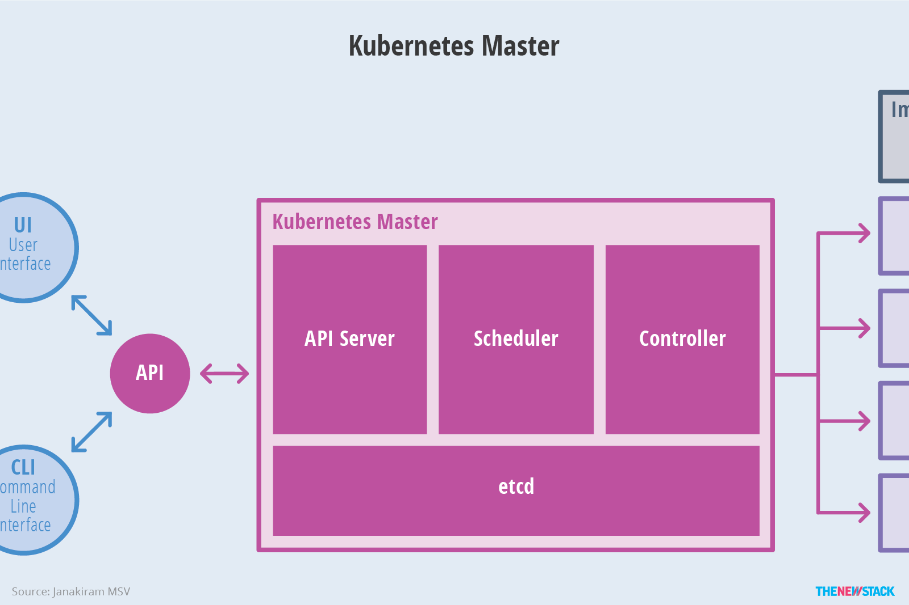
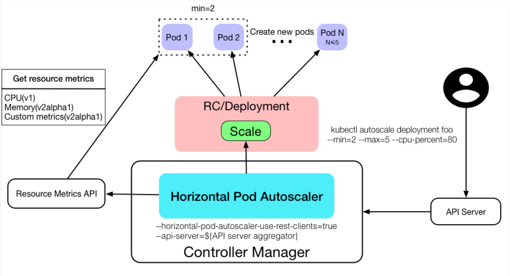

[TOC]


# kubernetes的基本概念

​		Kubernetes中的大部分概念如Node、Pod、Replication Controller、Service等都可以被看作一种资源对象，几乎所有资源对象都可以通过Kubernetes提供的kubectl工具（或者API编程调用）执行增、删、改、查等操作并将其保存在etcd中持久化存储。从这个角度来看Kubernetes其实是一个高度自动化的资源控制系统，它通过跟踪对比etcd库里保存的“资源期望状态”与当前环境中的“实际资源状态”的差异来实现自动控制和自动纠错的高级功能。


# 1 Master

​		Kubernetes里的Master指的是集群控制节点，在每个Kubernetes集群里都需要有一个Master来负责整个集群的管理和控制，基本上 Kubernetes的所有控制命令都发给它，它负责具体的执行过程，我们后面执行的所有命令基本都是在Master上运行的。Master通常会占据一个独立的服务器（高可用部署建议用3台服务器），如果它宕机或者不可用，那么对集群内容器应用的管理都将失效。 

master节点上主要运行四个组件：api-server、scheduler、controller-manager、etcd。



| 组件               | 作用                                                         |
| ------------------ | ------------------------------------------------------------ |
| kube-apiserver     | 提供了HTTP Rest 接口的关键服务进程，是Kubernetes里所有资源的增、删、改、查等 操作的唯一入口；各组件协调者并提供认证、授权、访问控制、API注册和发现等机制。 |
| scheduler          | 负责资源调度 （Pod调度）的进程，相当于公交公司的“调度室”。   |
| controller-manager | Kubernetes里所有资源对象的自动化控制中心，可以将其理解为资源对象的“大总管”。 |
| etcd               | etcd是一个高可用的键值存储系统，Kubernetes使用它来存储所有资源对象的的状态和数据，从而实现了Restful的API。 |


# 2 Node

​		Node是Kubernetes集群中的工作负载节点，每个Node都会被Master分配一些工作负载（Docker容器），当某个Node宕机时，其上的工作负载会被Master自动转移到其他节点上。

​		每个Node节点主要由三个模块组成：kubelet、kube-proxy、Container runtime。


| 组件              | 作用                                                         |
| ----------------- | ------------------------------------------------------------ |
| Container runtime | 负责本机的容器创建和管理工作。                               |
| kube-proxy        | 实现Kubernetes Service的通信与负载均衡机制的重要组件。       |
| kubelet           | 负责Pod对应的容器的创建、启停等任务，同时与 Master密切协作，实现集群管理的基本功能。 |

除了核心组件，还有一些推荐的Add-ons（插件）：

- kube-dns负责为整个集群提供DNS服务
- Ingress Controller为服务提供外网入口
- Heapster提供资源监控
- Dashboard提供GUI
- Federation提供跨可用区的集群
- Fluentd-elasticsearch提供集群日志采集、存储与查询


**master与node关系：**


# 3 Pod

​		**Pod是Kubernetes最重要的基本概念，容器组Pod是最小部署单元，一个Pod有一个或多个容器组成， Pod中容器共享存储和网络，在同一台Docker主机上运行。**


Kubernetes会设计出一个全新的Pod的概念并且有这样特殊的组成结构？ 

1、通过容器组的状态，去解决容器死亡率的问题，更好的判断业务的存活状态；

2、解决多个容器网络通信和文件共享问题；

​		Kubernetes为每个Pod都分配了唯一的IP地址，称之为Pod IP，一个Pod里的多个容器共享Pod IP地址。Kubernetes要求底层网络支持集群内任意两个Pod之间的TCP/IP直接通信，这通常采用虚拟二层网络技术来实现，例如Flannel、OpenvSwitch等，因此我们需要牢记一点：在Kubernetes里，一个Pod里的容器与另外主机上的Pod容器能够直接通信。

Pod有两种类型：**普通的Pod**和**静态Pod**（Static Pod）。静态Pod比较特殊，它并没被存放在Kubernetes的etcd存储里，而是被存放在 某个具体的Node上的一个具体文件中，并且只在此Node上启动、运行。而普通的Pod一旦被创建，就会被放入etcd中存储，随后会被 Kubernetes Master调度到某个具体的Node上并进行绑定（Binding），随后该Pod被对应的Node上的kubelet进程实例化成一组相关的Docker容器并启动。在默认情况下，当Pod里的某个容器停止时，Kubernetes会自动检测到这个问题并且重新启动这个Pod（重启Pod里 的所有容器），如果Pod所在的Node宕机，就会将这个Node上的所有Pod重新调度到其他节点上。

Pod、容器与Node的关系如图所示：


​		每个Pod都可以对其能使用的服务器上的计算资源设置限额，当前可以设置限额的计算资源有CPU与Memory两种，其中CPU的资源单位为CPU（Core）的数量，是一个绝对值而非相对值。

​		Kubernetes里通常以千分之一的CPU配额为最小单位，用m来表示。通常一个容器的CPU配额被定义为100～300m，即占用0.1～0.3个CPU。与CPU配额类似，Memory配额也是一个绝对值，它的单位是内存字节数。 

在Kubernetes里，一个计算资源进行配额限定时需要设定以下两个参数。

- Requests：该资源的最小申请量，系统必须满足要求。 
- Limits：该资源最大允许使用的量，不能被突破，当容器试图使用超过这个量的资源时，可能会被Kubernetes“杀掉”并重启。

示例：

表明MySQL容器申请最少0.25个CPU及64MiB内存，在运行过程中MySQL容器所能使用的资源配额为0.5个CPU及128MiB内存： 

```yml
spec:
  containers:
  - name: db
    image: mysql
    resource:
      requests:
        memory: "64Mi"
        cpu: "250m"
      limits:
        memory: "128Mi"
        cpu: "500m"
```


# 4 Event

Event是一个事件的记录，记录了事件的最早产生时间、最后重现时间、重复次数、发起者、类型，以及导致此事件的原因等众多信息。Event通常会被关联到某个具体的资源对象上，是排查故障的重要参考信息，之前我们看到Node的描述信息包括了Event，而Pod同样有Event记录，当我们发 现某个Pod迟迟无法创建时，可以用`kubectl describe pod xxxx`来查看它的描述信息，以定位问题的成因，比如下面这个Event记录信息表明Pod里的一个容器被探针检测为失败一次： 


# 5 **Label** 

Label（标签）是Kubernetes系统中另外一个核心概念。**一个Label是一个key=value的键值对**，其中key与value由用户自己指定。

Label可以被附加到各种资源对象上，例如Node、Pod、Service、RC 等，一个资源对象可以定义任意数量的Label，同一个Label也可以被添加到任意数量的资源对象上。Label通常在资源对象定义时确定， 也可以在对象创建后动态添加或者删除。**每一个对象可以拥有多个标签，但是，key值必须是唯一的。** 

**作用：**通过对资源对象捆绑一个或多个不同的Label来实现多维度的资源分组管理功能，以便灵活、方便地进行资源分配、调度、配置、部署等管理工作。

例如，部署不同版本的应用到不同的环境中；监控和分析应用（日志记录、监控、告警）等。一些常用的Label示例如下：

- 版本标签："release":"stable"、"release":"canary"。 
- 环境标签："environment":"dev"、"environment":"qa"、"environment":"production"。 
- 架构标签："tier":"frontend"、"tier":"backend"、"tier":"middleware"。 
- 分区标签："partition":"customerA"、"partition":"customerB"。 
- 质量管控标签："track":"daily"、"track":"weekly"。 


给某个资源对象定义一个 Label，就相当于给它打了一个标签，随后可以通过Label Selector（标签选择器）查询和筛选拥有某些Label的资源对象，Label Selector可以被类比为SQL语句中的where查询条件，

当前有两种Label Selector表达式：基于等式的（Equality-based）和基于集合的（Set-based）。

**等式类表达式匹配标签：**

- name=redis-slave：匹配所有具有标签name=redis-slave的资源对象。
- env!=production：匹配所有不具有标签env=production的资源对象，比如env=test就是满足此条件的标签之一。 

**集合操作类表达式匹配标签：**

- name in（redis-master, redis-slave）：匹配所有具有标签name=redis-master或者name=redis-slave的资源对象。 
- name not in（php-frontend）：匹配所有不具有标签name=php-frontend的资源对象。 

通过多个Label Selector表达式的组合实现复杂的条件选择，多个表达式之间用“，”进行分隔即可，几个条件之间是“AND”的关系，即同时满足多个条件，比如下面的例子：

```
name=redis-slave,env!=production
name notin (php-frontend),env!=production
```

matchLabels用于定义一组Label，与直接写在Selector中的作用相同；matchExpressions用于定义一组基于集合的筛选条件，可用的条 件运算符包括In、NotIn、Exists和DoesNotExist。如果同时设置了matchLabels和matchExpressions，则两组条件为AND关系，即需要同时满足所有条件才能完成Selector的筛选。 

要查看每个Pod自动生成的标签，运行`kubectl get pods --show-labels`输出。


# 6 Replication Controller

Replication Controller（简称RC）,是Kubernetes系统中的核心概念之一，即声明某种Pod的副本数量在任意时刻都符合某个预期值，所以RC的定义包括如下几个部分。 

- Pod期待的副本数量
- 用于筛选目标Pod的Label Selector
- 当Pod的副本数量小于预期数量时，用于创建新Pod的Pod模板（template）

示例：

一个完整的RC定义的例子 [frontend-rc.yaml](assets\frontend-rc.yaml) ，即确保拥有tier=frontend标签的这个Pod（运行Tomcat容器）在整个Kubernetes集群中始终只有一个副本：

```yml
apiVersion: v1
kind: ReplicationController
metadata:
  name: frontend
spec:
  replicas: 1
  selector:
    tier: frontend
  template:
    metadata:
      labels:
        app: app-demo
        tier: frontend
    spec:
      containers:
      - name: tomcat-demo
        image: tomcat
        imagePullPolicy: IfNotPresent
        env:
        - name: GET_HOSTS_FROM
          value: dns
        ports:
        - containerPort: 80

```

将RC将其提交到Kubernetes集群中后，Master 上的Controller Manager组件就得到通知，定期巡检系统中当前存活的目标Pod，并确保目标Pod实例的数量刚好等于此RC的期望值，有过多的Pod副本在运行，系统就会停掉一些Pod，少于1个就会自动创建，大大减少了系统管理员在传统IT环境中需要完成的许多手工运维工作（如主机监控脚本、应用监控脚本、故障恢复脚本等）。


`kubectl scale`命令对RC的副本数量进行动态缩放（scaling）：

```bash
kubctl scale rc redis-slave --replicas=3
```

需要注意的是，删除RC并不会影响通过该RC已创建好的Pod。为了删除所有Pod，可以设置replicas的值为0，然后更新该RC。另外，kubectl提供了stop和delete命令来一次性删除RC和RC控制的全部Pod。

**应用场景：**

​		应用升级时，通常会使用一个新的容器镜像版本替代旧版本。我们希望系统平滑升级，比如在当前系统中有10个对应的旧版本的Pod，则最佳的系统升级方式是旧版本的Pod每停止一个，就同时创建一个新版本的Pod，在整个升级过程中此消彼长，而运行中的Pod数量始终是10个，几分钟以后，当所有的Pod都已经是新版本时，系统升级完成。通过RC机制，Kubernetes很容易就实现了这种高级实用的特性，被称为“滚动升级”（Rolling Update）。

**Replica Set和Replication Controller的区别：**

Replica Set与RC当前的唯一区别是，**Replica Sets支持基于集合的Label selector（Set-based selector）**，**而 RC只支持基于等式的Label Selector（equality-based selector）**，这使得Replica Set的功能更强。


# 7 Deployment

Deployment是Kubernetes在1.2版本中引入的新概念，用于更好地解决Pod的编排问题。是一个更高层次的API对象，它管理ReplicaSets和Pod，并提供声明式更新等功能。官方建议使用Deployment管理ReplicaSets，而不是直接使用ReplicaSets。


Deployment的典型使用场景有以下几个。 

- 创建一个Deployment对象来生成对应的Replica Set并完成Pod副本的创建。 
- 检查Deployment的状态来看部署动作是否完成（Pod副本数量是否达到预期的值）。 
- 更新Deployment以创建新的Pod（比如镜像升级）。 
- 如果当前Deployment不稳定，则回滚到一个早先的Deployment版本。 
- 暂停Deployment以便于一次性修改多个PodTemplateSpec的配置项，之后再恢复Deployment，进行新的发布。 
- 扩展Deployment以应对高负载。 
- 查看Deployment的状态，以此作为发布是否成功的指标。 
- 清理不再需要的旧版本ReplicaSets。 

除了API声明与Kind类型等有所区别，Deployment的定义与Replica Set的定义很类似：


示例：

创建一个名为  [frontend-deployment.yaml](assets\frontend-deployment.yaml) 的Deployment描述文件，内容如下： 

```yml
apiVersion: apps/v1
kind: Deployment
metadata:
  name: frontend
spec:
  replicas: 1
  selector:
    matchLabels:
      tier: frontend
    matchExpressions:
      - {key: tier, operator: In, values: [frontend]}
  template:
    metadata:
      labels:
        app: app-demo
        tier: frontend
    spec:
      containers:
      - name: tomcat-demo
        image: tomcat
        imagePullPolicy: IfNotPresent
        ports:
        - containerPort: 8080

```

创建Deployment：

```bash
# kubectl create -f frontend-deployment.yaml
deployment.apps/frontend created
```

查看Deployment的信息

```bash
# kubectl get deployments
NAME       READY   UP-TO-DATE   AVAILABLE   AGE
frontend   1/1     1            1           23m
```

对上述输出中涉及的数量解释如下。 

- `READY` ：1/1左边1是真正运行的副本数，右边1是期望的副本数即replicas定义的副本数。
- `UP-TO-DATE`：显示已更新以实现期望状态的副本数。
- `AVAILABLE`：显示应用程序可供用户使用的副本数。
- `AGE` ：显示应用程序运行的时间量。

要查看Deployment创建的ReplicaSet（rs），运行`kubectl get rs`输出，看到它的命名与Deployment的名称有关系： 

ReplicaSet 命名规则是：[DEPLOYMENT-NAME]-[RANDOM-STRING]

```bash
# kubectl get rs
NAME                  DESIRED   CURRENT   READY   AGE
frontend-797f47d685   1         1         1       44m
```

查看对应的pod：

发现Pod的命名以Deployment对应的Replica Set的名称为前缀。

```bash
# kubectl get pods
NAME                        READY   STATUS    RESTARTS   AGE
frontend-797f47d685-q5zc6   1/1     Running   0          53m
```

运行kubectl describe deployments，可以清楚地看到Deployment控制的Pod的水平扩展过程。


# 8 Horizontal Pod Autoscaler

通过手工执行kubectl scale命令，我们可以实现Pod扩容或缩容。 显然不符合谷歌对Kubernetes的定位目标—自动化、智能化。

Kubernetes有一个Horizontal Pod Autoscaling（Pod横向自动扩容，HPA）的资源，可以根据CPU使用率或应用自定义metrics自动扩展Pod数量。

**注意**：从kubernetes1.11开始Heapster被废弃不在使用，metrics-server 替代了heapster。实现HPA首先需要部署metrics-server，一个集群级别的资源利用率数据的聚合器。

Horizontal Pod Autoscaling可以根据CPU使用率或应用自定义metrics自动扩展Pod数量（支持replication controller、deployment和replica set）。

- 控制管理器每隔30s（可以通过–horizontal-pod-autoscaler-sync-period修改）查询metrics的资源使用情况
- 支持三种metrics类型
  - 预定义metrics（比如Pod的CPU）以利用率的方式计算
  - 自定义的Pod metrics，以原始值（raw value）的方式计算
  - 自定义的object metrics
- 支持两种metrics查询方式：Heapster和自定义的REST API
- 支持多metrics




HPA与之前的RC、Deployment一样，也属于一种Kubernetes资源对象。通过追踪分析指定RC控制的所有目标Pod的负载变化情况，来 确定是否需要调整目标Pod的副本数量，这是HPA的实现原理。

**当前，HPA有以下两种方式作为Pod负载的度量指标：**

- **CPU UtilizationPercentage**：是一个算术平均值，即目标Pod所有副本自身的CPU利用率的平均值。 一个Pod自身的CPU利用率是该Pod当前CPU的使用量除以它的Pod Request的值，比如定义一个Pod的Pod Request为0.4，而当前Pod的CPU使用量为0.2，则它的CPU使用率为 50%，如果目标Pod没有定义Pod Request的值，则无法使用 CPU UtilizationPercentage实现Pod横向自动扩容。
- **应用程序自定义的度量指标**：比如服务在每秒内的相应请求数（TPS或QPS）。 


1、根据CPU进行HPA伸缩过程

```bash
# 创建pod和service
# kubectl run php-apache --image=registry.cn-beijing.aliyuncs.com/crazywjj/hpa-example:V1.0 --requests=cpu=200m --expose --port=80

cat >php-apache.yaml<<EOF
apiVersion: apps/v1
kind: Deployment
metadata:
  name: php-apache
spec:
  selector:
    matchLabels:
      run: php-apache
  replicas: 1
  template:
    metadata:
      labels:
        run: php-apache
    spec:
      containers:
      - name: php-apache
        image: registry.cn-beijing.aliyuncs.com/crazywjj/hpa-example:V1.0
        imagePullPolicy: IfNotPresent
        ports:
        - containerPort: 80
        resources:
          limits:
            cpu: 500m
          requests:
            cpu: 200m
---
apiVersion: v1
kind: Service
metadata:
  name: php-apache
  labels:
    run: php-apache
spec:
  ports:
  - port: 80
  selector:
    run: php-apache
EOF

$ kubectl create -f  php-apache.yaml
service "php-apache" created
deployment "php-apache" created

# 命令行创建autoscaler
$ kubectl autoscale deployment php-apache --cpu-percent=50 --min=1 --max=10
deployment "php-apache" autoscaled
或者
vim hpa.yaml
apiVersion: autoscaling/v1
kind: HorizontalPodAutoscaler
metadata:
  name: php-apache
  namespace: default
spec:
  maxReplicas: 10
  minReplicas: 1
  scaleTargetRef:
    kind: Deployment
    name: php-apache
  targetCPUUtilizationPercentage: 50

$ kubectl get hpa
NAME         REFERENCE               TARGETS   MINPODS   MAXPODS   REPLICAS   AGE
php-apache   Deployment/php-apache   0%/50%    1         10        1          16m

# 增加负载,需要一段时间
$ kubectl run -i --tty load-generator --rm --image=busybox --restart=Never -- /bin/sh -c "while sleep 0.01; do wget -q -O- http://php-apache; done"

# 查看hpa负载
$ kubectl get hpa
NAME         REFERENCE               TARGETS    MINPODS   MAXPODS   REPLICAS   AGE
php-apache   Deployment/php-apache   191%/50%   1         10        1          16m

# 查看hpa详情
$ kubectl describe hpa php-apache

# autoscaler将这个deployment扩展为5个pod
$ kubectl get deployment php-apache
NAME         READY   UP-TO-DATE   AVAILABLE   AGE
php-apache   5/5     5            5           18m

# 删除刚才创建的负载增加pod后会发现负载降低，并且pod数量也自动降回1个（也需要一段时间）
$ kubectl delete pod load-generator
$ kubectl get hpa
NAME         REFERENCE                     TARGET    CURRENT   MINPODS   MAXPODS   AGE
php-apache   Deployment/php-apache/scale   50%       0%        1         10        11m

$ kubectl get deployment php-apache
NAME         READY   UP-TO-DATE   AVAILABLE   AGE
php-apache   1/1     1            1           23m
```


**HPA伸缩过程：**

- 收集HPA控制下所有Pod最近的cpu使用情况（CPU utilization）
- 对比在扩容条件里记录的cpu限额（CPUUtilization） • 调整实例数（必须要满足不超过最大/最小实例数）
- 每隔30s做一次自动扩容的判断 CPU utilization的计算方法是用cpu usage（最近一分钟的平均值，通过metrics可以直接获取到）除以 cpu request（这里cpu request就是我们在创建容器时制定的cpu使用核心数）得到一个平均值，这个 平均值可以理解为：平均每个Pod CPU核心的使用占比。

**HPA进行伸缩算法：**

- 计算公式：TargetNumOfPods = ceil(sum(CurrentPodsCPUUtilization) / Target)
- ceil()表示取大于或等于某数的最近一个整数
- 每次扩容后冷却3分钟才能再次进行扩容，而缩容则要等5分钟后。
- 当前Pod Cpu使用率与目标使用率接近时，不会触发扩容或缩容;
- 触发条件：avg(CurrentPodsConsumption) / Target >1.1 或 <0.9

 2、基于多项度量指标和自定义度量指标进行HPA伸缩

*custom metrics*（自定义度量指标）： 即 Pod 度量指标和 Object 度量指标。 这些度量指标可能具有特定于集群的名称，并且需要更高级的集群监控设置。

使用方法

- 控制管理器开启 `--horizontal-pod-autoscaler-use-rest-clients`
- 控制管理器配置的 `--master` 或者 `--kubeconfig`
- 在 API Server Aggregator 中注册自定义的 metrics API，如 https://github.com/kubernetes-incubator/custom-metrics-apiserver 和 https://github.com/kubernetes/metrics

> 注：可以参考 [k8s.io/metics](https://github.com/kubernetes/metrics) 开发自定义的 metrics API server。

比如 HorizontalPodAutoscaler 保证每个 Pod 占用 50% CPU、1000pps 以及 10000 请求 / s：

```yml
apiVersion: autoscaling/v2beta1
kind: HorizontalPodAutoscaler
metadata:
  name: php-apache
spec:
  scaleTargetRef:
    apiVersion: apps/v1
    kind: Deployment
    name: php-apache
  minReplicas: 1
  maxReplicas: 10
  metrics:
  - type: Resource
    resource:
      name: cpu
      target:
        type: AverageUtilization
        averageUtilization: 50
  - type: Pods
    pods:
      metric:
        name: packets-per-second
      target:
        type: AverageValue
        averageValue: 1k
  - type: Object
    object:
      metric:
        name: requests-per-second
      describedObject:
        apiVersion: networking.k8s.io/v1beta1
        kind: Ingress
        name: main-route
      target:
        kind: Value
        value: 10k
status:
  observedGeneration: 1
  lastScaleTime: <some-time>
  currentReplicas: 1
  desiredReplicas: 1
  currentMetrics:
  - type: Resource
    resource:
      name: cpu
    current:
      averageUtilization: 0
      averageValue: 0
  - type: Object
    object:
      metric:
        name: requests-per-second
      describedObject:
        apiVersion: networking.k8s.io/v1beta1
        kind: Ingress
        name: main-route
      current:
        value: 10k
```

https://kubernetes.io/zh/docs/tasks/run-application/horizontal-pod-autoscale-walkthrough/


# 9 Volume

Volume（存储卷）是Pod中能够被多个容器访问的共享目录。首先，Kubernetes中的Volume被定义在Pod上，被一个Pod里的多个容器挂载到具体的文件目录下；其次，Kubernetes中的Volume与Pod的生命周期相同，但与容器的生命周期无关，当容器终止或者重启时，Volume中的数据也不会丢失。

Volume的使用前，需要Pod指定volume的类型和内容（spec.volume）和挂载点（spec.containers.volumeMounts）两个信息。

**常用的数据卷：**
• 本地（hostPath，emptyDir）
• 网络（NFS，Ceph，GlusterFS）
• 公有云（AWS EBS）
• K8S资源（configmap，secret）

1、emptyDir（临时存储卷）

一个emptyDir Volume是在Pod分配到Node时创建的。初始内容为空，并且无须指定宿主机上对应的目录文件，pod创建时创建，pod移除时移除。

```yml
apiVersion: v1
kind: Pod        #类型是Pod
metadata:
  labels:
    name: redis
    role: master        #定义为主redis
  name: redis-master
spec:
  containers:
    - name: master
      image: redis:latest
      env:        #定义环境变量
        - name: MASTER
          value: "true"
      ports:        #容器内端口
        - containerPort: 6379
      volumeMounts:        #容器内挂载点
        - mountPath: /data
          name: redis-data        #必须有名称
  volumes:
    - name: redis-data        #跟上面的名称对应
      emptyDir: {}        #宿主机挂载点
```

Emptydir创建后，在宿主机上的访问路径为`/var/lib/kubelet/pods/<pod uid>/volumes/kubernetes.io~empty-dir/redis-data`,如果在此目录中创建删除文件，都将对容器中的/data目录有影响。


2、hostPath（节点存储卷）

hostPath允许挂载Node上的文件系统到Pod里面去。如果Pod需要使用Node上的文件，可以使用hostPath。

挂载宿主机的/tmp目录到Pod容器的/data目录：

```yml
apiVersion: v1
kind: Pod        #类型是Pod
metadata:
  labels:
    name: redis
    role: master        #定义为主redis
  name: redis-master
spec:
  containers:
    - name: master
      image: redis:latest
      env:        #定义环境变量
        - name: MASTER
          value: "true"
      ports:        #容器内端口
        - containerPort: 6379
      volumeMounts:        #容器内挂载点
        - mountPath: /data
          name: redis-data        #必须有名称
  volumes:
    - name: redis-data        #跟上面的名称对应
      hostPath: 
        path: /data      #宿主机挂载点
```


3、NFS（网络存储卷）

使用NFS网络文件系统提供的共享目录存储数据时，需要在系统中部署一个NFS Server（建议直接部署到服务器）。

```yml
apiVersion: v1
kind: Pod
metadata:
  name: nfs-web
spec:
  containers:
    - name: web
      image: nginx
      imagePullPolicy: Never        #如果已经有镜像，就不需要再拉取镜像
      ports:
        - name: web
          containerPort: 80
          hostPort: 80        #将容器的80端口映射到宿主机的80端口
      volumeMounts:
        - name : nfs        #指定名称必须与下面一致
          mountPath: "/usr/share/nginx/html"        #容器内的挂载点
  volumes:
    - name: nfs            #指定名称必须与上面一致
      nfs:            #nfs存储
        server: 192.168.66.50        #nfs服务器ip或是域名
        path: "/test"                #nfs服务器共享的目录
```


# 10 PV/PVC/StorageClass

PV/PVC/StorageClass关系图：


PersistentVolume（PV）是集群中由管理员配置的一段网络存储。 与普通的Volume不同，PV是Kubernetes中的一个资源对象，创建一个PV相当于创建了一个存储资源对象，这个资源的使用要通过PVC来请求。**主要包括存储能力、访问模式、存储类型、回收策略、后端存储类型等关键信息的设置。**

PersistentVolumeClaim（PVC）是用户对存储资源PV的请求。根据PVC中指定的条件Kubernetes动态的寻找系统中的PV资源并进行绑定。目前PVC与PV匹配可以通过StorageClassName、matchLabels或者matchExpressions三种方式。权限要求可以请求特定的大小和访问模式。**主要包括存储空间请求、访问模式、PV选择条件和存储类别等信息的设置。**

StorageClass为管理员提供了一种描述他们提供的存储的“类”的方法。 不同的类可能映射到服务质量级别，或备份策略，或者由群集管理员确定的任意策略。 每个 StorageClass 都包含 provisioner、parameters 和 reclaimPolicy 字段， 这些字段会在 StorageClass 需要动态分配 PersistentVolume 时会使用到。


# 11 StatefulSet

在Kubernetes系统中，Pod的管理对象RC、Deployment、DaemonSet和Job都面向无状态的服务。但现实中有很多服务是有状态的，statefulset是为了解决**有状态服务**的问题，而产生的一种资源类型（deployment和replicaSets是解决无状态服务而设计的）。特别是一些复杂的中间件集群，例如MySQL集群、MongoDB 集群、Akka集群、ZooKeeper集群等，这些应用集群有4个共同点。

（1）每个节点都有固定的身份ID，通过这个ID，集群中的成员可以相互发现并通信。 

（2）集群的规模是比较固定的，集群规模不能随意变动。 

（3）集群中的每个节点都是有状态的，通常会持久化数据到永久存储中。 

（4）如果磁盘损坏，则集群里的某个节点无法正常运行，集群功能受损


**应用场景：**

- 稳定的、唯一的网络标识：即pod重新调度后其PodName和HostName不变，基于Headless Service来实现的。
- 稳定的、持久的存储：即每个pod的存储资源是不共享的，且pod重新调度后还是能访问到相同的持久化数据，基于pvc实现。
- 有序的、优雅的部署和伸缩：即pod是有顺序的，在部署或者扩展的时候是根据定义的顺序依次依序部署的（即从0到N-1,在下一个Pod运行之前所有之前的pod必都是Running状态或者Ready状态），是基于init containers来实现的。
- 有序的、优雅的删除和停止：在pod删除时是从最后一个依次往前删除，即从N-1到0。
- 有序的、自动的滚动更新。

从上面的应用场景可以发现，StatefulSet由以下几个部分组成：

- 用于定义网络标志（DNS domain）的Headless Service
- 用于创建pvc的volumeClaimTemplates
- 定义具体应用的StatefulSet

StatefulSet中每个Pod的DNS格式为`statefulSetName-{0..N-1}.serviceName.namespace.svc.cluster.local`，其中

- `serviceName`为Headless Service的名字；
- `0..N-1`为Pod所在的序号，从0开始到N-1；
- `statefulSetName`为StatefulSet的名字；
- `namespace`为服务所在的namespace，Headless Servic和StatefulSet必须在相同的namespace；
- `.cluster.local`为Cluster Domain；


**总结**

使用statefulset资源类型的服务通常有以下几点特点

- 有状态服务
- 多节点部署，集群部署
- 节点有主从(备)之分。集群通常是主节点先运行，从节点后续运行并加入集群，这里就用**statefulset资源的有序部署的特性**
- 节点之间数据分片存储，**这里使用到了statefulSet资源的存储隔离的特性，以及保证pod重新调度后还是能访问到相同的持久化数据**

https://kubernetes.io/docs/concepts/workloads/controllers/statefulset/


