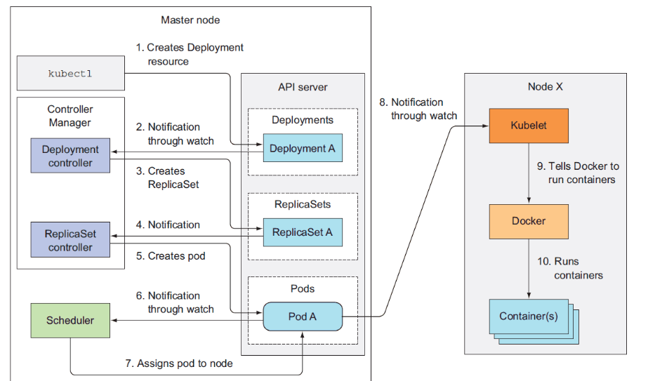

[TOC]

# 第1章 kubernetes介绍

# 1  kubernets是什么
Kubernetes(k8s)是Google2014年开源的容器集群管理系统（谷歌内部:Borg），主要用于容器化应用程序的部署、扩展和管理的开源平台。

k8s的目标是让部署容器化的应用简单并且高效，k8s提供了应用部署、规划、更新、维护的一种机制！

官网地址：<https://kubernetes.io/>

# 2 kubernetes组件

Kubernetes属于主从分布式架构，主要由Master Node和Worker Node组成，以及包括客户端命令行工具kubectl和其它附加项。

**Master Node组成：**

- API server 提供了资源操作的唯一入口，并提供认证、授权、访问控制、API注册和发现等机制；

- controller-manager 负责维护集群的状态，可以创建和管理多个Pod，提供副本管理、滚动升级和集群级别的自愈能力。例如，如果一个Node故障，Controller就能自动将该节点上的Pod调度到其他健康的Node上；

- scheduler 负责资源的调度，按照预定的调度策略将Pod调度到相应的机器上；
- etcd 键值对数据库，用于保存集群所有的网络配置和对象的状态信息；

**Worker Node组成：**

- kubelet 负责维护容器的生命周期，同时也负责Volume（CVI）和网络（CNI）的管理；

- kube-proxy 负责为Service提供cluster内部的服务发现和负载均衡；

- Container 负责镜像管理和容器的真正运行（CRI）；

**常见附加项组成：**

在Kunbernetes中可以以附加项的方式扩展Kubernetes的功能，目前主要有网络、服务发现和可视化这三大类的附加项，下面是可用的一些附加项：

网络和网络策略：

- ACI 通过与Cisco ACI集成的容器网络和网络安全。
- Calico 是一个安全的3层网络和网络策略提供者。
- Canal 联合Fannel和Calico，通过网络和网络侧。
- Cilium 是一个3层网络和网络侧插件，它能够透明的加强HTTP/API/L7 策略。其即支持路由，也支持overlay/encapsultion模式。
- Flannel 是一个overlay的网络提供者。

服务发现：

- CoreDNS 是一个灵活的，可扩展的DNS服务器，它能够作为Pod集群内的DNS进行安装。
- Ingress 提供基于Http协议的路由转发机制。

可视化&控制：

- Dashboard 是Kubernetes的web用户界面。

# 3 kubernetes工作流程

1. 准备好一个包含应用程序的Deployment的yml文件，然后通过kubectl客户端工具发送给ApiServer；
2. ApiServer接收到客户端的请求，不会去直接创建pod，而是生成一个包含创建信息的yaml，并将信息存储到数据库(etcd)中；
3. Controller Manager通过list-watch机制，监测发现新的deployment，将该资源加入到内部工作队列；
4. Controller Manager发现该资源没有关联的pod和replicaset，启用 deployment controller创建replicaset资源，deployment controller创建完成后，将deployment，replicaset，pod资源信息更新存储到etcd；
5. ReplicaSet controller检查etcd数据库变化，通过Pod Template来创建期望数量的pod实例（未运行容器）；
6. Scheduler通过list-watch机制，发现尚未被分配的Pod；
7. Scheduler经过主机过滤、主机打分规则，将pod分配到可以运行它们的节点上，并将绑定结果更新到etcd数据库，记录pod分配情况；
8. Kubelet监控数据库变化，获取到分配到其所在节点的Pod信息；
9. Kubelet调用CNI（Docker 运行或通过 rkt)创建 Pod 中的容器；
10. Docker运行container容器；
11. kuberproxy运行在集群各个主机上，管理网络通信，如服务发现、负载均衡。为新创建的pod注册动态DNS到CoreOS。给pod的service添加iptables/ipvs规则，用于服务发现和负载均衡。
12. controller通过control loop（控制循环）将当前pod状态与用户所期望的状态做对比，如果当前状态与用户期望状态不同，则controller会将pod修改为用户期望状态，实在不行会将此pod删掉，然后重新创建pod。

# 3 kubernetes主要功能

| 名词             | 解释                                                         |
| ---------------- | ------------------------------------------------------------ |
| 数据卷           | Pod中容器之间共享数据，可以使用数据卷。                      |
| 应用程序健康检查 | 容器内服务可能进程堵塞无法处理请求，可以设置监控检查策略保证应用健壮性。 |
| 复制应用程序实例 | 控制器维护着Pod副本数量，保证一个Pod或一组同类的Pod数量始终可用。 |
| 弹性伸缩         | 根据设定的指标（CPU利用率）自动缩放Pod副本数。               |
| 服务发现         | 使用环境变量或DNS服务插件保证容器中程序发现Pod入口访问地址。 |
| 负载均衡         | 一组Pod副本分配一个私有的集群IP地址，负载均衡转发请求到后端容器。在集群内部其他Pod可通过这个ClusterIP访问应用。 |
| 滚动更新         | 更新服务不中断，一次更新一个Pod，而不是同时删除整个服务。    |
| 服务编排         | 通过文件描述部署服务，使得应用程序部署变得更高效。           |
| 资源监控         | Node节点组件集成cAdvisor资源收集工具，可通过Heapster汇总整个集群节点资源数据，然后存储到InfluxDB时序数据库，再由Grafana展示。 |
| 提供认证和授权   | 支持角色访问控制（RBAC）认证授权等策略。                     |