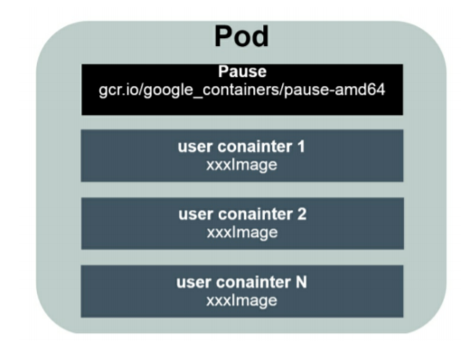
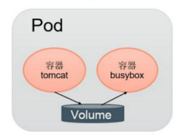
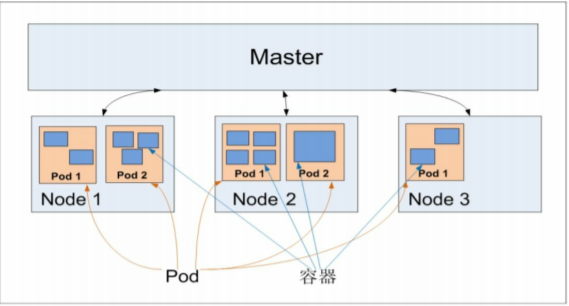
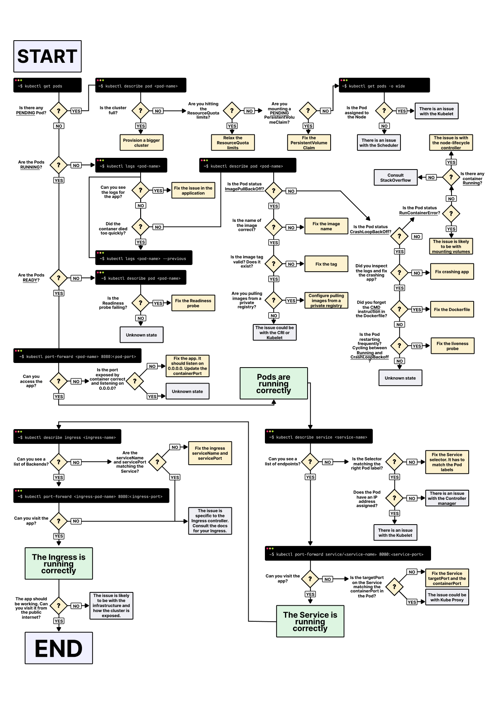

[TOC]


# Pod介绍


# 1 Pod概念

Pod是Kubernetes创建或部署的最小/最简单的基本单位，一个Pod代表集群上正在运行的一个进程。

一个Pod可以包含一个或多个容器，因此它可以被看作是内部容器的逻辑宿主机。Pod的设计理念是为了支持多个容器在一个Pod中共享网络和文件系统。

同一个 Pod 的多个容器应用之间仅需通过 localhost 通信，一组容器被绑定在了一个环境中。

Pod中运行容器Container。为建立Service与Pod间的关联关系，首先为每个Pod都有设置一个标签Label，然后给相应的Service定义标签选择器Label Selector。

Pod运行于Node环境中，节点可以是物理机或者云或者虚拟机。通常一个节点上运行几百个Pod，每个Pod里运行一个特殊的容器Pause，其他容器则为业务容器，业务容器共享Pause容器的网络栈和Volume挂载卷。


# 2 Pod组成

Pod是Kubernetes最重要的基本概念，如图所示是Pod的组成示意图，我们看到每个Pod都有一个特殊的被称为“根容器”的Pause容器。
Pause容器对应的镜像属于Kubernetes平台的一部分，除了Pause容器，每个Pod还包含一个或多个紧密相关的用户业务容器。 

Pod的组成示意图：



为什么Kubernetes会设计出一个全新的Pod的概念并且Pod有这样特殊的组成结构？

原因之一：在一组容器作为一个单元的情况下，我们难以简单地对“整体”进行判断及有效地行动。比如，一个容器死亡了，此时算是整体死亡么？是N/M的死亡率么？引入业务无关并且不易死亡的Pause容器作为Pod的根容器，以它的状态代表整个容器组的状态，就简单、巧妙地解决了这个难题。

原因之二：Pod里的多个业务容器共享Pause容器的IP，共享Pause容器挂接的Volume，这样既简化了密切关联的业务容器之间的通信问题，也很好地解决了它们之间的文件共享问题。


**Pod中可以共享两种资源：网络和存储。**

-  **网络：**

每个Pod都会被分配一个唯一的IP地址。Pod中的所有容器共享网络空间，包括IP地址和端口。Pod内部的容器可以使用`localhost`互相通信。Pod中的容器与外界通信时，必须分配共享网络资源（例如使用宿主机的端口映射）。

- **存储：**

可以Pod指定多个共享的Volume。Pod中的所有容器都可以访问共享的volume。Volume也可以用来持久化Pod中的存储资源，以防容器重启后文件丢失。

**Pod容器共享Volume：**

同一个Pod中的多个容器能够共享Pod级别的存储卷Volume。Volume可以被定义为各种类型，多个容器各自进行挂载操作，将一个Volume挂载为容器内部需要的目录，如图所示。




在下面的例子中，在Pod内包含两个容器：tomcat和busybox，在Pod级别设置Volume“app-logs”，用于tomcat向其中写日志文件，busybox读日志文件。

配置文件pod-volume-applogs.yaml的内容如下：

```yml
apiVersion: v1
kind: Pod
metadata:
  name: volume-pod
spec:
  containers:
  - name: tomcat
    image: tomcat
    ports:
    - containerPort: 8080
    volumeMounts:
    - name: app-logs
      mountPath: /usr/local/tomcat/logs
  - name: busybox
    image: busybox
    command: ["sh", "-c", "tail -f /logs/catalina*.log"]
    volumeMounts:
    - name: app-logs
      mountPath: /logs
  volumes:
  - name: app-logs
    emptyDir: {}
```


# 3 Pod定义和基本用法

通过yaml文件或者json描述Pod和其内容器的运行环境和期望状态，例如一个最简单的运行nginx应用的pod，定义如下：

```yml
apiVersion: v1
kind: Pod
metadata:
  name: nginx
  labels:
    app: nginx
spec:
  containers:
  - name: nginx
    image: nginx
    ports:
    - containerPort: 80
```

> 在生产环境中，推荐使用诸如Deployment，StatefulSet，Job或者CronJob等控制器来创建Pod，而不是直接创建。

将上述pod描述文件保存为nginx-pod.yaml，**使用kubectl apply命令运行pod**

```css
# kubectl apply -f nginx-pod.yaml
```

简要分析一下上面的Pod定义文件：

- apiVersion： 使用哪个版本的Kubernetes API来创建此对象；
- kind：要创建的对象类型，例如Pod，Deployment等；
- metadata：用于唯一区分对象的元数据，包括：name，UID和namespace；
- labels：是一个个的key/value对，定义这样的label到Pod后，其他控制器对象可以通过这样的label来定位到此Pod，从而对Pod进行管理。（参见Deployment等控制器对象）；
- spec： 其它描述信息，包含Pod中运行的容器，容器中运行的应用等等。不同类型的对象拥有不同的spec定义。详情参见API文档；

查看已经创建的Pod：

```bash
# kubectl get pods
NAME    READY   STATUS    RESTARTS   AGE
nginx   1/1     Running   0          23h
```

查看这个Pod的详细信息，可以看到两个容器的定义及创建的过程（Event事件信息)：

```bash
# kubectl describe pod nginx
Name:         nginx
Namespace:    default
Priority:     0
Node:         k8s-node42/10.159.238.42
Start Time:   Mon, 19 Apr 2021 10:34:31 +0800
Labels:       app=nginx
Annotations:  Status:  Running
IP:           10.244.2.2
IPs:
  IP:  10.244.2.2
Containers:
  nginx:
    Container ID:   docker://dd9d831b881294022766fc98a9139773461fc4f3df413f9501125fc74cdcfb98
    Image:          nginx
    Image ID:       docker-pullable://nginx@sha256:75a55d33ecc73c2a242450a9f1cc858499d468f077ea942867e662c247b5e412
    Port:           80/TCP
    Host Port:      0/TCP
    State:          Running
      Started:      Mon, 19 Apr 2021 10:34:52 +0800
    Ready:          True
    Restart Count:  0
    Environment:    <none>
    Mounts:
      /var/run/secrets/kubernetes.io/serviceaccount from default-token-j5xrr (ro)
Conditions:
  Type              Status
  Initialized       True
  Ready             True
  ContainersReady   True
  PodScheduled      True
Volumes:
  default-token-j5xrr:
    Type:        Secret (a volume populated by a Secret)
    SecretName:  default-token-j5xrr
    Optional:    false
QoS Class:       BestEffort
Node-Selectors:  <none>
Tolerations:     node.kubernetes.io/not-ready:NoExecute for 300s
                 node.kubernetes.io/unreachable:NoExecute for 300s
Events:          <none>
```

删除创建Pod：

```bash
# kubectl delete -f nginx-pod.yaml
```

> Kubernetes在每个Pod启动时，会自动创建一个镜像为gcr.io/google_containers/pause:version的容器，所有处于该Pod中的容器在启动时都会添加诸如`--net=container:pause --ipc=contianer:pause --pid=container:pause`的启动参数，因此pause容器成为Pod内共享命名空间的基础。所有容器共享pause容器的IP地址，也被称为Pod IP。


YAML格式的pod定义文件的完整内容：

```yaml
apiVersion: v1        　　          #必选，版本号，例如v1,版本号必须可以用 kubectl api-versions 查询到 .
kind: Pod       　　　　　　         #必选，Pod
metadata:       　　　　　　         #必选，元数据
  name: string        　　          #必选，Pod名称
  namespace: string     　　        #必选，Pod所属的命名空间,默认为"default"
  labels:       　　　　　　          #自定义标签
    - name: string      　          #自定义标签名字
  annotations:        　　                 #自定义注释列表
    - name: string
spec:         　　　　　　　            #必选，Pod中容器的详细定义
  containers:       　　　　            #必选，Pod中容器列表
  - name: string      　　                #必选，容器名称,需符合RFC 1035规范
    image: string     　　                #必选，容器的镜像名称
    imagePullPolicy: [ Always|Never|IfNotPresent ]  #获取镜像的策略 Alawys表示下载镜像 IfnotPresent表示优先使用本地镜像,否则下载镜像，Nerver表示仅使用本地镜像
    command: [string]     　　        #容器的启动命令列表，如不指定，使用打包时使用的启动命令
    args: [string]      　　             #容器的启动命令参数列表
    workingDir: string                     #容器的工作目录
    volumeMounts:     　　　　        #挂载到容器内部的存储卷配置
    - name: string      　　　        #引用pod定义的共享存储卷的名称，需用volumes[]部分定义的的卷名
      mountPath: string                 #存储卷在容器内mount的绝对路径，应少于512字符
      readOnly: boolean                 #是否为只读模式
    ports:        　　　　　　        #需要暴露的端口库号列表
    - name: string      　　　        #端口的名称
      containerPort: int                #容器需要监听的端口号
      hostPort: int     　　             #容器所在主机需要监听的端口号，默认与Container相同
      protocol: string                  #端口协议，支持TCP和UDP，默认TCP
    env:        　　　　　　            #容器运行前需设置的环境变量列表
    - name: string      　　            #环境变量名称
      value: string     　　            #环境变量的值
    resources:        　　                #资源限制和请求的设置
      limits:       　　　　            #资源限制的设置
        cpu: string     　　            #Cpu的限制，单位为core数，将用于docker run --cpu-shares参数
        memory: string                  #内存限制，单位可以为Mib/Gib，将用于docker run --memory参数
      requests:       　　                #资源请求的设置
        cpu: string     　　            #Cpu请求，容器启动的初始可用数量
        memory: string                    #内存请求,容器启动的初始可用数量
    livenessProbe:      　　            #对Pod内各容器健康检查的设置，当探测无响应几次后将自动重启该容器，检查方法有exec、httpGet和tcpSocket，对一个容器只需设置其中一种方法即可
      exec:       　　　　　　        #对Pod容器内检查方式设置为exec方式
        command: [string]               #exec方式需要制定的命令或脚本
      httpGet:        　　　　        #对Pod内个容器健康检查方法设置为HttpGet，需要制定Path、port
        path: string
        port: number
        host: string
        scheme: string
        HttpHeaders:
        - name: string
          value: string
      tcpSocket:      　　　　　　#对Pod内个容器健康检查方式设置为tcpSocket方式
         port: number
       initialDelaySeconds: 0       #容器启动完成后首次探测的时间，单位为秒
       timeoutSeconds: 0    　　    #对容器健康检查探测等待响应的超时时间，单位秒，默认1秒
       periodSeconds: 0     　　    #对容器监控检查的定期探测时间设置，单位秒，默认10秒一次
       successThreshold: 0
       failureThreshold: 0
       securityContext:
         privileged: false
    restartPolicy: [Always | Never | OnFailure] #Pod的重启策略，Always表示一旦不管以何种方式终止运行，kubelet都将重启，OnFailure表示只有Pod以非0退出码退出才重启，Nerver表示不再重启该Pod
    nodeSelector: obeject   　　    #设置NodeSelector表示将该Pod调度到包含这个label的node上，以key：value的格式指定
    imagePullSecrets:     　　　　#Pull镜像时使用的secret名称，以key：secretkey格式指定
    - name: string
    hostNetwork: false      　　    #是否使用主机网络模式，默认为false，如果设置为true，表示使用宿主机网络
    volumes:        　　　　　　    #在该pod上定义共享存储卷列表
    - name: string     　　 　　    #共享存储卷名称 （volumes类型有很多种）
      emptyDir: {}      　　　　    #类型为emtyDir的存储卷，与Pod同生命周期的一个临时目录。为空值
      hostPath: string      　　    #类型为hostPath的存储卷，表示挂载Pod所在宿主机的目录
        path: string      　　        #Pod所在宿主机的目录，将被用于同期中mount的目录
      secret:       　　　　　　    #类型为secret的存储卷，挂载集群与定义的secre对象到容器内部
        scretname: string  
        items:     
        - key: string
          path: string
      configMap:      　　　　            #类型为configMap的存储卷，挂载预定义的configMap对象到容器内部
        name: string
        items:
        - key: string
          path: string
```


# 4 Pod类型

Pod其实有两种类型：**普通的Pod**和**静态Pod（Static Pod）**。

静态Pod比较特殊，它并没被存放在Kubernetes的etcd存储里，而是被存放在某个具体的Node上的一个具体文件中，并且只在此Node上启动、运行。

而普通的Pod一旦被创建，就会被放入etcd中存储，随后会被KubernetesMaster调度到某个具体的Node上并进行绑定（Binding），随后该Pod被对应的Node上的kubelet进程实例化成一组相关的Docker容器并启动。

在默认情况下，当Pod里的某个容器停止，Kubernetes会自动检测到这个问题并且重新启动这个Pod（重启Pod里的所有容器），如果Pod所在的Node宕机，就会将这个Node上的所有Pod重新调度到其他节点上。Pod、容器与Node的关系如图：




## 4.1 静态Pod

静态Pod是由kubelet进行创建和管理，并且仅存在于特定Node上。不能通过API Server进行管理。

无法与ReplicationController、Deployment或者DaemonSet进行关联，并且kubelet无法对它们进行健康检查，只能手动进行。

> **说明：** 如果你在运行一个 Kubernetes 集群，并且在每个节点上都运行一个静态 Pod， 就可能需要考虑使用 [DaemonSet](https://kubernetes.io/zh/docs/concepts/workloads/controllers/daemonset/) 替代这种方式。


**1、创建静态Pod有两种方式：配置文件方式和HTTP方式。** 

**（1）配置文件方式** 

以配置文件方式部署静态Pod，需要开启kubelet组件的 `--pod-manifest-path=` 参数（kubeadm部署）或`-- config=/etc/kubelet.d/`参数（二进制部署），来配置静态Pod的配置文件目录。配置文件是以标准的JSON 或 YAML 格式定义的Pod。**kubelet会定期扫描静态配置文件目录，根据这个目录添加和移除的JSON或YAML文件来启动和删除静态Pod。**

如果在已经启动的kubelet组件上，没有添加`--pod-manifest-path=/etc/kubernetes/manifests `参数，添加后，重启kubelet即可部署静态Pod。

比如`--pod-manifest-path=/etc/kubernetes/manifests` 而用kubeadm部署的集群，在这个目录下，可以看到`kube-apiserver.yaml 、kube-controller-manager.yaml 、kube-scheduler.yaml`三个静态Pod yaml文件。

模板：

/etc/kubernetes/manifest/static-web.yaml

```yml
apiVersion: v1
kind: Pod
metadata:
  name: static-web
  labels:
    app: static
spec:
  containers:
    - name: web
      image: nginx
      ports:
        - name: web
          containerPort: 80
```

由于静态Pod无法通过API Server直接管理，所以在Master上尝试删除这个Pod时，会使其变成Pending状态，且不会被删除。删除静态Pod只要删除`--pod-manifest-path`目录下的文件即可。

**（2）HTTP方式**

kubelet 周期地从`–manifest-url=`参数指定的地址下载文件，并且把它翻译成 JSON/YAML 格式的 pod 定义。此后的操作方式与`–pod-manifest-path=`相同，kubelet 会不时地重新下载该文件，当文件变化时对应地终止或启动静态 pod。

**（3）静态Pod的作用**

由于静态Pod只受所在节点的kubelet控制，可以有效预防通过kubectl、或管理工具操作的误删除，可以用来部署核心组件应用。保障应用服务总是运行稳定数量和提供稳定服务。


# 5 Pod故障归类与排查方法

## 5.1 Pod 故障归类

- Pod状态 一直处于 Pending
- Pod状态 一直处于 Waiting
- Pod状态 一直处于 ContainerCreating
- Pod状态 处于 ImagePullBackOff
- Pod状态 处于 CrashLoopBackOff
- Pod状态 处于 Error
- Pod状态 一直处于 Terminating
- Pod状态 处于 Unknown


## 5.2 Pod 排查故障命令

- `kubectl get pod <pod-name> -o yaml` # 查看 Pod 配置是否正确
- `kubectl describe pod <pod-name>` # 查看 Pod 详细事件信息
- `kubectl logs <pod-name> [-c <container-name>]` # 查看容器日志


## 5.3 Pod 故障排查方法

**1）Pod 一直处于 `Pending`状态**

Pending状态，这个状态意味着，Pod 的 YAML 文件已经提交给 Kubernetes，API 对象已经被创建并保存在 Etcd 当中。但是，这个 Pod 里有些容器因为某种原因而不能被顺利创建。比如，调度不成功（可以通过 `kubectl describe pod` 命令查看到当前 Pod 的事件，进而判断为什么没有调度）。

可能原因：

- 资源不足（集群内所有的 Node 都不满足该 Pod 请求的 CPU、内存、GPU 等资源）；
- HostPort 已被占用（通常推荐使用 Service 对外开放服务端口）。


**2）Pod 一直处于 `Waiting` 或 `ContainerCreating` 状态**

首先还是通过 `kubectl describe pod` 命令查看到当前 `Pod` 的事件。

```bash
kubectl -n kube-system describe pod nginx-pod
```

可能的原因包括：

1、镜像拉取失败，比如，镜像地址配置错误、拉取不了国外镜像源（gcr.io）、私有镜像密钥配置错误、镜像太大导致拉取超时（可以适当调整 kubelet 的 --image-pull-progress-deadline 和 --runtime-request-timeout 选项）等。

2、CNI 网络错误，一般需要检查 CNI 网络插件的配置，比如：无法配置 Pod 网络、无法分配 IP 地址。

3、容器无法启动，需要检查是否打包了正确的镜像或者是否配置了正确的容器参数。

4、Failed create pod sandbox，查看kubelet日志，原因可能是磁盘坏道（input/output error）。


**3）Pod 一直处于 `ImagePullBackOff` 状态**

通常是**镜像名称配置错误**、**私有镜像的密钥配置错误**或者**网络原因**导致。这种情况可以使用 `docker pull` 来验证镜像是否可以正常拉取。

如果私有镜像密钥配置错误或者没有配置，按下面检查：

- 查询 docker-registry 类型的 Secret

```bash
# 查看 docker-registry Secret 
$ kubectl  get secrets my-secret -o yaml | grep 'dockerconfigjson:' | awk '{print $NF}' 
```

- 创建 docker-registry 类型的 Secret

```
# 首先创建一个 docker-registry 类型的 Secret
$ kubectl create secret docker-registry my-secret --docker-server=DOCKER_REGISTRY_SERVER --docker-username=DOCKER_USER --docker-password=DOCKER_PASSWORD --docker-email=DOCKER_EMAIL

# 然后在 Deployment 中引用这个 Secret
spec:
  containers:
  - name: private-reg-container
```


**4）Pod 一直处于 `CrashLoopBackOff` 状态**

`CrashLoopBackOff` 状态说明容器曾经启动了，但又异常退出。此时 Pod 的 RestartCounts 通常是大于 0 的，可以先查看一下容器的日志。

```
kubectl describe pod <pod-name>
kubectl logs <pod-name>
kubectl logs --previous <pod-name>
```

通过命令 `kubectl logs` 和 `kubectl logs --previous` 可以发现一些容器退出的原因，比如：

- 容器进程退出；
- 健康检查失败退出；
- OOMKilled；

此时如果还未发现线索，还可以到容器内执行命令来进一步查看退出原因

```
kubectl exec cassandra -- cat /var/log/cassandra/system.log
```

如果还是没有线索，那就需要 SSH 登录该 Pod 所在的 Node 上，查看 `Kubelet` 或者 `Docker` 的日志进一步排查。


**5）Pod 处于 `Error` 状态**

通常处于 Error 状态说明 Pod 启动过程中发生了错误。

常见的原因包括：

- 依赖的 `ConfigMap`、`Secret` 或者 `PV` 等不存在；
- 请求的资源超过了管理员设置的限制，比如超过了 `LimitRange` 等；
- 违反集群的安全策略，比如违反了 `PodSecurityPolicy` 等；
- 容器无权操作集群内的资源，比如开启 `RBAC` 后，需要为 `ServiceAccount` 配置角色绑定;


**6）Pod 处于 Terminating 或 Unknown 状态**

从 v1.5 开始，Kubernetes 不会因为 Node 失联而删除其上正在运行的 Pod，而是将其标记为 `Terminating` 或 `Unknown` 状态。想要删除这些状态的 Pod 有三种方法：

- 从集群中删除该 Node。使用公有云时，kube-controller-manager 会在 VM 删除后自动删除对应的 Node。而在物理机部署的集群中，需要管理员手动删除 Node（如 `kubectl delete node <node-name>`。

- Node 恢复正常。Kubelet 会重新跟 kube-apiserver 通信确认这些 Pod 的期待状态，进而再决定删除或者继续运行这些 Pod。

- 用户强制删除。用户可以执行 `kubectl delete pods <pod> --grace-period=0 --force` 强制删除 Pod。除非明确知道 Pod 的确处于停止状态（比如 Node 所在 VM 或物理机已经关机），否则不建议使用该方法。特别是 StatefulSet 管理的 Pod，强制删除容易导致脑裂或者数据丢失等问题。

`Unknown` 这是一个异常状态，意味着 Pod 的状态不能持续地被 kubelet 汇报给 kube-apiserver，这很有可能是主从节点（Master 和 Kubelet）间的通信出现了问题。


## 5.4 Pod 排错图解



- (图片来自[A visual guide on troubleshooting Kubernetes deployments](https://learnk8s.io/troubleshooting-deployments)）

**参考文档**

- [Troubleshoot Applications](https://kubernetes.io/docs/tasks/debug-application-cluster/debug-application/)

