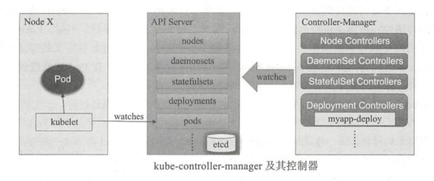
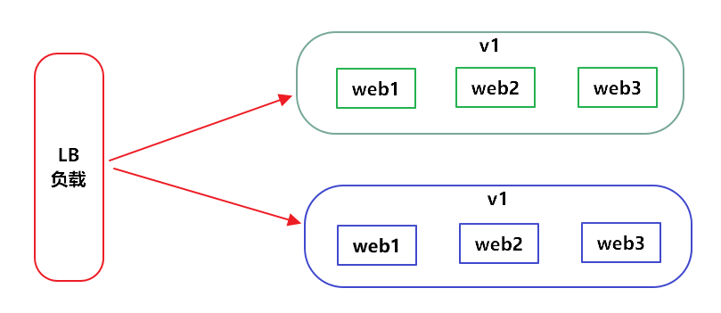
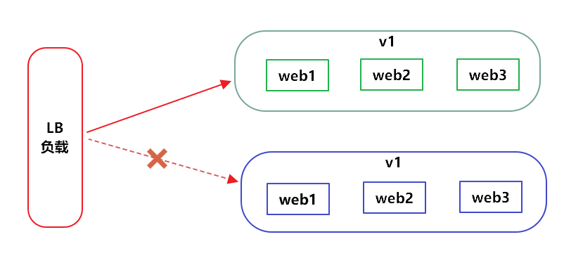
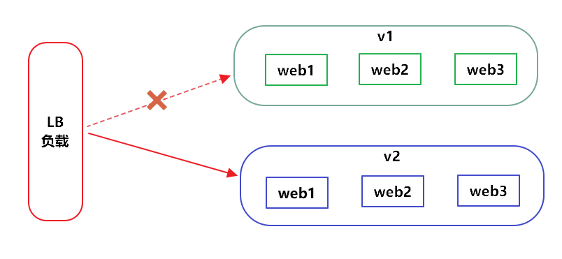
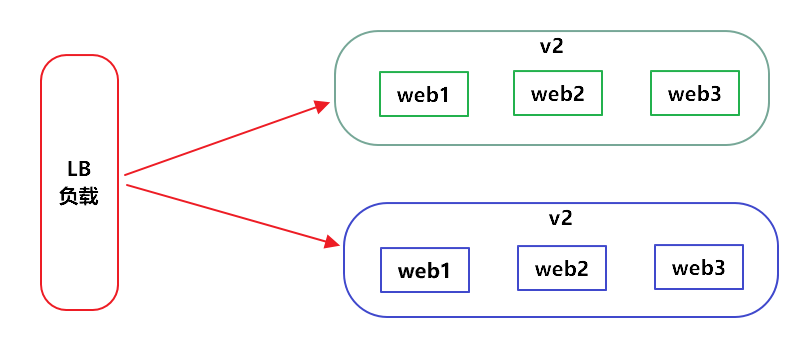
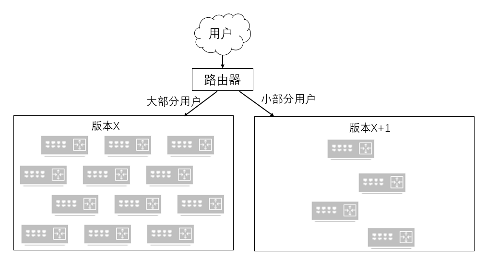

[TOC]


# Pod控制器

自主式 Pod 对象由调度器绑定至目标工作节点后，即由相应节点上的 kubelet 负责监控其容器的存活性，容器主进程崩溃后， kubelet 够自动重启相应的容器。不过， kubelet 对非主进程崩溃类的容器错误却无从感知，这依赖于用户为 Pod 资游对象自定义的存活性探测( liveness probe ）机制，以便 kubelet 能够探知到此类故障。然而，在 Pod 对象遭到意外删除，或者工作节点自身发生故障时，又该如何处理呢？

kubelet 是Kubemetes 集群节点代理程序，它在每个工作节点上都运行着一个实例。因而，集群中的某工作节点发生故障时，其 kubelet 也必将不再可用，于是，节点上的 Pod 资源的健康状态将无从得到保证，也无法再由 kubelet 重启。此种场景中的 Pod 存活性一般要由工作节点之外的 Pod 控制器来保证。事实上，遭到意外删除的 Pod 资源的恢复也依赖于其控制器。

Pod 控制器由 master的kube-controller-manager 组件提供，常见的此类控制器有 ReplicationController、ReplicaSet Deployment 、DaemonSet、StatefulSet、Job、CronJob 等，它们分别以不同的方式管理 Pod 资源对象。实践中，对 Pod 对象的管理通常都是由某种控制器的特定对象来实现的，包括其创建、删除及重新调度等操作。	


在Kubernetes平台上，我们很少会直接创建一个Pod，在大多数情况下会通过RC、Deployment、DaemonSet、Job等控制器完成对一 组Pod副本的创建、调度及全生命周期的自动控制任务。

**控制器** 又称之为**工作负载**，常见包含以下类型控制器：

- **ReplicationController（RC） 和 ReplicaSet（RS）**
  - ReplicaSet（简称RS）: 是Replication Controller 升级版本。当用户创建指定数量的pod副本数量，确保pod副本数量符合预期状态，并且支持滚动式自动扩容和缩容功能。
- **Deployment**
  - 工作在ReplicaSet之上，用于管理无状态应用，目前来说最好的控制器。支持滚动更新和回滚功能，还提供声明式配置。
- **DaemonSet**
  - 用于确保集群中的每一个节点只运行特定的pod副本，通常用于实现系统级后台任务,比如ingress,elk.服务是无状态的,服务必须是守护进程。
- **StatefulSet**
  - 管理有状态应用,比如redis,mysql。
- **Job/CronJob**
  - Job是一次性任务运行，完成就立即退出，不需要重启或重建。
  - CronJob是周期性任务控制，执行后就退出，不需要持续后台运行。
- **HorizontalPodAutoscaler（HPA）**自动水平伸缩


# 1 关于Pod控制器

Kubernetes 提供了众多的控制器来管理各种类型的资源，如 Node Lifecycle Controller Namespace Controller Service Controller 和 Deployment Controller 等，它们的功用几乎可以做到见名知义 创建完成后， 每一个控制器对象都可以通过内部的和解循环（ reconci iation loop ），不间断地监控着由其负责的所有资源并确保其处于或不断地逼近用户定义的目标状态。

## 1.1  Pod控制器概述

Master 的各组件中， API Server 仅负责将资源存储于etcd 中，并将其变动通知给各相关的客户端程序，如 kubelet、kube-scheduler kube-proxy、kube-controller-manager 等，kub-scheduler 监控到处于未绑定状态的 Pod 对象出现时，会立即启动调度器为其挑选适配的工作节点。



## 1.2 控制器与 Pod 对象

通常，一个 Pod 控制器资源至少应该包含三个基本的组成部分：

- 标签选择器：匹配并关联 Pod 资源对象，并据此判断哪个pod归自己管理。
- 期望的副本数：当现存的pod数量不足，会根据pod资源模板进行新建帮助用户管理无状态的pod资源，精确反应用户定义的目标数量，但是RelicaSet不是直接使用的控制器，而是使用Deployment。
- Pod 模板 ：用于新建 Pod 资源对象的 Pod 模板资源。

>  *注意*：DaemonSet 用于确保集群中的每个工作节点或符合条件的每个节点上都运行着一个Pod 副本，而不是某个精确的数量值。因此不具有上面组成部分中的第二项。


## 1.3 Pod 模板资源

Pod Template 是Kubernetes API 的常用资源类型，常用于为控制器指定自动创建 Pod资源对象时所需要的配置信息。因为要内嵌于控制器中使用，所以 Pod 模板的配置信息中不需要apiVersion和kind 字段 ，但此之外的其他内容与定义自主式 Pod对象所支持的字段几乎完全相同，这包括 metadata和spec 及其 内嵌的其他各个字段。Pod 控制器类资源的spec字段通常 内嵌 replicas、selector和template 字段，其中template 即为 Pod 模板的定义。


# 2 RC和RS控制器

Replication Controller（简称RC）：是Kubernetes系统中的核心概念之一，即声明某种Pod的副本数量在任意时刻都符合某个预期值。

ReplicaSet（简称RS）: 是Replication Controller 升级版本。当用户创建指定数量的pod副本数量，确保pod副本数量符合预期状态，并且支持滚动式自动扩容和缩容功能。

应用升级时，通常会使用一个新的容器镜像版本替代旧版本。我们希望系统平滑升级，比如在当前系统中有10个对应的旧版本的Pod，则最佳的系统升级方式是旧版本的Pod每停止一个，就同时创建一个新版本的Pod，在整个升级过程中此消彼长，而运行中的Pod数量始终是10个，几分钟以后，当所有的Pod都已经是新版本时，系统升级完成。通过RC机制，Kubernetes很容易就实现了这种高级实用的特性，被称为“滚动升级”（Rolling Update）。

**Replica Set和Replication Controller的区别：**

Replica Set与RC当前的唯一区别是，**Replica Sets支持基于集合的Label selector（Set-based selector）如：version in (v1.0, v2.0) 或 env notin (dev, qa)**，**而 RC只支持基于等式的Label Selector（equality-based selector）如：env=dev或environment!=qa**，这使得Replica Set的功能更强。


## 2.1 RC用法

**1、RC定义了如下**

> 1.Pod期待的副本数(replicas)
>
> 2.用于筛选目标Pod的Label Seletcor(标签选择器)
>
> 3.当Pod的副本小于预期(replicas)时，用于创建新Pod的Pod模板(template)

**2、RC主要功能**

- 确保Pod数量: 它会确保Kubernetes中有指定数量的Pod在运行，如果少于指定数量的Pod，RC就会创建新的，反之会删除多余的，保证Pod的副本数量不变
- 确保Pod健康: 当Pod不健康，RC会杀死不健康的Pod，重新创建新的
- 弹性伸缩: 在业务高峰或者低峰的时候，可以用RC来动态调整Pod数量来提供资源的利用率吧，当然也可以使用HPA来实现
- 滚动升级: 滚动升级是一种平滑的升级方式，通过逐步替换的策略，保证整体系统的稳定性

**3、RC使用**

一个完整的RC定义的例子  [rc-nginx.yaml](yaml\rc-nginx.yaml)  ，即确保拥有app=rc-nginx标签的这个Pod（运行nginx容器）在整个Kubernetes集群中始终只有一个副本：

```yaml
apiVersion: v1
kind: ReplicationController
metadata:
  name: rc-nginx
spec:
  replicas: 1
  selector:
    app: rc-nginx
  template:
    metadata:
      labels:
        app: rc-nginx
    spec:
      containers:
      - name: nginx-demo
        image: nginx:1.14.0
        imagePullPolicy: IfNotPresent
        ports:
        - containerPort: 80

```

执行并测试删除：

```bash
$ kubectl create -f  rc-nginx.yaml
$ kubectl get pod frontend-rc-kfffm
NAME                READY   STATUS    RESTARTS   AGE
rc-nginx-wzl9m            1/1     Running   0          37s
# 尝试删除rc-nginx-wzl9m，会发现系统会立刻创建一个新的rc-nginx-xxx
$ kubectl delete pod rc-nginx-wzl9m
pod "rc-nginx-wzl9m" deleted

$ kubectl get po
NAME                      READY   STATUS    RESTARTS   AGE
rc-nginx-bwk4n            1/1     Running   0          59s


```

RC将其提交到Kubernetes集群中后，Master 上的Controller Manager组件就得到通知，定期巡检系统中当前存活的目标Pod，并确保目标Pod实例的数量刚好等于此RC的期望值，有过多的Pod副本在运行，系统就会停掉一些Pod，少于1个就会自动创建，大大减少了系统管理员在传统IT环境中需要完成的许多手工运维工作（如主机监控脚本、应用监控脚本、故障恢复脚本等）。

**4、RC的副本数量动态缩放**

在Pod运行时，我们可以通过`kubectl scale`命令对RC的副本数量进行**动态缩放**（scaling）。

```bash
# 扩展Pod副本到3
kubectl scale rc [rc名称] --replicas=3 

# 缩减副本到1
kubectl scale rc [rc名称] --replicas=1

# 查看结果RC数量
$ kubectl get rc
NAME       DESIRED   CURRENT   READY   AGE
rc-nginx   1         1         1       5m9s

DESIRED   #rc设置的数量
CURRENT   #已经创建的数量
READY     #准备好的数量
```

将原来 rc-nginx.yaml 的 1个副本改为3个：

```bash
$ kubectl scale rc rc-nginx --replicas=3
$ kubectl get pod|grep rc-nginx
rc-nginx-6cjft            1/1     Running   0          46s
rc-nginx-bwk4n            1/1     Running   0          8m51s
rc-nginx-mwx8x            1/1     Running   0          46s

```

除了通过命令的方式修改，我们还可以通过yaml文件的方式进行缩放。

> ==**注意：**== 删除RC并不会影响通过该RC已创建号的Pod。为了删除所有Pod，可以设置replicas的值为0，然后更新该RC。另外,kubectl提供了`stop`和`delete`命令来一次性删除RC和RC控制的全部Pod


**5、基于RC滚动升级**

指定镜像升级，每10秒升级一个

```bash
# 基于命令
kubectl rolling-update rc-nginx --image=nginx:1.20.0 --update-period=10s
# 基于yaml文件升级
kubectl rolling-update rc-nginx -f rc-nginx-1.20.0.yaml --update-period=10s
```

使用kubectl rolling-update实现滚动更新的不足：

- rolling-update的逻辑是由kubectl发出N条命令到APIServer完成的，很可能因为网络原因导致update中断
- 需要创建一个新的rc，名字与要更新的rc不能一样
- 回滚还需要执行rolling-update，只是用老的版本替换新的版本
- service执行的rolling-update在集群中没有记录，后续无法跟踪rolling-update历史

现如今，RC的方式已经被Deployment替代。


## 2.2 RS用法

ReplicaSet（简称RS）: 是Replication Controller 升级版本。当用户创建指定数量的pod副本数量，确保pod副本数量符合预期状态，并且支持滚动式自动扩容和缩容功能。

**ReplicaSet 能够实现以下功能：**

- 确保 Pod 资源对象的数量： ReplicaSet 需要确保由其控制运行的 Pod副本数量精确吻合配置中定义的期望值，否则就会自动补足所缺或终止所余。

- 确保 Pod 健康运行：探测到由其管控的 Pod 对象因其所在的工作节点故障而不可用时，自动请求由调度器于其他工作节点创建缺失的 Pod 副本。

- 弹性伸缩：业务规模因各种原因时常存在明显波动，在波峰或波谷期间，可以通过ReplicaSet 控制器动态调整相关 Pod 资源对象的数量。 此外，在必要时还可以通过HPA (Hroizonta!PodAutoscaler ）控制器实现 Pod 资源的自动伸缩。

**1、创建 [rs-nginx.yaml](yaml\rs-nginx.yaml) 资源：**

```yaml
apiVersion: apps/v1
kind: ReplicaSet
metadata:
  name: rs-nginx
spec:
  replicas: 1
  selector:
    matchLabels:
      app: rs-nginx
  template:
    metadata:
      labels:
        app: rs-nginx
    spec:
      containers:
      - name: nginx-demo
        image: nginx:1.14.0
        imagePullPolicy: IfNotPresent
        ports:
        - containerPort: 80

```

从以上示例可以看出，它也由 kind、apiVersion、metadata、spec和status这5个一级字段组成，其中 status 为只读字段，因此需要在清单文件中配置的仅为前4个字段。它的 spec 字段一般嵌套使用以下几个属性字段：

- `replicas <integer>` ：期望的 Pod 对象副本数；

- `selector <Object>`：当前控制器匹配 Pod 对象副本的标签选择器，支持 `matchLabels`和`matchExpressions `两种匹配机制；

- `template <Object>`：用于补足 Pod 副本数量时使用的 Pod 模板资源；

- `minReadySeconds <integer>` ：新建的 Pod 对象，在启动后多长时间内如果其容器未发生崩溃等异常情况即被视为“就绪”；默认为 

  0秒，表示 一旦就绪性探测成功，即视为可用。

创建资源后查看详细：

```
$ kubectl get rs rs-nginx -o wide
NAME       DESIRED   CURRENT   READY   AGE     CONTAINERS   IMAGES         SELECTOR
rs-nginx   1         1         1       7m49s   nginx-demo   nginx:1.14.0   app=rs-nginx

```

> ==**注意：**==强行修改RS控制器下管控的Pod资源的标签，会导致它不再被控制器作为副本计数，这样就会触发RS对副本对象进行补足机制。

测试如下：将` rs-nginx-sbf2b` 的标签 app 的值置空

```bash
#查看标签
$ kubectl get pods rs-nginx-sbf2b --show-labels
NAME             READY   STATUS    RESTARTS   AGE   LABELS
rs-nginx-sbf2b   1/1     Running   0          16m   app=rs-nginx

$ kubectl label pods rs-nginx-sbf2b --overwrite app=
pod/rs-nginx-sbf2b labeled

$ kubectl get po|grep rs-nginx
rs-nginx-5rfw8            1/1     Running   0          27s
rs-nginx-sbf2b            1/1     Running   0          19m

```

由此可见，修改 Pod 资源的标签即可将其从控制器的管控之下移出，当然，修改后标签的如果又能被其他控制器资源的标签选择器所命中，则此时它又成了隶属于另一控制器的副本。如果修改其标签后的 Pod 对象不再隶属于任何控制器，那么它就将成为自主式 Pod，与此前手动创建的 Pod 对象的特性相同，即误删 或所在的工作节点故障都会造成其永久性的消失。

**2、查看Pod资源变动的相关事件**

```bash
kubectl describe rs rs-nginx
Name:         rs-nginx
Namespace:    default
Selector:     app=rs-nginx
Labels:       <none>
Annotations:  <none>
Replicas:     1 current / 1 desired
Pods Status:  1 Running / 0 Waiting / 0 Succeeded / 0 Failed
Pod Template:
  Labels:  app=rs-nginx
  Containers:
   nginx-demo:
    Image:        nginx:1.14.0
    Port:         80/TCP
    Host Port:    0/TCP
    Environment:  <none>
    Mounts:       <none>
  Volumes:        <none>
Events:
  Type    Reason            Age    From                   Message
  ----    ------            ----   ----                   -------
  Normal  SuccessfulCreate  24m    replicaset-controller  Created pod: rs-nginx-sbf2b
  Normal  SuccessfulCreate  4m59s  replicaset-controller  Created pod: rs-nginx-5rfw8

```

**3、更新 ReplicaSet 控制器**

Replic aSet控制器的核心组成部分是标签选择器、副本数量及 Pod 模板，但更新操作一般是围绕 replicas和template 两个字段值进行的，毕竟改变标签选择器的需求几乎不存在。

更新Pod模板：升级应用

vim  [rs-nginx-v2.yaml](yaml\rs-nginx-v2.yaml) 

```yaml
apiVersion: apps/v1
kind: ReplicaSet
metadata:
  name: rs-nginx
spec:
  replicas: 1
  selector:
    matchLabels:
      app: rs-nginx
  template:
    metadata:
      labels:
        app: rs-nginx
    spec:
      containers:
      - name: nginx-demo
        image: nginx:1.20.0  #修改镜像
        imagePullPolicy: IfNotPresent
        ports:
        - containerPort: 80

```

对新版本的清单文件执行`kubectl apply`  或  `kubectl replace `  命令即可完成 rs-nginx控制器资源的修改操作：

> ==**注意**==：使用`kubectl replace`进行更新后，需要手动删除原来的pod才能更新为新版


```bash

$ kubectl get pod rs-nginx-bgdlv
NAME             READY   STATUS    RESTARTS   AGE
rs-nginx-bgdlv   1/1     Running   0          17s
$ kubectl exec -it rs-nginx-bgdlv -- nginx -v
nginx version: nginx/1.14.0
$ kubectl apply -f rs-nginx-v2.yaml
Warning: kubectl apply should be used on resource created by either kubectl create --save-config or kubectl apply
replicaset.apps/rs-nginx configured

#会发现nginx的版本，没有发生变化，手动删除控制器现有的 Pod 对象（或修改与其匹配的控制器标签选择器的标签），并由控制器基于新的Pod 模板自动创建出足额的 Pod，即可完成一次应用的升级。
$ kubectl exec -it rs-nginx-bgdlv -- nginx -v
nginx version: nginx/1.14.0

# 这里采用一次性删除所有含app=rs-nginx标签的pod，生产环境中，建议着个删除，以确保最小的影响业务
$ kubectl delete pod rs-nginx-bgdlv -l app=rs-nginx
pod "rs-nginx-bgdlv" deleted

$ kubectl exec -it rs-nginx-b7q6t -- nginx -v
nginx version: nginx/1.20.0

```

**4、扩容和缩容**

```bash
# 扩容
$ kubectl scale replicasets rs-nginx --replicas=5

# 缩容
$ kubectl scale replicasets rs-nginx --replicas=1
```

另外， kubectl scale 还支持在现有 Pod副本数量，符合指定的值时才执行扩展操作，这仅需要为命令使用`--current-replica `选项即可:

```bash
$ kubectl scale replicasets rs-nginx --current-replicas=2 --replicas=5
```

尽管 ReplicaSet 控制器功能强大，但在实践中 ，它却并非是用户直接使用的控制器，而是要由比其更高一级抽象的 Deployment 控制器对象来调用。

# 3 Deployment控制器

Deployment是Kubernetes在1.2版本中引入的新概念，用于更好地解决Pod的编排问题。是一个更高层次的API对象，它管理ReplicaSets和Pod，并提供声明式更新等功能。官方建议使用Deployment管理ReplicaSets，而不是直接使用ReplicaSets。

Deployment 控制器比ReplicaSets多了很多特性：

- **事件和状态查看** ：必要时可以查 Deployment 对象升级的详细进度和状态。
- **回滚**：升级操作完成后发现问题时，支持使用回滚机制将应用返回到前一个或由用户指定的历史记记录中的版本。
- **版本记录** ：对 Deployment 对象的每次操作都予以保存，以供后回滚操作使用。
- **暂停和启动** ：对于每一次升级 ，都能够随时暂停和启动。
- **多种自动更新方案**：一是 Recreate 即重建更新机制，全面停止，删除旧pod后启用新版本代理；另一个是 RollingUpdate ，即滚动升级，着步替换旧的pod至新版本。


## 3.1 创建 Deployment

Deployment 是标准的 Kubernetes API 资源，它建构于 ReplicaSet 资源之上，于是其spec 段中嵌套使用的字段包含了ReplicaSet 控制器支持的 replicas、selector、template、minReadySeconds ，它也利用这些信息完成了其二级资源 ReplicaSet 对象的创建。

vim  [nginx-deployment.yaml](yaml\nginx-deployment.yaml) 

```yaml
# 声明api的版本
apiVersion: apps/v1
# kind代表资源的类型，资源是Deployment
kind: Deployment
# 资源叫什么名字，是在其属性metadata里面的。
metadata:
  name: nginx-deployment
spec:
  replicas: 3
  selector:
    matchLabels:
      name: nginx
  template:
    metadata:
      labels:
        name: nginx
    spec:
      containers:
        - name: nginx
          image: nginx：1.14.0
          ports:
            - containerPort: 80
          resources:
            requests:
              cpu: 200m
              memory: 64Mi
            limits:
              cpu: 400m
              memory: 256Mi

```

执行后查看：

```bash
$ kubectl create -f nginx-deployment.yaml --record
# --record参数可以记录当前版本的Deployment都执行过哪些命令。

$ kubectl get pod |grep nginx-deployment
nginx-deployment-845c84b94c-g2g95   1/1     Running   0          7m16s
nginx-deployment-845c84b94c-gkj4q   1/1     Running   0          7m16s
nginx-deployment-845c84b94c-ztjm7   1/1     Running   0          7m16s

$ kubectl get pod -l name=nginx
NAME                                READY   STATUS    RESTARTS   AGE
nginx-deployment-845c84b94c-g2g95   1/1     Running   0          8m10s
nginx-deployment-845c84b94c-gkj4q   1/1     Running   0          8m10s
nginx-deployment-845c84b94c-ztjm7   1/1     Running   0          8m10s

$ kubectl get deploy nginx-deployment
NAME               READY   UP-TO-DATE   AVAILABLE   AGE
nginx-deployment   3/3     3            3           6m36s


```

对上面deploy输出中涉及的数量解释如下： 

- `READY` ：1/1左边1是真正运行的副本数，右边1是期望的副本数即replicas定义的副本数。
- `UP-TO-DATE`：显示已更新以实现期望状态的副本数。
- `AVAILABLE`：显示应用程序可供用户使用的副本数。
- `AGE` ：显示应用程序运行的时间量。


## 3.2 更新Deployment

### 3.2.1 Deployment更新策略

ReplicaSet 控制器的应用更新，要手动分成多步并以特定的次序进行，过程复杂且容易出错，而 Deployment 却只需要由用户指定在 Pod 模板中要改动的内容，例如：容器镜像文件的版本，剩下的步骤由其自动完成。

Deployment 支持两种更新策略：滚动更新（ rolling update ）和重新创建（ recreate)，默认为滚动更新。

滚动更新时，应用升级期间还要确保可用的 Pod 对象数量不低于某阈值，以确保可以持续处理客户端的服务请求，变动的方式和 Pod 对象的数量范围将通过 `spec.strategy.rollingUpdate.maxSurge` 和 `spec.strategy.rollingUpdate.maxUnavailable` 两个属性协同进行定义，它的功能如下：

- maxSurge：升级过程中最多可以比原先设置多出的POD数量 ，可以是数量也可以是百分比。  

  例如：maxSurage=1，replicas=5,则表示Kubernetes会先启动1一个新的Pod后才删掉一个旧的POD，整个升级过程中最多会有5+1个POD。

- maxUnavailable ： 升级过程中最多有多少个POD处于无法提供服务的状态，可以是数量也可以是百分比。  

  例如：maxUnavaible=1，则表示Kubernetes整个升级过程中最多会有1个POD处于无法服务的状态。

==**注意：**==max Surge和max Unavailab 属性的值不可同时为0 ，否则 Pod对象的副本数量在符合用户期望的数量后无法做出合理变动以进行滚动更新操作。

配置时，用户还可以使用 Deplpoyment 控制器的 `spec.minReadySeconds` 属性来控制应用升级的速度。Deployment 控制器也支持用户保留其滚动更新历史中的旧 ReplicaSet 对象版本，使用`Spec.revisionHistoryLimit`，进行定义保存历史版本数量。

> ==**注意：**==为了保存版本升级的历史，需要在创建 Deployment 对象时于命令中使用`--record`选项。


尽管滚动更新以节约系统资源著称，但它也存在。直接改动现有系统引发不确定性风险，而且升级过程出现问题后，执行回滚操作也较为缓慢。有鉴于此， **金丝雀部署可能是较为理想的方式**，当然，如果不考虑虑系统资源的可用性，那么传统的蓝绿部署也是不错的选择。


### 3.2.2 Deployment更新操作

修改 Pod 模板相关的配置参数便能完成 Deployment 控制器资源的更新。由于是声明式配置，因此对 Deployment 控制器资源的修改尤其适合使用 `apply`和`patch `命令来进行，如果仅是修改容器镜像， `set image` 命令更为易用。

**1、设置等待时间**

为了使得升级过程更易于观测，这里先使用`kubectl patch`命令为其`specminReadySeconds `字段定义等待时长为5s：

```bash
$ kubectl patch deployments nginx-deployment -p '{"spec": {"minReadySeconds": 5}}'
```

patch 的补丁形式为 JSON 格式，以 -p 指定设置`spec.minReadySeconds` 的值。

> ==**注意：**==修改 Deployment 控制器的 `minReadySeconds`、`replicas`和`strategy`等字段的值不会触发 Pod 资源更新操作，因为他们不属于模板的内嵌字段，对现存的 Pod 不会产生任何影响。


**2、更改Pod模板中的镜像**

修改nginx-deployment中的nginx镜像由nginx:1.14.0变为nginx:1.20.0

```bash
$ kubectl set image deployment/nginx-deployment nginx=nginx:1.20.0
deployment.apps/nginx-deployment image updated
```

或者使用edit命令来编辑 Deployment，修改` .spec.template.spec.containers[0].image `，将nginx:1.14.0变为nginx:1.20.0

```bash
$ kubectl edit deployment/nginx-deployment
```

修改后你会发现，deployment正在自动更新，无需人为介入。


**3、查看更新进度**

`kubectl rollout status` 命令可用于打印滚动更新过程中的状态信息：

```bash
$ kubectl rollout status deployment/nginx-deployment
Waiting for deployment "nginx-deployment" rollout to finish: 1 out of 3 new replicas have been updated...
Waiting for deployment "nginx-deployment" rollout to finish: 1 out of 3 new replicas have been updated...
Waiting for deployment "nginx-deployment" rollout to finish: 1 out of 3 new replicas have been updated...
Waiting for deployment "nginx-deployment" rollout to finish: 2 out of 3 new replicas have been updated...
Waiting for deployment "nginx-deployment" rollout to finish: 2 out of 3 new replicas have been updated...
Waiting for deployment "nginx-deployment" rollout to finish: 2 out of 3 new replicas have been updated...
Waiting for deployment "nginx-deployment" rollout to finish: 2 out of 3 new replicas have been updated...
Waiting for deployment "nginx-deployment" rollout to finish: 1 old replicas are pending termination...
Waiting for deployment "nginx-deployment" rollout to finish: 1 old replicas are pending termination...
Waiting for deployment "nginx-deployment" rollout to finish: 1 old replicas are pending termination...
deployment "nginx-deployment" successfully rolled out

```

还可以使用 `kubectl get ployment -- watch` 命令监控其更新过程中 Pod 对象的变化过程

```bash
$ kubectl get deployments nginx-deployment --watch
NAME               READY   UP-TO-DATE   AVAILABLE   AGE
nginx-deployment   3/3     3            3           17h
nginx-deployment   3/3     3            3           17h
nginx-deployment   3/3     3            3           17h
nginx-deployment   3/3     0            3           17h
nginx-deployment   3/3     1            3           17h
nginx-deployment   4/3     1            3           17h
nginx-deployment   4/3     1            4           17h
nginx-deployment   3/3     1            3           17h
nginx-deployment   3/3     2            3           17h
nginx-deployment   4/3     2            3           17h
nginx-deployment   4/3     2            4           17h
nginx-deployment   3/3     2            3           17h
nginx-deployment   3/3     3            3           17h
nginx-deployment   4/3     3            3           17h
nginx-deployment   4/3     3            4           17h
nginx-deployment   3/3     3            3           17h

```

由此可以看出，UP-TO-DATE 的 replica 的数目由3-->0-->1-->2-->3最终达到配置中要求的数目。


滚动更新时， nginx-deployment 控制器会创建一个新的 ReplicaSet 控制器来管控新版本的 Pod 对象，升级完成后，旧版本的ReplicaSet 会保留在历史记录中，但其此前的Pod 对象将会被删除。通过执行`kubectl get rs`可以看到 Deployment 更新了Pod：

```bash
$ kubectl get rs
NAME                          DESIRED   CURRENT   READY   AGE
nginx-deployment-57dd96ddb9   0         0         0       17h
nginx-deployment-6f98bfdddd   3         3         3       7m2s
```

最后验证nginx镜像版本是否更改：

```bash
$ kubectl get pod|grep nginx-deployment
nginx-deployment-6f98bfdddd-65xrr   1/1     Running   0          10m
nginx-deployment-6f98bfdddd-7w5kn   1/1     Running   0          9m39s
nginx-deployment-6f98bfdddd-jnhr6   1/1     Running   0          10m
$ kubectl exec -it nginx-deployment-6f98bfdddd-65xrr -- nginx -v
nginx version: nginx/1.20.0

```


**4、deployments更新过程分析**

查看Deployment详细：

```bash
$ kubectl describe deployments nginx-deployment
Name:                   nginx-deployment
Namespace:              default
CreationTimestamp:      Wed, 02 Jun 2021 17:26:21 +0800
Labels:                 <none>
Annotations:            deployment.kubernetes.io/revision: 2
Selector:               name=nginx
Replicas:               3 desired | 3 updated | 3 total | 3 available | 0 unavailable
StrategyType:           RollingUpdate
MinReadySeconds:        5
RollingUpdateStrategy:  25% max unavailable, 25% max surge
Pod Template:
  Labels:  name=nginx
  Containers:
   nginx:
    Image:      nginx:1.20.0
    Port:       80/TCP
    Host Port:  0/TCP
    Limits:
      cpu:     400m
      memory:  256Mi
    Requests:
      cpu:        200m
      memory:     64Mi
    Environment:  <none>
    Mounts:       <none>
  Volumes:        <none>
Conditions:
  Type           Status  Reason
  ----           ------  ------
  Available      True    MinimumReplicasAvailable
  Progressing    True    NewReplicaSetAvailable
OldReplicaSets:  <none>
NewReplicaSet:   nginx-deployment-6f98bfdddd (3/3 replicas created)
Events:
  Type    Reason             Age   From                   Message
  ----    ------             ----  ----                   -------
  Normal  ScalingReplicaSet  14m   deployment-controller  Scaled up replica set nginx-deployment-6f98bfdddd to 1
  Normal  ScalingReplicaSet  13m   deployment-controller  Scaled down replica set nginx-deployment-57dd96ddb9 to 2
  Normal  ScalingReplicaSet  13m   deployment-controller  Scaled up replica set nginx-deployment-6f98bfdddd to 2
  Normal  ScalingReplicaSet  12m   deployment-controller  Scaled down replica set nginx-deployment-57dd96ddb9 to 1
  Normal  ScalingReplicaSet  12m   deployment-controller  Scaled up replica set nginx-deployment-6f98bfdddd to 3
  Normal  ScalingReplicaSet  12m   deployment-controller  Scaled down replica set nginx-deployment-57dd96ddb9 to 0

```

会发现当镜像版本有更新时，既要保证服务可用，又要保证在线更新，流程应该是：

1. 先增加一个pod，镜像版本为新版本
2. pod可用之后，删除一个老版本pod
3. 循环第1、2步，直到老版本pod全部删除，新版本的pod全部可用

- 上述的这个过程就是replicaset的作用，它根据需求，自动的增加新版本pod，然后删除老版本pod，直到老版本pod全部删除，新版本的pod全部可用。

- 如果此时版本需要回退，那replicaset需要把刚才的步骤逆向更新一遍，实现版本回退。

- **deployment的作用就是管理replicaset**。deployment会保存各个版本的replicaset，一旦需要进行版本回滚，deployment会立即回滚replicaset的版本，从而控制pod状态。

  

## 3.3 回退Deployment

若因各种原因导致滚动更新无法正常进行，如镜像文件获取失败、 金丝雀遇险等，则应该将应用回滚到之前的版本，或者回滚到由用户指定的历史记录中的版本。

假设我们在更新 Deployment 的时候犯了一个拼写错误，将镜像的名字写成了nginx:1.200，而正确的名字应该是nginx:1.20.0：

```bash
$ kubectl set image deployment/nginx-deployment nginx=nginx:1.200
deployment.apps/nginx-deployment image updated

$ kubectl rollout status deployments nginx-deployment
Waiting for deployment "nginx-deployment" rollout to finish: 1 out of 3 new replicas have been updated...
...
#会发现Rollout 将会卡住。

```

Ctrl-C 停止上面的 rollout 状态监控。

```bash
$ kubectl get pod|grep nginx-deployment
nginx-deployment-57dd96ddb9-4gsjt   1/1     Running            0          38m
nginx-deployment-57dd96ddb9-c9489   1/1     Running            0          38m
nginx-deployment-57dd96ddb9-qfhww   1/1     Running            0          38m
nginx-deployment-7798b55bfd-hw4rm   0/1     ImagePullBackOff   0          3m20s

```

这种情况，并没有影响正常的Pod，删除有问题的Pod，重新定义镜像版本即可发布。

> ==**注意：**== 
>
> 1. 只要 Deployment 的 rollout 被触发就会创建一个 revision。也就是说当且仅当 Deployment 的 Pod template（如.spec.template）被更改，例如更新template 中的 label 和容器镜像时，就会创建出一个新的 revision。
> 2. Deployment controller会自动停止坏的 rollout，并停止扩容新的 ReplicaSet。


如果是镜像已经更新完为nginx=nginx:1.20.0，发现版本有BUG，需要回滚：

- **查看检查下 Deployment 的 历史revision**

```
$ kubectl rollout history deployments nginx-deployment
deployment.apps/nginx-deployment
REVISION  CHANGE-CAUSE
1         kubectl create --filename=nginx-deployment.yaml --record=true
2         kubectl create --filename=nginx-deployment.yaml --record=true
3         kubectl create --filename=nginx-deployment.yaml --record=true

```

因为创建 Deployment 的时候使用了`--recored`参数，可以记录命令，方便查看每次 revision 的变化。

- **查看单个revision 的详细信息**

```bash
$ kubectl rollout history deployments nginx-deployment --revision=3
deployment.apps/nginx-deployment with revision #3
Pod Template:
  Labels:	name=nginx
	pod-template-hash=6f98bfdddd
  Annotations:	kubernetes.io/change-cause: kubectl create --filename=nginx-deployment.yaml --record=true
  Containers:
   nginx:
    Image:	nginx:1.20.0
    Port:	80/TCP
    Host Port:	0/TCP
    Limits:
      cpu:	400m
      memory:	256Mi
    Requests:
      cpu:	200m
      memory:	64Mi
    Environment:	<none>
    Mounts:	<none>
  Volumes:	<none>

```

会发现revision=3是更新后的版本。

- **版本回退**

回退当前的 rollout 到之前的版本（也就是上一次）：

```bash
$ kubectl rollout undo deployment/nginx-deployment
```

也可以使用 `--to-revision`参数指定某个历史版本：

```
$ kubectl rollout undo deployment/nginx-deployment --to-revision=1
```

该 Deployment 现在已经回退到了先前的稳定版本。如您所见，Deployment controller产生了一个回退到revison 2的DeploymentRollback的 event。

```bash
$ kubectl describe deployment nginx-deployment
Name:                   nginx-deployment
Namespace:              default
CreationTimestamp:      Thu, 03 Jun 2021 14:19:41 +0800
Labels:                 <none>
Annotations:            deployment.kubernetes.io/revision: 5
                        kubernetes.io/change-cause: kubectl create --filename=nginx-deployment.yaml --record=true
Selector:               name=nginx
Replicas:               3 desired | 3 updated | 3 total | 3 available | 0 unavailable
StrategyType:           RollingUpdate
MinReadySeconds:        0
RollingUpdateStrategy:  25% max unavailable, 25% max surge
Pod Template:
  Labels:  name=nginx
  Containers:
   nginx:
    Image:      nginx:1.14.0
    Port:       80/TCP
    Host Port:  0/TCP
    Limits:
      cpu:     400m
      memory:  256Mi
    Requests:
      cpu:        200m
      memory:     64Mi
    Environment:  <none>
    Mounts:       <none>
  Volumes:        <none>
Conditions:
  Type           Status  Reason
  ----           ------  ------
  Available      True    MinimumReplicasAvailable
  Progressing    True    NewReplicaSetAvailable
OldReplicaSets:  <none>
NewReplicaSet:   nginx-deployment-57dd96ddb9 (3/3 replicas created)
Events:
  Type    Reason             Age                  From                   Message
  ----    ------             ----                 ----                   -------
  Normal  ScalingReplicaSet  13m                  deployment-controller  Scaled up replica set nginx-deployment-6f98bfdddd to 1
  Normal  ScalingReplicaSet  13m                  deployment-controller  Scaled down replica set nginx-deployment-57dd96ddb9 to 2
  Normal  ScalingReplicaSet  13m                  deployment-controller  Scaled up replica set nginx-deployment-6f98bfdddd to 2
  Normal  ScalingReplicaSet  13m                  deployment-controller  Scaled down replica set nginx-deployment-57dd96ddb9 to 1
  Normal  ScalingReplicaSet  13m                  deployment-controller  Scaled up replica set nginx-deployment-6f98bfdddd to 3
  Normal  ScalingReplicaSet  13m                  deployment-controller  Scaled down replica set nginx-deployment-57dd96ddb9 to 0
  Normal  ScalingReplicaSet  3m22s (x2 over 20m)  deployment-controller  Scaled up replica set nginx-deployment-7798b55bfd to 1
  Normal  ScalingReplicaSet  45s (x2 over 13m)    deployment-controller  Scaled down replica set nginx-deployment-7798b55bfd to 0
  Normal  ScalingReplicaSet  45s                  deployment-controller  Scaled up replica set nginx-deployment-57dd96ddb9 to 1
  Normal  ScalingReplicaSet  43s                  deployment-controller  Scaled up replica set nginx-deployment-57dd96ddb9 to 2
  Normal  ScalingReplicaSet  43s                  deployment-controller  Scaled down replica set nginx-deployment-6f98bfdddd to 2
  Normal  ScalingReplicaSet  40s (x2 over 54m)    deployment-controller  Scaled up replica set nginx-deployment-57dd96ddb9 to 3
  Normal  ScalingReplicaSet  40s                  deployment-controller  Scaled down replica set nginx-deployment-6f98bfdddd to 1
  Normal  ScalingReplicaSet  37s                  deployment-controller  Scaled down replica set nginx-deployment-6f98bfdddd to 0

```

通过设置`.spec.revisonHistoryLimit`项来指定 deployment 最多保留多少 revision 历史记录。如果将该项设置为0，Deployment就不允许回退了。

```bash
$ kubectl edit deployment/nginx-deployment
...
spec:
  progressDeadlineSeconds: 600
  replicas: 3
  revisionHistoryLimit: 10

```


# 企业常见几种发布方式

**前言**

在软件上线之前，不可避免地要对软件的正确性、可靠性进行测试，又不希望停机维护、不影响用户体验，并且在新版本出现问题的时候能够及时回退。所以，需要有一套完整的部署方案，灰度发布、滚动发布、蓝绿部署都是常见的手段，而A/B测试则是对用户体验进行调查的测试手段，这里一并学习。

## 蓝绿发布

**（1）定义**

蓝绿部署是不停老版本，部署新版本然后进行测试。确认OK后将流量切到新版本，然后老版本同时也升级到新版本。

**（2）特点**

蓝绿部署无需停机，并且风险较小。

**（3）优势和不足**

- 优势
  升级切换和回退速度非常快。
- 不足
  切换是全量的，如果V2版本有问题，则对用户体验有直接影响。需要两倍机器资源。

**（4）发布过程**

①蓝绿发布的初始状态是两组服务器（简单理解为蓝色和绿色）都提供服务，且版本一致为v1。




②着步将蓝色服务器流量引向绿色服务器，直至全部流量都切换至绿色服务器，蓝色服务器不再提供任何服务；




③开始升级蓝色服务器的应用为v2，版本 v2 与 v1 不同(新功能、Bug修复等)；然后再将绿色服务器流量着步全量切换至蓝色服务器，直至绿色服务器不提供服务；



④两个版本并行运行一段时间，但是只有蓝色v2的应用提供服务，如果版本v2测试正常；就将绿色v1版本的应用升级至v2，并将部分流量重新引向绿色服务器，从而实现两组服务器提供v2版本的服务。如果v2测试异常，绿色v1版本不升级，并将流量迅速切换至绿色v1应用。



**（5）演示**

准备两套yaml文件

vim  [nginx-deployment-v1.yaml](yaml\nginx-deployment-v1.yaml) 

```yaml
apiVersion: apps/v1
kind: Deployment
metadata:
  name: nginx-deployment-v1
spec:
  selector:
    matchLabels:
      app: nginx
      version: "1.14.0"
  replicas: 5
  revisionHistoryLimit: 10
  strategy:
    rollingUpdate:
      maxSurge: 1
      maxUnavailable: 3
  template:
    metadata:
      labels:
        app: nginx
        version: "1.14.0"
    spec:
      terminationGracePeriodSeconds: 60
      containers:
        - name: nginx-deployment-v1
          image: nginx:1.14.0
          imagePullPolicy: IfNotPresent
          livenessProbe:
            httpGet:
              path: /
              port: 80
              scheme: HTTP
            initialDelaySeconds: 30
            timeoutSeconds: 5
            successThreshold: 1
            failureThreshold: 3
          readinessProbe:
            httpGet:
              path: /
              port: 80
              scheme: HTTP
            initialDelaySeconds: 15
            timeoutSeconds: 5
            successThreshold: 1
            failureThreshold: 3
          ports:
          - containerPort: 80
            name: nginx
```

vim  [nginx-deployment-v2.yaml](yaml\nginx-deployment-v2.yaml) 

```yaml
apiVersion: apps/v1
kind: Deployment
metadata:
  name: nginx-deployment-v2
spec:
  selector:
    matchLabels:
      app: nginx
      version: "1.20.0"
  replicas: 5
  revisionHistoryLimit: 10
  strategy:
    rollingUpdate:
      maxSurge: 1
      maxUnavailable: 3
  template:
    metadata:
      labels:
        app: nginx
        version: "1.20.0"
    spec:
      terminationGracePeriodSeconds: 60
      containers:
        - name: nginx-deployment-v2
          image: nginx:1.20.0
          imagePullPolicy: IfNotPresent
          livenessProbe:
            httpGet:
              path: /
              port: 80
              scheme: HTTP
            initialDelaySeconds: 30
            timeoutSeconds: 5
            successThreshold: 1
            failureThreshold: 3
          readinessProbe:
            httpGet:
              path: /
              port: 80
              scheme: HTTP
            initialDelaySeconds: 15
            timeoutSeconds: 5
            successThreshold: 1
            failureThreshold: 3
          ports:
          - containerPort: 80
            name: nginx

```


## 灰度发布/金丝雀发布

**（1）定义**

金丝雀发布是能够平滑过渡的一种发布方式，也是增量发布的一种类型，是在原有版本可用的情况下，同时部署一个新版本应用作为“金丝雀”，测试新版本的性能和表现，以保障整体系统稳定的情况下，尽早发现、调整问题。

金丝雀发布一般先发 1 台，或者一个小比例，例如 2% 的服务器，主要做流量验证用，也称为金丝雀 (Canary) 测试（国内常称灰度测试）。简单的金丝雀测试一般通过手工测试验证，复杂的金丝雀测试需要比较完善的监控基础设施配合，通过监控指标反馈，观察金丝雀的健康状况，作为后续发布或回退的依据。

**（2）发布规则**

在**更新时执行暂停（pause）或继续（resume）操作**，通过Service或Ingress资源和相关的路由策略将部分用户的请求流量引入到这些新的Pod之上进行发布验证，运行一段时间后，如果确定没有问题，即可使用`kubectl roollout resume`命令继续滚动更新过程。

**（3）发布过程**

灰度发布／金丝雀发布由以下几个步骤组成：
① 准备好部署各个阶段的工件，包括：构建工件，测试脚本，配置文件和部署清单文件。
② 从负载均衡列表中移除掉“金丝雀”服务器。
③ 升级“金丝雀”应用（排掉原有流量并进行部署）。
④ 对应用进行自动化测试。
⑤ 将“金丝雀”服务器重新添加到负载均衡列表中（连通性和健康检查）。
⑥ 如果“金丝雀”在线使用测试成功，升级剩余的其他服务器。（否则就回滚）灰度发布可以保证整体系统的稳定，在初始灰度的时候就可以发现、调整问题，以保证其影响度。




**（4）适用场景**
① 不停止老版本，另外搞一套新版本，不同版本应用共存。
② 灰度发布中，常常按照用户设置路由权重，例如90%的用户维持使用老版本，10%的用户尝鲜新版本。
③ 经常与A/B测试一起使用，用于测试选择多种方案。AB test就是一种灰度发布方式，让一部分用户继续用A，一部分用户开始用B，如果用户对B没有什么反对意见，那么逐步扩大范围，把所有用户都迁移到B上面来。

**（5）演示**

vim  [nginx-deployment-v3.yaml](yaml\nginx-deployment-v3.yaml) 

```yaml
apiVersion: apps/v1
kind: Deployment
metadata:
  name: nginx-deployment-v3
spec:
  selector:
    matchLabels:
      app: nginx
  replicas: 5
  revisionHistoryLimit: 10
  template:
    metadata:
      labels:
        app: nginx
    spec:
      terminationGracePeriodSeconds: 60
      containers:
        - name: nginx
          image: nginx:1.14.0
          imagePullPolicy: IfNotPresent
          livenessProbe:
            httpGet:
              path: /
              port: 80
              scheme: HTTP
            initialDelaySeconds: 30
            timeoutSeconds: 5
            successThreshold: 1
            failureThreshold: 3
          readinessProbe:
            httpGet:
              path: /
              port: 80
              scheme: HTTP
            initialDelaySeconds: 15
            timeoutSeconds: 5
            successThreshold: 1
            failureThreshold: 3
          ports:
          - containerPort: 80
            name: nginx
```

执行后，创建nginx为1.14.0版本；然后修改镜像版本为1.20.0后，进行更新：

```bash
$ kubectl create -f nginx-deployment-v3.yaml --record


$ kubectl set image deployment/nginx-deployment-v3 nginx=nginx:1.20.0 && kubectl rollout pause deployment nginx-deployment-v3

deployment.apps/nginx-deployment-v3 image updated
deployment.apps/nginx-deployment-v3 paused


$ kubectl get po|grep nginx-deployment-v3
nginx-deployment-v3-69757888f8-87scw   1/1     Terminating         0          51s
nginx-deployment-v3-69757888f8-fsvmz   0/1     ContainerCreating   0          1s
nginx-deployment-v3-69757888f8-j4nd5   1/1     Running             0          51s
nginx-deployment-v3-69757888f8-ktmvq   1/1     Running             0          51s
nginx-deployment-v3-69757888f8-lhmzz   1/1     Running             0          51s
nginx-deployment-v3-69757888f8-p7dwd   1/1     Running             0          51s
nginx-deployment-v3-d756d5979-lsx4s    0/1     ContainerCreating   0          1s
nginx-deployment-v3-d756d5979-lsxf9    0/1     ContainerCreating   0          1s

#会发现原来的pod销毁1个，然后新建了3个新的pod；查看详细会发现，新旧版本的nginx共同运行。
$ kubectl describe pod nginx-deployment-v3-d756d5979-6wx6c
Events:
  Type    Reason     Age    From               Message
  ----    ------     ----   ----               -------
  Normal  Scheduled  2m10s  default-scheduler  Successfully assigned default/nginx-deployment-v3-d756d5979-6wx6c to k8s-master40
  Normal  Pulled     2m8s   kubelet            Container image "nginx:1.20.0" already present on machine
  Normal  Created    2m7s   kubelet            Created container nginx
  Normal  Started    2m7s   kubelet            Started container nginx

# 如果并行运行一段时间，发现没有问题需要继续执行如下命令更新全部pod

$ kubectl rollout resume deployments nginx-deployment-v3
$ kubectl get pod|grep nginx-deployment-v3
nginx-deployment-v3-69757888f8-fsvmz   1/1     Terminating         0          3m51s
nginx-deployment-v3-69757888f8-j4nd5   1/1     Terminating         0          4m41s
nginx-deployment-v3-69757888f8-ktmvq   1/1     Running             0          4m41s
nginx-deployment-v3-69757888f8-lhmzz   1/1     Terminating         0          4m41s
nginx-deployment-v3-69757888f8-p7dwd   1/1     Running             0          4m41s
nginx-deployment-v3-d756d5979-2nxsc    0/1     ContainerCreating   0          1s
nginx-deployment-v3-d756d5979-lsx4s    1/1     Running             0          3m51s
nginx-deployment-v3-d756d5979-lsxf9    1/1     Running             0          3m51s
nginx-deployment-v3-d756d5979-qpzfv    0/1     ContainerCreating   0          1s
nginx-deployment-v3-d756d5979-spfzj    0/1     ContainerCreating   0          1s

 
# 验证镜像更新情况
$ for i in `kubectl get pod|grep nginx-deployment-v3|awk '{print $1}'`;do kubectl exec -it $i -- nginx -v;done
nginx version: nginx/1.20.0
nginx version: nginx/1.20.0
nginx version: nginx/1.20.0
nginx version: nginx/1.20.0
nginx version: nginx/1.20.0

#查看版本记录信息
$ kubectl rollout history deployments nginx-deployment-v3
$ kubectl rollout history deployments nginx-deployment-v3 --revision=2
deployment.apps/nginx-deployment-v3 with revision #2
Pod Template:
  Labels:	app=nginx
	pod-template-hash=d756d5979
  Annotations:	kubernetes.io/change-cause: kubectl create --filename=nginx-deployment-v3.yaml --record=true
  Containers:
   nginx:
    Image:	nginx:1.20.0
    Port:	80/TCP
    Host Port:	0/TCP
    Liveness:	http-get http://:80/ delay=30s timeout=5s period=10s #success=1 #failure=3
    Readiness:	http-get http://:80/ delay=15s timeout=5s period=10s #success=1 #failure=3
    Environment:	<none>
    Mounts:	<none>
  Volumes:	<none>

$ kubectl rollout history deployments nginx-deployment-v3 --revision=1
deployment.apps/nginx-deployment-v3 with revision #1
Pod Template:
  Labels:	app=nginx
	pod-template-hash=69757888f8
  Annotations:	kubernetes.io/change-cause: kubectl create --filename=nginx-deployment-v3.yaml --record=true
  Containers:
   nginx:
    Image:	nginx:1.14.0
    Port:	80/TCP
    Host Port:	0/TCP
    Liveness:	http-get http://:80/ delay=30s timeout=5s period=10s #success=1 #failure=3
    Readiness:	http-get http://:80/ delay=15s timeout=5s period=10s #success=1 #failure=3
    Environment:	<none>
    Mounts:	<none>
  Volumes:	<none>

# 如果发现版本有问题，也就是回退到--revision=1
$ kubectl rollout undo deployment/nginx-deployment-v3 --to-revision=1
$ for i in `kubectl get pod|grep nginx-deployment-v3|awk '{print $1}'`;do kubectl exec -it $i -- nginx -v;done
nginx version: nginx/1.14.0
nginx version: nginx/1.14.0
nginx version: nginx/1.14.0
nginx version: nginx/1.14.0
nginx version: nginx/1.14.0

```


## 滚动发布

在金丝雀发布基础上的进一步优化改进，是一种自动化程度较高的发布方式，用户体验比较平滑，是目前成熟型技术组织所采用的主流发布方式。

**（1）定义**

滚动发布，一般是取出一个或者多个服务器停止服务，执行更新，并重新将其投入使用。周而复始，直到集群中所有的实例都更新成新版本。这种部署方式相对于蓝绿部署，更加节约资源——它不需要运行两个集群、两倍的实例数。我们可以部分部署，例如每次只取出集群的20%进行升级。


**（2）发布过程**

①滚动式发布一般先发 1 台，或者一个小比例，如 2% 服务器，主要做流量验证用，类似金丝雀 (Canary) 测试。

②滚动式发布需要比较复杂的发布工具和智能 LB，支持平滑的版本替换和流量拉入拉出。

③每次发布时，先将老版本 V1 流量从 LB 上摘除，然后清除老版本，发新版本 V2，再将 LB 流量接入新版本。这样可以尽量保证用户体验不受影响。

④一次滚动式发布一般由若干个发布批次组成，每批的数量一般是可以配置的（可以通过发布模板定义）。例如第一批 1 台（金丝雀），第二批 10%，第三批 50%，第四批 100%。每个批次之间留观察间隔，通过手工验证或监控反馈确保没有问题再发下一批次，所以总体上滚动式发布过程是比较缓慢的 (其中金丝雀的时间一般会比后续批次更长，比如金丝雀 10 分钟，后续间隔 2 分钟)。

⑤回退是发布的逆过程，将新版本流量从 LB 上摘除，清除新版本，发老版本，再将 LB 流量接入老版本。和发布过程一样，回退过程一般也比较慢的。

⑥滚动式发布国外术语通常叫 `Rolling Update Deployment`。


**（3）优势和适用场合**

**优势：**

- 用户体验影响小，体验较平滑

**不足：**

- 发布和回退时间比较缓慢
- 发布工具比较复杂，LB 需要平滑的流量摘除和拉入能力

**适用场合：**

- 用户体验不能中断的网站业务场景
- 有一定的复杂发布工具研发能力；


**（4）演示**

vim  [nginx-deployment-v4.yaml](yaml\nginx-deployment-v4.yaml) 

```yaml
apiVersion: apps/v1
kind: Deployment
metadata:
  name: nginx-deployment-v4
spec:
  selector:
    matchLabels:
      app: nginx
  replicas: 5
  #滚动升级策略
  minReadySeconds: 5
  strategy:
    type: RollingUpdate
    rollingUpdate:
      maxSurge: 1
      maxUnavailable: 1
  revisionHistoryLimit: 10
  template:
    metadata:
      labels:
        app: nginx
    spec:
      terminationGracePeriodSeconds: 60
      containers:
        - name: nginx
          image: nginx:1.14.0
          imagePullPolicy: IfNotPresent
          livenessProbe:
            httpGet:
              path: /
              port: 80
              scheme: HTTP
            initialDelaySeconds: 30
            timeoutSeconds: 5
            successThreshold: 1
            failureThreshold: 3
          readinessProbe:
            httpGet:
              path: /
              port: 80
              scheme: HTTP
            initialDelaySeconds: 15
            timeoutSeconds: 5
            successThreshold: 1
            failureThreshold: 3
          ports:
          - containerPort: 80
            name: nginx


```

执行：

```bash
$ kubectl create -f nginx-deployment-v4.yaml --record
$ kubectl set image deployment/nginx-deployment-v4 nginx=nginx:1.20.0 && kubectl rollout pause deployment nginx-deployment-v4
$ for i in `kubectl get pod|grep nginx-deployment-v4|awk '{print $1}'`;do kubectl exec -it $i -- nginx -v;done
nginx version: nginx/1.20.0
nginx version: nginx/1.20.0
nginx version: nginx/1.20.0
nginx version: nginx/1.20.0
nginx version: nginx/1.20.0

#回滚与上边的发布方式一样。
```

- minReadySeconds：Kubernetes在等待设置的时间后才进行升级
  - 如果没有设置该值，Kubernetes会假设该容器启动起来后就提供服务了
  - 如果没有设置该值，在某些极端情况下可能会造成服务不正常运行
- maxSurge：升级过程中最多可以比原先设置多出的POD数量
  - 例如：maxSurage=1，replicas=5,则表示Kubernetes会先启动1一个新的Pod后才删掉一个旧的POD，整个升级过程中最多会有5+1个POD。
- maxUnavaible：升级过程中最多有多少个POD处于无法提供服务的状态
  - 当maxSurge不为0时，该值也不能为0。
  - 例如：maxUnavaible=1，则表示Kubernetes整个升级过程中最多会有1个POD处于无法服务的状态。
    


## A/B测试

首先需要明确的是，A/B测试和蓝绿部署以及金丝雀，完全是两回事。

蓝绿部署和金丝雀是发布策略，目标是确保新上线的系统稳定，关注的是新系统的BUG、隐患。

A/B测试是效果测试，同一时间有多个版本的服务对外服务，这些服务都是经过足够测试，达到了上线标准的服务，有差异但是没有新旧之分（它们上线时可能采用了蓝绿部署的方式）。

A/B测试关注的是不同版本的服务的实际效果，譬如说转化率、订单情况等。

A/B测试时，线上同时运行多个版本的服务，这些服务通常会有一些体验上的差异，譬如说页面样式、颜色、操作流程不同。相关人员通过分析各个版本服务的实际效果，选出效果最好的版本。


在A/B测试中，需要能够控制流量的分配，譬如说，为A版本分配10%的流量，为B版本分配10%的流量，为C版本分配80%的流量。

参考：

1. [Blue-green Deployments, A/B Testing, and Canary Releases](http://blog.christianposta.com/deploy/blue-green-deployments-a-b-testing-and-canary-releases/)
2. [BlueGreenDeployment](https://martinfowler.com/bliki/BlueGreenDeployment.html)
3. https://help.aliyun.com/document_detail/85948.html


