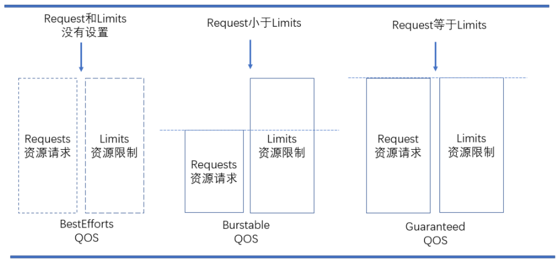

[TOC]


# Pod状态与生命周期

Pod在整个生命周期中被系统定义为各种状态，熟悉Pod的各种状态对于理解如何设置Pod的调度策略、重启策略是很有必要的。 


# 1 Pod状态

## 1.1 Pod phase

Pod 的 `status` 属性是一个 [PodStatus](https://kubernetes.io/docs/reference/generated/kubernetes-api/v1.21/#podstatus-v1-core) 对象，其中包含一个 `phase` 字段。它简单描述了 Pod 在其生命周期的阶段。

Pod 阶段的数量和含义是严格定义的。 除了本文档中列举的内容外，不应该再假定 Pod 有其他的 `phase` 值。

下图是Pod的生命周期示意图，从图中可以看到Pod状态的变化。


下面是 `phase` 可能的值：即整个过程Pod通常处于的状态之一

| 状态值            | 描述                                                         |
| ----------------- | ------------------------------------------------------------ |
| Pending（悬决）   | Pod定义正确，提交到Master，但有一个或者多个容器尚未创建亦未运行。它的**第1个状态是Pending**。也就是说k8s的API已经接受了你的pod请求；但是还没有真正的发起调度。通常，Master对Pod进行调度需要一些时间，Node进行容器镜像的下载也需要一些时间，启动容器也需要一定时间。（写数据到etcd，调度，pull镜像，启动容器）。 |
| Running（运行中） | Pod已经被分配到某个Node上，并且所有的容器都被创建完毕，至少有一个容器正在运行中，或者有容器正在启动或重启中。 |
| Succeeded（成功） | Pod中所有的容器都成功运行结束，并且不会被重启。这是Pod的一种最终状态。 |
| Failed（失败）    | Pod中所有的容器都运行结束了，其中至少有一个容器是非正常结束的（exit code不是0）。这也是Pod的一种最终状态。 |
| Unknown（未知）   | 无法获得Pod的状态，通常是由于无法和Pod所在的Node进行通信。   |

如果某节点死掉或者与集群中其他节点失联，Kubernetes 会实施一种策略，将失去的节点上运行的所有 Pod 的 `phase` 设置为 `Failed`。


## 1.2 Pod conditions

Pod 的 conditions 表示了 Pod 的一些条件，是一个数组。只有所有的条件为 True 时，Pod 才可以提供服务。

每个 Pod 都拥有一个 PodStatus，里面包含 [PodConditions](https://kubernetes.io/docs/reference/generated/kubernetes-api/v1.21/#podcondition-v1-core) 数组，代表 Condition 是否通过。PodCondition 属性描述：

| 字段               | 描述                                                |
| ------------------ | --------------------------------------------------- |
| lastProbeTime      | 最后一次探测 Pod Condition 的时间戳。               |
| lastTransitionTime | 上次 Condition 从一种状态转换到另一种状态的时间。   |
| message            | 上次 Condition 状态转换的详细描述。                 |
| reason             | Condition 最后一次转换的原因。                      |
| status             | Condition 状态类型，可以为 `True` `False` `Unknown` |
| type               | Condition 类型                                      |

关于 Condition Type 的描述：

| Type            | 描述                                                         |
| --------------- | ------------------------------------------------------------ |
| PodScheduled    | Pod 已经被调度到某节点。                                     |
| Ready           | Pod 可以为请求提供服务，并且应该被添加到对应服务的负载均衡池中。 |
| Initialized     | 所有 [init containers](https://kubernetes.io/docs/concepts/workloads/pods/init-containers) 成功启动。 |
| Unschedulable   | 调度器不能正常调度容器，例如缺乏资源或其他限制。             |
| ContainersReady | Pod 中所有容器全部就绪。                                     |

例如：通过查看一个正常的pod信息描述会看到如下内容

```bash
$ kubectl describe pod <pod name> -n <namespace>
Conditions:
  Type              Status
  Initialized       True
  Ready             True
  ContainersReady   True
  PodScheduled      True
```


# 2 Pod的创建过程


Pod是Kubernetes的基础单元，了解其创建的过程，更有助于理解系统的运作。

①用户通过kubectl或其他API客户端提交Pod Spec给API Server。

②API Server尝试将Pod对象的相关信息存储到etcd中，等待写入操作完成，API Server返回确认信息到客户端。

③API Server开始反映etcd中的状态变化。

④所有的Kubernetes组件通过"watch"机制跟踪检查API Server上的相关信息变动。

⑤kube-scheduler（调度器）通过其"watcher"检测到API Server创建了新的Pod对象但是没有绑定到任何工作节点。

⑥kube-scheduler为Pod对象挑选一个工作节点并将结果信息更新到API Server。

⑦调度结果新消息由API Server更新到etcd，并且API Server也开始反馈该Pod对象的调度结果。

⑧Pod被调度到目标工作节点上的kubelet尝试在当前节点上调用docker engine进行启动容器，并将容器的状态结果返回到API Server。

⑨API Server将Pod信息存储到etcd系统中。

⑩在etcd确认写入操作完成，API Server将确认信息发送到相关的kubelet。


# 3 Pod重启策略

Pod的重启策略（RestartPolicy）应用于Pod内的所有容器，并且仅在Pod所处的Node上由kubelet进行判断和重启操作。当某个容器异常退出或者健康检查失败时，kubelet将根据 `RestartPolicy` 的设置来进行相应的操作。

Pod 的 `spec` 中包含一个 `restartPolicy` 字段，其可能取值包括 Always、OnFailure 和 Never。默认值是 Always。

- `Always`：当容器失败时，由kubelet自动重启该容器。
- `OnFailure`：当容器终止运行且退出码不为0时，有kubelet自动重启该容器。
- `Never`：不论容器运行状态如何，kubelet都不会重启该容器。

失败的容器由 kubelet 以五分钟为上限的指数退避延迟（10秒，20秒，40秒…）重新启动，并在成功执行十分钟后重置。

Pod的重启策略与控制方式息息相关，当前可用于管理Pod的控制器包括ReplicationController、Job、DaemonSet及直接通过kubelet管 

理（静态Pod）。

每种控制器对Pod的重启策略要求如下：

- RC 和 DaemonSet：必须设置为Always，需要保证该容器持续运行。
- Job：OnFailure或Never，确保容器执行完成后不再重启。 
- kubelet：在Pod失效时自动重启它，不论将RestartPolicy设置为什么值，也不会对Pod进行健康检查。


# 4 Pod探针和健康状态

[Probe](https://kubernetes.io/docs/reference/generated/kubernetes-api/v1.21/#probe-v1-core)（探针） 是由 [kubelet](https://kubernetes.io/zh/docs/reference/command-line-tools-reference/kubelet/) 对容器执行的定期诊断。 要执行诊断，，kubelet 调用由容器实现的 [Handler](https://kubernetes.io/docs/reference/generated/kubernetes-api/v1.21/#handler-v1-core) （处理程序）。

有三种类型的处理程序：

- [ExecAction](https://kubernetes.io/docs/reference/generated/kubernetes-api/v1.21/#execaction-v1-core)： 在容器内执行指定命令。如果命令退出时返回码为 0 则认为诊断成功。
- [TCPSocketAction](https://kubernetes.io/docs/reference/generated/kubernetes-api/v1.21/#tcpsocketaction-v1-core)： 对容器的 IP 地址上的指定端口执行 TCP 检查。如果端口打开，则诊断被认为是成功的。
- [HTTPGetAction](https://kubernetes.io/docs/reference/generated/kubernetes-api/v1.21/#httpgetaction-v1-core)： 对容器的 IP 地址上指定端口和路径执行 HTTP Get 请求。如果响应的状态码大于等于 200 且小于 400，则诊断被认为是成功的。

每次探测都将获得以下三种结果之一：

- `Success`：容器诊断通过
- `Failure`：容器诊断失败
- `Unknown`：诊断失败，因此不应采取任何措施


Kubernetes对 Pod 的健康状态可以通过两类探针（Probe）来检查： `LivenessProbe` 和 `ReadinessProbe`，kubelet定期执行这两类探针来诊断容器的健康状况。

- `livenessProbe`：判断容器是否正在运行（Running状态）。如果**存活探测**失败，则 kubelet 会杀死容器，并且根据重启策略进行处理。如果容器不包含存活探针，则默认状态为 `Success`。
- `readinessProbe`：判断容器服务是否可用（Ready状态）。如果**就绪探测**失败，端点控制器将从与 Pod 匹配的所有 Service 的端点中删除该 Pod 的 IP 地址。初始延迟之前的就绪状态默认为 `Failure`。如果容器不提供就绪探针，则默认状态为 `Success`。

==**示例：**==

`ExecAction`：

```yaml
apiVersion: apps/v1
kind: Deployment
metadata:
spec:
      containers:
        livenessProbe:            # 健康状态检查
          exec:
            command:
            - touch
            - /tmp/healthy
          initialDelaySeconds: 30 # 初始化时间，单位：秒
          timeoutSeconds: 5       # 探测超时时长，单位：秒
          periodSeconds: 30       # 探测时间间隔，单位：秒
          successThreshold: 1     # 失败后探测成功的最小连续成功次数
          failureThreshold: 5     # 最大失败次数
        readinessProbe:           # 准备状态检查
          exec:
            command:
            - touch
            - /tmp/ok
          initialDelaySeconds: 30
          timeoutSeconds: 5
```

`TCPSocketAction`：

```yaml
apiVersion: v1
kind: Pod
metadata:
  name: liveness-tcp-socket
spec:
  containers:
  - name: nginx
    image: nginx
    ports:
    - containerPort: 80
    livenessProbe:
      tcpSocket:
        port: 80
      initialDelaySeconds: 15
      timeoutSeconds: 1
```

`HTTPGetAction`：

```yaml
apiVersion: apps/v1
kind: Deployment
metadata:
spec:
      containers:
        livenessProbe:
          httpGet:
            path: /healthCheck
            port: 8080
            scheme: HTTP
          initialDelaySeconds: 30
          timeoutSeconds: 5
          periodSeconds: 30
          successThreshold: 1
          failureThreshold: 5
        readinessProbe:
          httpGet:
            path: /healthCheck
            port: 8080
            scheme: HTTP
          initialDelaySeconds: 30
          timeoutSeconds: 5
```

对于每种探测方式，都需要设置initialDelaySeconds和 timeoutSeconds两个参数，它们的含义分别如下。 

- **initialDelaySeconds**：启动容器后进行首次健康检查的等待时间，单位为s。 

- **timeoutSeconds**：健康检查发送请求后等待响应的超时时间，单位为s。当超时发生时，kubelet会认为容器已经无法提供服务，将会重启该容器。


# 5 Pod的持久性和终止过程

## 5.1 Pod的持久性

Pod在设计支持就不是作为持久化实体的。在调度失败、节点故障、缺少资源或者节点维护的状态下都会死掉会**被驱逐**。

通常，用户不需要手动直接创建Pod，而是应该使用controller（例如Deployments），即使是在创建单个Pod的情况下。Controller可以提供集群级别的自愈功能、复制和升级管理。


## 5.2 Pod的终止

因为Pod作为在集群的节点上运行的进程，所以在不再需要的时候能够优雅的终止掉是十分必要的（比起使用发送KILL信号这种暴力的方式）。用户需要能够放松删除请求，并且知道它们何时会被终止，是否被正确的删除。用户想终止程序时发送删除pod的请求，在pod可以被强制删除前会有一个宽限期，会发送一个TERM请求到每个容器的主进程。一旦超时，将向主进程发送KILL信号并从API server中删除。如果kubelet或者container manager在等待进程终止的过程中重启，在重启后仍然会重试完整的宽限期。

终止过程主要分为如下几个步骤：

1. 用户发出删除 pod 命令，默认宽限期是30秒；

2. 在Pod超过该宽限期后API server就会更新Pod的状态为“dead”；

3. 在客户端命令行上显示的Pod状态为“terminating”；

4. 跟第三步同时，当kubelet发现pod被标记为“terminating”状态时，开始停止pod进程：

   - 如果在pod中定义了preStop hook，在停止pod前会被调用。如果在宽限期过后，preStop hook依然在运行，第二步会再增加2秒的宽限期；

   - 向Pod中的进程发送TERM信号；

5. 跟第三步同时，该Pod将从该service的端点列表中删除，不再是replication controller的一部分。关闭的慢的pod将继续处理load balancer转发的流量；

6. 过了宽限期后，将向Pod中依然运行的进程发送SIGKILL信号而杀掉进程；

7. Kublete会在API server中完成Pod的的删除，通过将优雅周期设置为0（立即删除）。Pod在API中消失，并且在客户端也不可见；

删除宽限期默认是30秒。 **`kubectl delete`**命令支持 **`—grace-period=<seconds>`** 选项，允许用户设置自己的宽限期。如果设置为0将强制删除pod。在kubectl>=1.5版本的命令中，你必须同时使用 `--force` 和 `--grace-period=0` 来强制删除pod。

Pod的强制删除是通过在集群和etcd中将其定义为删除状态。当执行强制删除命令时，API server不会等待该pod所运行在节点上的kubelet确认，就会立即将该pod从API server中移除，这时就可以创建跟原pod同名的pod了。这时，在节点上的pod会被立即设置为terminating状态，不过在被强制删除之前依然有一小段优雅删除周期。 


# 6 Pod资源申请和Qos服务等级

在Docker的范畴内，我们知道可以对运行的容器进行请求或消耗的资源进行限制。而在Kubernetes中，也有同样的机制，容器或Pod可以进行申请和消耗的资源就是CPU和内存。CPU属于可压缩型资源，即资源的额度可以按照需求进行收缩。而内存属于不可压缩型资源，对内存的收缩可能会导致无法预知的问题。

Pod 中的资源限制也主要是针对 cpu 和 内存。与 docker 不同的是，它提供了 requests 和 limits 两个设置。具体的含义为：

- `requests`：pod 运行所需要的最少资源。例如 kubernetes 在调度 pod 时，就是以这个设置来挑选 node
- `limits`：pod 运行的资源上限。也就说，超过这个 limits, pod 会被 kill 掉。

资源的隔离目前是属于容器级别，CPU和内存资源的配置需要Pod中的容器spec字段下进行定义。其具体字段，可以使用 "requests" 进行定义请求的确保资源可用量。也就是说容器的运行可能用不到这样的资源量，但是必须确保有这么多的资源供给。而 "limits" 是用于限制资源可用的最大值，属于硬限制。

在Kubernetes中，1个单位的CPU相当于虚拟机的1颗虚拟CPU（vCPU）或者是物理机上一个超线程的CPU，它支持分数计量方式，一个核心（1core）相当于1000个微核心（millicores），因此500m相当于是0.5个核心，即二分之一个核心。内存的计量方式也是一样的，默认的单位是字节，也可以使用E、P、T、G、M和K作为单位后缀，或者是Ei、Pi、Ti、Gi、Mi、Ki等形式单位后缀。 

**资源需求举例：**

```yml
apiVersion: v1
kind: Pod
metadata:
  name: nginx-pod
spec:
  containers:
  - name: nginx
    image: nginx
    resources:
      requests:
        memory: "128Mi"
        cpu: "200m"
```

上面的配置清单中，nginx请求的CPU资源大小为200m，这意味着一个CPU核心足以满足nginx以最快的方式运行，其中对内存的期望可用大小为128Mi，实际运行时不一定会用到这么多的资源。考虑到内存的资源类型，在超出指定大小运行时存在会被OOM killer杀死的可能性，于是该请求值属于理想中使用的内存上限。

**资源限制举例：**

容器的资源需求只是能够确保容器运行时所需要的最少资源量，但是并不会限制其可用的资源上限。当应用程序存在Bug时，也有可能会导致系统资源被长期占用的情况，这就需要另外一个limits属性对容器进行定义资源使用的最大可用量。CPU是属于可压缩资源，可以进行自由地调节。而内存属于硬限制性资源，当进程申请分配超过limit属性定义的内存大小时，该Pod将会被OOM killer杀死。如下：

```yml
[root@master ~]# vim memleak-pod.yaml

apiVersion: v1
kind: Pod
metadata:
  name: memleak-pod
  labels:
    app: memleak
spec:
  containers:
  - name: simmemleak
    image: saadali/simmemleak
    resources:
      requests:
        memory: "64Mi"
        cpu: "1"
      limits:
        memory: "64Mi"
        cpu: "1"


[root@master ~]# kubectl apply -f memleak-pod.yaml 
pod/memleak-pod created
[root@master ~]# kubectl get pods -l app=memleak
NAME          READY     STATUS      RESTARTS   AGE
memleak-pod   0/1       OOMKilled   2          12s
[root@master ~]# kubectl get pods -l app=memleak
NAME          READY     STATUS             RESTARTS   AGE
memleak-pod   0/1       CrashLoopBackOff   2          28s
```

Pod资源默认的重启策略为Always，在memleak因为内存限制而终止会立即重启，此时该Pod会被OOM killer杀死，在多次重复因为内存资源耗尽重启会触发Kunernetes系统的重启延迟，每次重启的时间会不断拉长，后面看到的Pod的状态通常为"CrashLoopBackOff"。

**在一个Kubernetes集群上，运行的Pod众多，那么当节点都无法满足多个Pod对象的资源使用时，是按照什么样的顺序去终止这些Pod对象呢？**


Kubernetes是无法自行去判断的，需要借助于Pod对象的优先级进行判定终止Pod的优先问题。根据Pod对象的requests和limits属性，Kubernetes将Pod对象分为三个服务质量类别：

QOS是K8S中的一种资源保护机制，其主要是针对不可压缩资源比如内存的一种控制技术。比如在内存中，其通过为不同的Pod和容器构造OOM评分，并且通过内核策略的辅助，从而实现当节点内存资源不足的时候，内核可以按照策略的优先级，优先kill掉那些优先级比较低（分值越高，优先级越低）的Pod。



**QoS Class:（Quality of service class）服务质量等级**

- Guranteed:优先级最高。pod中每个容器同时定义了cpu和memory的request和limit，并且两者的request=limit；
- Burstable:优先级中等。pod中至少有一个容器定义了cpu或memory的request属性，且二者不一定要相等；
- BestEffort:优先级最低。pod中没有任何一个容器定义了request或limit属性；


参考链接：

- https://kubernetes.io/zh/docs/concepts/workloads/pods/
- Pod重启策略：https://kubernetes.io/zh/docs/concepts/workloads/pods/pod-lifecycle/#restart-policy