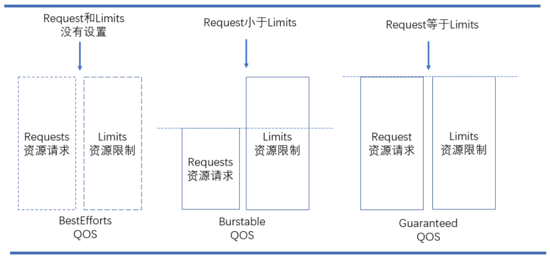

[TOC]

[TOC]


# Pod资源管理与QoS

当你定义 Pod 时可以选择性地为每个容器设定所需要的资源数量。 最常见的可设定资源是 CPU 和内存（RAM）大小；此外还有其他类型的资源。

目前来说，资源隔离尚且属于容器级别， CPU 和内存资源的配置需要在 Pod 中的容器上进行，每种资源均可由“ requests ”属性定义其请求的确保可用值，即容器运行可能用不到这么大的资源，但用到时必须要确保有如此多的资源可用，而“ limits ”属性则用于限制资源可用的最大值，即硬限制。

Kubernetes根据资源能否伸缩进行分类，划分为可压缩资源和不可以压缩资源。CPU资源是目前支持的一种可压缩资源，而内存资源和磁盘资源为目前所支持的不可压缩资源。


# 1 资源需求（Requests）和限制（ Limits）

官方文档：https://kubernetes.io/docs/concepts/configuration/manage-compute-resources-container/

Pod 中的资源管理也主要是针对 cpu 和 内存。提供了 requests 和 limits 两个设置。具体的含义为：

**Request:** 容器使用的最小资源需求，作为容器schedule阶段时资源分配的判断依赖。只有当节点上可分配资源量>=容器资源请求数时才允许将容器调度到该节点。但Request参数不限制容器的最大可使用资源。

```
spec.containers[].resources.requests.cpu
spec.containers[].resources.requests.memory
```

**Limits:** 容器能使用资源的资源的最大值，超过这个 limits, pod 会被 kill 掉。设置为0表示使用资源无上限。

```
spec.containers[].resources.limits.cpu
spec.containers[].resources.limits.memory
```

Kubernetes 系统上， 1个单位的 CPU 相当于虚拟机上的 1 颗虚拟 CPU ( vCPU ）或物理机上的一个超线程（ Hyperthread ，或称为一个逻辑 CPU ），它支持分数计量方式：

- memory单位可以写为： M或者Mi,1M=1000kb,1Mi=1024kb
- cpu单位可以写为：m或者数字，(1000m=1核CPU)，(500m=0.5CPU)，(250m=0.25CPU)

Request能够保证Pod有足够的资源来运行，而Limit则是防止某个Pod无限制地使用资源，导致其他Pod崩溃。两者之间必须满足关系: 0<=Request<=Limit<=Infinity (如果Limit为0表示不对资源进行限制，这时可以小于Request)

对于CPU，如果pod中服务使用CPU超过设置的limits，pod不会被kill掉但会被限制。如果没有设置limits，pod可以使用全部空闲的cpu资源。

对于内存，当一个pod使用内存超过了设置的limits，pod中container的进程会被kernel因OOM kill掉。当container因为OOM被kill掉时，系统倾向于在其原所在的机器上重启该container或本机或其他重新创建一个pod。

示例：

**CPU限制与请求：**

vim  [cpu-demo.yaml](yaml\cpu-demo.yaml) 

```bash
apiVersion: apps/v1
kind: Deployment
metadata:
  name: cpu-demo-nginx
spec:
  selector:
    matchLabels:
      app: nginx
  replicas: 1
  template:
    metadata:
      labels:
        app: nginx
    spec:
      containers:
      - name: nginx
        image: nginx
        ports:
        - containerPort: 80
        resources:
          requests:
            cpu: 5
          limits:
            cpu: 10

```

执行后查看：

```bash
$ kubectl create  -f cpu-demo.yaml

$ kubectl describe pod cpu-demo-nginx-87d455574-wk7gx
...
Events:
  Type    Reason     Age    From               Message
  ----    ------     ----   ----               -------
  Normal  Scheduled  3m13s  default-scheduler  Successfully assigned default/cpu-demo-nginx-87d455574-wk7gx to k8s-master40
  Normal  Pulling    3m13s  kubelet            Pulling image "nginx"
  Normal  Pulled     3m1s   kubelet            Successfully pulled image "nginx"
  Normal  Created    3m1s   kubelet            Created container nginx
  Normal  Started    3m1s   kubelet            Started container nginx

$ kubectl get pod cpu-demo-nginx-87d455574-wk7gx -o wide
NAME                             READY   STATUS    RESTARTS   AGE     IP            NODE           NOMINATED NODE   READINESS GATES
cpu-demo-nginx-87d455574-wk7gx   1/1     Running   0          3m57s   10.244.0.39   k8s-master40   <none>           <none>
# 由于此次测试中k8s-master40配置为6c16g，所有pod能调度成功。
# 修改pod中的requests.cpu为10后，查看pod详细，会发现
Events:
  Type     Reason            Age   From               Message
  ----     ------            ----  ----               -------
  Warning  FailedScheduling  14s   default-scheduler  0/3 nodes are available: 3 Insufficient cpu.
  Warning  FailedScheduling  13s   default-scheduler  0/3 nodes are available: 3 Insufficient cpu.

```

**内存需求与限制：**

vim  [memory-demo.yaml](yaml\memory-demo.yaml) 

```
apiVersion: apps/v1
kind: Deployment
metadata:
  name: memory-demo-nginx
spec:
  selector:
    matchLabels:
      app: nginx
  replicas: 1
  template:
    metadata:
      labels:
        app: nginx
    spec:
      containers:
      - name: nginx
        image: nginx
        ports:
        - containerPort: 80
        resources:
          requests:
            memroy: 10240Mi
          limits:
            memory: 20480Mi

```

执行后查看：

```bash
$ kubectl get pod memory-demo-nginx-8554bb994f-xffxd -o wide
NAME                                 READY   STATUS    RESTARTS   AGE   IP            NODE           NOMINATED NODE   READINESS GATES
memory-demo-nginx-8554bb994f-xffxd   1/1     Running   0          14s   10.244.0.40   k8s-master40   <none>           <none>

```


# 2 QoS分类

`QoS`是 Quality of Service 的缩写，即服务质量。为了**实现资源被有效调度和分配的同时提高资源利用率**，`kubernetes`针对不同服务质量的预期，通过 QoS（Quality of Service）来对 pod 进行服务质量管理，**kubelet提供QoS服务质量管理，支持系统级别的OOM控制**。对于一个 pod 来说，服务质量体现在两个具体的指标：`CPU 和内存`。当节点上内存资源紧张时，kubernetes 会根据预先设置的不同 QoS 类别进行相应处理。


QoS 主要分为`Guaranteed、Burstable 和 Best-Effort`三类，优先级从高到低依次是：

- Guranteed:优先级最高。pod中每个容器同时定义了cpu和memory的request和limit，并且两者的request=limit；
- Burstable:优先级中等。pod中至少有一个容器定义了cpu或memory的request属性，且二者不一定要相等；
- BestEffort:优先级最低。pod中没有任何一个容器定义了request或limit属性；




## 2.1 Guaranteed（有保证的）

pod中的所有容器都必须对cpu和memory同时设置*limits*，如果有一个容器要设置*requests*，那么所有容器都要设置，并设置参数同*limits*一致，那么这个pod的QoS就是*Guaranteed*级别。

注：如果一个容器只指明*limit*而未设定*request*，则*request*的值等于*limit*值。

Guaranteed举例1：容器只指明了*limits*而未指明*requests*。

```yaml
containers:
name: foo
resources:
  limits:
    cpu: 10m
    memory: 1Gi
name: bar
resources:
  limits:
    cpu: 100m
    memory: 100Mi
```

Guaranteed举例2：*requests*与*limit*均指定且值相等。

```yaml
containers:
name: foo
resources:
  limits:
    cpu: 10m
    memory: 1Gi
  requests:
    cpu: 10m
    memory: 1Gi

name: bar
resources:
  limits:
    cpu: 100m
    memory: 100Mi
  requests:
    cpu: 100m
    memory: 100Mi
```

## 2.2 Burstable（不稳定的）

pod中只要有一个容器的*requests*和*limits*的设置不相同，该pod的QoS即为*Burstable*。举例如下：

Container bar没有指定*resources*

```yaml
containers:
name: foo
resources:
  limits:
    cpu: 10m
    memory: 1Gi
  requests:
    cpu: 10m
    memory: 1Gi
name: bar
```

*Burstable*举例2：pod中只要有一个容器没有对cpu或者memory中的request和limits都没有明确指定。

```yaml
containers:
name: foo
resources:
  limits:
    memory: 1Gi
name: bar
resources:
  limits:
    cpu: 100m
```

*Burstable*举例3：Container foo没有设置*limits*，而bar *requests*与 *limits*均未设置。

```yaml
containers:
name: foo
resources:
  requests:
    cpu: 10m
    memory: 1Gi  
name: bar
```

## 2.3 Best-Effort（尽最大努力）

如果对于全部的resources来说*requests*与*limits*均未设置，该pod的QoS即为*Best-Effort*。举例如下

```yaml
containers:
name: foo
  resources:
name: bar
  resources:
```


## 2.4 QoS进行资源回收策略

Kubernetes 通过`cgroup`给pod设置QoS级别，当资源不足时先`kill`优先级低的 pod，在实际使用过程中，通过`OOM`分数值来实现，`OOM`分数值范围为0-1000。OOM 分数值根据`OOM_ADJ`参数计算得出。

对于`Guaranteed`级别的 Pod，OOM_ADJ参数设置成了-998，对于`Best-Effort`级别的 Pod，OOM_ADJ参数设置成了1000，对于`Burstable`级别的 Pod，OOM_ADJ参数取值从2到999。

对于 kuberntes 保留资源，比如kubelet，docker，OOM_ADJ参数设置成了-999，表示不会被OOM kill掉。OOM_ADJ参数设置的越大，计算出来的OOM分数越高，表明该pod优先级就越低，当出现资源竞争时会越早被kill掉，对于OOM_ADJ参数是-999的表示kubernetes永远不会因为OOM将其kill掉。


**1、QoS pods被kill掉场景与顺序**

- Best-Effort pods：系统用完了全部内存时，该类型 pods 会最先被kill掉。
- Burstable pods：系统用完了全部内存，且没有 Best-Effort 类型的容器可以被 kill 时，该类型的 pods 会被 kill 掉。
- Guaranteed pods：系统用完了全部内存，且没有 Burstable 与 Best-Effort 类型的容器可以被 kill 时，该类型的 pods 会被 kill 掉。


**2、QoS使用建议**

如果资源充足，可将 QoS pods 类型均设置为`Guaranteed`。用计算资源换业务性能和稳定性，减少排查问题时间和成本。如果想更好的提高资源利用率，业务服务可以设置为Guaranteed，而其他服务根据重要程度可分别设置为Burstable或Best-Effort。
