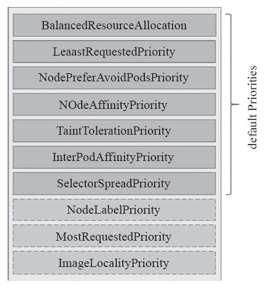
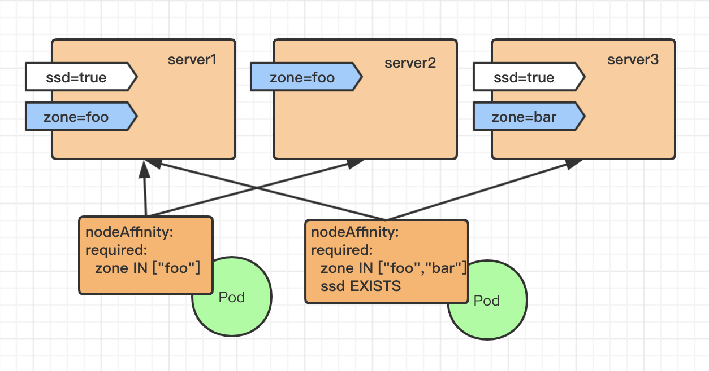
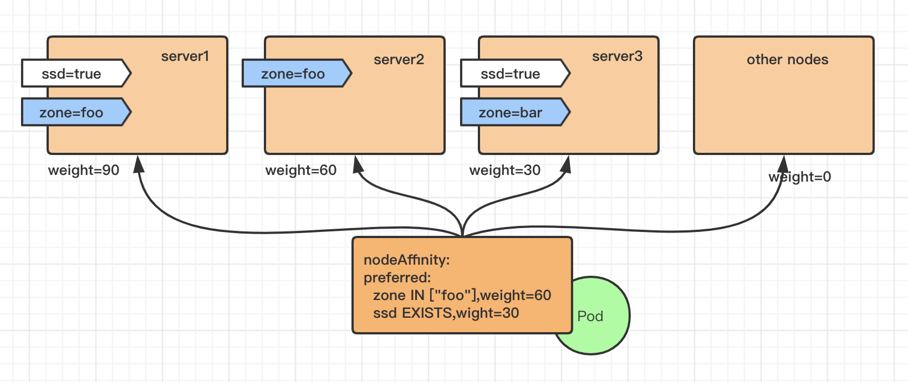
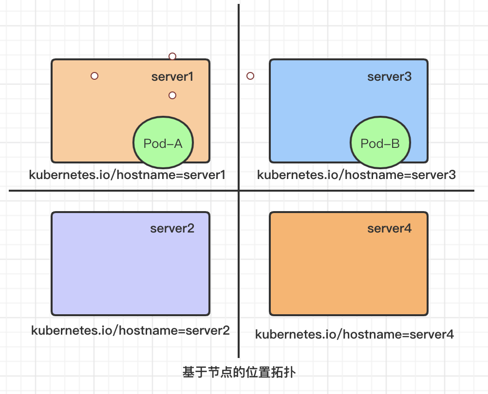
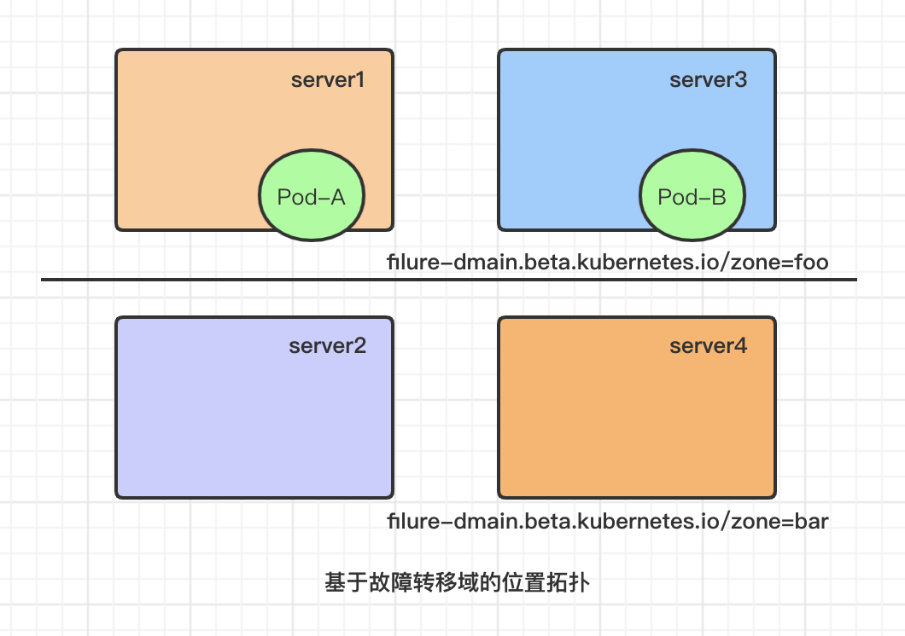
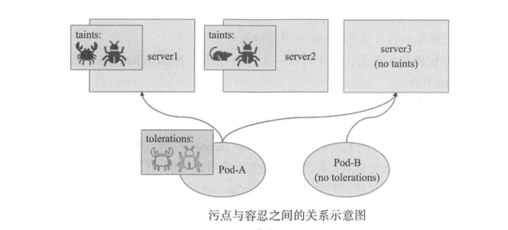

[TOC]


# Pod资源调度

API Server在接受客户端提交Pod对象创建请求后，然后是通过调度器（kube-schedule）从集群中选择一个可用的最佳节点来创建并运行Pod。而这一个创建Pod对象，在调度的过程当中有3个阶段：节点预选、节点优选、节点选定，从而筛选出最佳的节点。

如图：


- 节点预选：基于一系列的预选规则对每个节点进行检查，将那些不符合条件的节点过滤，从而完成节点的预选
- 节点优选：对预选出的节点进行优先级排序，以便选出最合适运行Pod对象的节点
- 节点选定：从优先级排序结果中挑选出优先级最高的节点运行Pod，当这类节点多于1个时，则进行随机选择

当我们有需求要将某些Pod资源运行在特定的节点上时，我们可以通过组合节点标签，以及Pod标签或标签选择器来匹配特定的预选策略并完成调度，如`MatchInterPodAfinity、MatchNodeSelector、PodToleratesNodeTaints`等预选策略，这些策略常用于为用户提供自定义Pod亲和性或反亲和性、节点亲和性以及基于污点及容忍度的调度机制。


# 1 常用的预选策略

预选策略实际上就是节点过滤器，例如节点标签必须能够匹配到Pod资源的标签选择器（MatchNodeSelector实现的规则），以及Pod容器的资源请求量不能大于节点上剩余的可分配资源（PodFitsResource规则）等等。执行预选操作，调度器会逐一根据规则进行筛选，如果预选没能选定一个合适的节点，此时Pod会一直处于Pending状态，直到有一个可用节点完成调度。其常用的预选策略如下：

- CheckNodeCondition：检查是否可以在节点报告磁盘、网络不可用或未准备好的情况下将Pod对象调度其上。
- HostName：如果Pod对象拥有spec.hostname属性，则检查节点名称字符串是否和该属性值匹配。
- PodFitsHostPorts：如果Pod对象定义了ports.hostPort属性，则检查Pod指定的端口是否已经被节点上的其他容器或服务占用。
- MatchNodeSelector：如果Pod对象定义了spec.nodeSelector属性，则检查节点标签是否和该属性匹配。
- NoDiskConflict：检查Pod对象请求的存储卷在该节点上可用。
- PodFitsResources：检查节点上的资源（CPU、内存）可用性是否满足Pod对象的运行需求。
- PodToleratesNodeTaints：如果Pod对象中定义了spec.tolerations属性，则需要检查该属性值是否可以接纳节点定义的污点（taints）。
- PodToleratesNodeNoExecuteTaints：如果Pod对象定义了spec.tolerations属性，检查该属性是否接纳节点的NoExecute类型的污点。
- CheckNodeLabelPresence：仅检查节点上指定的所有标签的存在性，要检查的标签以及其可否存在取决于用户的定义。
- CheckServiceAffinity：根据当前Pod对象所属的Service已有其他Pod对象所运行的节点调度，目前是将相同的Service的Pod对象放在同一个或同一类节点上。
- MaxEBSVolumeCount：检查节点上是否已挂载EBS存储卷数量是否超过了设置的最大值，默认值：39
- MaxGCEPDVolumeCount：检查节点上已挂载的GCE PD存储卷是否超过了设置的最大值，默认值：16
- MaxAzureDiskVolumeCount：检查节点上已挂载的Azure Disk存储卷数量是否超过了设置的最大值，默认值：16
- CheckVolumeBinding：检查节点上已绑定和未绑定的PVC是否满足Pod对象的存储卷需求。
- NoVolumeZoneConflct：在给定了区域限制的前提下，检查在该节点上部署Pod对象是否存在存储卷冲突。
- CheckNodeMemoryPressure：在给定了节点已经上报了存在内存资源压力过大的状态，则需要检查该Pod是否可以调度到该节点上。
- CheckNodePIDPressure：如果给定的节点已经报告了存在PID资源压力过大的状态，则需要检查该Pod是否可以调度到该节点上。
- CheckNodeDiskPressure：如果给定的节点存在磁盘资源压力过大，则检查该Pod对象是否可以调度到该节点上。
- MatchInterPodAffinity：检查给定的节点能否可以满足Pod对象的亲和性和反亲和性条件，用来实现Pod亲和性调度或反亲和性调度。

在上面的这些预选策略里面，CheckNodeLabelPressure和CheckServiceAffinity可以在预选过程中结合用户自定义调度逻辑，这些策略叫做可配置策略。其他不接受参数进行自定义配置的称为静态策略。


# 2 优选函数

预选策略筛选出一个节点列表就会进入优选阶段，在这个过程调度器会向每个通过预选的节点传递一系列的优选函数来计算其优先级分值，优先级分值介于0-10之间，其中0表示不适用，10表示最适合托管该Pod对象。

另外，调度器还支持给每个优选函数指定一个简单的值，表示权重，进行节点优先级分值计算时，它首先将每个优选函数的计算得分乘以权重，然后再将所有优选函数的得分相加，从而得出节点的最终优先级分值。权重可以让管理员定义优选函数倾向性的能力，其计算优先级的得分公式如下：

```
finalScoreNode = (weight1 * priorityFunc1) + (weight2 * priorityFunc2) + ......
```

下图是关于优选函数的列表图：




# 3 Node亲和性调度

NodeAffinity意为Node亲和性的调度策略，是用于替换NodeSelector的全新调度策略。

节点亲和性是用来确定Pod对象调度到哪一个节点的规则，这些规则基于节点上的自定义标签和Pod对象上指定的标签选择器进行定义。

例如，将Pod调度至有着特殊CPU的节点或一个可用区域内的节点之上 。

定义节点亲和性规则有两种：**硬亲和性（require）**和**软亲和性（preferred）**

- 硬亲和性：实现的是强制性规则，指Pod调度时必须满足的规则，如果不存在满足规则的节点时 ，Pod对象的状态会一直是Pending。表达式为`RequiredDuringSchedulingIgnoredDuringExecution`。
- 软亲和性：实现的是一种柔性调度限制，在Pod调度时可以尽量满足其规则，在无法满足规则时，可以调度到一个不匹配规则的节点之上。表达式为`PreferredDuringSchedulingIgnoredDuringExecution`。

表达式中`IgnoredDuringExecution`的意思是：在Pod资源基于节点亲和性规则调度至某节点之后，如果节点标签发生了改变而不再符合此节点亲和性规则时 ，调度器不会将Pod对象从此节点上移出，因为该规则仅对新建的Pod对象生效。

节点亲和性模型如图所示：




## 3.1 Node硬亲和性

为`Pod`对象使用`nodeSelector`属性可以基于节点标签匹配的方式将`Pod`对象强制调度至某一类特定的节点之上 ，不过它仅能基于简单的等值关系定义标签选择器，而`nodeAffinity`中支持使用 `matchExpressions`属性构建更为复杂的标签选择机制。

例如，下面示例中定义的`Pod`对象，其使用节点硬亲和规则定义可将当前`Pod`对象调度至拥有`zone`标签且其值为`foo`的节点之上：

vim  [with-required-nodeaffinity.yaml](yaml\with-required-nodeaffinity.yaml) 

```yaml
apiVersion: v1
kind: Pod
metadata:
  name: with-required-nodeaffinity
spec:
  affinity:
    nodeAffinity: 
      requiredDuringSchedulingIgnoredDuringExecution:
        nodeSelectorTerms:
        - matchExpressions:
          - {key: zone, operator: In, values: ["foo"]}
  containers:
  - name: nginx
    image: nginx
```

将上面配置清单中定义的资源创建于集群之中，由其状态信息可知它处于`Pending`阶段，这是由于节点硬亲和限制，节点不存在能够满足匹配条件所致：

```bash
$ kubectl apply -f with-required-nodeaffinity.yaml
pod/with-required-nodeaffinity created
$ kubectl get pod with-required-nodeaffinity
NAME                         READY   STATUS    RESTARTS   AGE
with-required-nodeaffinity   0/1     Pending   0          21s
```

通过`describe`查看对应的`events`：

```bash
$ kubectl describe pod with-required-nodeaffinity
...
Events:
  Type     Reason            Age   From               Message
  ----     ------            ----  ----               -------
  Warning  FailedScheduling  57s   default-scheduler  0/3 nodes are available: 3 node(s) didn't match node selector.
  Warning  FailedScheduling  57s   default-scheduler  0/3 nodes are available: 3 node(s) didn't match node selector.
```

规划为各节点设置节点标签 ，这也是设置节点亲和性的前提之一：

```bash
$ kubectl label node k8s-master40 zone=foo
node/k8s-master40 labeled
$ kubectl label node k8s-node41 zone=foo
node/k8s-node41 labeled
$ kubectl label node k8s-node42 zone=bar

# 查看所有节点标签
$ kubectl get nodes --show-labels
NAME           STATUS   ROLES    AGE   VERSION    LABELS
k8s-master40   Ready    master   48d   v1.18.18   beta.kubernetes.io/arch=amd64,beta.kubernetes.io/os=linux,kubernetes.io/arch=amd64,kubernetes.io/hostname=k8s-master40,kubernetes.io/os=linux,node-role.kubernetes.io/master=,storagenode=glusterfs,zone=foo
k8s-node41     Ready    <none>   47d   v1.18.18   beta.kubernetes.io/arch=amd64,beta.kubernetes.io/os=linux,kubernetes.io/arch=amd64,kubernetes.io/hostname=k8s-node41,kubernetes.io/os=linux,storagenode=glusterfs,zone=foo
k8s-node42     Ready    <none>   18d   v1.18.18   beta.kubernetes.io/arch=amd64,beta.kubernetes.io/os=linux,kubernetes.io/arch=amd64,kubernetes.io/hostname=k8s-node42,kubernetes.io/os=linux,storagenode=glusterfs,zone=bar

```

然后查看pod状态和调度结果：

```bash
$ kubectl get pod with-required-nodeaffinity
NAME                         READY   STATUS    RESTARTS   AGE
with-required-nodeaffinity   1/1     Running   0          28m

$ kubectl describe pod with-required-nodeaffinity
...
  Normal   Scheduled         6m6s   default-scheduler  Successfully assigned default/with-required-nodeaffinity to k8s-master40
  Normal   Pulling           6m5s   kubelet            Pulling image "nginx"
  Normal   Pulled            5m55s  kubelet            Successfully pulled image "nginx"
  Normal   Created           5m55s  kubelet            Created container nginx
  Normal   Started           5m54s  kubelet            Started container nginx

```

发现pod已经Running。

在定义节点亲和性时，`requiredDuringSchedulinglgnoredDuringExecution`字段的值是一个对象列表，用于定义节点硬亲和性，它可由一到多个`nodeSelectorTerm`定义的对象组成， 彼此间为“逻辑或”的关系，进行匹配度检查时，在多个`nodeSelectorTerm`之间只要满足其中之一 即可。`nodeSelectorTerm`用于定义节点选择器条目，其值为对象列表，它可由一个或多个`matchExpressions`对象定义的匹配规则组成，多个规则彼此之间为“逻辑与”的关系， 这就意味着某节点的标签需要完全匹配同一个`nodeSelectorTerm`下所有的`matchExpression`对象定义的规则才算成功通过节点选择器条目的检查。而`matchExmpressions`又可由 一到多 个标签选择器组成，多个标签选择器彼此间为“逻辑与”的关系 。

给两个节点打上`ssd=true`的标签：

```bash
kubectl label node k8s-master40 ssd=true
kubectl label node k8s-node42 ssd=true
```

下面的资源配置清单示例中定义了调度拥有**两个标签选择器**的节点挑选条目，两个标签选择器彼此之间为“逻辑与”的关系，因此，满足其条件的节点为`k8s-master40`和`k8s-node42`：

vim  [with-required-nodeaffinity-2.yaml](yaml\with-required-nodeaffinity-2.yaml) 

```yaml
apiVersion: v1
kind: Pod
metadata:
  name: with-required-nodeaffinity-2
spec:
  affinity:
    nodeAffinity: 
      requiredDuringSchedulingIgnoredDuringExecution:
        nodeSelectorTerms:
        - matchExpressions:
          - {key: zone, operator: In, values: ["foo", "bar"]}
          - {key: ssd, operator: Exists, values: []}
  containers:
  - name: nginx
    image: nginx

```

执行后会发现pod会运行在`k8s-master40`或`k8s-node42`任意节点。

构建标签选择器表达式中支持使用操作符有`In`、`Notln`、`Exists`、`DoesNotExist`、`Lt`和`Gt`等

- In：`label`的值在某个列表中
- NotIn：`label`的值不在某个列表中
- Gt：`label`的值大于某个值
- Lt：`label`的值小于某个值
- Exists：某个`label`存在
- DoesNotExist：某个`label`不存在

另外，调度器在调度`Pod`资源时，节点亲和性`MatchNodeSelector`仅是其节点预选策略中遵循的预选机制之一，其他配置使用的预选策略依然正常参与节点预选过程。 

例如，将上面资源配置清单示例中定义的`Pod`对象容器修改为如下内容并进行测试：

vim  [with-required-nodeaffinity-3.yaml](yaml\with-required-nodeaffinity-3.yaml) 

```yaml
apiVersion: v1
kind: Pod
metadata:
  name: with-required-nodeaffinity-3
spec:
  affinity:
    nodeAffinity:
      requiredDuringSchedulingIgnoredDuringExecution:
        nodeSelectorTerms:
        - matchExpressions:
          - {key: zone, operator: In, values: ["foo", "bar"]}
          - {key: ssd, operator: Exists, values: []}
  containers:
  - name: nginx
    image: nginx
    resources:
      requests:
        cpu: 6
        memory: 20Gi

```

执行`kubectl apply -f with-required-nodeaffinity-3.yaml`后；会发现`with-required-nodeaffinity-3`一直处于`Pending`；因为`0/3 nodes are available: 3 Insufficient cpu, 3 Insufficient memory.`没有节点符合cpu和memory的要求。

在预选策略`PodFitsResources`根据节点资源可用性进行节点预选的过程中，它会获取给定节点的可分配资源量（资源总量减去已被运行于其上的各`Pod`对象的`requests`属性之和），去除那些无法容纳新`Pod`对象请求的资源量的节点，如果资源不够，同样会调度失败。

由上述操作过程可知，节点硬亲和性实现的功能与节点选择器`nodeSelector`相似， 但亲和性支持使用匹配表达式来挑选节点，这一点提供了灵活且强大的选择机制，因此可被理解为新一代的节点选择器。


## 3.2 Node软亲和性

节点软亲和性为节点选择机制提供了一种柔性控制逻辑，被调度的`Pod`对象不再是“必须”而是“应该”放置于某些特定节点之上，当条件不满足时它也能够接受被编排于其他不符合条件的节点之上。另外，它还为每种倾向性提供了`weight`属性以便用户定义其优先级，取值范围是`1 ～ 100`，数字越大优先级越高 。

vim  [myapp-deploy-with-node-affinity.yaml](yaml\myapp-deploy-with-node-affinity.yaml) 

```yaml
apiVersion: apps/v1
kind: Deployment
metadata:
  name: myapp-deploy-with-node-affinity
spec:
  replicas: 3
  selector:
    matchLabels:
      app: nginx
  template:
    metadata:
      name: nginx
      labels:
        app: nginx
    spec:
      affinity:
        nodeAffinity:
          preferredDuringSchedulingIgnoredDuringExecution:
          - weight: 60
            preference:
              matchExpressions:
              - {key: zone, operator: In, values: ["foo"]}
          - weight: 30
            preference:
              matchExpressions:
              - {key: ssd, operator: Exists, values: []}
      containers:
      - name: nginx
        image: nginx
```

`Pod`资源模板定义了节点软亲和性以选择运行在拥有`zone=foo`和`ssd`标签（无论其值为何）的节点之上， 其中`zone=foo`是更为重要的倾向性规则， 它的权重为`60`，相比较来说，`ssd`标签就没有那么关键， 它的权重为`30`。 这么一来， 如果集群中拥有足够多的节点，那么它将被此规则分为四类 ： 同时满足拥有`zone=foo`和`ssd`标签、仅具有`zoo=foo`标 签、 仅具有`ssd`标签， 以及不具备此两个标签。

如图所示:



示例环境共有三个节点，相对于定义的节点亲和性规则来说，它们所拥有的倾向性权重分别如图所示。在创建需要`3`个`Pod`对象的副本时，其运行效果为三个`Pod`对象被分散运行于集群中的三个节点之上，而非集中运行于某一个节点 。

之所以如此，是因为使用了节点软亲和性的预选方式，所有节点均能够通过调度器上`MatchNodeSelector`预选策略的筛选，因此，可用节点取决于其他预选策略的筛选结果。在第二阶段的优选过程中，除了`NodeAffinityPriority`优选函数之外，还有其他几个优选函数参与优先级评估，尤其是`SelectorSpreadPriority`，它会将同一个`ReplicaSet`控制器管控的所有`Pod`对象分散到不同的节点上运行；以抵御节点故障带来的风险 。不过，这种节点亲和性的权重依然在发挥作用，如果把副本数量扩展至越过节点数很多，如`15`个， 那么它们将被调度器以接近节点亲和性权重比值`90:60:30`的方式分置于相关的节点之上。


# 4 Pod资源亲和调度

在出于高效通信的需求，有时需要将一些Pod调度到相近甚至是同一区域位置（比如同一节点、机房、区域）等等，比如业务的前端Pod和后端Pod，此时这些Pod对象之间的关系可以叫做亲和性。

同时出于安全性的考虑，也会把一些Pod之间进行隔离，此时这些Pod对象之间的关系叫做反亲和性（anti-affinity）。

调度器把第一个Pod放到任意位置，然后和该Pod有亲和或反亲和关系的Pod根据该动态完成位置编排，这就是Pod亲和性和反亲和性调度的作用。Pod的亲和性定义也存在硬亲和性和软亲和性的区别，其约束的意义和节点亲和性类似。

Pod的亲和性调度要求各相关的Pod对象运行在同一位置，而反亲和性则要求它们不能运行在同一位置。这里的位置实际上取决于节点的位置拓扑，拓扑的方式不同，Pod是否在同一位置的判定结果也会有所不同。

如果基于各个节点的`kubernetes.io/hostname`标签作为评判标准，那么会根据节点的`hostname`去判定是否在同一位置区域，如图所示：



如果是基于所划分的故障转移域来进行评判，同一位置， 而`server2`和`server3`属于另一个意义上的同一位置：



因此，在定义`Pod`对象的亲和性与反亲和性时，需要借助于标签选择器来选择被依赖的`Pod`对象，并根据选出的`Pod`对象所在节点的标签来判定“同一位置”的具体意义。


## 4.1 Pod硬亲和性

`Pod`强制约束的亲和性调度也使用`requiredDuringSchedulinglgnoredDuringExecution`属性进行定义。`Pod`亲和性用于描述一个`Pod`对象与具有某特征的现存`Pod`对象运行位置的依赖关系，因此，测试使用`Pod`亲和性约束，**需要事先存在被依赖的`Pod`对象**，它们具有特别的识别标签。

例如创建一个有着标签`app=tomcat`的`Deployment`资源部署一个`Pod`对象：

```bash
kubectl run tomcat -l app=tomcat --image tomcat:alpine
```

再通过资源清单定义一个`Pod`对象，它通过`labelSelector`定义的标签选择器挑选感兴趣的现存`Pod`对象， 而后根据挑选出的`Pod`对象所在节点的标签`kubernetes. io/hostname`来判断同一位置的具体含义，并将当前`Pod`对象调度至这一位置的某节点之上：

vim  [with-pod-affinity-1.yaml](yaml\with-pod-affinity-1.yaml) 

```bash
apiVersion: v1
kind: Pod
metadata:
  name: with-pod-affinity-1
spec:
  affinity:
    podAffinity:
      requiredDuringSchedulingIgnoredDuringExecution:
      - labelSelector:
          matchExpressions:
          - {key: app, operator: In, values: ["tomcat"]}
        topologyKey: kubernetes.io/hostname
  containers:
  - name: nginx
    image: nginx
```

**结果：**with-pod-affinity-1的pod会分配到与tomcat所在的同一个机器。

事实上，kubernetes.io/hostname标签是Kubernetes集群节点的内建标签，它的值为当前节点的节点主机名称标识，对于各个节点来说，各有不同。因此，新建的Pod象将被部署至被依赖的Pod对象的同一节点上，requiredDuringSchedulingIgnoredDuringExecution表示这种亲和性为强制约束。

基于单一节点的`Pod`亲和性只在极个别的情况下才有可能会用到，较为常用的通常是基于同一地区 `region`、区域`zone`或机架`rack`的拓扑位置约束。

**例如：**部署应用程序服务`myapp`与数据库`db`服务相关的`Pod`时，`db Pod`可能会部署于如上图所示的`foo`或`bar`这两个区域中的某节点之上，依赖于数据服务的`myapp Pod`对象可部署于`db Pod`所在区域内的节点上。当然，如果`db Pod`在两个区域`foo`和`bar`中各有副本运行，那么`myapp Pod`将可以运行于这两个区域的任何节点之上。

依赖于亲和性这两个`Pod`的其他`Pod`对象可运行于`zone`标签值为`foo`和`bar`的区域内的所有节点之上。资源配置清单如下：

vim  [myapp-with-pod-affinity.yaml](yaml\myapp-with-pod-affinity.yaml) 

```yaml
apiVersion: apps/v1
kind: Deployment
metadata:
  name: myapp-with-pod-affinity
spec:
  replicas: 3
  selector:
    matchLabels:
      app: myapp
  template:
    metadata:
      name: myapp
      labels:
        app: myapp
    spec:
      affinity:
        podAffinity:
          requiredDuringSchedulingIgnoredDuringExecution:
          - labelSelector:
              matchExpressions:
              - {key: app, operator: In, values: ["db"]}
            topologyKey: zone
      containers:
      - name: nginx
        image: nginx
```

在调度示例中的`Deployment`控制器创建的`Pod`资源时，调度器首先会基于标签选择器查询拥有标签`app=db`的所有`Pod`资源，接着获取到它们分别所属的节点的`zone`标签值，接下来再查询拥有匹配这些标签值的所有节点，从而完成节点预选。而后根据优选函数计算这些节点的优先级，从而挑选出运行新建`Pod`对象的节点。

需要注意的是，如果节点上的标签在运行时发生了更改，以致它不再满足`Pod`上的亲和性规则，但该`Pod`还将继续在该节点上运行，因此它仅会影响新建的`Pod`资源；另外，`labelSelector`属性仅匹配与被调度器的`Pod`在同一名称空间中的`Pod`资源，不过也可以通过为其添加 `namespace`字段以指定其他名称空间 。


## 4.2 Pod软亲和性

类似于节点亲和性机制，`Pod`也支持使用`preferredDuringSchedulinglgnoredDuringExecution`属性定义柔性亲和机制，调度器会尽力确保满足亲和约束的调度逻辑，然而在约束条件不能得到满足时，它也允许将`Pod`对象调度至其他节点运行。

下面是一个使用了`Pod`软亲和性调度机制的资源配置清单示例：

vim  [myapp-with-preferred-pod-affinity.yaml](yaml\myapp-with-preferred-pod-affinity.yaml) 

```yaml
apiVersion: apps/v1
kind: Deployment
metadata:
  name: myapp-with-preferred-pod-affinity
spec:
  replicas: 3
  selector:
    matchLabels:
      app: myapp
  template:
    metadata:
      name: myapp
      labels:
        app: myapp
    spec:
      affinity:
        podAffinity:
          preferredDuringSchedulingIgnoredDuringExecution:
          - weight: 80
            podAffinityTerm:
              labelSelector:
                matchExpressions:
                - {key: app, operator: In, values: ["cache"]}
              topologyKey: zone
          - weight: 20
            podAffinityTerm:
              labelSelector:
                matchExpressions:
                - {key: app, operator: In, values: ["db"]}
              topologyKey: zone
      containers:
      - name: nginx
        image: nginx
```

它定义了两组亲和性判定机制，一个是选择`cache Pod`所在节点的`zone`标签，并赋予了较高的权重`80`，另一个是选择`db Pod`所在节点的 `zone`标签，它有着略低的权重`20`。于是，调度器会将目标节点分为四类 ：`cache Pod`和`db Pod`同时所属的`zone`、`cache Pod`单独所属的`zone`、`db Pod`单独所属的`zone`，以及其他所有的`zone`。


## 4.3 Pod反亲和性


podAffinity 用于定义 Pod 对象的亲和约束，对应地，将其替换 podAntiAffinty 即可用于定义 Pod 对象的反亲和约束 。不过，反亲和性调度一般用于分散同一类应用的 Pod对象等， 也包括将不同安全级别的 Pod 调度至不同的区域、机架或节点等。

下面的资源配置清单 [deploy-with-required-podAntiAffinity.yaml](yaml\deploy-with-required-podAntiAffinity.yaml) 中 定义了由同一 Deployment 创建但彼此基于节点位置互斥的 Pod 对象：

```yaml
apiVersion: apps/v1
kind: Deployment
metadata:
  name: myapp-with-pod-anti-affinity
spec:
  replicas: 4
  selector:
    matchLabels:
      app: myapp
  template:
    metadata:
      name: myapp
      labels:
        app: myapp
    spec:
      affinity:
        podAntiAffinity:
          requiredDuringSchedulingIgnoredDuringExecution:
          - labelSelector:
              matchExpressions:
              - {key: app, operator: In, values: ["myapp"]}
            topologyKey: kubernetes.io/hostname
      containers:
      - name: myapp
        image: ikubernetes/myapp:v1

```

由于定义的强制性反亲和约束，因此，创建的 Pod 本必须运行于不同的节点中。本集群中一共只存在3个节点，因此， 必然地会有一个Pod 对象处于 Pending 状态。


# 5 污点和容忍度

污点（ taints ）是**定义在节点上**的键值型属性数据，用于让节点拒绝将 Pod 调度运行于其上，除非该 Pod 对象具有能够接纳节点污点的容忍。 

容忍度（ tolerations ）是**定义在 Pod对象上**的键值型属性数据，用于配置其可容忍的节点污点，而且调度器仅能将 Pod 象调度至其能够容忍该节点污点的节点之上。

污点和容忍度（Toleration）相互配合，可以用来避免 Pod 被分配到不合适的节点上。 每个节点上都可以应用一个或多个污点，这表示对于那些不能容忍这些污点的 Pod，是不会被该节点接受的。

如下：污点和容忍之间的关系图




## 5.1 定义污点和容忍度

污点定义在节点的 node Spec 中，而容忍度则定义在 Pod podSpec 中，它们都是键值型数据，但又都额外支持一个效果（ effect ）标记，语法格式为 `key=value:effect` ，effect用于定义对 Pod 对象的排斥等级，主要包含三个类型：

- NoSchedule ：不能容忍此污点的新 Pod 对象不能调度至当前节点，属于强制型约束关系，节点上现存的 Pod 对象不受影响。
- PreferNoSchedule : NoSchedule 的柔性约束版本，即不能容忍此污点的新 Pod 对象尽量不会被调度至当前节点，但是当没有其它节点可供调度时也允许接受相应的 Pod。节点上现存的 Pod 对象不受影响。
- NoExecute ：不能容忍此污点的新 Pod 对象不可调度至当前节点，属于强制型约束关系，而且节点上现存的 Pod 对象因节点污点变动或 Pod 容忍度变动而不再满足匹配规则时， Pod 对象将被驱逐。

此外，在 Pod 对象上定义容忍度时，它支持两种操作符： 一种是等值比较（Equal)，表示容忍度与污点必须在 key、value、effect 三者之上完全匹配；另一种是存在性判断 (Exists），表示二者的 key和effect 必须完全匹配，而容忍度中的 value 字段要使用空值。


另外，一个节点可以配置使用多个污点， 一个Pod 对象也可以有多个容忍度，不过二者在进行匹配检查时应遵循如下逻辑：

1.  首先处理每个有着与之匹配的容忍度的污点。
2. 不能匹配到的污点上，如果存在一个污点使用了 No Schedule 标识，则拒绝调度 Pod 对象至此节点。
3. 不能匹配到的污点上，若没有任何一个使用了 NoSchedule 效用标识，但至少有一个使用了 PreferNoScheduler ，则应尽量避免将 Pod 对象调度至此节点。
4. 如果至少有一个不匹配的污点使用 NoExecute 效用标识， 则节点将立即驱逐 Pod对象，或者不予调度至给定节点；另外，即便容忍度可以匹配到使用了 NoExecute 效用标识的污点，若在定义容忍度时还同时使用 `tolerationSeconds` 属性定义了容忍时限，则超出时限后其也将被节点驱逐。


在使用 kubeadm 部署的 kubernetes 集群，其 Master 节点将被添加污点信息以阻止不能容忍此污点的 Pod 象调度至此节点，因此，用户手动创建的没有特意添加容忍此污点容忍度的 Pod 对象将不会被调度至此节点：

```bash
$ kubectl describe node k8s-master40
Name:               k8s-master40
Roles:              master
Labels:             beta.kubernetes.io/arch=amd64
                    beta.kubernetes.io/os=linux
                    kubernetes.io/arch=amd64
                    kubernetes.io/hostname=k8s-master40
                    kubernetes.io/os=linux
                    node-role.kubernetes.io/master=NoSchedule
                    ssd=true
                    storagenode=glusterfs
                    zone=foo
```

但是，有些系统级应用 kube-proxy、kube-flannel 等，都在资源创建时就添加上了相应的容忍度以确保它们被 DaemonSet 控制器创建时能够调度 Master 节点运行：

```bash
$ kubectl describe pod kube-flannel-ds-5f7fw -n kube-system
Node-Selectors:  <none>
Tolerations:     :NoSchedule
                 node.kubernetes.io/disk-pressure:NoSchedule
                 node.kubernetes.io/memory-pressure:NoSchedule
                 node.kubernetes.io/network-unavailable:NoSchedule
                 node.kubernetes.io/not-ready:NoExecute
                 node.kubernetes.io/pid-pressure:NoSchedule
                 node.kubernetes.io/unreachable:NoExecute
                 node.kubernetes.io/unschedulable:NoSchedule
```

这里基础组件的Pod甚至，它还能容忍那些报告了磁盘压力或内存压力的节点以及未就绪的节点和不可达的节点， 以确保它们能在任何状态下正常调度至集群节点上运行。


## 5.2 管理节点的污点

定义污点信息：仅可使用字母 、数字、连接符、点号和下划线，且仅能以字母或数字开头，其中键名的长度上限为 253 符，值长为 63个字符。 生产环境中，污点通常用于描述具体的部署规划，它们的键名形 node-type、node-role、node-project 等，因此还可在必要时带上域名以描述其额外的信息。

使用 `kubect taint` 命令，即可向节点添加污点，命令的语法格式如下：

```bash
kubectl taint node nodename KEY_1=VAL_1:TAINT_EFFECT_1
```

例如，使用`node-type=production:NoSchedule` 定义节点`k8s-master40`：

```
$ kubectl taint node k8s-master40 node-type=production:NoSchedule
node/k8s-master40 tainted
```

此时， k8s-master40上已有的 Pod 象不受影响，但新建的 Pod 若不能容忍此污点将不能再被调度至此节点。

禁止master部署pod：

```
kubectl taint nodes k8s-master(节点名称) node-role.kubernetes.io/master=true:NoSchedule
```

查看节点上的污点信息：

```bash
$ kubectl get nodes k8s-master40 -o go-template={{.spec.taints}}
[map[effect:NoSchedule key:node-type value:production]]
```

删除污点：

仍然通过 kubectl taint 命令进行 ，但要使用如下的命令格式，省略效用标识则表示删除使用指定键名的所有污点，否则就只删除指定键名上对应效用标识的污点：

```bash
kubectl taint nodes <node -name> <key>[:<effect>]-
```

例如，删除k8s-master40上node-type键的效用标识为“ NoSchedule ”的污点信息：

```bash
$ kubectl taint node k8s-master40 node-type:NoSchedule-
node/k8s-master40 untainted
```

若要删除使用指定键名的所有污点，则在删除命令中省略效用标识即能实现，例如：

```bash
$ kubectl taint node k8s-master40 node-type-
node/k8s-master40 untainted
```

删除节点上的全部污点信息，通过 `kubectl patch` 命令将节点属性 `spec.taints` 的值直接置为空即可，例如：

```
$ kubectl patch nodes k8s-master40  -p '{"spec":{"taints":[]}}'
```

**污点使用方法示例：**

流程：

node打上污点（可以想象成一个标签）,pod如果不定义容忍这个污点，那么pod就不会被调度器分配到这个node。

**操作命令：**

1.node打上污点的三种类型以及介绍

**目前支持的 taint 类型(也被称为effect)：**

**NoSchedule**：K8S的node添加这个effect类型污点，新的不能容忍的pod不能再调度过来，但是老的运行在node上不受影响。

**NoExecute**：K8S的node添加这个effect类型污点，新的不能容忍的pod不能调度过来，老的pod也会被驱逐。

**PreferNoSchedule**：尽量不要调度到该节点，但pod会尝试将pod分配到该节点。

给节点添加污点：

```
$ kubectl describe node k8s-master40|grep Taints
Taints:             <none>
$ kubectl taint node k8s-master40 app=web:NoSchedule
node/k8s-master40 tainted
$ kubectl describe node k8s-master40|grep Taints
Taints:             app=web:NoSchedule

```

创建pod调度

vim  [taint-demo.yaml](yaml\taint-demo.yaml)

```yaml
apiVersion: apps/v1
kind: Deployment
metadata:
  name: taint
  labels:
    app: taint
spec:
  replicas: 3
  revisionHistoryLimit: 10
  selector:
    matchLabels:
      name: taint
  template:
    metadata:
      labels:
        name: taint
    spec:
      containers:
      - name: nginx
        image: nginx
        ports:
        - name: http
          containerPort: 80
      tolerations:  #添加容忍策略
      - key: "app"  #对应我们添加节点的key的名称
        operator: "Equal"   #操作符
        value: "web"    #容忍的值key对应的value
        effect: "NoSchedule"

```

执行后查看：

```
$ kubectl get pod -o wide|grep taint
taint-56c9f7dfc4-7kkdj    1/1     Running   0          23s   10.244.0.35     k8s-master40   <none>           <none>
taint-56c9f7dfc4-8mcwn    1/1     Running   0          23s   10.244.2.48     k8s-node42     <none>           <none>
taint-56c9f7dfc4-w4879    1/1     Running   0          23s   10.244.1.62     k8s-node41     <none>           <none>

```

可以看到有一个 pod 副本被调度到了 k8s-master40 节点，这就是容忍的使用方法。

对于 tolerations 属性的写法，其中pod的 key、value、effect 与 Node 的 Taint 设置需保持一致， 还有以下几点说明：

如果 operator 的值是 Exists，则 value 属性可省略。

如果 operator 的值是 Equal，则表示其 key 与 value 之间的关系是 equal(等于)。

如果不指定 operator 属性，则默认值为 Equal。


## 5.3 Pod对象的容忍度

Pod 对象的容忍度可通过 `spec.tolerations` 字段进行添加，根据使用的操作符不同，主要有两种可用的形式：一种是与污点信息完全匹配的等值关系；另一种是判断污点信息存在性的匹配方式。

使用 Equal 操作符的示例如下所示， 其中 `tolerationSeconds `用于定义延迟驱逐当前 Pod 对象的时长：

```
tolerations: 
- key: "keyl"
  operator: "Equal" 
  value: "valuel" 
  effect: "NoExecute" 
  tolerationSeconds: 3600
```

使用存在性判断机制的容忍度示例如下所示：

```
tolerations: 
- key: "keyl"
  operator: "Exists" 
  value: "valuel" 
  effect: "NoExecute" 
  tolerationSeconds: 3600
```


## 5.4 问题节点标识

Kubernetes 1.6 版本起支持使用污点自动标识问题节点，它通过节点控制器在特定件下自动为节点添加污点信息。它们都使用 NoExecute 效用标识，因此不能容忍此类污点的现有 Pod 对象也会遭到驱逐。目前，内建使用的此类污点包含如下几个：

- `node.kubernetes.io/not-ready` ：节点进入 “NotReady ”状态时被自动添加的污点。
- `node.alpha.kubernetes.io/unreachable` ：节点进入“ NotReachable ”状态时被自动添加的污点。
- `node.kubernetes.io/out-of-disk` ：节点进入“ OutOfDisk ”状态时被自动添加的污点。
- `node.kubernetes.io/memory-pressure`：节点内存资源面临压力。

- `node.kubernetes.io/disk-pressure`：节点磁盘资源面临压力。
- `node.kubernetes.io/network-unavailable`：节点网络不可用。
- `node.cloudprovider.kubernetes.io/uninitialized`：`kubelet`由外部的云环境程序启动时，
  它将自动为节点添加此污点，待到云控制器管理器中的控制器初始化此节点时再将其删除。

`Kubernetes`的核心组件通常都要容忍此类的污点，以确保其相应的`DaemonSet`控制器能够无视此类污点，于节点上部署相应的关键性`Pod`对象，例如`kube-proxy`或`kube- flannel`等。


# 6 Pod 优选级和抢占式调度

对于运行各种负载 （如 Service 、Job） 的中等规模或者大规模的集群来说，出于各种原因，我们需要尽可能提高集群的资源利用率。 而提高资源利用率的常规做法时采用优先级方案，即**不同类型的负载对应不同的优级**，同时允许集群中的所有负载所需的资源总量超过集群可提供的资源，在这种情况下，当发生资源不足的情况时，系统可以选择释放一些不重要的负载 （优先级最低的），保障最重要的负载能够获取足够的资源稳定运行。

在Kubernetes 1.8版本之前，当集群的可用资源不足的时，在用户提交新的Pod 创建请求后， 该Pod 会一直处于 Pending 状态，即使这个 Pod 是一个重要 （很有身份）的 Pod，也只能被动等待其他 Pod 被删除并释放资源，才能有机会被调度成功。 **Kubernetes 1.8 版本引入基于 Pod 优先级抢占 （Pod priotity Preemption）的调度策略，此时 Kubernetes 会尝试释放目标节点上低优先级的 Pod，以腾出空间 安置高优先级的 Pod，这种调度方式被称为 “抢占式调度”。**

如何声明一个负载相对其他负载“更重要”？ 可以通过下列几个维度来定义：

- Priority，优先级
- Qos， 服务质量等级
- 系统定义的其他度量指标

优先级抢占调度策略的核心行为分别是：

- 驱逐 （Eviction）：kubelet进程的行为
- 抢占 （Preemption）：Scheduler执行的行为

**Eviction（驱逐）** 是 kubelet 进程的行为，即当一个Node 发生资源不足 （under resource pressure） 的情况时，该节点上的 kubelet 进程会执行驱逐动作，此时 Kubelet 会综合考虑 Pod 的优先级、资源申请量与实际使用量等信息来计算那些 Pod 需要驱逐； 当同样优先级的 Pod 需要被驱逐时，实际使用的资源量超过申请量最大倍数的高耗能 Pod 会被首先驱逐。对于 Qos 等级为 “Best Effort” 的 Pod 来说， 由于没有定义资源申请（CPU/Memory Request），所以他们实际使用的资源可能非常大。

 **Preemption（抢占）** 则是 Scheduler 执行的行为，当一个新的 Pod 因为资源无法满足而不能被调度时，Scheduler 可能 （有权决定）选择驱逐部分低优先级的 Pod 实例来满足此 Pod 的调度目标，这就是 Preemption 机制。

Pod优先级调度示例如下

首先，由集群管理员创建PriorityClasses，PriorityClass不属于任何 命名空间：

```
apiVersion: scheduling.k8s.io/v1beta1
kind:  PriorityClass
metadata:
  name: high-priority
  labels:
    version: v1
value: 10000
globalDefault: false
description: "descript Pod priotity Preemption"

```

> *上述YAML文件定义了一个名为high-priority的优先级类别，优先级*
> *为100000，数字越大，优先级越高，超过一亿的数字被系统保留，用于 指派给系统组件*

在任意Pod中引用上述Pod优先级类别：

```yaml
apiVersion: v1
kind: Pod
metadata:
  labels:
    test: nginx
  name: nginx
spec:
  containers:
  - name: nginx
    image: nginx
    ports:
    - name: http
      containerPort: 80
  tolerations:
  - key: version
    operator: Exists  
    effect: NoSchedule    
  priorityClassName: high-priority

```

查看优先级：

```yaml
kubectl describe pod nginx |head -5
Name:                 nginx
Namespace:            default
Priority:             10000
Priority Class Name:  high-priority
Node:                 k8s-node42/10.159.238.42

```

