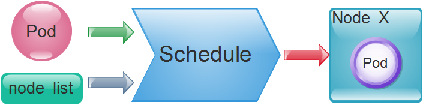

[TOC]

# Pod资源调度

API Server在接受客户端提交Pod对象创建请求后，然后是通过调度器（kube-schedule）从集群中选择一个可用的最佳节点来创建并运行Pod。而这一个创建Pod对象，在调度的过程当中有3个阶段：节点预选、节点优选、节点选定，从而筛选出最佳的节点。如图：

- 节点预选：基于一系列的预选规则对每个节点进行检查，将那些不符合条件的节点过滤，从而完成节点的预选
- 节点优选：对预选出的节点进行优先级排序，以便选出最合适运行Pod对象的节点
- 节点选定：从优先级排序结果中挑选出优先级最高的节点运行Pod，当这类节点多于1个时，则进行随机选择

当我们有需求要将某些Pod资源运行在特定的节点上时，我们可以通过组合节点标签，以及Pod标签或标签选择器来匹配特定的预选策略并完成调度，如`MatchInterPodAfinity、MatchNodeSelector、PodToleratesNodeTaints`等预选策略，这些策略常用于为用户提供自定义Pod亲和性或反亲和性、节点亲和性以及基于污点及容忍度的调度机制。