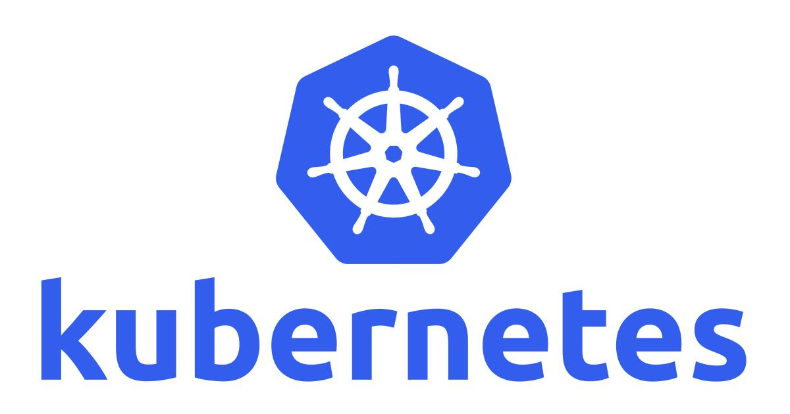

# Kubernetes 学习

​		Kubernetes，简称k8s，是用8代替8个字符"ubernete"而成的缩写。是一个开源的管理云平台中多个主机上的容器化的应用，Kubernetes的目标是让部署容器化的应用简单并且高效（powerful）,Kubernetes提供了应用部署，规划，更新，维护的一种机制。

# 一 入门

主要介绍k8s是什么、组件、工作流程、主要功能和优势。

<table border="0">
<tr>
   <td><a href="概念介绍/kubernetes介绍.md">kubernetes介绍</a></td>
</tr>
</table>

# 二 安装部署

主要介绍以kubeadm方式部署单主和多主高可用方式、k8s版本升级。

<table border="0">
<tr>
   <td><a href="安装部署/kubeadm部署--单主集群.md">kubeadm部署--单主集群</a></td>
   <td><a href="安装部署/kubeadm部署--多主集群.md">kubeadm部署--多主集群</a></td>
   <td><a href="安装部署/kubectl命令行工具详解.md">kubectl命令行工具详解</a></td>
   <td><a href="安装部署/kubernetes版本升级.md">kubernetes版本升级</a></td>
</tr>
</table>

# 三 数据存储

Kubernetes对于**有状态的容器应用或者对数据需要持久化的应用**，不仅需要将容器内的目录挂载到宿主机的目录或者emptyDir临时存储卷，而且需要更加可靠的存储来保存应用产生的重要数据，以便容器应用在重建之后仍然可以使用之前的数据。

<table border="0">
<tr>
   <td><a href="数据存储/Volume存储卷.md">Volume存储卷</a></td>
   <td><a href="数据存储/PV和PVC.md">PV和PVC</a></td>
   <td><a href="数据存储/StorageClass.md">StorageClass</a></td>
   <td><a href="数据存储/GlusterFS持久化存储.md">GlusterFS 持久化存储</a></td>
    </tr>
</table>

# 四 Pod与控制器

Pod是Kubernetes创建或部署的**最小/最简单的基本单位**，一个Pod代表集群上正在运行的一个进程。

Pod控制器是**用于实现管理pod的中间层**，确保pod资源符合预期的状态，pod的资源出现故障时，会尝试进行重启，当根据重启策略无效，则会重新新建pod的资源。

<table border="0">
<tr>
   <td><a href="Pod与控制器/Pod介绍.md">Pod介绍</a></td>
   <td><a href="Pod与控制器/Pod状态与生命周期.md">Pod状态与生命周期</a></td>
   <td><a href="Pod与控制器/Pod资源调度.md">Pod资源调度</a></td>
</tr>
</table>

# 三 资源对象

Kubernetes 中的所有内容都被抽象为"资源"，如 Pod、Service、Node 等都是资源。"对象"就是"资源"的实例，是持久化的实体。如某个具体的 Pod、某个具体的 Node。Kubernetes 使用这些实体去表示整个集群的状态。

对象的创建、删除、修改都是通过 "Kubernetes API"，也就是 "Api Server" 组件提供的 API 接口，这些是 RESTful 风格的 Api，与 k8s 的"万物皆对象"理念相符。命令行工具 "kubectl"，实际上也是调用 kubernetes api。

kubectl 可以通过配置文件来创建这些 “对象”，配置文件更像是描述对象“属性”的文件，配置文件格式可以是 “JSON” 或 “YAML”，常用 “YAML”。

<table border="0">
<tr>
   <td><a href="Kubernetes学习/Node.md">Node</a></td>
   <td><a href="Kubernetes学习/Pod.md">Pod</a></td>
   <td><a href="Kubernetes学习/Label.md">Label</a></td>
   <td><a href="Kubernetes学习/RC(Replication Co.mdntroller).md">RC(Replication Controller)</a></td>
</tr>
<tr>
   <td><a href="Kubernetes学习/Deployment.md">Deployment</a></td>
</tr>
<tr>
   <td><a href="Kubernetes学习/02-kubernetes的基本概念.md">02-kubernetes的基本概念</a></td>
</tr>
</table>

# 二进制

<table border="0">
    <tr>
        <td><a href="二进制/01-Kubernets高可用集群.md">01-Kubernets 高可用集群</a></td>
        <td><a href="二进制/02-Kubernetes集群插件.md">02-Kubernetes 集群插件</a></td>
    </tr>
</table>
<table border="0">
    <tr>
    <td><a href="二进制/promethues/prometheus+grafana监控部署实践.md">prometheus+grafana 监控部署实践</a></td>
    <td><a href="二进制/promethues/prometheus查询语法.md">prometheus 查询语法</a></td>
    <td><a href="二进制/promethues/prometheus告警规则.md">prometheus 告警规则</a></td>
    <td><a href="二进制/promethues/prometheus浅析.md">prometheus 浅析</a></td>
    </tr>
</table>
