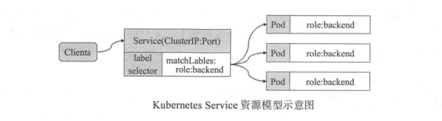
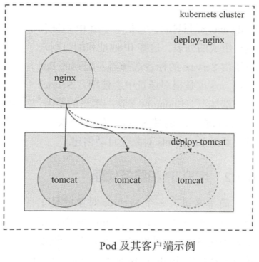
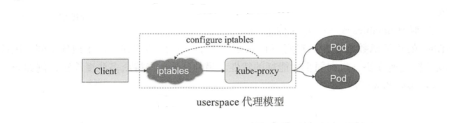
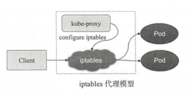
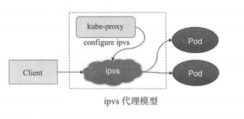
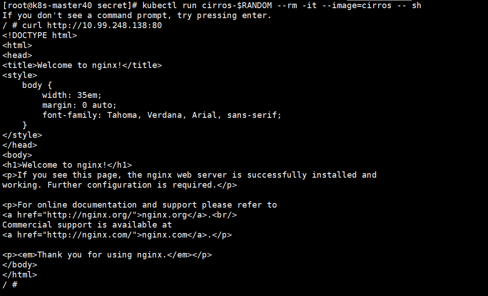
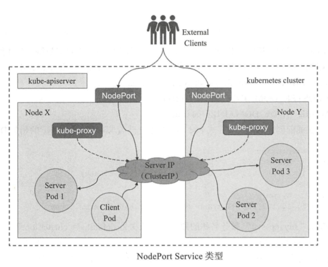
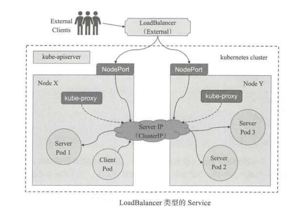
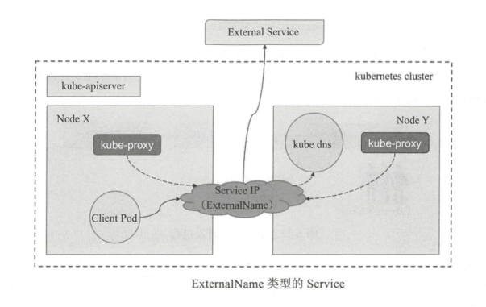

[TOC]


# Service

Service是Kubernetes的核心概念，通过创建Service，可以为一组具有相同功能的容器应用提供一个统一的入口地址，并且将请求负载 分发到后端的各个容器应用上。


# 1 Service 资源及实现模型

Kubernetes Service 定义了这样一种抽象：通过规则定义出由多个 Pod 对象组合而成的逻辑集合，以及访问这组 Pod的策略。Service 资源基于标签选择器将一组Pod 定义成一个逻辑组合，并通过自己的 IP 地址和端口调度代理请求至组内 Pod对象上。



由 Deployment 等控制器管理的 Pod 对象中断后会由新建的资源对象所取代，而扩缩容后的应用则会带来 Pod 对象的变动，随之变化的还有 Pod 的 IP 地址访问接口等，这也是编排系统之上的应用程序必然要面临的问题。为此， Kubemetes 特地设计了 Service 资源来解决此类问题。




# 2 Kubernetes的三种IP

- Node IP
  - Node IP是Kubernetes集群中节点的物理网卡IP地址(一般为内网)，属于这个网络的服务器之间都可以直接通信，所以Kubernetes集群外要想访问Kubernetes集群内部的某个节点或者服务，肯定得通过Node IP进行通信（这个时候一般是通过外网IP了）
- Cluster IP
  - Cluster IP是Service的IP地址，是一个虚拟的IP，仅仅作用于Kubernetes Service这个对象，由Kubernetes自己来进行管理和分配地址，当然我们也无法ping这个地址，他没有一个真正的实体对象来响应，他只能结合Service Port来组成一个可以通信的服务,相当于VIP地址，来代理后端服务。
- Pod IP
  - Pod IP是每个Pod的IP地址，它是Docker Engine根据docker0网桥的IP地址段进行分配的（我们这里使用的是flannel这种网络插件保证所有节点的Pod IP不会冲突）


# 3 虚拟IP和Service代理

Service 对象的 IP 地址也称为 Cluster IP ，它位于为 Kubernetes 集群配置指定专用 IP 地址的范围之内，而且是一种虚拟 IP 地址，它在 Service 对象创建后即保持不变，并且能够被同一集群中的 Pod 资源所访问。Service 端口用于接收客户端请求并将其转发至其后端的Pod中应用的相应端口之上 ，因此，这种代理机制也称为"端口代理"（ port proxy ）或四层代理，它工作于 TCP/IP 协议的传输层。

一个 Service 对象就是工作节点上的一些 iptables或ipvs 规则，用于将到达 Service对象IP 地址的流量调度转发至相应的 Endpoints 对象指向的 IP 地址和端口上。每个工作节点的 kube-proxy组件通过 API Server 监控 Service 及与其关联的 Pod对象，并将其 创建或变动实时反映至当前工作节点上相应的 iptables 或 ipvs 规则上。			

> **==注意==：**Servic 并不直接链接至 Pod对象，还有个中间层 `Endpoints `资源对象，它是一个由IP地址和端口组成的列表。


kube-proxy 将请求代理至相应端点的方式有三种： `userspace `（用户空间 ）、 `iptables ` 和 `ipvs`。

## 3.1 userspace 代理模式

此处的 userspace 是指 Linux 操作系统的用户空间。这种模式，kube-proxy 会监视API Server上Service 对象和 Endpoints 对象的添加和移除操作。 对每个 Service，它会在本地 Node 上打开一个端口（随机选择）。 任何连接到“代理端口”的请求，都会被代理到 Service 的后端的某个`Pod` 上。 使用哪个后端 Pod，是 kube-proxy 基于 `SessionAffinity` 来确定的。

最后，它配置 iptables 规则，捕获到达该 Service 的 `clusterIP`（是虚拟 IP） 和 `Port` 的请求，并重定向到代理端口，代理端口再代理请求到后端Pod。



默认情况下，用户空间模式下的 kube-proxy 通过轮询算法选择后端。这种代理模型中，请求流量到达内核空间后经由套接字送往用户空间的 kube-proxy,而后再由它送回内核空 ，并调度至后端 Pod 这种方式中，请求在内核空间和用户空间来回转发必然会导致效率不高。


## 3.2 iptables 代理模型

同前一种代理模型类似， iptables 代理模型中， kube-proxy 跟踪 API Server Service和Endpoints 对象的变动（ 创建或移除），并据此做出 Service 资源定义的变动。同时，对于每个 Service ，它都会创建iptables 规则直接捕获到达 ClusterIP和Port 的流 量，并将其重定向至当前 Service 后端，如图，所示 对于每个 Endpoints 对象， Service 资源会为其创建iptables 规则并关联至挑选的后端 Pod 资源，默认算法是随机调度（ random iptables 理模式由 Kubernetes 1.1版本引人，并自 1.2 开始成为默认的类型。



在创建 Service 资源时，集群中每个节点上的 kube proxy 都会收到通知并将其定义为当前节点上的 iptables 规则，用于转发工作接口接收到的与此 Servic巳资源的 ClusterIP 和端口的相关流量。客户端发来的请求被相关的 iptables 规则进行调度和目标地址转换（DNAT ）后再转发至集群内的 Pod 象之上。

相对于用户空间模型来说， iptables 模型无须将流量在用户空间和内核空间来回切换，因而更加高效和可靠。不过，其缺点是 iptables 代理模型不会在被挑中的后端 Pod 资源无响应时自动进行重定向，而 userspace 模型则可以。


## 3.3  ipvs 代理模型

此种模型中， kube proxy 跟踪 API Server上Service 和 Endpoints 对象的变动，据此来调用 netlink 接口创建 ipvs规则，并确保与 API Server 中的变动保持同步。它与 iptables 规则的不同之处仅在于其请求流量的调度功能由ipvs 实现 ，余下的其他功能仍由 iptables完成。



类似于 iptables 模型， ipvs 构建于netfilter的钩子函数之上，但它使用 hash 表作为底层数据结构并工作于内核空间，因此具有流量转发速度快、规则同步性能好的特性。另外， ipvs 支持众多调度算法，例如rr、 lc、dh、se、nq等。


# 4 Servive资源应用

Service 资源本身并不提供任何服务，真正处理并响应客户端请求的是后端的 Pod 资源，这些 Pod 资源通常各类控制器对象所创建和管理，因此 Service 资源通常要与控制器资源（最常用的控制器之一是 Deployment ）协同使用以完成应用的创建和对外发布。


## 4.1 创建 Service 资源

创建 Service 对象的常用方法有两种：一是直接使用“ kubectl expose ”命令，另一个是使用资源配置文件，它与此前使用资源清单文件配置其他资源的方法类似。定义 Service 资源对象时， spec 的两个较为常用的内嵌字段分别是selector和ports ，分别用于定义使用的标签选择器和要暴露的端口 。

示例：

创建一个nginx的pod：

vim nginx-pod.yaml

```yaml
apiVersion: apps/v1
kind: Deployment
metadata:
  name: nginx-deployment
spec:
  replicas: 3
  selector:
    matchLabels:
      name: nginx
  template:
    metadata:
      labels:
        name: nginx
    spec:
      containers:
        - name: nginx
          image: nginx:1.14.0
          ports:
            - containerPort: 80
          resources:
            requests:
              cpu: 200m
              memory: 64Mi 
            limits:
              cpu: 400m
              memory: 256Mi

```

创建nginx的service资源：

vim nginx-service.yaml

```yaml
kind: Service
apiVersion: v1
metadata:
  name: nginx-service
spec:
  selector:
    name: nginx
  ports:
  - protocol: TCP
    port: 80
    targetPort: 80
```

执行并查看：

```bash
$ kubectl create -f nginx-service.yaml
$ kubectl get svc nginx-service
NAME               TYPE        CLUSTER-IP      EXTERNAL-IP   PORT(S)   AGE
nginx-service      ClusterIP   10.99.248.138   <none>        80/TCP    67s

```

根据结果显示，nginx-deployment的service类型是ClusterIP，此类型的 Service 对象仅能通过 此IP 地址接受来自于集群内的客户端 Pod中的请求。若集群上存在标签为“ name=nginx”的 Pod 资源，则它们会被关联和创建，作为此 Service 对象的后端 Endpoint 对象，并负责接收相应的请求流量。

查看此 Endpoint 资源的端点列表：

```bash
$ kubectl get endpoints nginx-deployment
NAME               ENDPOINTS                                       AGE
nginx-deployment   10.244.0.92:80,10.244.1.95:80,10.244.2.202:80   104s

$ kubectl get pod -o wide|grep nginx
nginx-deployment-57dd96ddb9-9nfms   1/1     Running   0          11m   10.244.2.202    k8s-node42     <none>           <none>
nginx-deployment-57dd96ddb9-jw4rm   1/1     Running   0          11m   10.244.1.95     k8s-node41     <none>           <none>
nginx-deployment-57dd96ddb9-qqkvc   1/1     Running   0          11m   10.244.0.92     k8s-master40   <none>           <none>
#可以看出ENDPOINTS列表对应了，pod ip+port
```

Service 对象创建完成后即可作为服务被各客户端访问，但要真正响应这些请求，还是要依赖于各后端的资源对象。


## 4.2 向Service 对象请求服务

Service 资源的默认类型为 ClusterIP，它仅能接收来自于集群中的Pod 对象中的客户端程序的访问。下面创建一个专用的 Pod ，利用其交互式接口完成访问测试。为了简单起见，这里选择直接创建一个临时使用的 Pod 对象作为交 式使用的 户端进行，它使用 CirrOS 镜像， 默认的命令提示符为“ ／＃ ”：

```bash
$ kubectl run cirros-$RANDOM --rm -it --image=cirros -- sh
If you don't see a command prompt, try pressing enter.
/ #

```

> 注意：CirrOS 是设计用来进行云计算环境测试的 Linux 微型发行版。它拥有 HTTP 户端工具curl 等。

而后，在容器的交互式接口中使用 crul nginx-service 服务的 ClusterIP ( 10.99.248.138 ) Port ( 80 tcp ）发起访问请求测试：



当前Kubernetes 集群的 Service 代理模式为 iptables ，它默认使用随机调度算法，因此Service 会将客户端请求随机调度至与其关联的某个后端 Pod 资源上。


## 4.3 Service 会话粘性

​		Service 资源还支持 Session affinity （粘性会话或会话粘性）机制，它能够将来自同一个客户端的请求始终转发至同一个后端的 Pod 对象，这意味着它会影响调度算法的流量分发功用，进而降低其负载均衡的效果。因此，当客户端访问 Pod 中的应用程序时，如果有基于客户端身份保存某些私有信息，并基于这些私有信息追踪用户的活动等一类的需求时，那么应该启用 session affinity 机制。

​		Session affinity 的效果仅会在一定时间期限内生效，默认值为 10800 秒，超出此时长之后，客户端的再次访问会被调度算法重新调度。另外，Service 资源的 Sssion affinity机制仅能基于客户端 IP 地址识别客户端身份，它会把由同 NAT 服务器进行源地址转换的所有客户端识别为同一个客户端，调度粒度粗糙且效果不佳，因此，实践中并不推荐使用此种方法实现粘性。


# 5 服务发现

在 Kubenetes 系统上，Service 为Pod 中的服务类应用提供了个稳定的访问人口，但 Pod 客户端中的应用如何得知某个特定 Service 资源的 IP和端口呢 这个时候就需要引人服务发现（ Service Discovery ）的机制。


## 5.1 服务发现概述

简单来说，服务发现就是服务或者应用之间互相定位的过程。

服务发现机制的**基本实现**， 一般是事先部署好一个网络位置较为稳定的服务注册中心（也称为服务总线），服务提供者（服务端）向注册中心注册自己的位置信息，并在变动后及时予以更新，相应地，服务消费者则周期性地从注册中心获取服务提供者的最新位置信息从而“发现”要访问的目标服务资源。复杂的服务发现机制还能够让服务提供者提供其描述信息、状态信息及资源使用信息等，以供消费者实现更为复杂的服务选择逻辑。

实践中，根据服务发现过程的实现方式，服务发现还可分为两种类型：客户端发现和服务端发现。

- 客户端发现：由客户端到服务注册中心发现其依赖到的服务的相关信息，因此，它需要内置特定的服务发现程序和发现逻辑
- 服务端发现：这种方式需要额外用到一个称为中央路由器或服务均衡器的组件；服务消费者将请求发往中央路由器或者负载均衡器，由它们负责查询服务注册中心获取服务提供者的位置信息，并将服务消费者的请求转发给服务提供者

由此可见，服务注册中心是服务发现得以落地的核心组件。事实上， DNS 可以算是最为原始的服务发现系统之一，不过，在服务的动态性很强的场景中， DNS 录的传播速度可能会跟不上服务的变更速度，因此它并不适用于微服务环境。

**Netflix Eureka** 是目前较为流行的服务发现系统之一，它是专门开发用来实现服务发现的系统，以可用性目的为先，可以在多种故障期间保持服务发现和服务注册的功能可用，其设计原 遵从“存在少 的错误数据，总比完全不可用要好” 另一个同级别的实现是 **Consul** ，它是由 HashiCorp 公司提供的商业产品，不过该公司还提供了一个开源基础版本它于服务发现的基础功能之外还提供了多数据中心的部署能力等一众出色的特性。


## 5.2 服务发现的方式

创建 Pod 资源时·， kubelet 会将其所属名称空间内的每个活动的 Service 对象以一系列环境变量的形式注入其中。它支持使用 Kubernetes Service 环境变量以及与 Docker links容器的变量。

### 5.2.1 环境变量

**( I ) Kubernetes Service 环境变量**

Kubernetes 为每个 Service 资源生成包括以下形式的环境变量在内的一系列环境变量，在同一命名空间中创建的Pod对象都会自动拥有这些变量。

 如下：

```bash
{SVCNAME}_SERVICE_HOST
{SVCNAME}_SERVICE_PORT
```

> 注意：如果 SVCNAME 中使用了连接线，那么 ubernetes 会在定义为环境变量时将其转换为下划线


**( 2 ) Docker Link 形式的环境变量**

Docker 使用 link 选项实现容器连接时所设置的环境变量形式，具体使用方式请参考Docker 的相关文档。在创建 Pod 对象时， Kubernetes 会将与 形式兼容的一系列环境变量。

例如，在 Service 资源 myapp-svc 创建后创建的 Pod 中查看可用的环境变量 ，其中以 MYAPP_SVC_SERVICE 开头的表示 Kubernetes Service 环境变 ，名称中不包含"SERVICE ”字符串的环境变 Docker Link 形式的环境变量：

```
I # pr ntenv I grep MYAPP 
MYAPP_SVC_PORT_80_TCP_ADDR=l0.107.208.93 
MYAPP_SVC_PORT_80_TCP_PORT=80 
MYAPP_SVC_PORT_80_TCP_PROTO=tcp 
MYAPP_SVC_PORT_80_TCP=tcp://10.107.208.93:80 
MYAPP_SVC_SERVICE_HOST=l0.107.208.93 
MYAPP_SVC_SERVICE_PORT=80 
MYAPP_SVC_PORT=tcp://10.107.208.93:80
```

基于环境变 的服务发现其功能简单、易用，但存在一定的局限，例如，仅有那些与创建的 Pod 对象在同一名称空间 中且事先存在的 Service 象的信息才会以环境变量的形式注人，不在同一命名空间的，或者是在 Pod 资源创建之后才创建的 Service 对象的相环境变量则不会被添加。但是，基于 DNS 的发现机制并不存在此类限制。


### 5.2.2 DNS

Kubernetes 系统之上用于名称解析和服务发现的 ClusterDNS 是集群的核心附件之一，集群中创建的每个Service对象， 都会由其自动生成相关的资源记录。默认情况下，集群内各Pod资源会自动配置其作为名称解析服务器，并 在其DNS 搜索列表中包含它所属名称空间的域名后缀。

创建Service资源对象时，ClusterDNS会为它自动创建资源记录用于名称解析和服务注册，于是，Pod资源可直接使用标准的DNS名称来访问这些Service资源。每个Service对象相关的DNS记录包含以下两个：

```
{SVCNAME}.{NAMESPACE}.{CLUSTER_DOMAIN}
{SVCNAME}.{NAMESPACE}.svc.{CLUSTER_DOMAIN}
```

参数 “--cluster-dns ”指定 集群DNS 服务的工作地址，“--cluster-domain”定义了 集群使用的本地域名，因此，系统初始化时默认会将“ cluster.local. ”和主机所在的域“ ilinux.io. ”作为 DNS 的本地域使用，这些信息会在 Pod 创建时以DNS配置的相关信息注入它的 /etc /resolv.conf 文件中。

例如：

```bash
# kubectl exec -it  nginx-deployment-57dd96ddb9-9nfms -- /bin/bash
root@nginx-deployment-57dd96ddb9-9nfms:/# cat /etc/resolv.conf
nameserver 10.96.0.10
search default.svc.cluster.local svc.cluster.local cluster.local
options ndots:5

```


# 6 服务暴露

Service IP 地址仅在集群内可达，然而，总会有些服务需要暴露到外部网络中接受各类客户端的访问，例如分层架构应用中的前端 Web 应用程序等。 此时，就需要在集群的边缘为其添一层转发机制，以实现将外部请求流量接入到集群的 Service 资源之上，这种操作也称为发布服务到外部网络中。


## 6.1 Service 类型

Kubemetes Service 共有四种类型：ClusterlP、NodePort、LoadBalancer、ExtemalName。

- **ClusterIP ：**通过集群内部 IP 地址暴露服务 ，此地址仅在集群内部可达，而无法被集群外部的客户端访问，此为默认的 Service 类型。
- **NodePort**：这种类型建立在 ClusterIP 类型之上，其在每个节点的 IP 地址的某静态端NodePort 暴露 务，因此，它依然Service 分配集群 IP 地址， 将此作为NodePort 的路由目标。简单来说， NodePort 型就是在工作节点的 IP 地址上选择个端口用于将集群外部的用户请求转发至目标 Service ClusterIP Port ，因此，这种类型的 Service 既可如 ClusterIP 一样受到集群内部客户端 Pod 的访问，也会受集群外部客户端通过套接字＜NodeIP>: NodePort＞进行的请求。




- **LoadBalancer ：**这种类型建构在 NodePort 类型之上，其通过 cloud provider 提供的负载均衡器将服务暴露到集群外部 ，因此 LoadBalancer 一样具有 NodePort 和ClusterIP。简而言之， LoadBalancer 类型 Service 会指向关联 Kubernetes 集群外部的切实存在的某个负载均衡设备，该设备通过工作节点之上的 NodePort 向集群内部发送请求流 。




- **ExternalName：**其通过将 Service 映射至由 externalName 字段的内容指定的主机名来暴露服务，此主机名需要被 DNS 服务解析至 CNAME 类型的记录。换言之，此种此类型并非定义由 Kubemetes 集群提供的服务，而是把集群外部的某服务以 DNS CNAME记录的方式映射到集群内，从而让集群内的 Pod 资源能够访问外部的 Service的一种实现方式，如图所示，这种类型的 Service 没有 ClusterIP 和 NodeIP。也没有标签选择器用于选择 Pod 资源，因此也不会有 Endpoints 存在。




## 6.2 NodePort类型的Service资源

NodePort 即节点 Port ，通常在安装部署 Kubemetes 集群系统时会预留一个端口范围用于 NodePort ，默认为 30000~32767 之间的端口 ClusterIP 类型的可省略 spec.type 属性所不同的是，定义 NodePort 类型的 Service 资源时，需要通过此属性明确指定其类型名称。

例如，下面配置清单中定义的 Service 资源对象 myapp-svc-nodeport ，它使用了NodePort 类型，且指定其节点端口为 32223：

vim  [myapp-svc-nodeport.yaml](yaml\myapp-svc-nodeport.yaml) 

```yaml
kind: Service
apiVersion: v1
metadata:
  name: myapp-svc-nodeport
spec:
  type: NodePort
  selector:
    app: myapp
  ports:
  - protocol: TCP
    port: 80
    targetPort: 80
    nodePort: 32223
```

生产环境中，不建议使用自定端口进行端口暴露。

```bash
$ kubectl get svc myapp-svc-nodeport
NAME                 TYPE       CLUSTER-IP      EXTERNAL-IP   PORT(S)        AGE
myapp-svc-nodeport   NodePort   10.111.137.18   <none>        80:32223/TCP   14s

```


## 6.3 LoadBalancer类型的Service资源

NodePort 类型 Service 资源虽然能够于集群外部访问得到，但外部客户端必须得事先得知 NodePort 和 集群节点至少一个 IP 地址 ，且选定的节点发生故障时，客户端还得自行选择请求访问其他的节 点。另外，集群节点很可能是某 IaaS 云环境中使用私有 IP 地址的VM，或者是IDC中使用私有地址的物理机，这类地址对互联网客户端不可达，因此，一般还应该在集群之外创建一个具有公网 IP 地址的负载均衡器，由它接入外部客户端的请求并调度至集群节点相应的 NodePort 之上。

LoadBalancer 类型的 Service 资源配置清单：

vim  [myapp-svc-lb.yaml](yaml\myapp-svc-lb.yaml) 

```yaml
kind: Service
apiVersion: v1
metadata:
  name: myapp-svc-lb
spec:
  type: LoadBalancer
  selector:
    app: myapp
  ports:
  - protocol: TCP
    port: 80
    targetPort: 80
    nodePort: 32223

```

进一步地，在 IaaS 环境支持手动指定 IP 地址时，用户还可以使用` .spec.loadBalancerIP`指定创建的负载均衡器使用的 IP 地址，并可使用 `.spec. IoadBalancerSourceRanges` 指定负载均衡器允许的客户端来源的地址范围。


## 6.4 ExternalName Service 

ExternalName 类型的 Service 资源用于将集群外部的服务发布到集群中以供 Pod 中的应用程序访问，因此，它不需要使用标签选择器关联任何的 Pod 对象，但必须要使用 `sepc.externalName` 属性定义一个 CNAME 记录用于返回外部真正提供服务的主机的别名，而后通过 CNAME 记录值获取到相关主机的 IP 地址。

vim  [externalname-redis-svc.yaml](yaml\externalname-redis-svc.yaml) 

```yaml
kind: Service
apiVersion: v1
metadata:
  name: externalname-redis-svc
  namespace: default
spec:
  type: ExternalName
  externalName: redis.ik8s.io
  ports:
  - protocol: TCP
    port: 6379
    targetPort: 6379
    nodePort: 0
  selector: {}

```

Service 资源 external-redis-svc 创建完成后，各 Pod 对象即可通过 external-redis-svc 或 其FQDN 格式的名称 `external-redi s-svc.default.svc.cluster.local `访问相应的服务 ClusterDNS会将此名称以 CNAME 格式解析为 `.spec.externalName` 段中的名称，而后通过 DNS 服务将其解析为相应的主机的 IP 地址。

例如，通过此前创建的交互 Pod 资源客户端进行服务名称解析：

```
# nslookup external redis svc
```

由于 ExternalName 类型 的Service 资源实现于 DNS 级别，客户端将直接接入外部的服务而完全不需要服务代理，因此，它也无须配置 Cluster IP 此种类型的服务也称为 Headless Service。


# 7 Headless 类型的 Service 资源

Service 对象隐藏了各 Pod 资源，并负责将客户端的请求流量调度至该组 Pod 象之上。不过，偶尔也会存在这样一类需求：客户端需要直接访问 Service 资源后端的所有 Pod资源，这时就应该向客户端暴露每个 Pod 资源的 IP 地址，而不再是中间层 Service 对象的Cluster IP ，这种类型 Service 资源便称为 Headless Service。

Headless Service 对象没有 ClusterIP ，于是 kube-proxy 便无须处理此类请求 ，也就更没有了负载均衡或代理它的需要。在前端应用拥有自有的其他服务发现机制时， Headless Service 即可省去定义 ClusterlP 需求。至于如何为此 Service 资源配置 IP 地址，则取决于它的标签选择器的定义。

- 具有标签选择器：端点控制器（ Endpoints Controller ）会在 API 中为其创建 Endpoints记录，并将 ClusterDNS 服务中的A记录直接解析到此 Service 后端的各 Pod对象的IP地址上。
- 没有标签选择 ：端点控制器（ Endpoints Controller ）不会在 API 中为其创 Endpoints记录，ClusterDNS 的配置分为两种情形，对 ExtemalNam 类型的服务创建 CNAME 记录， 对其他类型来说，为那些与当前 Service 共享名称的所有 Endpoints对象创建一条记录。


## 7.1 创建 Headless Se vice 资源


