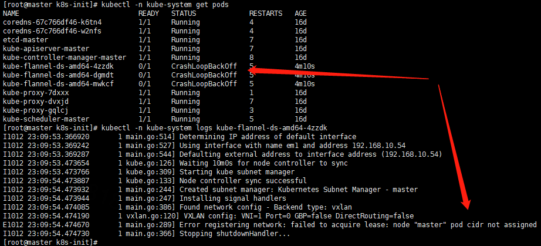

# k8s使用常见问题

# 1 node(s) had taints that the pod didn't tolerate

直译意思是节点有了污点无法容忍，执行kubectl get no -o yaml | grep taint -A 5 之后发现该节点是不可调度的。这是因为kubernetes使用kubeadm初始化的集群，出于安全考虑Pod不会被调度到Master Node上，也就是说Master Node不参与工作负载。

允许master节点部署pod，使用命令如下:

```bash
# 查看信息
kubectl get no -o yaml | grep taint -A 5
kubectl taint nodes --all node-role.kubernetes.io/master-
```

输出如下:

node “k8s” untainted

输出error: taint “node-role.kubernetes.io/master:” not found错误忽略。

禁止master部署pod

```
kubectl taint nodes k8s node-role.kubernetes.io/master=true:NoSchedule
```


# 2 pod has unbound immediate PersistentVolumeClaims


# 3 no matches for kind "DaemonSet" in version "extensions/v1beta1"

DaemonSet、Deployment、StatefulSet 和 ReplicaSet 在 v1.16 中将不再从 extensions/v1beta1、apps/v1beta1 或 apps/v1beta2 提供服务。

解决方法：

将yaml配置文件内的api接口修改为 apps/v1 ，导致原因为之间使用的kubernetes 版本是1.14.x版本，1.16.x 版本放弃部分API支持。


# 4 kubelet  Back-off restarting failed container

在通过glusterfs-daemonset.json部署glusterfs时，查看pod是不是就重启报错Back-off restarting failed container。

需要在image后加入如下内容：

```json
 "image": "gluster/gluster-centos:latest",
            "command": [
              "/bin/bash",
              "-ce",
              "tail -f /dev/null"
            ],
```


# 5 Failed to get D-Bus connection: Operation not permitted

Liveness probe failed: Failed to get D-Bus connection: Operation not permitted

Readiness probe failed: Failed to get D-Bus connection: Operation not permitted


# 6 kubectl create 和 kubectl apply创建资源对象的区别

| 序号 | kubectl apply                                                | kubectl create                                               |
| ---- | ------------------------------------------------------------ | ------------------------------------------------------------ |
| 1    | 根据yaml文件中包含的字段（yaml文件可以只写需要改动的字段），直接升级集群中的现有资源对象 | 首先删除集群中现有的所有资源，然后重新根据yaml文件（必须是完整的配置信息）生成新的资源对象 |
| 2    | yaml文件可以不完整，只写需要的字段                           | yaml文件必须是完整的配置字段内容                             |
| 3    | kubectl apply只工作在yaml文件中的某些改动过的字段            | kubectl create工作在yaml文件中的所有字段                     |
| 4    | 在只改动了yaml文件中的某些声明时，而不是全部改动，你可以使用kubectl apply | 在没有改动yaml文件时，使用同一个yaml文件执行命令kubectl replace，将不会成功（fail掉），因为缺少相关改动信息 |


# 7 k8s中containers的command用法错误

```bash
$ kubectl get po
NAME                            READY   STATUS              RESTARTS   AGE
cronjob-test-1623209100-4j59c   0/1     CrashLoopBackOff    2          75s
cronjob-test-1623209100-d8wh8   0/1     CrashLoopBackOff    2          75s
cronjob-test-1623209160-9pc54   0/1     ContainerCreating   0          15s
cronjob-test-1623209160-pv7h5   0/1     ContainerCreating   0          15s


$ kubectl describe pod cronjob-test-1623209160-9pc54
...
  Warning  Failed     <invalid>                      kubelet            Error: failed to start container "my-cronjob": Error response from daemon: OCI runtime create failed: container_linux.go:348: starting container process caused "exec: \"bash\": executable file not found in $PATH": unknown
```

发现：

```
command: ["bash","-c","date;echo  Hello from the Kubernetes cluster"] #job具体执行的任务
```

在describe详细中看到因为找不到command命令的$PATH导致，改为`/bin/sh`后就可以了。


# 8 Unable to connect to the server: x509: certificate signed by unknown authority

```bash
[root@k8s-m01 ~]# kubectl get nodes
Unable to connect to the server: x509: certificate signed by unknown authority (possibly because of "crypto/rsa: verification error" while trying to verify candidate authority certificate "kubernetes")

```

出现这样的报错是什么原因呢？其实有可能是忘记执行脚本程序了。

```bash
mkdir -p $HOME/.kube
sudo cp -i /etc/kubernetes/admin.conf $HOME/.kube/config
sudo chown $(id -u):$(id -g) $HOME/.kube/config
```


# 9 k8s安装flannel报错“node "master" pod cidr not assigned”

在安装flannel网络插件后，发现pod: kube-flannel-ds 一直是CrashLoopBackOff

解决解决办法，在`kubeadm-init.yaml`文件中添加配置（已添加)

```yaml
controllerManager:  
  extraArgs:
    allocate-node-cidrs: "true"
    cluster-cidr: "10.244.0.0/16"
```
