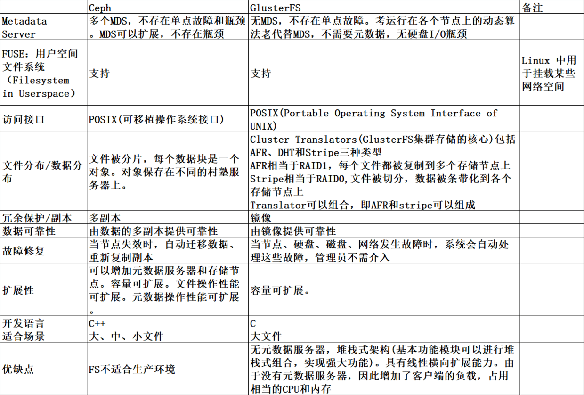

[TOC]


# GlusterFS 持久化存储

# 1 介绍

GlusterFS是一个开源的分布式文件系统，具有强大的横向扩展能力，通过扩展能够支持数PB存储容量和处理数千客户端。GlusterFS借助TCP/IP或InfiniBandRDMA网络将物理分布的存储资源聚集在一起，使用单一全局命名空间来管理数据。

**与Ceph的简单对比：**




# 2 搭建GlusterFS集群

## 2.1 环境介绍

已搭建K8S集群（1个master 2个node节点），并做好k8s-master40免密登录其他机器，不使用for循环的都是在单机上执行。

| 主机名       | IP            | 角色   | 数据盘   |
| ------------ | ------------- | ------ | -------- |
| k8s-master40 | 10.159.238.40 | master | /dev/vdb |
| k8s-node41   | 10.159.238.41 | node   | /dev/vdb |
| k8s-node42   | 10.159.238.42 | node   | /dev/vdb |

## 2.2 安装及配置GlusterFS集群

```bash
# yum安装--三台都执行
yum -y install centos-release-gluster
yum install -y glusterfs glusterfs-server glusterfs-fuse glusterfs-rdma
systemctl start glusterfsd.service
systemctl enable glusterfsd.service
systemctl status glusterfsd.service|grep -i running

# 添加其他节点到k8s-master40信任池--k8s-master40上执行
[root@k8s-master40 ~]# gluster peer probe k8s-node41
[root@k8s-master40 ~]# gluster peer probe k8s-node42

# 创建数据目录--三台都执行
mkdir -p /data-glusterfs

# 创建名为k8s-volume复制卷--k8s-master40上执行
[root@k8s-master40 ~]# gluster volume create k8s-volume replica 3 k8s-master40:/data-glusterfs k8s-node41:/data-glusterfs k8s-node42:/data-glusterfs force

# 删除volume:  
gluster volume delete NAME

# 启动复制卷--k8s-master40上执行
[root@k8s-master40 ~]# gluster volume start k8s-volume

# 查询卷的状态--k8s-master40上执行
[root@k8s-master40 ~]# gluster volume status
Status of volume: k8s-volume
Gluster process                             TCP Port  RDMA Port  Online  Pid
------------------------------------------------------------------------------
Brick k8s-master40:/data-glusterfs          49152     0          Y       6866
Brick k8s-node41:/data-glusterfs            49152     0          Y       15075
Brick k8s-node42:/data-glusterfs            49152     0          Y       18601
Self-heal Daemon on localhost               N/A       N/A        Y       6883
Self-heal Daemon on k8s-node42              N/A       N/A        Y       18618
Self-heal Daemon on k8s-node41              N/A       N/A        Y       15092

Task Status of Volume k8s-volume
------------------------------------------------------------------------------
There are no active volume tasks

[root@k8s-master40 ~]# gluster volume info

Volume Name: k8s-volume
Type: Replicate
Volume ID: 6276421b-b28e-406e-a1a4-745c90f8723c
Status: Started
Snapshot Count: 0
Number of Bricks: 1 x 3 = 3
Transport-type: tcp
Bricks:
Brick1: k8s-master40:/data-glusterfs
Brick2: k8s-node41:/data-glusterfs
Brick3: k8s-node42:/data-glusterfs
Options Reconfigured:
cluster.granular-entry-heal: on
storage.fips-mode-rchecksum: on
transport.address-family: inet
nfs.disable: on
performance.client-io-threads: off

# 验证复制卷可用性--三台分别执行
[root@k8s-master40 mnt]# mount -t glusterfs k8s-master40:k8s-volume /mnt && touch /mnt/$(hostname)
[root@k8s-node41 ~]# mount -t glusterfs k8s-node41:k8s-volume /mnt && touch /mnt/$(hostname)
[root@k8s-node42 ~]# mount -t glusterfs k8s-node42:k8s-volume /mnt && touch /mnt/$(hostname)
# 生产环境建议将glusterfs挂载到单独的数据盘；并加入开机自启动。

# 查看挂载点下的文件
ls /mnt/
k8s-master40  k8s-node41  k8s-node42

# 测试完后,说明glusterfs功能正常，可以卸载掉挂载点/mnt,但是不要删除k8s-volume卷后边静态挂载glusterfs会使用。
```


# 3 k8s静态挂载GlusterFS

> 参考：https://github.com/kubernetes/examples/tree/master/volumes/glusterfs

## 3.1 创建GlusterFS的endpoints

vim   [glusterfs-endpoints.yaml](yaml\glusterfs-endpoints.yaml) 

```yaml
apiVersion: v1
kind: Endpoints
metadata:
  name: glusterfs-cluster
  namespace: default
subsets:
- addresses:
  - ip: 10.159.238.40
  - ip: 10.159.238.41
  - ip: 10.159.238.42
  ports:
  - port: 49152
    protocol: TCP
```

## 3.2 创建GlusterFS的service

vim  [glusterfs-service.yaml](yaml\glusterfs-service.yaml) 

```yaml
apiVersion: v1
kind: Service
metadata:
  name: glusterfs-cluster
  namespace: default
spec:
  ports:
  - port: 49152
    protocol: TCP
    targetPort: 49152
  sessionAffinity: None
```

## 3.3 创建GlusterFS的PV

vim   [glusterfs-pv.yaml](yaml\glusterfs-pv.yaml) 

```yaml
apiVersion: v1
kind: PersistentVolume
metadata:
  name: glusterfs-cluster-pv
  labels:
    type: glusterfs
spec:
  storageClassName: glusterfs-volume
  capacity:
    storage: 10Gi
  accessModes:
    - ReadWriteMany
  persistentVolumeReclaimPolicy: Recycle  
  glusterfs:
    endpoints: "glusterfs-cluster"
    path: "k8s-volume"
    readOnly: false

```

## 3.4 创建GlusterFS的PVC

vim   [glusterfs-pvc.yaml](yaml\glusterfs-pvc.yaml) 

```yaml
apiVersion: v1
kind: PersistentVolumeClaim
metadata:
  name: glusterfs-cluster-pvc
spec:
  storageClassName: glusterfs-volume
  accessModes:
  - ReadWriteMany
  resources:
    requests:
      storage: 2Gi

```

创建并查看这些资源

```shell
[root@k8s-master40 glusterfs]# kubectl create -f glusterfs-endpoints.yaml
endpoints/glusterfs-cluster created
[root@k8s-master40 glusterfs]# kubectl get ep
NAME                ENDPOINTS                                                     AGE
fuseim.pri-ifs      <none>                                                        17d
glusterfs-cluster   10.159.238.40:49152,10.159.238.41:49152,10.159.238.42:49152   7s
kubernetes          10.159.238.40:6443                                            37d
mysql-service       <none>                                                        16d
[root@k8s-master40 glusterfs]# kubectl create -f glusterfs-service.yaml
service/glusterfs-cluster created
[root@k8s-master40 glusterfs]# kubectl get service
NAME                TYPE        CLUSTER-IP     EXTERNAL-IP   PORT(S)     AGE
glusterfs-cluster   ClusterIP   10.103.57.32   <none>        49152/TCP   9s
kubernetes          ClusterIP   10.96.0.1      <none>        443/TCP     37d
mysql-service       ClusterIP   None           <none>        80/TCP      16d
[root@k8s-master40 glusterfs]# kubectl create -f glusterfs-pv.yaml
persistentvolume/glusterfs-cluster-pv created
[root@k8s-master40 glusterfs]# kubectl get pv
NAME                                       CAPACITY   ACCESS MODES   RECLAIM POLICY   STATUS   CLAIM                           STORAGECLASS       REASON   AGE
glusterfs-cluster-pv                       10Gi       RWX            Recycle          Bound    default/glusterfs-cluster-pvc   glusterfs-volume            10m

[root@k8s-master40 glusterfs]# kubectl create -f glusterfs-pvc.yaml
persistentvolumeclaim/glusterfs-cluster-pvc created
[root@k8s-master40 glusterfs]# kubectl get pvc
NAME                    STATUS   VOLUME                                     CAPACITY   ACCESS MODES   STORAGECLASS       AGE
glusterfs-cluster-pvc   Bound    glusterfs-cluster-pv                       10Gi       RWX            glusterfs-volume   9m49s
```

## 3.5 创建应用使用GlusterFS卷

vim [nginx-glusterfs.yaml](yaml\nginx-glusterfs.yaml) 

```yaml
apiVersion: apps/v1
kind: Deployment
metadata:
  name: nginx-deployment
spec:
  replicas: 2
  selector:
    matchLabels:
      name: nginx
  template:
    metadata:
      labels:
        name: nginx
    spec:
      containers:
        - name: nginx
          image: nginx
          ports:
            - containerPort: 80
          volumeMounts:
            - name: nginxglusterfs
              mountPath: "/usr/share/nginx/html"
      volumes:
      - name: nginxglusterfs
        persistentVolumeClaim:
          claimName: glusterfs-cluster-pvc
```

创建并查看：

```bash
[root@k8s-master40 glusterfs]# kubectl create -f nginx-glusterfs.yaml
[root@k8s-master40 glusterfs]# kubectl get pod
NAME                                      READY   STATUS    RESTARTS   AGE
nginx-deployment-796648dc8f-7vmcz         1/1     Running   0          36s
nginx-deployment-796648dc8f-xrmzl         1/1     Running   0          36s
```

查看挂载点是否成功：

```bash
[root@k8s-master40 glusterfs]# kubectl exec -it nginx-deployment-796648dc8f-7vmcz -- ls /usr/share/nginx/html/
输出如下信息，证明挂载成功
k8s-master40  k8s-node41  k8s-node42
```


# 4 k8s动态挂载GlusterFS

前提条件：确保GlusterFS和Heketi程序都正常。

Heketi是一个提供RESTful API管理GlusterFS卷的管理程序，作为kubernetes的Storage存储的external provisioner；便于管理员对GlusterFS进行操作：

- 可以用于管理GlusterFS卷的生命周期;
- 能够在OpenStack，Kubernetes，Openshift等云平台上实现动态存储资源供应（动态在GlusterFS集群内选择bricks构建volume）；
- 支持GlusterFS多集群管理。

## 4.1 安装并配置heketi

**1）所有节点安装**

```bash
yum install -y heketi heketi-client
```

**2）配置集群SSH免密互信**

```bash
yum -y install sshpass
#!/bin/bash
UserName=root
IPlist=(10.159.238.40 10.159.238.41 10.159.238.42 )
#创建密钥
ssh-keygen -f /etc/heketi/heketi_key -t rsa -N '' &>/dev/null
#分发公钥
for i in ${IPlist[*]};do sshpass -p "123456" ssh-copy-id -i /etc/heketi/heketi_key.pub -p 22 -o StrictHostKeyChecking=no $UserName@$i &>/dev/null;done
```

**3）修改heketi配置**

heketi有三种executor，分别为mock，ssh，kubernetes，建议在测试环境使用mock，生成环境使用ssh，当glusterfs以容器的方式部署在Kubernetes上时，才是用kubernetes。

vim /etc/heketi/[heketi.json](yaml\heketi.json) 

```json
{
  "_port_comment": "Heketi Server Port Number",
  "port": "8080",

  "_use_auth": "Enable JWT authorization. Please enable for deployment",
  "use_auth": false,

  "_jwt": "Private keys for access",
  "jwt": {
    "_admin": "Admin has access to all APIs",
    "admin": {
      "key": "My Secret"
    },
    "_user": "User only has access to /volumes endpoint",
    "user": {
      "key": "My Secret"
    }
  },

  "_glusterfs_comment": "GlusterFS Configuration",
  "glusterfs": {
    "_executor_comment": "Execute plugin. Possible choices: mock, kubernetes, ssh",
    "executor": "kubernetes",

    "_db_comment": "Database file name",
    "db": "/var/lib/heketi/heketi.db",

    "kubeexec": {
      "rebalance_on_expansion": true
    },

    "sshexec": {
      "rebalance_on_expansion": true,
      "keyfile": "/etc/heketi/private_key",
      "fstab": "/etc/fstab",
      "port": "22",
      "user": "root",
      "sudo": false
    }
  },

  "_backup_db_to_kube_secret": "Backup the heketi database to a Kubernetes secret when running in Kubernetes. Default is off.",
  "backup_db_to_kube_secret": true
}
```

分发到其他机器：

```bash
IPlist=(10.159.238.40 10.159.238.41 10.159.238.42 )for i in ${IPlist[*]}  do    scp /etc/heketi/heketi.json $UserName@$i:/etc/heketi/ &>/dev/nulldone
```

**4）启动并添加开机自启**

```bash
IPlist=(10.159.238.40 10.159.238.41 10.159.238.42 )for i in ${IPlist[*]}  do    ssh $UserName@$i "chown -R heketi:heketi /etc/heketi/*;systemctl start heketi.service;systemctl enable heketi.service"done
```

**5）测试heketi连接**

```bash
[root@k8s-master40 ~]# for i in k8s-master40 k8s-node41 k8s-node42;do curl http://$i:18080/hello;echo \n;done
Hello from Heketin
Hello from Heketin
Hello from Heketin
```

**6）配置集群主节点**

在集群的主节点复制`/usr/share/heketi/topology-sample.json`配置文件到`/etc/heketi/topology.json`，执行添加节点和添加device的操作：

Heketi要求在一个GlusterFS集群中至少有3个节点。在topology.json配置文件hostnames字段的manage上填写主机名，在storage上填写IP地址，devices要求为未创建文件系统的裸设备（可以有多块盘），以供Heketi自动完成PV（Physical Volume）、VG（Volume Group）和LV（Logical Volume）的创建。

vim /etc/heketi/[topology.json](yaml\topology.json) 

```json
{
    "clusters":[
        {
            "nodes":[
                {
                    "node":{
                        "hostnames":{
                            "manage":[
                                "k8s-master40"
                            ],
                            "storage":[
                                "10.159.238.40"
                            ]
                        },
                        "zone":1
                    },
                    "devices":[
                        {
                            "name":"/dev/vdb",
                            "destroydata":false
                        }
                    ]
                },
                {
                    "node":{
                        "hostnames":{
                            "manage":[
                                "k8s-node41"
                            ],
                            "storage":[
                                "10.159.238.41"
                            ]
                        },
                        "zone":2
                    },
                    "devices":[
                        {
                            "name":"/dev/vdb",
                            "destroydata":false
                        }
                    ]
                },
                {
                    "node":{
                        "hostnames":{
                            "manage":[
                                "k8s-node42"
                            ],
                            "storage":[
                                "10.159.238.42"
                            ]
                        },
                        "zone":3
                    },
                    "devices":[
                        {
                            "name":"/dev/vdb",
                            "destroydata":false
                        }
                    ]
                }
            ]
        }
    ]
}
```

- 通过topology.json文件定义组建GlusterFS集群；
- topology指定了层级关系：clusters-->nodes-->node/devices-->hostnames/zone；
- node/hostnames字段的manage填写主机ip，指管理通道，在heketi服务器不能通过hostname访问GlusterFS节点时不能填写hostname；
- node/hostnames字段的storage填写主机ip，指存储数据通道，与manage可以不一样；
- node/zone字段指定了node所处的故障域，heketi通过跨故障域创建副本，提高数据高可用性质，如可以通过rack的不同区分zone值，创建 跨机架的故障域；
- devices字段指定GlusterFS各节点的盘符（可以是多块盘），必须是未创建文件系统的裸设备


分发到其他节点：

```bash
IPlist=(10.159.238.40 10.159.238.41 10.159.238.42 )for i in ${IPlist[*]};do scp /etc/heketi/topology.json $UserName@$i:/etc/heketi/ &>/dev/null; done
```

**7）创建GlusterFS集群**

```
# GlusterFS集群各节点的glusterd服务已正常启动，但不必组建受信存储池；# heketi-cli命令行也可手动逐层添加cluster，node，device，volume等；# “--server http://localhost:8080”：localhost执行heketi-cli时，可不指定；# ”--user admin --secret admin@123 “：heketi.json中设置了认证，执行heketi-cli时需要带上认证信息，否则报”Error: Invalid JWT token: Unknown user”错
```

注意：此处/dev/vdb不用做任何格式化操作。

```bash
[root@k8s-master40 ~]# heketi-cli  --user admin --secret adminkey  --server http://k8s-master40:18080 topology load --json=/etc/heketi/topology.json

```

注意：将gluster集群托管于heketi后，不要使用命令管理存储卷，以免与Heketi数据库中存储的信息不一致。

查看：

```
heketi-cli --user admin --secret adminkey --server http://k8s-master40:18080 topology info
```


**8）创建一个大小为3G，副本为3的volume**

```bash
[root@k8s-master40 ~]# heketi-cli --user admin --secret adminkey --server http://k8s-master40:18080 volume create --size 3 --replica 3
Name: vol_011f36f3475e624ee3fe835a89b51ff9
Size: 3
Volume Id: 011f36f3475e624ee3fe835a89b51ff9
Cluster Id: 7fa39054f091b3f4f3980170f78658eb
Mount: 10.159.238.40:vol_011f36f3475e624ee3fe835a89b51ff9
Mount Options: backup-volfile-servers=10.159.238.42,10.159.238.41
Block: false
Free Size: 0
Reserved Size: 0
Block Hosting Restriction: (none)
Block Volumes: []
Durability Type: replicate
Distribute Count: 1
Replica Count: 3
```

通过上面信息，可以看到Heketi创建了名为 `vol_011f36f3475e624ee3fe835a89b51ff9` 的数据卷。创建完后执行`df -h`；会发现系统多了一个`/var/lib/heketi/mounts/vg_`的挂载点。

**查看所有volume：**

- 查看heketi topology信息，此时volume与brick等未创建；
- 通过”heketi-cli cluster info“可以查看集群相关信息；
- 通过”heketi-cli node info“可以查看节点相关信息；
- 通过”heketi-cli device info“可以查看device相关信息

```bash
[root@k8s-master40 ~]# gluster volume info

Volume Name: vol_011f36f3475e624ee3fe835a89b51ff9
Type: Replicate
Volume ID: 69a70397-730e-4902-a155-0115d40214b9
Status: Started
Snapshot Count: 0
Number of Bricks: 1 x 3 = 3
Transport-type: tcp
Bricks:
Brick1: 10.159.238.40:/var/lib/heketi/mounts/vg_89d97a0ca00433dfd59bc151e6c2da3d/brick_a23608a489f1a89bab7f7d21f8f44051/brick # 客户端系统的挂载点
Brick2: 10.159.238.41:/var/lib/heketi/mounts/vg_70c7c28e95e7ea6013fedd8d9f73e34f/brick_607179c28ad3331a4d1f3105d44d4741/brick
Brick3: 10.159.238.42:/var/lib/heketi/mounts/vg_67134c0483cb4276ab92b197b5aeda02/brick_5fcc2b8038366844a4c9fea412a5d0e7/brick
Options Reconfigured:
user.heketi.id: 011f36f3475e624ee3fe835a89b51ff9
cluster.granular-entry-heal: on
storage.fips-mode-rchecksum: on
transport.address-family: inet
nfs.disable: on
performance.client-io-threads: off

[root@k8s-master40 glusterfs]# heketi-cli --user admin --secret adminkey --server http://k8s-master40:18080 volume list
Id:011f36f3475e624ee3fe835a89b51ff9    Cluster:7fa39054f091b3f4f3980170f78658eb    Name:vol_011f36f3475e624ee3fe835a89b51ff9
```


## 4.2 创建storageclass

vim  [glusterfs-storageclass.yaml](yaml\glusterfs-storageclass.yaml) 

```yaml
apiVersion: v1
kind: Secret
metadata:
  name: heketi-secret
  namespace: default
data:
  #base64 encoded password. E.g.: echo -n "mypassword" | base64
  key: bXlwYXNzd29yZA==
type: kubernetes.io/glusterfs
---
apiVersion: storage.k8s.io/v1beta1
kind: StorageClass
metadata:
  name: glusterfs
  annotations:
    storageclass.beta.kubernetes.io/is-default-class: "true"
provisioner: kubernetes.io/glusterfs
allowVolumeExpansion: true
parameters:
  resturl: "http://10.159.238.40:18080"
  clusterid: "7fa39054f091b3f4f3980170f78658eb"
  restauthenabled: "true"
  restuser: "admin"
  #secretNamespace: "default"
  #secretName: "heketi-secret"
  restuserkey: "adminkey"
  gidMin: "40000"
  gidMax: "50000"
  volumetype: "replicate:3"

```

**参数说明：**

- provisioner：表示存储分配器，需要根据后端存储的不同而变更；
- reclaimPolicy: 默认即”Delete”，删除pvc后，相应的pv及后端的volume，brick(lvm)等一起删除；设置为”Retain”时则保留数据，需要手工处理
- resturl：heketi API服务提供的url；
- restauthenabled：可选参数，默认值为”false”，heketi服务开启认证时必须设置为”true”；
- restuser：可选参数，开启认证时设置相应用户名；
- secretNamespace：可选参数，开启认证时可以设置为使用持久化存储的namespace；
- secretName：可选参数，开启认证时，需要将heketi服务的认证密码保存在secret资源中；
- clusterid：可选参数，指定集群id，也可以是1个clusterid列表，格式为”id1,id2”；
- volumetype：可选参数，设置卷类型及其参数，如果未分配卷类型，则有分配器决定卷类型；如”volumetype: replicate:3”表示3副本的replicate卷，”volumetype: disperse:4:2”表示disperse卷，其中‘4’是数据，’2’是冗余校验，”volumetype: none”表示distribute卷# 

**注意：**allowVolumeExpansion可以根据情况是否设置为true(默认为false),allowVolumeExpansion为flase时不能动态扩容（例如不能直接修改pvc大小，当allowVolumeExpansion为true时可以修改）

执行：

```bash
[root@k8s-master40 glusterfs]# kubectl create -f glusterfs-storageclass.yaml
secret/heketi-secret created
storageclass.storage.k8s.io/glusterfs created
```

查看创建的secret和storageclass：

```bash
[root@k8s-master40 glusterfs]# kubectl get sc,secret
NAME                                              PROVISIONER               RECLAIMPOLICY   VOLUMEBINDINGMODE   ALLOWVOLUMEEXPANSION   AGE
storageclass.storage.k8s.io/glusterfs (default)   kubernetes.io/glusterfs   Delete          Immediate           true                   35m

NAME                         TYPE                                  DATA   AGE
secret/default-token-j5xrr   kubernetes.io/service-account-token   3      42d
secret/heketi-secret         kubernetes.io/glusterfs               1      35m

```

## 4.3 创建pod测试

vim  [test-glusterfs-heketi.yaml](yaml\test-glusterfs-heketi.yaml) 

```yaml
kind: Pod
apiVersion: v1
metadata:
  name: test-pod
spec:
  containers:
  - name: test-pod
    image: busybox:1.24
    command:
      - "/bin/sh"
    args:
      - "-c"
      - "touch /mnt/SUCCESS && exit 0 || exit 1"   #创建一个SUCCESS文件后退出
    volumeMounts:
      - name: www
        mountPath: "/mnt"
  restartPolicy: "Never"
  volumes:
    - name: www
      persistentVolumeClaim:
        claimName: gluster-pvc01  #与PVC名称保持一致
---
kind: PersistentVolumeClaim
apiVersion: v1
metadata:
  name: gluster-pvc01
  namespace: default
  annotations:
    volume.beta.kubernetes.io/storage-class: "glusterfs"
spec:
  accessModes: [ "ReadWriteOnce" ]
  storageClassName: "glusterfs"
  resources:
    requests:
      storage: 1Gi

```


# 5 k8s动态存储管理GlusterFS+Heketi(容器化方式)

注意：清理掉上边测试中所产生的任何东西。

## 5.1 准备工作

1）为了能够使用GlusterFS，首先在计划用于GlusterFS的各Node上安装GlusterFS客户端：

```bash
yum install -y glusterfs-client glusterfs-fuse socat
```

2）GlusterFS管理服务容器需要以特权模式运行，在kube-apiserver的启动参数中增加`--allow-privileged=true`： 

```bash
ps -ef | grep kube | grep allow
```

3）每个kubetnetes节点的宿主机需要加载dm_thin_pool模块

```bash
lsmod |grep dm_thin_pool  #没有输出执行下边
modprobe dm_thin_pool
```

4）给Node打标签

给要部署GlusterFS管理服务的节点打上`storagenode=glusterfs`的标签，是为了将GlusterFS容器定向部署到安装了GlusterFS的Node上：

```bash
kubectl label node k8s-master40 storagenode=glusterfs
kubectl label node k8s-node41 storagenode=glusterfs
kubectl label node k8s-node42 storagenode=glusterfs
```

5）安装heketi客户端

```bash
yum install -y centos-release-gluster
yum install -y heketi heketi-client
```


非必选：

由于使用kubeadm部署，介于安全机制会把master节点，设为NoSchedule；部署GlusterFS需要使用三个node；因此需要设置master为可调度：

```bash
kubectl get no -o yaml | grep taint -A 5
kubectl taint nodes --all node-role.kubernetes.io/master-
```


## 5.2 创建容器集群

其实heketi官方在其源码包及其heketi-client的二进制包中都包含了将glusterfs及heketi部署到kubernetes的相关示例文件。

github地址如下：https://github.com/heketi/heketi/tree/master/extras/kubernetes

直接将其全部下载到本地：

```bash
wget https://raw.githubusercontent.com/heketi/heketi/master/extras/kubernetes/glusterfs-daemonset.json
wget https://raw.githubusercontent.com/heketi/heketi/master/extras/kubernetes/heketi-bootstrap.json
wget https://raw.githubusercontent.com/heketi/heketi/master/extras/kubernetes/heketi-deployment.json
wget https://raw.githubusercontent.com/heketi/heketi/master/extras/kubernetes/heketi-service-account.json
wget https://raw.githubusercontent.com/heketi/heketi/master/extras/kubernetes/heketi-start.sh
wget https://raw.githubusercontent.com/heketi/heketi/master/extras/kubernetes/heketi.json
wget https://raw.githubusercontent.com/heketi/heketi/master/extras/kubernetes/topology-sample.json
```


### 5.2.1 部署GlusterFS服务

GlusterFS管理服务容器以DaemonSet的方式进行部署，确保在每个Node上都运行一个GlusterFS管理服务。 [glusterfs-daemonset.json](yaml\glusterfs-daemonset.json) 的内容如下：

```json
{
    "kind": "DaemonSet",
    "apiVersion": "apps/v1",
    "metadata": {
        "name": "glusterfs",
        "labels": {
            "glusterfs": "deployment"
        },
        "annotations": {
            "description": "GlusterFS Daemon Set",
            "tags": "glusterfs"
        }
    },
    "spec": {
        "selector": {
            "matchLabels": {
                "glusterfs-node": "daemonset"
            }
        },
        "template": {
            "metadata": {
                "name": "glusterfs",
                "labels": {
                    "glusterfs-node": "daemonset"
                }
            },
            "spec": {
                "nodeSelector": {
                    "storagenode" : "glusterfs"
                },
                "hostNetwork": true,
                "containers": [
                    {
                        "image": "gluster/gluster-centos:latest",
                        "imagePullPolicy": "Always",
                        "name": "glusterfs",
                        "volumeMounts": [
                            {
                                "name": "glusterfs-heketi",
                                "mountPath": "/var/lib/heketi"
                            },
                            {
                                "name": "glusterfs-run",
                                "mountPath": "/run"
                            },
                            {
                                "name": "glusterfs-lvm",
                                "mountPath": "/run/lvm"
                            },
                            {
                                "name": "glusterfs-etc",
                                "mountPath": "/etc/glusterfs"
                            },
                            {
                                "name": "glusterfs-logs",
                                "mountPath": "/var/log/glusterfs"
                            },
                            {
                                "name": "glusterfs-config",
                                "mountPath": "/var/lib/glusterd"
                            },
                            {
                                "name": "glusterfs-dev",
                                "mountPath": "/dev"
                            },
                            {
                                "name": "glusterfs-cgroup",
                                "mountPath": "/sys/fs/cgroup"
                            }
                        ],
                        "securityContext": {
                            "capabilities": {},
                            "privileged": true
                        },
                        "readinessProbe": {
                            "timeoutSeconds": 3,
                            "initialDelaySeconds": 60,
                            "exec": {
                                "command": [
                                    "/bin/bash",
                                    "-c",
                                    "systemctl status glusterd.service"
                                ]
                            }
                        },
                        "livenessProbe": {
                            "timeoutSeconds": 3,
                            "initialDelaySeconds": 60,
                            "exec": {
                                "command": [
                                    "/bin/bash",
                                    "-c",
                                    "systemctl status glusterd.service"
                                ]
                            }
                        }
                    }
                ],
                "volumes": [
                    {
                        "name": "glusterfs-heketi",
                        "hostPath": {
                            "path": "/var/lib/heketi"
                        }
                    },
                    {
                        "name": "glusterfs-run"
                    },
                    {
                        "name": "glusterfs-lvm",
                        "hostPath": {
                            "path": "/run/lvm"
                        }
                    },
                    {
                        "name": "glusterfs-etc",
                        "hostPath": {
                            "path": "/etc/glusterfs"
                        }
                    },
                    {
                        "name": "glusterfs-logs",
                        "hostPath": {
                            "path": "/var/log/glusterfs"
                        }
                    },
                    {
                        "name": "glusterfs-config",
                        "hostPath": {
                            "path": "/var/lib/glusterd"
                        }
                    },
                    {
                        "name": "glusterfs-dev",
                        "hostPath": {
                            "path": "/dev"
                        }
                    },
                    {
                        "name": "glusterfs-cgroup",
                        "hostPath": {
                            "path": "/sys/fs/cgroup"
                        }
                    }
                ]
            }
        }
    }
}

```

执行：

```bash
$ kubectl create -f glusterfs-daemonset.json
$ kubectl get pod
NAME              READY   STATUS    RESTARTS   AGE
glusterfs-9wr4v   0/1     Running   5          10m
glusterfs-g9cfh   0/1     Running   4          10m
glusterfs-x9tc2   0/1     Running   4          10m
```

可以看到READY是0/1， RESTARTS是5；也就是glusterfs容器一直在重启。

查看详情：

```bash
$ kubectl describe pod glusterfs-9wr4v
```

会发现没有启动：

```bash
May 20 09:52:30 k8s-node42 systemd[1]: Starting GlusterFS, a clustered file-system server...
May 20 09:52:31 k8s-node42 systemd[1]: glusterd.service: control process exited, code=exited status=1
May 20 09:52:31 k8s-node42 systemd[1]: Failed to start GlusterFS, a clustered file-system server.
May 20 09:52:31 k8s-node42 systemd[1]: Unit glusterd.service entered failed state.
May 20 09:52:31 k8s-node42 systemd[1]: glusterd.service failed.
  Normal   Pulled     14m (x2 over 16m)     kubelet  Container image "gluster/gluster-centos:latest" already present on machine
  Normal   Started    14m (x2 over 16m)     kubelet  Started container glusterfs
  Normal   Created    14m (x2 over 16m)     kubelet  Created container glusterfs
  Normal   Killing    12m (x2 over 14m)     kubelet  Container glusterfs failed liveness probe, will be restarted
  Warning  Unhealthy  5m11s (x37 over 13m)  kubelet  (combined from similar events): Readiness probe failed: ● glusterd.service - GlusterFS, a clustered file-system server
   Loaded: loaded (/usr/lib/systemd/system/glusterd.service; enabled; vendor preset: enabled)
   Active: failed (Result: exit-code) since Thu 2021-05-20 10:02:25 UTC; 1min 5s ago
     Docs: man:glusterd(8)
  Process: 76 ExecStart=/usr/sbin/glusterd -p /var/run/glusterd.pid --log-level $LOG_LEVEL $GLUSTERD_OPTIONS (code=exited, status=1/FAILURE)

May 20 10:02:23 k8s-node42 systemd[1]: Starting GlusterFS, a clustered file-system server...
May 20 10:02:25 k8s-node42 systemd[1]: glusterd.service: control process exited, code=exited status=1
May 20 10:02:25 k8s-node42 systemd[1]: Failed to start GlusterFS, a clustered file-system server.
May 20 10:02:25 k8s-node42 systemd[1]: Unit glusterd.service entered failed state.
May 20 10:02:25 k8s-node42 systemd[1]: glusterd.service failed.

```

以上信息看不出任何报错：需要进入容器，做debug调试，然后查看日志，但是要快因为容器会不断重启。

```bash
$ kubectl exec -it glusterfs-9wr4v -- bash
$ /usr/sbin/glusterd -f /etc/glusterfs/glusterd.vol  -p /var/run/glusterd.pid --log-level DEBUG --log-file /var/log/gluster.log
```

如果信息中发现`“E [rpc-transport.c:300:rpc_transport_load] 0-rpc-transport: /usr/lib64/glusterfs/7.9/rpc-transport/socket.so: symbol SSL_CTX_get0_param, version libssl.so.10 not defined in file libssl.so.10 with link time reference”`
直接：`yum -y install openssl-devel`即可解决。

还有一种可能就是部署时宿主机上/var/lib/glusterd/目录下已经有之前的文件导致，因为glusterfs-daemonset.json会将本地的/var/lib/glusterd/映射到容器内，执行`rm -rf /var/lib/glusterd/*`后，重新create即可。


### 5.2.2 部署Heketi

1）在部署Heketi服务之前，需要为它创建一个ServiceAccount对象：

cat  [heketi-service-account.json](yaml\heketi-service-account.json) 

```bash
{
  "apiVersion": "v1",
  "kind": "ServiceAccount",
  "metadata": {
    "name": "heketi-service-account"
  }
}
$ kubectl create -f heketi-service-account.json
serviceaccount/heketi-service-account created

$ kubectl get sa
NAME                     SECRETS   AGE
default                  1         44d
heketi-service-account   1         40h
```

建立该服务帐户控制gluster pod的能力。我们通过为新创建的服务帐户创建集群角色绑定来实现此目的。

```bash
$ kubectl create clusterrolebinding heketi-gluster-admin --clusterrole=edit --serviceaccount=default:heketi-service-account
```

2）部署Heketi服务：

- 创建一个Kubernetes secret来保存我们Heketi实例的配置

必须将配置文件的执行程序设置为 kubernetes才能让Heketi server控制gluster pod。

修改heketi.json的配置如下：

```bash
#修改执行插件为kubernetes
    "executor": "kubernetes",
#备份heketi数据库
    "backup_db_to_kube_secret": true
```

执行如下操作，将heketi.json创建为kubernetes的secret：

```bash
$ kubectl create secret generic heketi-config-secret --from-file=./heketi.json
```

- 运行heketi的deploy容器

修改heketi-bootstrap.json配置如下；或者在`https://hub.docker.com/r/heketi/heketi`查看一下镜像版本。

```
"image": "heketi/heketi:9"   # 以GitHub为准，确保能和后边的客户端保持一致
```

执行：

```bash
$ kubectl create -f heketi-bootstrap.json
$ kubectl get pod
NAME                             READY   STATUS    RESTARTS   AGE
deploy-heketi-77dfcc9df8-r2thz   1/1     Running   0          81s    #确保是运行中
glusterfs-8d5pb                  1/1     Running   0          106m
glusterfs-dt7q6                  1/1     Running   0          106m
glusterfs-swss6                  1/1     Running   0          106m

```

现在Bootstrap Heketi服务正在运行，配置端口转发，以便可以使用Heketi CLI与服务进行通信。使用Heketi pod的名称，运行以下命令：

```bash
nohup kubectl port-forward deploy-heketi-77dfcc9df8-r2thz 18080:8080 &
```

现在通过对Heketi服务运行示例查询来验证端口转发是否正常工作。该命令应该打印将要转发的本地端口。将其合并到URL中以测试服务，如下所示：

```bash
$ curl http://localhost:18080/hello
Hello from Heketi
```

最后，为Heketi CLI客户端设置环境变量，以便它知道如何到达Heketi Server。

```bash
export HEKETI_CLI_SERVER=http://localhost:18080
```


- 修改Heketi管理的GlusterFS集群的信息

确保hostnames/manage指向下面显示的确切名称kubectl get nodes，并且hostnames/storage是存储网络的IP地址。

cat  [topology-sample.json](yaml\topology-sample.json) 

```json


{
  "clusters": [
    {
      "nodes": [
        {
          "node": {
            "hostnames": {
              "manage": [
                "k8s-master40"
              ],
              "storage": [
                "10.159.238.40"
              ]
            },
            "zone": 1
          },
          "devices": [
            {
              "name": "/dev/vdb",
              "destroydata": false
            }
          ]
        },
        {
          "node": {
            "hostnames": {
              "manage": [
                "k8s-node41"
              ],
              "storage": [
                "10.159.238.41"
              ]
            },
            "zone": 1
          },
          "devices": [
            {
              "name": "/dev/vdb",
              "destroydata": false
            }
          ]
        },
        {
          "node": {
            "hostnames": {
              "manage": [
                "k8s-node42"
              ],
              "storage": [
                "10.159.238.42"
              ]
            },
            "zone": 1
          },
          "devices": [
            {
              "name": "/dev/vdb",
              "destroydata": false
            }
          ]
        }
      ]
    }
  ]
}

```

执行：

```bash
$ heketi-cli topology load --json=topology-sample.json
```

报错如下：

`Adding device /dev/vdb ... Unable to add device: Setup of device /dev/vdb failed (already initialized or contains data?):   Can't initialize physical volume "/dev/vdb" of volume group "vg_89d97a0ca00433dfd59bc151e6c2da3d" without -ff`

解决办法：

```bash
# 使用file -s 查看硬盘如果显示为data则为原始块设备。如果不是data类型，可先用pvcreate，pvremove来变更。
$ file -s /dev/vdb
/dev/vdb: LVM2 PV (Linux Logical Volume Manager), UUID: c6dvtL-RywZ-r7Od-KLHk-TbhC-cb3p-bUIyol, size: 107374182400 #可以看到vdb上已经有LVM卷

$  pvcreate -ff /dev/vdb    # -ff是强制
Really INITIALIZE physical volume "/dev/vdb" of volume group "vg_89d97a0ca00433dfd59bc151e6c2da3d" [y/n]? y
  WARNING: Forcing physical volume creation on /dev/vdb of volume group "vg_89d97a0ca00433dfd59bc151e6c2da3d"
  Physical volume "/dev/vdb" successfully created.

$ pvremove /dev/vdb
  Labels on physical volume "/dev/vdb" successfully wiped.
  
$ file -s /dev/vdb
/dev/vdb: data
```


- 使用Heketi为它配置一个卷来存储其数据库

执行此命令后会生成一个  [heketi-storage.json](yaml\heketi-storage.json)  的文件：

```bash
$ heketi-cli setup-openshift-heketi-storage
Saving heketi-storage.json
```

可能报错：

```yaml
Error: Failed to allocate new volume: Volume name 'heketidbstorage' already in use
```

需要删除/var/lib/heketi/所有内容。

然后在创建heketi相关服务：修改heketi-storage.json中镜像`"image": "heketi/heketi:dev"`为`"image": "heketi/heketi:9"`。

```bash
$ kubectl create -f heketi-storage.json
secret/heketi-storage-secret created
endpoints/heketi-storage-endpoints created
service/heketi-storage-endpoints created
job.batch/heketi-storage-copy-job created
```

- 等到作业完成然后删除引导程序Heketi

```bash
$ kubectl delete all,service,jobs,deployment,secret --selector="deploy-heketi"
```


- 创建Heketi的deployment应用

修改  [heketi-deployment.json](yaml\heketi-deployment.json)  中镜像`"image": "heketi/heketi:dev"`为`"image": "heketi/heketi:9"`。

```bash
$ kubectl create -f heketi-deployment.json
secret/heketi-db-backup created
service/heketi created
deployment.apps/heketi created
```

这样做，Heketi数据库将保留在GlusterFS卷中，并且每次重启Heketi pod时都不会重置。

然后就可以进入容器，查看相关信息：

```bash
$ kubectl exec -it heketi-7d8bd8cd86-5wpn9 -- bash
[root@heketi-7d8bd8cd86-5wpn9 ~]# heketi-cli cluster list
Clusters:
Id:3b850cd53686c198af9de42e3a378e21 [file][block]

[root@heketi-7d8bd8cd86-5wpn9 ~]# heketi-cli volume list
Id:aea9ecf91cc200322b66065224bf6cab    Cluster:3b850cd53686c198af9de42e3a378e21    Name:heketidbstorage

```


### 5.2.3 定义StorageClass

vim  [storageclass-gluster-heketi.yaml](yaml\storageclass-gluster-heketi.yaml) 

```yaml
apiVersion: storage.k8s.io/v1
kind: StorageClass
metadata:
  name: glusterfs-heketi
  annotations:
    storageclass.beta.kubernetes.io/is-default-class: "true"
provisioner: kubernetes.io/glusterfs
allowVolumeExpansion: true
parameters:
  resturl: "http://10.101.86.169:8080"
  clusterid: "3b850cd53686c198af9de42e3a378e21"
  volumetype: "replicate:3"
```

Provisioner参数必须被设置为“kubernetes.io/glusterfs”。 

resturl的地址需要被设置为API Server所在主机可以访问到的Heketi服务的某个地址，可以使用服务ClusterIP+端口号、容器IP地址+端口号，或将服务映射到物理机，使用物理机IP+NodePort。 

执行：

```bash
$ kubectl create -f storageclass-gluster-heketi.yaml
storageclass.storage.k8s.io/glusterfs-heketi created
$ kubectl get sc
NAME                         PROVISIONER               RECLAIMPOLICY   VOLUMEBINDINGMODE   ALLOWVOLUMEEXPANSION   AGE
glusterfs-heketi (default)   kubernetes.io/glusterfs   Delete          Immediate           true                   5s

```


### 5.2.4 创建nginx-deployment测试

vim  [nginx-deployment.yaml](yaml\nginx-deployment.yaml) 

```bash
apiVersion: apps/v1
kind: Deployment
metadata:
  name: nginx-deployment
spec:
  replicas: 2
  selector:
    matchLabels:
      name: nginx-deployment
  template:
    metadata:
      labels:
        name: nginx-deployment
    spec:
      containers:
        - name: nginx
          image: nginx
          ports:
            - containerPort: 80
          volumeMounts:
            - name: nginx-glusterfs
              mountPath: "/usr/share/nginx/html"
      volumes:
      - name: nginx-glusterfs
        persistentVolumeClaim:
          claimName: pvc-gluster-heketi
---
kind: PersistentVolumeClaim
apiVersion: v1
metadata:
  name: pvc-gluster-heketi
spec:
  accessModes: [ "ReadWriteOnce" ]
  storageClassName: "glusterfs-heketi"
  resources:
    requests:
      storage: 1Gi

```

执行：

```bash
$ kubectl create -f nginx-deployment.yaml

$ kubectl get pvc
NAME                 STATUS   VOLUME                                     CAPACITY   ACCESS MODES   STORAGECLASS       AGE
pvc-gluster-heketi   Bound    pvc-0164e460-7ff3-4ad8-b623-98a504c6e7f7   1Gi        RWO            glusterfs-heketi   9m12s
$ kubectl get pv
NAME                                       CAPACITY   ACCESS MODES   RECLAIM POLICY   STATUS   CLAIM                        STORAGECLASS       REASON   AGE
pvc-0164e460-7ff3-4ad8-b623-98a504c6e7f7   1Gi        RWO            Delete           Bound    default/pvc-gluster-heketi   glusterfs-heketi            9m15s

$ kubectl get pod
NAME                                READY   STATUS    RESTARTS   AGE
glusterfs-8d5pb                     1/1     Running   1          8h
glusterfs-dt7q6                     1/1     Running   1          8h
glusterfs-swss6                     1/1     Running   1          8h
heketi-7d8bd8cd86-5wpn9             1/1     Running   0          132m
nginx-deployment-75995974b4-g2vhz   1/1     Running   0          9m9s
nginx-deployment-75995974b4-wndxk   1/1     Running   0          9m9s

# 在一个容器的挂载目录创建文件SUCCESS，然后查看另一个容器和宿主机文件位置。
$ kubectl exec -it nginx-deployment-75995974b4-g2vhz -- touch /usr/share/nginx/html/SUCCESS
$ kubectl exec -it nginx-deployment-75995974b4-wndxk -- ls /usr/share/nginx/html/
SUCCESS

$ find / -name 'SUCCESS'
/var/lib/kubelet/pods/713b6c13-4d53-4e87-a062-54db2dbeb166/volumes/kubernetes.io~glusterfs/pvc-0164e460-7ff3-4ad8-b623-98a504c6e7f7/SUCCESS

$ df -h|grep pvc-0164e460-7ff3-4ad8-b623-98a504c6e7f7
10.159.238.41:vol_b70c9bd73c4d8add62c3a99219e8f08b 1014M   43M  972M   5% /var/lib/kubelet/pods/713b6c13-4d53-4e87-a062-54db2dbeb166/volumes/kubernetes.io~glusterfs/pvc-0164e460-7ff3-4ad8-b623-98a504c6e7f7

```

由此可以看出，`nginx-deployment`通过`storageClass`自动创建了PV存储，并将存储挂载到了目录`/usr/share/nginx/html`，实现了数据持久化；但是Deployment常用于无状态应用一般不需要数据持久化，可以对比StatefulSet控制器管理的有状态应用通过PVC动态创建模板（volumeClaimTemplates）实现数据持久化。

