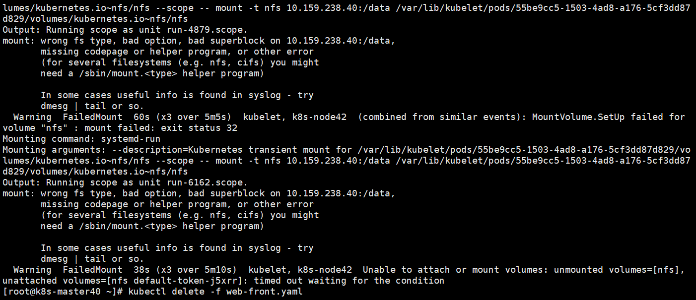

[TOC]


# PV和PVC

# 1 概念

**PersistentVolume（PV）：**持久化存储数据卷，PV其实是对底层存储的一种抽象，通常是由集群的管理员进行创建和配置 ，底层存储可以是Ceph，GlusterFS，NFS，hostpath等，都是通过插件机制完成与共享存储的对接。 与普通的Volume不同，PV是Kubernetes中的一个资源对象，创建一个PV相当于创建了一个存储资源对象，这个资源的使用要通过PVC来请求。

**PV作为存储资源：主要包括存储能力、访问模式、存储类型、回收策略、后端存储类型等关键信息的设置。**

之前提到的Volume是被定义在Pod上的，属于计算资源的一部分，而实际上，网络存储是相对独立于计算资源而存在的一种实体资源。比如在使用虚拟机的情况下，我们通常会先定义一个网络存储，然后从中划出一个“网盘”并挂接到虚拟机上。Persistent Volume（PV）和与之相关联的Persistent Volume Claim（PVC）也起到了类似的作用

PV可以被理解成Kubernetes集群中的某个网络存储对应的一块存储，它与Volume类似，但有以下区别。 

- PV只能是网络存储，不属于任何Node，但可以在每个Node上访问。
- PV并不是被定义在Pod上的，而是独立于Pod之外定义的。 
- PV目前支持的类型包括：
  - GCEPersistentDisk：GCE公有云提供的PersistentDisk。
  - AWSElasticBlockStore：AWS公有云提供的ElasticBlockStore。
  - AzureFile：Azure公有云提供的File。
  - AzureDisk：Azure公有云提供的Disk。 
  - FC（Fibre Channel）：光纤存储设备。 
  - Flocker：一种开源共享存储系统。
  - NFS：网络文件系统。
  - iSCSI：iSCSI存储设备。
  - RBD（Rados Block Device）：Ceph块存储。 
  - CephFS：一种开源共享存储系统。 
  - Cinder
  - GlusterFS：一种开源共享存储系统。 
  - VsphereVolume：VMWare提供的存储系统。
  - Quobyte Volumes
  - VMware Photon
  - Portworx Volumes：Portworx提供的存储服务。 
  - ScaleIO Volumes
  - HostPath：宿主机目录，仅用于单机测试。

**PersistentVolumeClaim（PVC）：**持久化数据卷声明，PVC 对象通常由开发人员创建，描述 Pod 所希望使用的持久化存储的属性。比如，Volume 存储的大小、可读写权限等等。PVC绑定PV，消耗的PV资源。是用户对存储资源PV的请求。根据PVC中指定的条件Kubernetes动态的寻找系统中的PV资源并进行绑定。目前PVC与PV匹配可以通过StorageClassName、matchLabels或者matchExpressions三种方式。权限要求可以请求特定的大小和访问模式。**主要包括存储空间请求、访问模式、PV选择条件和存储类别等信息的设置。**


# 2 PV和PVC的生命周期

PV是群集中的资源。PVC是对这些资源的请求，并且还充当对资源的检查。**PV和PVC之间的相互作用遵循以下生命周期：**

Provisioning ——-> Binding ——–>Using——>Releasing——>Recycling

- **供应准备Provisioning**---通过集群外的存储系统或者云平台来提供存储持久化支持。

  - 静态提供Static：集群管理员创建多个PV。 它们携带可供集群用户使用的真实存储的详细信息。 它们存在于Kubernetes API中，可用于消费。

  - 动态提供Dynamic：当管理员创建的静态PV都不匹配用户的PersistentVolumeClaim时，集群可能会尝试为PVC动态配置卷。 此配置基于StorageClasses：PVC必须请求一个类，并且管理员必须已创建并配置该类才能进行动态配置。 要求该类的声明有效地为自己禁用动态配置。

-  **绑定Binding**---用户创建pvc并指定需要的资源和访问模式。在找到可用pv之前，pvc会保持未绑定状态。

-  **使用Using**---用户可在pod中像volume一样使用pvc。

-  **释放Releasing**---用户删除pvc来回收存储资源，pv将变成“released”状态。由于还保留着之前的数据，这些数据需要根据不同的策略来处理，否则这些存储资源无法被其他pvc使用。

- **回收Recycling**---pv可以设置三种回收策略：保留（Retain），回收（Recycle）和删除（Delete）。

  - 保留策略：允许人工处理保留的数据。

  - 删除策略：将删除pv和外部关联的存储资源，需要插件支持。
  - 回收策略：将执行清除操作，之后可以被新的pvc使用，需要插件支持。

 注：目前只有NFS和HostPath类型卷支持回收策略，AWS EBS,GCE PD,Azure Disk和Cinder支持删除(Delete)策略。


# 3 测试使用


## 3.1 使用NFS

```bash
# 服务端
$ systemctl stop firewalld.service
$ yum -y install nfs-utils rpcbind
$ mkdir -p /data
$ chmod 755 /data
$ vim /etc/exports
/data  10.159.238.0/24(rw,sync,no_root_squash)
$ systemctl enable rpcbind
$ systemctl enable nfs-server
$ systemctl restart rpcbind
$ systemctl restart nfs-server
客户端
$ yum -y install nfs-utils rpcbind
$ mkdir -p /data
$ chmod 755 /data
$ systemctl enable rpcbind
$ systemctl restart rpcbind
$ mount -t nfs 10.159.238.40:/data  /data
```


## 3.2 PV关键参数说明

示例：

```yml
apiVersion: v1
kind: PersistentVolume
metadata:
  name: pv0003
spec:
  capacity:
    storage: 5Gi
  volumeMode: Filesystem
  accessModes:
    - ReadWriteOnce
  persistentVolumeReclaimPolicy: Recycle
  storageClassName: manual
  mountOptions:
    - hard
    - nfsvers=4.1
  nfs:
    path: /tmp
    server: 172.17.0.2
```

PersistentVolume 字段描述如下所示：

| 字段名称                    | 可选项/备注                                                  |
| --------------------------- | ------------------------------------------------------------ |
| Capacity （容量 ）          | 存储大小是可以设置或请求的唯一资源。目前仅支持对存储空间的设置 （storage=xx），将来可能包含IOPS、吞吐率等指标的设置。 |
| Volume Mode（存储卷模式）   | Kubernetes支持`volumeModes`PersistentVolumes中的两个：`Filesystem`和`Block`。`volumeMode`是可选的API参数。 `Filesystem`是`volumeMode`省略参数时使用的默认模式。 |
| Access Modes （访问模式）   | ReadWriteOnce（RWO）：读写权限，并且只能被单个Node挂载 <br />ReadOnlyMany（ROX）：只读权限，允许被多个Node挂载。 <br />ReadWriteMany（RWX）：读写权限，允许被多个Node挂载。 |
| StorageClassName（存储类）  | 带有存储类 StorageClassName 属性的 PersistentVolume 只能绑定到请求该 StorageClass 存储类的 PersistentVolumeClaim。 没有 StorageClassName 属性的 PersistentVolume 只能绑定到无特定 StorageClass 存储类要求的 PVC。 |
| Reclaim Policy （回收策略） | Retain 保留：保留数据，需要手工处理后才可用。<br />Recycle 回收： 清除后重新可用 (rm -rf /thevolume/*)，注意：目前只有 NFS 和 HostPath 两种类型支持回收策略。<br />Delete 删除：删除PV 及存储介质 |
| Mount Options （挂载参数）  | 挂载选项用来在挂载时作为 mount 命令的参数                    |
| Phase（阶段）               | Available：可用的 PV，尚未绑定到 PVC。<br />Bound：已经绑定到 PVC。<br />Released：PVC 已经被删除，但是资源还未被集群回收。<br />Failed：自动回收失败。 |

## 3.3 PVC关键参数说明

示例：

```yml
apiVersion: v1
kind: PersistentVolumeClaim
metadata:
  name: nfs-pvc
spec:
  storageClassName:  manual
  accessModes:
  - ReadWriteMany
  resources:
    requests:
      storage: 2Gi
```

PersistentVolumeClaim 字段描述如下所示：

| 字段名称                   | 可选项/备注                                                  |
| -------------------------- | ------------------------------------------------------------ |
| StorageClassName（存储类） | 只有该 StorageClass 存储类的 PV 才可以绑定到此 PVC           |
| Access Modes （访问模式）  | ReadWriteOnce（RWO）：读写权限，并且只能被单个Node挂载 <br />ReadOnlyMany（ROX）：只读权限，允许被多个Node挂载。 <br />ReadWriteMany（RWX）：读写权限，允许被多个Node挂载。 |
| Volume Modes               | Kubernetes支持`volumeModes`PersistentVolumes中的两个：`Filesystem`和`Block`。`volumeMode`是可选的API参数。 `Filesystem`是`volumeMode`省略参数时使用的默认模式。 |
| storage                    | 请求存储空间的大小。                                         |


## 3.4 创建 PV 文件

vim [nfs-pv.yaml](yaml\nfs-pv.yaml) 

```yml
apiVersion: v1
kind: PersistentVolume
metadata:
  name: nfs
spec:
  storageClassName:  manual
  capacity:
    storage: 5Gi
  accessModes:
    - ReadWriteMany
  nfs:
    server: 10.159.238.40
    path: "/data"
```

创建pv

```bash
$ kubectl create -f nfs-pv.yaml
persistentvolume/nfs created
$ kubectl  get pv
NAME   CAPACITY   ACCESS MODES   RECLAIM POLICY   STATUS      CLAIM   STORAGECLASS   REASON   AGE
nfs    5Gi        RWX            Retain           Available           manual                  13s
```

可以看到创建后的PV的Status为Available 可用状态，意味着当前PV还没有被PVC绑定使用。


## 3.5 创建 PVC 绑定PV

PV 是存储资源，而 PVC 是对 PV 的请求。PVC 跟 Pod 类似：Pod 消费 Node 资源，而 PVC 消费 PV 资源；Pod 能够请求 CPU 和内存资源，而 PVC 请求特定大小和访问模式的数据卷。

vim [nfs-pvc.yaml](yaml\nfs-pvc.yaml) 

```yml
apiVersion: v1
kind: PersistentVolumeClaim
metadata:
  name: nfs-pvc
spec:
  storageClassName:  manual
  accessModes:
  - ReadWriteMany
  resources:
    requests:
      storage: 2Gi
```

```bash
$ kubectl create -f nfs-pvc.yaml
persistentvolumeclaim/nfs-pvc created
$ kubectl  get pv
NAME   CAPACITY   ACCESS MODES   RECLAIM POLICY   STATUS   CLAIM             STORAGECLASS   REASON   AGE
nfs    5Gi        RWX            Retain           Bound    default/nfs-pvc   manual                  8m5s
```

可以看到PV和PVC的状态已经为Bound绑定状态，其中绑定需要检查的条件，包括两部分：

- PV 和 PVC 的 spec 字段。比如，PV 的存储（storage）大小、权限等，必须满足 PVC的要求。
- PV 和 PVC 的 storageClassName 字段必须一样。

PVC与PV绑定时会根据storageClassName（存储类名称）和accessModes（访问模式）判断哪些PV符合绑定需求。然后再根据存储量大小判断，首先PV存储量必须大于或等于PVC声明量；其次就是PV存储量越接近PVC声明量，那么优先级就越高（PV量越小优先级越高）。


## 3.6 创建Pod调用PVC

PVC使用方式和hostpath类似

vim [web-front.yaml](yaml\web-front.yaml) 

```yml
apiVersion: v1
kind: Pod
metadata:
  name: web-front
spec:
  containers:
  - name: web
    image: nginx
    ports:
      - name: web
        containerPort: 80
    volumeMounts:
        - name: nfs
          mountPath: "/usr/share/nginx/html"
  volumes:
  - name: nfs
    persistentVolumeClaim:
      claimName: nfs-pvc
```

Pod将PVC挂载到容器的html目录，我们在PVC的目录下创建一个文件用来验证：

```
echo  "hello nginx" > /data/index.html
```

创建Pod，并验证是否将文件挂载至容器：

```bash
$ kubectl create -f web-front.yaml
$ kubectl exec -it web-front -c web -- curl localhost
hello nginx

```

可以看到输出结果是前面写到PVC卷中的index.html 文件内容。

注意：在创建pod使用nfs的pvc时，node节点必须先挂载nfs，否则会有如下报错

