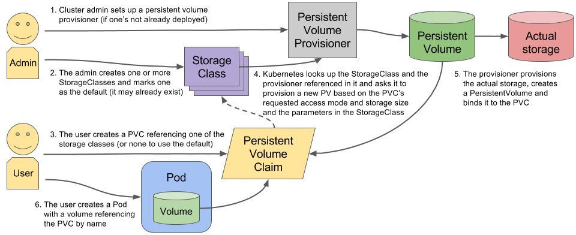

[TOC]


# StorageClass


# 1 StorageClass 介绍

StorageClass作为对存储资源的抽象定义，为管理员提供了描述存储 "类" 的方法。基于StorageClass的动态资源供应模式将逐步成为云平台的标准存储配置模式。StorageClass的定义主要包括名称、后端存储的提供者（provisioner）和后端存储的相关参数配置。StorageClass一旦被创建出来，则将无法修改。如需更改，则只能删除原StorageClass的定义重建。

下例定义了一个名为standard的StorageClass，提供者为aws-ebs，其参数设置了一个type，值为gp2：

```yml
apiVersion: storage.k8s.io/v1
kind: StorageClass
metadata:
  name: standard
provisioner: kubernetes.io/aws-ebs
parameters:
  type: gp2
reclaimPolicy: Retain
allowVolumeExpansion: true
mountOptions:
  - debug
volumeBindingMode: Immediate
```

**StorageClass的作用：**

- 减少了用户对于存储资源细节的关注；
- 减轻了管理员手工管理PV的工作，由系统自动完成PV的创建和绑定，实现了动态的资源供应；

Kubernetes提供了一套可以自动创建PV的机制,即：Dynamic Provisioning。而这个机制的核心在于：StorageClass这个API对象。

**PV/PVC/StorageClass关系图：**


上面PV对象创建的方式为Static Provisioning（静态资源调配），在大规模的生产环境里，面对集群中大量的PVC，需要提前手动创建好PV来与之绑定，这样会有很大的工作量。还好kubernetes提供了Dynamic Provisioning（动态资源调配）的机制，即：StorageClass对象，它的作用其实就是创建 PV 的模板。

StorageClass 对象会定义如下两个部分内容：

- PV 的属性。比如，存储名称、类型、Volume 的大小等等。
- 创建这种 PV 需要用到的provisioner存储插件。比如，Ceph 等等。

Kubernetes 有了这样两个信息之后，就能够根据用户提交的 PVC，找到一个对应的StorageClass，然后Kubernetes 就会调用该 StorageClass 声明的存储插件，自动创建出需要的 PV。


# 2 StorageClass 运行流程

要使用 StorageClass，我们就得安装对应的自动配置程序，例如：存储后端使用的是 nfs，那么我们就需要使用到一个 nfs-client 的自动配置程序，我们也叫它 Provisioner，这个程序使用我们已经配置好的 nfs 服务器，来自动创建持久卷，也就是自动帮我们创建 PV。

**详细的运作流程可以参考下图:**



 **搭建StorageClass+NFS,大致有以下几个步骤:**

```yml
1.创建一个可用的NFS Serve
2.创建Service Account.这是用来管控NFS provisioner在k8s集群中运行的权限
3.创建StorageClass.负责建立PVC并调用NFS provisioner进行预定的工作,并让PV与PVC建立管理
4.创建NFS provisioner.有两个功能,一个是在NFS共享目录下创建挂载点(volume),另一个则是建了PV并将PV与NFS的挂载点建立关联  
```


# 3 StorageClass 关键参数

| 字段名称              | 可选项/备注                                               |
| --------------------- | --------------------------------------------------------- |
| Provisioner（提供者） | 描述存储资源的提供者，也可以看作后端存储驱动。            |
| Parameters（参数）    | 后端存储资源提供者的参数设置，不同的Provisioner包括不同的 |

常见几种存储卷的参数：

**1）AWS EBS存储卷**

```yml
apiVersion: storage.k8s.io/v1
kind: StorageClass
metadata:
  name: slow
provisioner: kubernetes.io/aws-ebs
parameters:
  type: io1
  iopsPerGB: "10"
  fsType: ext4
```

参数说明如下（详细说明请参考AWS EBS文档）。 

- `type`：可选项为io1，gp2，sc1，st1，默认值为gp2。 
- `iopsPerGB`：仅用于io1类型的Volume，意为每秒每GiB的I/O 操作数量。 
- `fsType`：受 Kubernetes 支持的文件类型。默认值：`"ext4"`。
- `encrypted`：是否加密。 
- `kmsKeyId`：加密时的Amazon Resource Name。 

**2）GCE PD存储卷**

```yml
apiVersion: storage.k8s.io/v1
kind: StorageClass
metadata:
  name: slow
provisioner: kubernetes.io/gce-pd
parameters:
  type: pd-standard
   fstype: ext4
  replication-type: none
```

- `type`：`pd-standard` 或者 `pd-ssd`。默认：`pd-standard`
- `zone`(弃用)：GCE 区域。如果没有指定 `zone` 和 `zones`，通常 卷会在 Kubernetes 集群节点所在的活动区域中轮询调度分配。 `zone` 和 `zones` 参数不能同时使用。
- `zones`(弃用)：逗号分隔的 GCE 区域列表。如果没有指定 `zone` 和 `zones`， 通常卷会在 Kubernetes 集群节点所在的活动区域中轮询调度（round-robin）分配。 `zone` 和 `zones` 参数不能同时使用。
- `fstype`: `ext4` 或 `xfs`。 默认: `ext4`。宿主机操作系统必须支持所定义的文件系统类型。
- `replication-type`：`none` 或者 `regional-pd`。默认值：`none`。

**3）Glusterfs存储卷**

```yml
apiVersion: storage.k8s.io/v1
kind: StorageClass
metadata:
  name: slow
provisioner: kubernetes.io/glusterfs
parameters:
  resturl: "http://127.0.0.1:8081"
  clusterid: "630372ccdc720a92c681fb928f27b53f"
  restauthenabled: "true"
  restuser: "admin"
  secretNamespace: "default"
  secretName: "heketi-secret"
  gidMin: "40000"
  gidMax: "50000"
  volumetype: "replicate:3"
```

- `resturl`：制备 gluster 卷的需求的 Gluster REST 服务/Heketi 服务 url。 通用格式应该是 `IPaddress:Port`，这是 GlusterFS 动态制备器的必需参数。 如果 Heketi 服务在 OpenShift/kubernetes 中安装并暴露为可路由服务，则可以使用类似于 `http://heketi-storage-project.cloudapps.mystorage.com` 的格式，其中 fqdn 是可解析的 heketi 服务网址。
- `restauthenabled`：Gluster REST 服务身份验证布尔值，用于启用对 REST 服务器的身份验证。 如果此值为 'true'，则必须填写 `restuser` 和 `restuserkey` 或 `secretNamespace` + `secretName`。 此选项已弃用，当在指定 `restuser`、`restuserkey`、`secretName` 或 `secretNamespace` 时，身份验证被启用。
- `restuser`：在 Gluster 可信池中有权创建卷的 Gluster REST服务/Heketi 用户。
- `restuserkey`：Gluster REST 服务/Heketi 用户的密码将被用于对 REST 服务器进行身份验证。 此参数已弃用，取而代之的是 `secretNamespace` + `secretName`。

- `secretNamespace`，`secretName`：Secret 实例的标识，包含与 Gluster REST 服务交互时使用的用户密码。 这些参数是可选的，`secretNamespace` 和 `secretName` 都省略时使用空密码。 所提供的 Secret 必须将类型设置为 "kubernetes.io/glusterfs"，例如以这种方式创建：

- ```
  kubectl create secret generic heketi-secret \
    --type="kubernetes.io/glusterfs" --from-literal=key='opensesame' \
    --namespace=default
  ```

  Secret 的例子可以在 [glusterfs-provisioning-secret.yaml](https://github.com/kubernetes/examples/tree/master/staging/persistent-volume-provisioning/glusterfs/glusterfs-secret.yaml) 中找到。

- `clusterid`：`630372ccdc720a92c681fb928f27b53f` 是集群的 ID，当制备卷时， Heketi 将会使用这个文件。它也可以是一个 clusterid 列表，例如： `"8452344e2becec931ece4e33c4674e4e,42982310de6c63381718ccfa6d8cf397"`。这个是可选参数。
- `gidMin`，`gidMax`：StorageClass GID 范围的最小值和最大值。 在此范围（gidMin-gidMax）内的唯一值（GID）将用于动态制备卷。这些是可选的值。 如果不指定，所制备的卷为一个 2000-2147483647 之间的值，这是 gidMin 和 gidMax 的默认值。

- `volumetype`：卷的类型及其参数可以用这个可选值进行配置。如果未声明卷类型，则 由制备器决定卷的类型。 例如：
  - 'Replica volume': `volumetype: replicate:3` 其中 '3' 是 replica 数量.
  - 'Disperse/EC volume': `volumetype: disperse:4:2` 其中 '4' 是数据，'2' 是冗余数量.
  - 'Distribute volume': `volumetype: none`


# 4 StorageClass动态卷使用

==**前提是已经创建了NFS可以使用，并且客户端已经挂载共享目录。**==

## 4.1 创建 NFS

**当前环境NFS server及共享目录信息**

```yml
IP: 10.159.238.40
Export PATH: /data
```


## 4.2 创建 NFS provisioner

（1）创建一个NFS类型的StorageClass，首先需要创建 nfs-client-provisioner（存储插件）：nfs-client 的自动配置程序

 [nfs-client-provisioner.yaml](storageclass\nfs-client-provisioner.yaml) 

```yml
apiVersion: apps/v1
kind: Deployment
metadata:
  name: nfs-client-provisioner
  labels:
    app: nfs-client-provisioner
spec:
  replicas: 1
  strategy:
    type: Recreate
  selector:
    matchLabels:
      app: nfs-client-provisioner
  template:
    metadata:
      labels:
        app: nfs-client-provisioner
    spec:
      serviceAccountName: nfs-client-provisioner
      containers:
        - name: nfs-client-provisioner
          image: quay.io/external_storage/nfs-client-provisioner:latest
          volumeMounts:
            - name: nfs-client-root
              mountPath: /persistentvolumes
          env:
            - name: PROVISIONER_NAME
              value: fuseim.pri/ifs
            - name: NFS_SERVER
              value: 10.159.238.40 # 修改成自己的 IP
            - name: NFS_PATH
              value: /data
      volumes:
        - name: nfs-client-root
          nfs:
            server: 10.159.238.40 # 修改成自己的 IP
            path: /data

```

## 4.3 为 nfs-client授权

给nfs-client绑定相应的集群操作权限。

[nfs-client-sa.yaml](storageclass\nfs-client-sa.yaml) 

```yml
apiVersion: v1
kind: ServiceAccount
metadata:
  name: nfs-client-provisioner
  namespace: default  #根据实际环境设定namespace,下面类同
---
kind: ClusterRole
apiVersion: rbac.authorization.k8s.io/v1
metadata:
  name: nfs-client-provisioner-runner
rules:
  - apiGroups: [""]
    resources: ["persistentvolumes"]
    verbs: ["get", "list", "watch", "create", "delete"]
  - apiGroups: [""]
    resources: ["persistentvolumeclaims"]
    verbs: ["get", "list", "watch", "update"]
  - apiGroups: ["storage.k8s.io"]
    resources: ["storageclasses"]
    verbs: ["get", "list", "watch"]
  - apiGroups: [""]
    resources: ["events"]
    verbs: ["list", "watch", "create", "update", "patch"]
  - apiGroups: [""]
    resources: ["endpoints"]
    verbs: ["create", "delete", "get", "list", "watch", "patch", "update"]

---
kind: ClusterRoleBinding
apiVersion: rbac.authorization.k8s.io/v1
metadata:
  name: run-nfs-client-provisioner
subjects:
  - kind: ServiceAccount
    name: nfs-client-provisioner
    namespace: default
roleRef:
  kind: ClusterRole
  name: nfs-client-provisioner-runner
  apiGroup: rbac.authorization.k8s.io
```


## 4.4 创建 StorageClass

 [nfs-storageclass.yaml](storageclass\nfs-storageclass.yaml) 

```yml
apiVersion: storage.k8s.io/v1
kind: StorageClass
metadata:
  name: nfs-data-db   #这里的名称要和provisioner配置文件中的环境变量PROVISIONER_NAME保持一致
provisioner: fuseim.pri/ifs
parameters:
  archiveOnDelete: "ture"
reclaimPolicy: delete
```

> provisioner 字段的值是：fuseim.pri/ifs，这个是NFS提供的分配器，kubernetes也内置了一些存储的分配器：
>
> https://kubernetes.io/zh/docs/concepts/storage/storage-classes/

创建资源对象

```bash
$ kubectl  create -f  nfs-client-provisioner.yaml
$ kubectl  create -f  nfs-client-sa.yaml
$ kubectl  create -f  nfs-storageclass.yaml
$ kubectl get  sc或者storageclasses
NAME         PROVISIONER      RECLAIMPOLICY   VOLUMEBINDINGMODE   ALLOWVOLUMEEXPANSION   AGE
nfs-data-db   fuseim.pri/ifs   Delete          Immediate           false                  5m4s
```

StorageClass创建完成后，开发人员只需要在 PVC 里指定要使用的 StorageClass 名字即可，PV则会根据PVC的属性定义自动创建。

## 4.5 创建 PVC 请求文件

 [nfs-pvc02.yaml](storageclass\nfs-pvc02.yaml) 

```yml
apiVersion: v1
kind: PersistentVolumeClaim
metadata:
  name: nfs-pvc02
spec:
  accessModes:
    - ReadWriteOnce
  storageClassName: nfs-data-db
  resources:
    requests:
      storage: 1Gi
```

创建PVC并查看是否绑定相应的PV

```bash
$ kubectl  create  -f  nfs-pvc02.yaml
persistentvolumeclaim/nfs-pvc02 created
# 确保PVC状态为Bound

$ kubectl get pvc
NAME        STATUS   VOLUME                                     CAPACITY   ACCESS MODES   STORAGECLASS   AGE
nfs-pvc02   Bound    pvc-14781067-3b87-4e5f-950b-4b30807057c5   1Gi        RWO            nfs-data-db    6s

$ kubectl get pv
NAME  CAPACITY   ACCESS MODES   RECLAIM POLICY   STATUS      CLAIM    STORAGECLASS   REASON   AGE
pvc-14781067-3b87-4e5f-950b-4b30807057c5 1Gi RWO Delete  Bound  default/nfs-pvc02 nfs-data-db  3s

$ ls /data/
default-nfs-pvc02-pvc-14781067-3b87-4e5f-950b-4b30807057c5
#文件规则是按照${namespace}-${pvcName}-${pvName}创建的
```


可以看到创建完PVC后，StorageClass自动为PVC创建并绑定了对应的PV，而且PV的属性是和PVC相同的，在共享卷中也创建了相关的PV目录，这样我们创建Pod时只需要指定PVC的名字即可，不用再去手动的为PVC创建PV。

> **注意：Kubernetes 只会将StorageClass 定义相同的 PVC 和 PV 绑定起来。**


## 4.6 创建Pod进行挂载测试

 [test-pod.yaml](storageclass\test-pod.yaml) 

```yml
kind: Pod
apiVersion: v1
metadata:
  name: test-pod
spec:
  containers:
  - name: test-pod
    image: busybox:1.24
    command:
      - "/bin/sh"
    args:
      - "-c"
      - "touch /mnt/SUCCESS && exit 0 || exit 1"   #创建一个SUCCESS文件后退出
    volumeMounts:
      - name: nfs-pvc
        mountPath: "/mnt"
  restartPolicy: "Never"
  volumes:
    - name: nfs-pvc
      persistentVolumeClaim:
        claimName: nfs-pvc02  #与PVC名称保持一致
```

检查结果：共享目录下会有SUCCESS文件

```sh
$ kubectl create -f test-pod.yaml
$ ls /data/default-nfs-pvc02-pvc-55a34c4f-f21b-4aaf-a09e-bcf90596c8c5/
SUCCESS
```


# 5 StorageClass回收策略

通过存储类创建的持久化存储卷通过reclaimPolicy参数来指定，它的值可以是Delete或者Retain，默认为Delete，意味着 PV 被删除后，原始数据也会被删除。对于通过手工创建的，并使用存储类进行管理的持久化存储卷，将使用任何在创建时指定的存储卷。


## 5.1 StorageClass回收策略对数据影响

**1.第一种配置**

```
   archiveOnDelete: "false"  
   reclaimPolicy: Delete   #默认没有配置,默认值为Delete
```

**测试结果:**

```
1.pod删除重建后数据依然存在,旧pod名称及数据依然保留给新pod使用
2.sc删除重建后数据依然存在,旧pod名称及数据依然保留给新pod使用
3.删除PVC后,PV被删除且NFS Server对应数据被删除
```

**2**.第二种配置

```
   archiveOnDelete: "false"  
   reclaimPolicy: Retain  
```

**测试结果:**

```
1.pod删除重建后数据依然存在,旧pod名称及数据依然保留给新pod使用
2.sc删除重建后数据依然存在,旧pod名称及数据依然保留给新pod使用
3.删除PVC后,PV不会别删除,且状态由Bound变为Released,NFS Server对应数据被保留
4.重建sc后,新建PVC会绑定新的pv,旧数据可以通过拷贝到新的PV中
```

**3.第三种配置**

```
   archiveOnDelete: "ture"  
   reclaimPolicy: Retain  
```

**结果:**

```
1.pod删除重建后数据依然存在,旧pod名称及数据依然保留给新pod使用
2.sc删除重建后数据依然存在,旧pod名称及数据依然保留给新pod使用
3.删除PVC后,PV不会别删除,且状态由Bound变为Released,NFS Server对应数据被保留
4.重建sc后,新建PVC会绑定新的pv,旧数据可以通过拷贝到新的PV中
```

**4.第四种配置**

```
  archiveOnDelete: "ture"  
  reclaimPolicy: Delete  
```

**结果:**

```
1.pod删除重建后数据依然存在,旧pod名称及数据依然保留给新pod使用
2.sc删除重建后数据依然存在,旧pod名称及数据依然保留给新pod使用
3.删除PVC后,PV不会别删除,且状态由Bound变为Released,NFS Server对应数据被保留
4.重建sc后,新建PVC会绑定新的pv,旧数据可以通过拷贝到新的PV中
```

**总结:除以第一种配置外,其他三种配置在PV/PVC被删除后数据依然保留**


## 5.2 设置默认的StorageClass

**用 kubectl patch 命令来更新：**

```yaml
$ kubectl get sc
NAME          PROVISIONER      RECLAIMPOLICY   VOLUMEBINDINGMODE   ALLOWVOLUMEEXPANSION   AGE
nfs-data-db   fuseim.pri/ifs   Delete          Immediate           false                  2d22h

$ kubectl patch storageclass nfs-data-db -p '{"metadata": {"annotations":{"storageclass.kubernetes.io/is-default-class":"true"}}}' #设置nfs-data-db为默认后端存储

$ kubectl get sc
NAME                    PROVISIONER      RECLAIMPOLICY   VOLUMEBINDINGMODE   ALLOWVOLUMEEXPANSION   AGE
nfs-data-db (default)   fuseim.pri/ifs   Delete          Immediate           false                  2d22h
```

YAML文件设置

```yaml
apiVersion: storage.k8s.io/v1
kind: StorageClass
metadata:
  name: nfs-data-db
  annotations:
    "storageclass.kubernetes.io/is-default-class": "true"   #添加此注释
provisioner: nfs-client-provisioner #or choose another name, must match deployment's env PROVISIONER_NAME'
parameters:
  archiveOnDelete: "false"
```


**总结：**

1. hostPath：属于单节点集群中的持久化存储，Pod需要绑定集群节点。删除pod后，卷里面的文件会继续保持，但pod被重新调度到其他节点时，就无法访问到原数据。不适合作为存储数据库数据的目录。
2. emptyDir： 用于存储临时数据的简单空目录，生命周期是和pod捆绑的，随着pod创建而创建；删除而销毁，卷的内容将会丢失。emptyDir卷适用于同一个pod中运行的容器之间共享文件。
3. PVC 描述的，是 Pod 想要使用的持久化存储的属性，比如存储的大小、读写权限等。
4. PV 描述的，则是一个具体的 Volume 的属性，比如 Volume 的类型、挂载目录、远程存储服务器地址等。
5. StorageClass 的作用，则是充当 PV 的模板。并且，只有同属于一个 StorageClass 的 PV 和 PVC，才可以绑定在一起。当然，StorageClass 的另一个重要作用，是指定 PV 的 Provisioner（存储插件）。这时候，如果你的存储插件支持 Dynamic Provisioning 的话，Kubernetes 就可以自动为你创建 PV 了。

