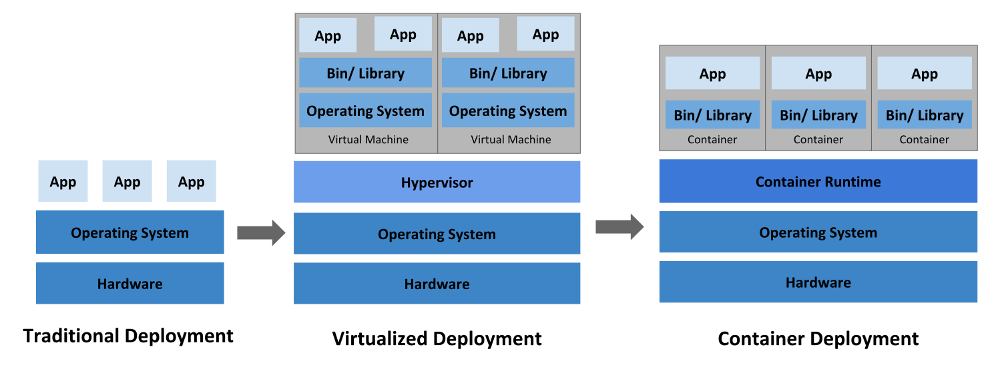

[TOC]

# kubernetes介绍

# 1 kubernets是什么

官网地址：<https://kubernetes.io/>

Kubernetes是一个可移植的，可扩展的开源平台，用于管理容器化的工作负载和服务，可促进声明式配置和自动化。它拥有一个庞大且快速增长的生态系统。Kubernetes的服务，支持和工具广泛可用。

**与传统部署方式对比：**

**传统部署时代：** 早期，公司都在物理服务器上运行应用程序。无法为物理服务器中的应用程序定义资源边界，这会导致资源分配问题。例如，如果在物理服务器上运行多个应用程序，则可能会出现一个应用程序占用大部分资源的情况，结果，另一个应用程序的性能将下降。解决方案是在不同的物理服务器上运行每个应用程序。但这并没有随着资源利用不足而扩展，并且组织维护许多物理服务器的成本很高。

**虚拟化部署时代：**作为解决方案，引入了虚拟化。它允许您在单个物理服务器的CPU上运行多个虚拟机（VM）。虚拟化允许在VM之间隔离应用程序，并提供安全级别，因为一个应用程序的信息不能被另一应用程序自由访问。

虚拟化可以更好地利用物理服务器中的资源，并具有更好的可伸缩性，因为可以轻松地添加或更新应用程序，降低硬件成本等等。借助虚拟化，您可以将一组物理资源呈现为一组一次性虚拟机。

每个VM都是一台完整的计算机，在虚拟化硬件之上运行所有组件，包括其自己的操作系统。

**容器部署时代：**容器类似于VM，但是它们具有轻松的隔离属性，可以在应用程序之间共享操作系统（OS）。因此，容器被认为是轻质的。与VM相似，容器具有自己的文件系统，CPU，内存，进程空间等的共享。由于它们与基础架构分离，因此可以跨云和OS分发进行移植。

==**容器的优势：持续集成、版本控制、可移植性、隔离性和安全性。**==

# 2 kubernetes组件

Kubernetes属于主从分布式架构，主要由Master Node和Worker Node组成，以及包括客户端命令行工具kubectl和其它附加项。

**Master Node组成：**

- **API server：**提供了资源操作的唯一入口，并提供认证、授权、访问控制、API注册和发现等机制；

- **Controller-manager：**负责维护集群的状态，可以创建和管理多个Pod，提供副本管理、滚动升级和集群级别的自愈能力。例如，如果一个Node故障，Controller就能自动将该节点上的Pod调度到其他健康的Node上；

- **scheduler**：负责资源的调度，按照预定的调度策略将Pod调度到相应的机器上；
- **etcd：**键值对数据库，用于保存集群所有的网络配置和对象的状态信息；

**Worker Node组成：**

- **kubelet**：负责维护容器的生命周期，同时也负责Volume（CVI）和网络（CNI）的管理；

- **kube-proxy：**负责为Service提供cluster内部的服务发现和负载均衡；

- **Container Runtime：**是Kubernetes最重要的组件之一，负责真正管理镜像和容器的生命周期。Kubelet通过 容器运行时接口（Container Runtime Interface，CRI) 与容器运行时交互，以管理镜像和容器。；

**常见附加项组成：**

在Kunbernetes中可以以附加项的方式扩展Kubernetes的功能，目前主要有网络、服务发现和可视化这三大类的附加项，下面是可用的一些附加项：

网络和网络策略：

- ACI 通过与Cisco ACI集成的容器网络和网络安全。
- Calico 是一个安全的3层网络和网络策略提供者。
- Canal 联合Fannel和Calico，通过网络和网络侧。
- Cilium 是一个3层网络和网络侧插件，它能够透明的加强HTTP/API/L7 策略。其即支持路由，也支持overlay/encapsultion模式。
- Flannel 是一个overlay的网络提供者。

服务发现：

- CoreDNS 是一个灵活的，可扩展的DNS服务器，它能够作为Pod集群内的DNS进行安装。
- Ingress 提供基于Http协议的路由转发机制。

可视化&控制：

- Dashboard 是Kubernetes的web用户界面。

# 3 kubernetes工作流程

1. 准备好一个包含应用程序的Deployment的yml文件，然后通过kubectl客户端工具发送给ApiServer；
2. ApiServer接收到客户端的请求，不会去直接创建pod，而是生成一个包含创建信息的yaml，并将信息存储到数据库(etcd)中；
3. Controller Manager通过list-watch机制，监测发现新的deployment，将该资源加入到内部工作队列；
4. Controller Manager发现该资源没有关联的pod和replicaset，启用 deployment controller创建replicaset资源，deployment controller创建完成后，将deployment，replicaset，pod资源信息更新存储到etcd；
5. ReplicaSet controller检查etcd数据库变化，通过Pod Template来创建期望数量的pod实例（未运行容器）；
6. Scheduler通过list-watch机制，发现尚未被分配的Pod；
7. Scheduler经过主机过滤、主机打分规则，将pod分配到可以运行它们的节点上，并将绑定结果更新到etcd数据库，记录pod分配情况；
8. Kubelet监控数据库变化，获取到分配到其所在节点的Pod信息；
9. Kubelet调用CNI（Docker 运行或通过 rkt)创建 Pod 中的容器；
10. Docker运行container容器；
11. kuberproxy运行在集群各个主机上，管理网络通信，如服务发现、负载均衡。为新创建的pod注册动态DNS到CoreOS。给pod的service添加iptables/ipvs规则，用于服务发现和负载均衡。
12. controller通过control loop（控制循环）将当前pod状态与用户所期望的状态做对比，如果当前状态与用户期望状态不同，则controller会将pod修改为用户期望状态，实在不行会将此pod删掉，然后重新创建pod。

# 4 kubernetes主要功能

| 名词             | 解释                                                         |
| ---------------- | ------------------------------------------------------------ |
| 数据卷           | Pod中容器之间共享数据，可以使用数据卷。                      |
| 应用程序健康检查 | 容器内服务可能进程堵塞无法处理请求，可以设置监控检查策略保证应用健壮性。 |
| 复制应用程序实例 | 控制器维护着Pod副本数量，保证一个Pod或一组同类的Pod数量始终可用。 |
| 弹性伸缩         | 根据设定的指标（CPU利用率）自动缩放Pod副本数。               |
| 服务发现         | 使用环境变量或DNS服务插件保证容器中程序发现Pod入口访问地址。 |
| 负载均衡         | 一组Pod副本分配一个私有的集群IP地址，负载均衡转发请求到后端容器。在集群内部其他Pod可通过这个ClusterIP访问应用。 |
| 滚动更新         | 更新服务不中断，一次更新一个Pod，而不是同时删除整个服务。    |
| 服务编排         | 通过文件描述部署服务，使得应用程序部署变得更高效。           |
| 资源监控         | Node节点组件集成cAdvisor资源收集工具，可通过Heapster汇总整个集群节点资源数据，然后存储到InfluxDB时序数据库，再由Grafana展示。 |
| 提供认证和授权   | 支持角色访问控制（RBAC）认证授权等策略。                     |

# 5 kubernetes优势

**1.用户体验效果好，可以快速上手操作：**

拥有良好的web ui界面，可以实现应用程序的快速部署，升级，扩容，缩容，回滚等。

**2.根据节点资源的使用情况对pod进行合理的调度：**

可以按照用户需要调度pod，例如保证Pod只在资源足够的节点上运行，会尝试把同一功能的pod分散在不同的节点上，还会尝试平衡不同节点的资源使用率等。

**3.灵活部署：**

支持多种平台，如公有云、私有云、混合云，VMware vSphere、VMware Workstation、虚拟机、物理机等。

**4.完善的认证授权机制，自带审计功能：**

可以对多用户做细化的授权管理，达到相互之间的操作完全隔离，互不影响，而且自身带有审计功能，可以对操作过程进行实时的日志记录，出现问题可以方便排查。

**5.可扩展性强：**

拥有强大的集群扩展能力，可以根据业务规模自动增加和缩减主机节点的数量，确保服务可以承受大量并发带来的压力，保证业务稳定运行。

**6.拥有完善的灾备预警解决方案：**

拥有多种灾备解决方案，支持备份和容灾，出现故障可以达到秒级切换，保证线上业务不受影响。

**7.支持windows节点：**

kubernetes支持将windows节点添加为工作节点并部署windows容器，确保不再受到具体的操作系统类型的影响，提升整体部署的效率。