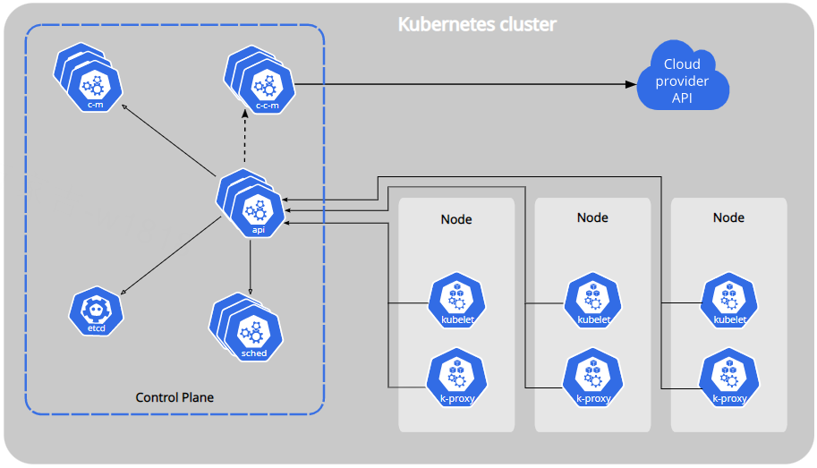
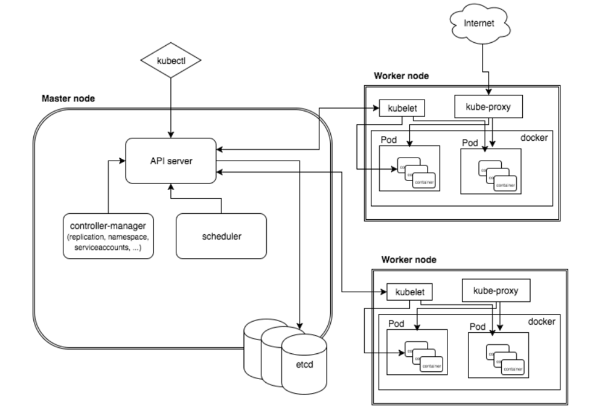
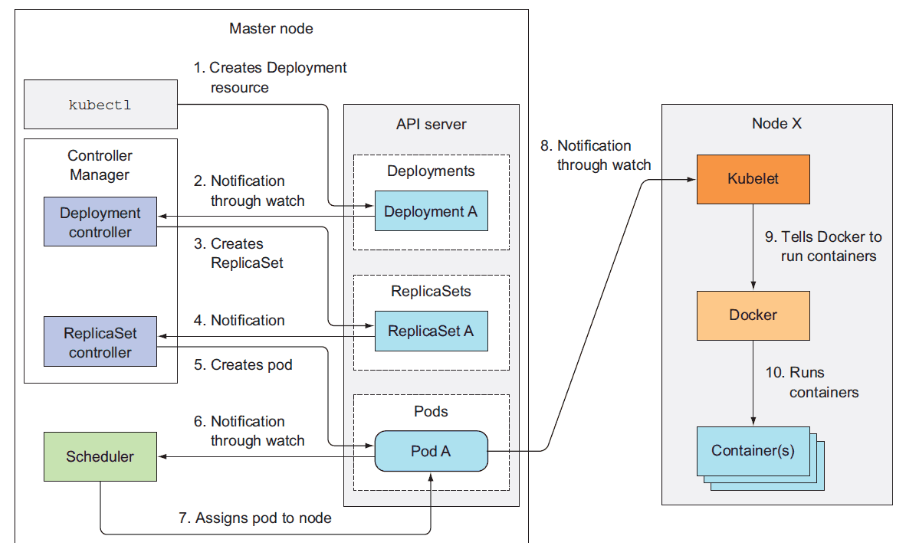

[TOC]

# Kubernetes介绍

# 1 介绍

官网地址：<https://kubernetes.io/>

**Kubernetes** 这个名字源于希腊语，意为“舵手”或“飞行员”。k8s 这个缩写是因为 k 和 s 之间有八个字符的关系。 Google 在 2014 年开源了 Kubernetes 项目。 Kubernetes 建立在 [Google 大规模运行生产工作负载十几年经验](https://research.google/pubs/pub43438)的基础上， 结合了社区中最优秀的想法和实践。

Kubernetes是一个可移植的，可扩展的开源平台，用于管理容器化的工作负载和服务，可促进声明式配置和自动化。它拥有一个庞大且快速增长的生态系统。Kubernetes的服务，支持和工具广泛可用。

**与传统部署方式对比：**

**传统部署时代：** 早期，公司都在物理服务器上运行应用程序。无法为物理服务器中的应用程序定义资源边界，这会导致资源分配问题。例如，如果在物理服务器上运行多个应用程序，则可能会出现一个应用程序占用大部分资源的情况，结果，另一个应用程序的性能将下降。解决方案是在不同的物理服务器上运行每个应用程序。但这并没有随着资源利用不足而扩展，并且组织维护许多物理服务器的成本很高。

**虚拟化部署时代：**作为解决方案，引入了虚拟化。它允许您在单个物理服务器的CPU上运行多个虚拟机（VM）。虚拟化允许在VM之间隔离应用程序，并提供安全级别，因为一个应用程序的信息不能被另一应用程序自由访问。

虚拟化可以更好地利用物理服务器中的资源，并具有更好的可伸缩性，因为可以轻松地添加或更新应用程序，降低硬件成本等等。借助虚拟化，您可以将一组物理资源呈现为一组一次性虚拟机。

每个VM都是一台完整的计算机，在虚拟化硬件之上运行所有组件，包括其自己的操作系统。

**容器部署时代：**容器类似于VM，但是它们具有轻松的隔离属性，可以在应用程序之间共享操作系统（OS）。因此，容器被认为是轻质的。与VM相似，容器具有自己的文件系统，CPU，内存，进程空间等的共享。由于它们与基础架构分离，因此可以跨云和OS分发进行移植。

==**容器的优势：持续集成、版本控制、可移植性、隔离性和安全性。**==

容器因具有许多优势而变得流行起来，例如：

- 敏捷应用程序的创建和部署：与使用 VM 镜像相比，提高了容器镜像创建的简便性和效率。
- 持续开发、集成和部署：通过快速简单的回滚（由于镜像不可变性）， 提供可靠且频繁的容器镜像构建和部署。
- 关注开发与运维的分离：在构建、发布时创建应用程序容器镜像，而不是在部署时， 从而将应用程序与基础架构分离。
- 可观察性：不仅可以显示 OS 级别的信息和指标，还可以显示应用程序的运行状况和其他指标信号。
- 跨开发、测试和生产的环境一致性：在笔记本计算机上也可以和在云中运行一样的应用程序。
- 跨云和操作系统发行版本的可移植性：可在 Ubuntu、RHEL、CoreOS、本地、 Google Kubernetes Engine 和其他任何地方运行。
- 以应用程序为中心的管理：提高抽象级别，从在虚拟硬件上运行 OS 到使用逻辑资源在 OS 上运行应用程序。
- 松散耦合、分布式、弹性、解放的微服务：应用程序被分解成较小的独立部分， 并且可以动态部署和管理 - 而不是在一台大型单机上整体运行。
- 资源隔离：可预测的应用程序性能。
- 资源利用：高效率和高密度。

## 1.1 Kubernetes能做什么

容器是打包和运行应用程序的好方式。在生产环境中， 你需要管理运行着应用程序的容器，并确保服务不会下线。 例如，如果一个容器发生故障，则你需要启动另一个容器。 如果此行为交由给系统处理，是不是会更容易一些？

这就是 Kubernetes 要来做的事情！ Kubernetes 为你提供了一个可弹性运行分布式系统的框架。 Kubernetes 会满足你的扩展要求、故障转移你的应用、提供部署模式等。 例如，Kubernetes 可以轻松管理系统的 Canary (金丝雀) 部署。

Kubernetes 为你提供：

- **服务发现和负载均衡**

  Kubernetes 可以使用 DNS 名称或自己的 IP 地址来暴露容器。 如果进入容器的流量很大， Kubernetes 可以负载均衡并分配网络流量，从而使部署稳定。

- **存储编排**

  Kubernetes 允许你自动挂载你选择的存储系统，例如本地存储、公共云提供商等。

- **自动部署和回滚**

  你可以使用 Kubernetes 描述已部署容器的所需状态， 它可以以受控的速率将实际状态更改为期望状态。 例如，你可以自动化 Kubernetes 来为你的部署创建新容器， 删除现有容器并将它们的所有资源用于新容器。

- **自动完成装箱计算**

  你为 Kubernetes 提供许多节点组成的集群，在这个集群上运行容器化的任务。 你告诉 Kubernetes 每个容器需要多少 CPU 和内存 (RAM)。 Kubernetes 可以将这些容器按实际情况调度到你的节点上，以最佳方式利用你的资源。

- **自我修复**

  Kubernetes 将重新启动失败的容器、替换容器、杀死不响应用户定义的运行状况检查的容器， 并且在准备好服务之前不将其通告给客户端。

- **密钥与配置管理**

  Kubernetes 允许你存储和管理敏感信息，例如密码、OAuth 令牌和 ssh 密钥。 你可以在不重建容器镜像的情况下部署和更新密钥和应用程序配置，也无需在堆栈配置中暴露密钥。

## 1.2 Kubernetes不是什么

Kubernetes 不是传统的、包罗万象的 PaaS（平台即服务）系统。 由于 Kubernetes 是在容器级别运行，而非在硬件级别，它提供了 PaaS 产品共有的一些普遍适用的功能， 例如部署、扩展、负载均衡，允许用户集成他们的日志记录、监控和警报方案。 但是，Kubernetes 不是单体式（monolithic）系统，那些默认解决方案都是可选、可插拔的。 Kubernetes 为构建开发人员平台提供了基础，但是在重要的地方保留了用户选择权，能有更高的灵活性。

Kubernetes：

- 不限制支持的应用程序类型。 Kubernetes 旨在支持极其多种多样的工作负载，包括无状态、有状态和数据处理工作负载。 如果应用程序可以在容器中运行，那么它应该可以在 Kubernetes 上很好地运行。
- 不部署源代码，也不构建你的应用程序。 持续集成（CI）、交付和部署（CI/CD）工作流取决于组织的文化和偏好以及技术要求。
- 不提供应用程序级别的服务作为内置服务，例如中间件（例如消息中间件）、 数据处理框架（例如 Spark）、数据库（例如 MySQL）、缓存、集群存储系统 （例如 Ceph）。这样的组件可以在 Kubernetes 上运行，并且/或者可以由运行在 Kubernetes 上的应用程序通过可移植机制（例如[开放服务代理](https://openservicebrokerapi.org/)）来访问。

- 不是日志记录、监视或警报的解决方案。 它集成了一些功能作为概念证明，并提供了收集和导出指标的机制。
- 不提供也不要求配置用的语言、系统（例如 jsonnet），它提供了声明性 API， 该声明性 API 可以由任意形式的声明性规范所构成。
- 不提供也不采用任何全面的机器配置、维护、管理或自我修复系统。
- 此外，Kubernetes 不仅仅是一个编排系统，实际上它消除了编排的需要。 编排的技术定义是执行已定义的工作流程：首先执行 A，然后执行 B，再执行 C。 而 Kubernetes 包含了一组独立可组合的控制过程，可以持续地将当前状态驱动到所提供的预期状态。 你不需要在乎如何从 A 移动到 C，也不需要集中控制，这使得系统更易于使用且功能更强大、 系统更健壮，更为弹性和可扩展。

# 2 Kubernetes组件

A Kubernetes cluster consists of 一组工作机器，称为 [节点](https://kubernetes.io/zh-cn/docs/concepts/architecture/nodes/)， 会运行容器化应用程序。每个集群至少有一个工作节点。

工作节点会托管 [Pod](https://kubernetes.io/zh-cn/docs/concepts/workloads/pods/) ，而 Pod 就是作为应用负载的组件。 [控制平面](https://kubernetes.io/zh-cn/docs/reference/glossary/?all=true#term-control-plane)管理集群中的工作节点和 Pod。 在生产环境中，控制平面通常跨多台计算机运行， 一个集群通常运行多个节点，提供容错性和高可用性。

This document outlines the various components you need to have for a complete and working Kubernetes cluster.

Kubernetes属于主从分布式架构，主要由Master Node和Worker Node组成，以及包括客户端命令行工具kubectl和其它附加项。

## 2.1 Master Node组件

### 2.1.1 kube-apiserver

API 服务器是 Kubernetes 控制平面的组件， 该组件负责公开了 Kubernetes API，负责处理接受请求的工作。 API 服务器是 Kubernetes 控制平面的前端。==提供了资源操作的唯一入口，并提供认证、授权、访问控制、API注册和发现等机制；==

### 2.1.2 etcd

一致且高可用的键值存储，用作 Kubernetes 所有集群数据的后台数据库。==例如：保存集群所有的网络配置和对象的状态信息；==

如果你的 Kubernetes 集群使用 etcd 作为其后台数据库， 请确保你针对这些数据有一份 [备份](https://kubernetes.io/zh-cn/docs/tasks/administer-cluster/configure-upgrade-etcd/#backing-up-an-etcd-cluster)计划。

你可以在官方[文档](https://etcd.io/docs/)中找到有关 etcd 的深入知识。

### 2.1.3 kube-scheduler

`kube-scheduler` 是[控制平面](https://kubernetes.io/zh-cn/docs/reference/glossary/?all=true#term-control-plane)的组件， 负责监视新创建的、未指定运行[节点（node）](https://kubernetes.io/zh-cn/docs/concepts/architecture/nodes/)的 [Pods](https://kubernetes.io/zh-cn/docs/concepts/workloads/pods/)， 并选择节点来让 Pod 在上面运行。

调度决策考虑的因素包括单个 Pod 及 Pods 集合的资源需求、软硬件及策略约束、 亲和性及反亲和性规范、数据位置、工作负载间的干扰及最后时限。负责资源的调度，按照预定的调度策略将Pod调度到相应的机器上；

### 2.1.4 kube-controller-manager

[kube-controller-manager](https://kubernetes.io/zh-cn/docs/reference/command-line-tools-reference/kube-controller-manager/) 是[控制平面](https://kubernetes.io/zh-cn/docs/reference/glossary/?all=true#term-control-plane)的组件， 负责运行[控制器](https://kubernetes.io/zh-cn/docs/concepts/architecture/controller/)进程。==维护集群的状态，可以创建和管理多个Pod，提供副本管理、滚动升级和集群级别的自愈能力。例如，如果一个Node故障，Controller就能自动将该节点上的Pod调度到其他健康的Node上。==

从逻辑上讲， 每个[控制器](https://kubernetes.io/zh-cn/docs/concepts/architecture/controller/)都是一个单独的进程， 但是为了降低复杂性，它们都被编译到同一个可执行文件，并在同一个进程中运行。

这些控制器包括：

- 节点控制器（Node Controller）：负责在节点出现故障时进行通知和响应
- 任务控制器（Job Controller）：监测代表一次性任务的 Job 对象，然后创建 Pods 来运行这些任务直至完成
- 端点分片控制器（EndpointSlice controller）：填充端点分片（EndpointSlice）对象（以提供 Service 和 Pod 之间的链接）。
- 服务账号控制器（ServiceAccount controller）：为新的命名空间创建默认的服务账号（ServiceAccount）。

## 2.2 Node 组件

节点组件会在每个节点上运行，负责维护运行的 Pod 并提供 Kubernetes 运行环境。

### 2.2.1 kubelet

`kubelet` 会在集群中每个[节点（node）](https://kubernetes.io/zh-cn/docs/concepts/architecture/nodes/)上运行。 它保证[容器（containers）](https://kubernetes.io/zh-cn/docs/concepts/overview/what-is-kubernetes/#why-containers)都运行在 [Pod](https://kubernetes.io/zh-cn/docs/concepts/workloads/pods/) 中。==负责维护容器的生命周期，同时也负责Volume（CVI）和网络（CNI）的管理。==

kubelet 接收一组通过各类机制提供给它的 PodSpecs， 确保这些 PodSpecs 中描述的容器处于运行状态且健康。 kubelet 不会管理不是由 Kubernetes 创建的容器。

### 2.2.2 kube-proxy

[kube-proxy](https://kubernetes.io/zh-cn/docs/reference/command-line-tools-reference/kube-proxy/) 是集群中每个[节点（node）](https://kubernetes.io/zh-cn/docs/concepts/architecture/nodes/)上所运行的网络代理， 实现 Kubernetes [服务（Service）](https://kubernetes.io/zh-cn/docs/concepts/services-networking/service/) 概念的一部分。==负责为Service提供cluster内部的服务发现和负载均衡。==

kube-proxy 维护节点上的一些网络规则， 这些网络规则会允许从集群内部或外部的网络会话与 Pod 进行网络通信。

如果操作系统提供了可用的数据包过滤层，则 kube-proxy 会通过它来实现网络规则。 否则，kube-proxy 仅做流量转发。

### 2.2.3 容器运行时（Container Runtime）

容器运行环境是负责运行容器的软件。是Kubernetes最重要的组件之一，==负责真正管理镜像和容器的生命周期。==Kubelet通过容器运行时接口（Container Runtime Interface，CRI) 与容器运行时交互，以管理镜像和容器。

Kubernetes 支持许多容器运行环境，例如 [containerd](https://containerd.io/docs/)、 [CRI-O](https://cri-o.io/#what-is-cri-o) 以及 [Kubernetes CRI (容器运行环境接口)](https://github.com/kubernetes/community/blob/master/contributors/devel/sig-node/container-runtime-interface.md) 的其他任何实现。

**常见附加项组成：**

在Kunbernetes中可以以附加项的方式扩展Kubernetes的功能，目前主要有网络、服务发现和可视化这三大类的附加项，下面是可用的一些附加项：

网络和网络策略：

- ACI 通过与Cisco ACI集成的容器网络和网络安全。
- Calico 是一个安全的3层网络和网络策略提供者。
- Canal 联合Fannel和Calico，通过网络和网络侧。
- Cilium 是一个3层网络和网络侧插件，它能够透明的加强HTTP/API/L7 策略。其即支持路由，也支持overlay/encapsultion模式。
- Flannel 是一个overlay的网络提供者。

服务发现：

- CoreDNS 是一个灵活的，可扩展的DNS服务器，它能够作为Pod集群内的DNS进行安装。
- Ingress 提供基于Http协议的路由转发机制。

可视化&控制：

- Dashboard 是Kubernetes的web用户界面。

# 3 kubernetes工作流程

1. 准备好一个包含应用程序的Deployment的yml文件，然后通过kubectl客户端工具发送给ApiServer；
2. ApiServer接收到客户端的请求，不会去直接创建pod，而是生成一个包含创建信息的yaml，并将信息存储到数据库(etcd)中；
3. Controller Manager通过list-watch机制，监测发现新的deployment，将该资源加入到内部工作队列；
4. Controller Manager发现该资源没有关联的pod和replicaset，启用 deployment controller创建replicaset资源，deployment controller创建完成后，将deployment，replicaset，pod资源信息更新存储到etcd；
5. ReplicaSet controller检查etcd数据库变化，通过Pod Template来创建期望数量的pod实例（未运行容器）；
6. Scheduler通过list-watch机制，发现尚未被分配的Pod；
7. Scheduler经过主机过滤、主机打分规则，将pod分配到可以运行它们的节点上，并将绑定结果更新到etcd数据库，记录pod分配情况；
8. Kubelet监控数据库变化，获取到分配到其所在节点的Pod信息；
9. Kubelet调用CNI（Docker 运行或通过 rkt)创建 Pod 中的容器；
10. Docker运行container容器；
11. kuberproxy运行在集群各个主机上，管理网络通信，如服务发现、负载均衡。为新创建的pod注册动态DNS到CoreOS。给pod的service添加iptables/ipvs规则，用于服务发现和负载均衡。
12. controller通过control loop（控制循环）将当前pod状态与用户所期望的状态做对比，如果当前状态与用户期望状态不同，则controller会将pod修改为用户期望状态，实在不行会将此pod删掉，然后重新创建pod。

# 4 kubernetes主要功能

| 名词             | 解释                                                         |
| ---------------- | ------------------------------------------------------------ |
| 数据卷           | Pod中容器之间共享数据，可以使用数据卷。                      |
| 应用程序健康检查 | 容器内服务可能进程堵塞无法处理请求，可以设置监控检查策略保证应用健壮性。 |
| 复制应用程序实例 | 控制器维护着Pod副本数量，保证一个Pod或一组同类的Pod数量始终可用。 |
| 弹性伸缩         | 根据设定的指标（CPU利用率）自动缩放Pod副本数。               |
| 服务发现         | 使用环境变量或DNS服务插件保证容器中程序发现Pod入口访问地址。 |
| 负载均衡         | 一组Pod副本分配一个私有的集群IP地址，负载均衡转发请求到后端容器。在集群内部其他Pod可通过这个ClusterIP访问应用。 |
| 滚动更新         | 更新服务不中断，一次更新一个Pod，而不是同时删除整个服务。    |
| 服务编排         | 通过文件描述部署服务，使得应用程序部署变得更高效。           |
| 资源监控         | Node节点组件集成cAdvisor资源收集工具，可通过Heapster汇总整个集群节点资源数据，然后存储到InfluxDB时序数据库，再由Grafana展示。 |
| 提供认证和授权   | 支持角色访问控制（RBAC）认证授权等策略。                     |

# 5 kubernetes优势

**1.用户体验效果好，可以快速上手操作：**

拥有良好的web ui界面，可以实现应用程序的快速部署，升级，扩容，缩容，回滚等。

**2.根据节点资源的使用情况对pod进行合理的调度：**

可以按照用户需要调度pod，例如保证Pod只在资源足够的节点上运行，会尝试把同一功能的pod分散在不同的节点上，还会尝试平衡不同节点的资源使用率等。

**3.灵活部署：**

支持多种平台，如公有云、私有云、混合云，VMware vSphere、VMware Workstation、虚拟机、物理机等。

**4.完善的认证授权机制，自带审计功能：**

可以对多用户做细化的授权管理，达到相互之间的操作完全隔离，互不影响，而且自身带有审计功能，可以对操作过程进行实时的日志记录，出现问题可以方便排查。

**5.可扩展性强：**

拥有强大的集群扩展能力，可以根据业务规模自动增加和缩减主机节点的数量，确保服务可以承受大量并发带来的压力，保证业务稳定运行。

**6.拥有完善的灾备预警解决方案：**

拥有多种灾备解决方案，支持备份和容灾，出现故障可以达到秒级切换，保证线上业务不受影响。

**7.支持windows节点：**

kubernetes支持将windows节点添加为工作节点并部署windows容器，确保不再受到具体的操作系统类型的影响，提升整体部署的效率。