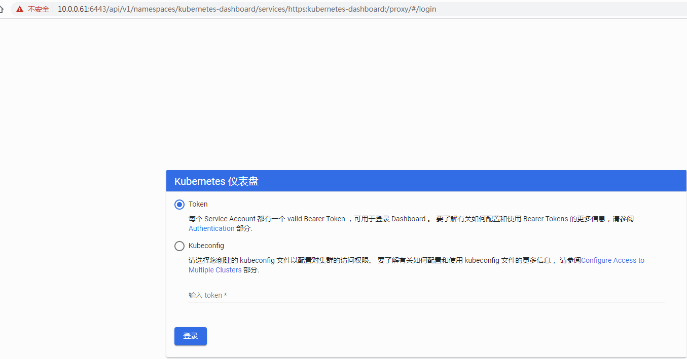
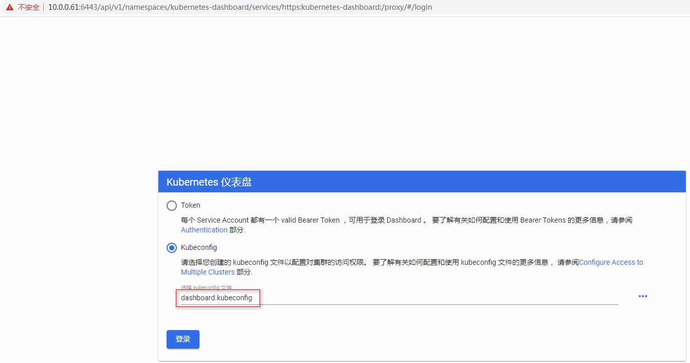
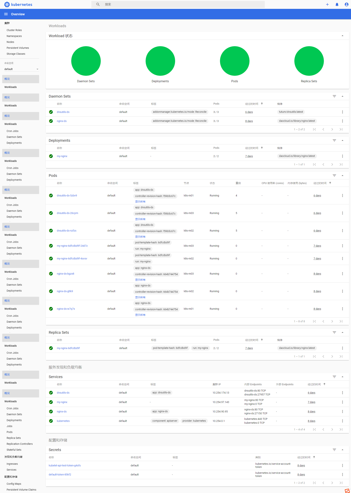

[TOC]


# Dashboard面板


## 1.2 Dashboard

Dashboard 是基于网页的 Kubernetes 用户界面。您可以使用 Dashboard 将容器应用部署到 Kubernetes 集群中，也可以对容器应用排错，还能管理集群本身及其附属资源。您可以使用 Dashboard 获取运行在集群中的应用的概览信息，也可以创建或者修改 Kubernetes 资源（如 Deployment，Job，DaemonSet 等等）。例如，您可以对 Deployment 实现弹性伸缩、发起滚动升级、重启 Pod 或者使用向导创建新的应用。

在kubernetes Dashboard中可以查看集群中应用的运行状态，也能够创建和修改各种kubernetes资源（比如Deployment，Job，Daemonset等等），用户可以对Deployment实现弹性伸缩，执行滚动升级，重启pod或者使用向导创建新的应用。

可以说，kubernetes Dashboard提供了kubectl的绝大部分功能。

- 全面的群集管理：命名空间，节点，窗格，副本集，部署，存储，RBAC创建修改等
- 快速且始终如一的即时更新：无需刷新页面即可查看最新信息
- 快速查看集群运行状况：实时图表可帮助快速跟踪性能不佳的资源
- 易于CRUD和扩展：加上内联API文档，可以轻松了解每个字段的作用
- 简单的OpenID集成：无需特殊代理

Dashboard 同时展示了kubernetes集群中的资源状态信息和所有报错信息。

官方参考文档：https://kubernetes.io/zh/docs/tasks/access-application-cluster/web-ui-dashboard/

GitHub项目下载地址：https://github.com/kubernetes/dashboard 

**1、部署Dashboard UI**

```bash
cd /opt/k8s/work
curl -o dashboard-recommended.yaml https://raw.githubusercontent.com/kubernetes/dashboard/v2.0.0-rc7/aio/deploy/recommended.yaml
```

 [dashboard-recommended.yaml](assets\dashboard-recommended.yaml) 

执行所有定义文件：

```bash
cd /opt/k8s/work
kubectl apply -f  dashboard-recommended.yaml
```

查看运行状态：

```bash
$ kubectl get pods -n kubernetes-dashboard
NAME                                        READY   STATUS    RESTARTS   AGE
dashboard-metrics-scraper-b68468655-vfnbf   1/1     Running   0          2m31s
kubernetes-dashboard-64999dbccd-tkvx2       1/1     Running   0          2m32s
```

查看`kubernetes-dashboard`信息：

```bash
$ kubectl get pod,deployment,svc -n kubernetes-dashboard
NAME                                            READY   STATUS    RESTARTS   AGE
pod/dashboard-metrics-scraper-b68468655-vfnbf   1/1     Running   0          9m44s
pod/kubernetes-dashboard-64999dbccd-tkvx2       1/1     Running   0          9m45s

NAME                                        READY   UP-TO-DATE   AVAILABLE   AGE
deployment.apps/dashboard-metrics-scraper   1/1     1            1           9m45s
deployment.apps/kubernetes-dashboard        1/1     1            1           9m45s

NAME                                TYPE        CLUSTER-IP       EXTERNAL-IP   PORT(S)    AGE
service/dashboard-metrics-scraper   ClusterIP   10.254.124.164   <none>        8000/TCP   9m45s
service/kubernetes-dashboard        ClusterIP   10.254.119.42    <none>        443/TCP    9m45s
```

**2、访问 dashboard**

从 1.7 开始，dashboard 只允许通过 https 访问，如果使用 kube proxy 则必须监听 localhost 或 127.0.0.1。对于 NodePort 没有这个限制，但是仅建议在开发环境中使用。对于不满足这些条件的登录访问，在登录成功后浏览器不跳转，始终停在登录界面。

**访问方式：**

Dashboard的github  https://github.com/kubernetes/dashboard/blob/master/docs/user/accessing-dashboard/1.7.x-and-above.md

- **kubectl proxy**：kubectl proxy在您的机器和Kubernetes API服务器之间创建代理服务器。默认情况下，只能在本地（从启动它的计算机上）访问它。

- **kubectl port-forward**：通过端口转发映射本地端口到指定的应用端口，从而访问集群中的应用程序(Pod)。

- **NodePort**：这种方法只推荐使用在一个node节点的方案，在大多数的环境都需要多个node节点，因此这种方法没有什么实用价值，不建议使用。

- **API Server**：如果Kubernetes API服务器是公开的并且可以从外部访问，则可以直接在以下位置访问仪表板： https://<master-ip>:<apiserver-port>/api/v1/namespaces/kubernetes-dashboard/services/https:kubernetes-dashboard:/proxy/

  注意：仅当您选择在浏览器中安装用户证书时，才可以使用这种方式访问Dashboard。在示例中，可以使用kubeconfig文件用于联系API服务器的证书。

- **Ingress**


访问： https://10.0.0.61:6443/api/v1/namespaces/kubernetes-dashboard/services/https:kubernetes-dashboard:/proxy/ 




**3、创建登录 Dashboard 的 token 和 kubeconfig 配置文件**

dashboard 默认只支持 token 认证（不支持 client 证书认证），所以如果使用 Kubeconfig 文件，需要将 token 写入到该文件。

**方式一：创建登录 token**

```bash
kubectl create sa dashboard-admin -n kube-system
kubectl create clusterrolebinding dashboard-admin --clusterrole=cluster-admin --serviceaccount=kube-system:dashboard-admin
ADMIN_SECRET=$(kubectl get secrets -n kube-system | grep dashboard-admin | awk '{print $1}')
DASHBOARD_LOGIN_TOKEN=$(kubectl describe secret -n kube-system ${ADMIN_SECRET} | grep -E '^token' | awk '{print $2}')
echo ${DASHBOARD_LOGIN_TOKEN}
```

则可以使用上面输出的token 登录 Dashboard。


**方法二：创建使用 token 的 KubeConfig 文件 （推荐使用这种方式）**

```bash
source /opt/k8s/bin/environment.sh
# 设置集群参数
kubectl config set-cluster kubernetes \
  --certificate-authority=/etc/kubernetes/cert/ca.pem \
  --embed-certs=true \
  --server=${KUBE_APISERVER} \
  --kubeconfig=dashboard.kubeconfig

# 设置客户端认证参数，使用上面创建的 Token
kubectl config set-credentials dashboard_user \
  --token=${DASHBOARD_LOGIN_TOKEN} \
  --kubeconfig=dashboard.kubeconfig

# 设置上下文参数
kubectl config set-context default \
  --cluster=kubernetes \
  --user=dashboard_user \
  --kubeconfig=dashboard.kubeconfig

# 设置默认上下文
kubectl config use-context default --kubeconfig=dashboard.kubeconfig

[root@ k8s-m01 ~]# ll
-rw-------  1 root root 3015 2020-04-19 10:44 dashboard.kubeconfig
```

用生成的 dashboard.kubeconfig 登录 Dashboard（其它API server节点也可以用）。

登录：






这里由于缺少Heapster或metrics-server插件，当前dashboard还不能展示 Pod、Nodes 的 CPU、内存等统计数据和图表。


