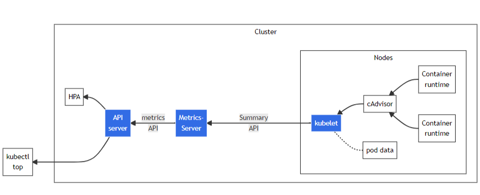
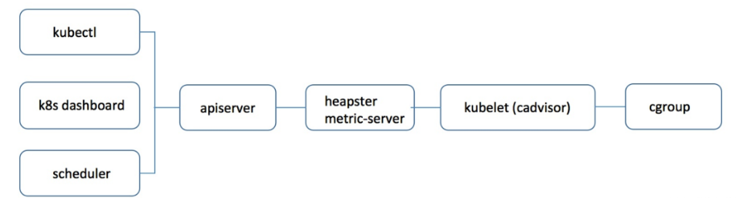

[TOC]


# Metrics Server监控数据采集


# 1、介绍


- 概念

Metrics Server 是 Kubernetes 集群核心监控数据的聚合器，Metrics Server 从 Kubelet 收集资源指标，并通过 Merics API 在 Kubernetes APIServer 中提供给缩放资源对象 HPA 使用。也可以通过 Metrics API 提供的 Kubectl top 查看 Pod 资源占用情况，从而实现对资源的自动缩放。

- 功能

主要是基于 Kubernetes 集群的 CPU、内存的水平自动缩放。可以支持多达 5000 个集群节点，每个节点的资源占用率非常低，Metrics Server 在每个节点上占用 0.5m CPU 和 4M 内存。

- 设计

Metrics Server 是 Kubernetes 监控组件中的重要一部分，Metrics Server 主要分为 API 和 Server 两大部分。其中 Metrics API 部分主要通过 APIServer 对外暴露 Pod 资源使用情况，比如：HPA、kubectl top、Kubernetes dashboard 等。Metrics Server 是根据 Kubernetes 监控架构进行实施，该组件会定期通过 Summary API 从 Kubelet 所在集群节点获取服务指标，然后将指标汇总、存储到内存中，仅仅存储指标最新状态，一旦重启组件数据将会丢失。现在通过 Metrics Server 采集到了数据，也暴露了 API 那么通过 kube-aggregator 统一把 API Server（/apis/metrics） 数据转发给 Metrics Server，最后通过 metrics api 统一暴露出去。


注意事项：

- `Kubernetes Metrics Server` 是 `Cluster` 的核心监控数据的聚合器，`kubeadm` 默认是不部署的。

- Metrics API 只可以查询当前的度量数据，并不保存历史数据。（实际是最近一次采集的数据，保存在内存中）
- 这些数据指标并非由metric-server本身采集，而是由每个节点上的cadvisor采集，metric-server只是发请求给cadvisor并将metric格式的数据转换成aggregate api
- `Metrics Server` 供 `Dashboard` 等其他组件使用，是一个扩展的 `APIServer`，依赖于 `API Aggregator`。所以，在安装 `Metrics Server` 之前需要先在 `kube-apiserver` 中开启 `API Aggregator`。（开启方法可以参考官方社区的文档）

项目地址：https://github.com/kubernetes-sigs/metrics-server ,目前稳定版本是v0.6.3。


- 原理
  Metrics server定时从Kubelet的Summary API(类似/ap1/v1/nodes/nodename/stats/summary)采集指标信息，这些聚合过的数据将存储在内存中，且以metric-api的形式暴露出去。

  Metrics server复用了api-server的库来实现自己的功能，比如鉴权、版本等，为了实现将数据存放在内存中吗，去掉了默认的etcd存储，引入了内存存储（即实现Storage interface)。

  因为存放在内存中，因此监控数据是没有持久化的，可以通过第三方存储来拓展。

来看下Metrics-Server的架构：


从 Kubelet、cAdvisor 等获取度量数据，再由metrics-server提供给 Dashboard、HPA 控制器等使用。本质上metrics-server相当于做了一次数据的转换，把cadvisor格式的数据转换成了kubernetes的api的json格式。由此我们不难猜测，metrics-server的代码中必然存在这种先从metric中获取接口中的所有信息，再解析出其中的数据的过程。我们给metric-server发送请求时，metrics-server中已经定期从中cadvisor获取好数据了，当请求发过来时直接返回缓存中的数据。


- 如何获取监控数据
  Metrics-Server通过kubelet获取监控数据。在1.7版本之前，k8s在每个节点都安装了一个叫做cAdvisor的程序，负责获取节点和容器的CPU，内存等数据；而在1.7版本及之后，k8s将cAdvisor精简化内置于kubelet中，因此可直接从kubelet中获取数据。


- 如何提供监控数据



Metrics-Server通过metrics API提供监控数据。

先说下API聚合机制，API聚合机制是kubernetes 1.7版本引入的特性，能将用户扩展的API注册至API Server上。

API Server在此之前只提供kubernetes资源对象的API，包括资源对象的增删查改功能。有了API聚合机制之后，用户可以发布自己的API，而Metrics-Server用到的metrics API和custom metrics API均属于API聚合机制的应用。

用户可通过配置APIService资源对象以使用API聚合机制，如下是metrics API的配置文件：

```yaml
apiVersion: apiregistration.k8s.io/v1beta1
kind: APIService
metadata:
  name: v1beta1.metrics.k8s.io
spec:
  service:
    name: metrics-server
    namespace: kube-system
  group: metrics.k8s.io
  version: v1beta1
  insecureSkipTLSVerify: true
  groupPriorityMinimum: 100
  versionPriority: 100

```

如上，APIService提供了一个名为v1beta1.metrics.k8s.io的API，并绑定至一个名为metrics-server的Service资源对象。

可以通过kubectl get apiservices命令查询集群中的APIService。

因此，访问Metrics-Server的方式如下：

```
/apis/metrics.k8s.io/v1beta1  --->   metrics-server.kube-system.svc  --->   x.x.x.x
 
+---------+       +-----------+                   +------------------------+        +-----------------------------+
| 发起请求 +----->+ API Server +----------------->+ Service：metrics-server +-------->+ Pod：metrics-server-xxx-xxx |
	
```

有了访问Metrics-Server的方式，HPA，`kubectl top`等对象就可以正常工作了。


# 2、安装 metric-server

https://github.com/kubernetes-sigs/metrics-server

- 下载 metrics 接口的部署文件components.yaml

```
wget https://github.com/kubernetes-sigs/metrics-server/releases/latest/download/components.yaml
```

兼容性：

| 指标服务器 | 指标 API 组/版本       | 支持的 Kubernetes 版本 |
| :--------- | :--------------------- | :--------------------- |
| 0.6.x      | metrics.k8s.io/v1beta1 | *1.19+                 |
| 0.5.x      | metrics.k8s.io/v1beta1 | *1.8+                  |
| 0.4.x      | metrics.k8s.io/v1beta1 | *1.8+                  |
| 0.3.x      | metrics.k8s.io/v1beta1 | 1.8-1.21               |


- 修改配置

（1）修改镜像地址

```bash
sed -i 's/registry.k8s.io\/metrics-server/registry.cn-hangzhou.aliyuncs.com\/google_containers/g' components.yaml
```

（2）禁用证书
kubelet 证书需要由集群证书颁发机构签名(或者通过向 Metrics Server 传递参数 --kubelet-insecure-tls 来禁用证书验证)。

**==由于是测试环境，我们选择使用参数禁用证书验证，生产环境不推荐这样做！！！==**

在大概 139 行的位置追加参数：

```yaml
spec:
      containers:
      - args:
        - --cert-dir=/tmp
        - --secure-port=4443
        - --kubelet-preferred-address-types=InternalIP,ExternalIP,Hostname
        - --kubelet-use-node-status-port
        - --metric-resolution=15s
        - --kubelet-insecure-tls
```

- apply 部署文件：

```bash
kubectl apply -f components.yaml
```


- 验证Metrics Server组件部署成功

（1）查看原生apiserver是否有metrics.k8s.io/v1beta1

```bash
[root@k8s-m01 ~]#  kubectl api-versions|grep metrics
metrics.k8s.io/v1beta1
```

可以看到metrics.k8s.io/v1beta1群组已经注册到原生apiserver上。

（2）查看metrics server pod是否运行正常

```bash
[root@k8s-m01 ~]# kubectl get pods -n=kube-system |grep metrics
metrics-server-6b6bdfcf4b-qx2zv   1/1     Running   0          10m
```

可以看到对应pod已经正常运行，接着查看pod日志，只要metrics server pod没有出现错误日志，或者无法注册等信息，就表示pod里的容器运行正常。

（3）使用kubectl top 命令查看pod的cpu ，内存占比，看看对应命令是否可以正常执行，如果Metrics Server服务有异常的话会报Error from server (ServiceUnavailable): the server is currently unable to handle the request (get nodes.metrics.k8s.io)错误。

```bash
[root@k8s-m01 ~]# kubectl top nodes
NAME      CPU(cores)   CPU%   MEMORY(bytes)   MEMORY%
k8s-m01   171m         4%     1695Mi          10%
k8s-m02   70m          1%     1283Mi          8%
k8s-m03   79m          1%     1287Mi          8%
[root@k8s-m01 ~]# kubectl top pod
No resources found in default namespace.
[root@k8s-m01 ~]# kubectl top pod -A
NAMESPACE      NAME                              CPU(cores)   MEMORY(bytes)
kube-flannel   kube-flannel-ds-8lzbt             10m          23Mi
kube-flannel   kube-flannel-ds-bwkc5             9m           25Mi
kube-flannel   kube-flannel-ds-mm87z             8m           24Mi
kube-system    coredns-7f89b7bc75-ktfpt          4m           12Mi
kube-system    coredns-7f89b7bc75-zjbxx          5m           14Mi
kube-system    etcd-k8s-m01                      15m          24Mi
kube-system    kube-apiserver-k8s-m01            57m          283Mi
kube-system    kube-controller-manager-k8s-m01   18m          51Mi
kube-system    kube-proxy-68dgg                  1m           16Mi
kube-system    kube-proxy-jnh5d                  1m           18Mi
kube-system    kube-proxy-x6nzh                  1m           17Mi
kube-system    kube-scheduler-k8s-m01            3m           22Mi
kube-system    metrics-server-6b6bdfcf4b-qx2zv   5m           24Mi
```

可以看到kubectl [top命令]可以正常执行，说明metrics server 部署成功没有问题。


