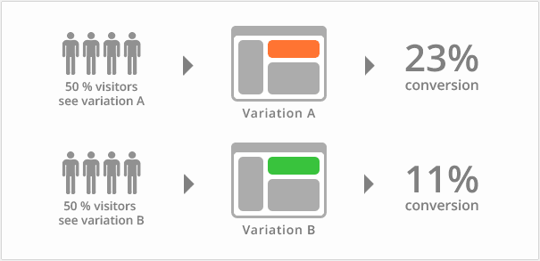

# 企业常见几种发布方式

**前言**

在软件上线之前，不可避免地要对软件的正确性、可靠性进行测试，又不希望停机维护、不影响用户体验，并且在新版本出现问题的时候能够及时回退。所以，需要有一套完整的部署方案，灰度发布、滚动发布、蓝绿部署都是常见的手段，而A/B测试则是对用户体验进行调查的测试手段，这里一并学习。

## 蓝绿发布

**（1）定义**

蓝绿部署是不停老版本，部署新版本然后进行测试。确认OK后将流量切到新版本，然后老版本同时也升级到新版本。

**（2）特点**

蓝绿部署无需停机，并且风险较小。

**（3）优势和不足**

- 优势
  升级切换和回退速度非常快。
- 不足
  切换是全量的，如果V2版本有问题，则对用户体验有直接影响。需要两倍机器资源。

**（4）发布过程**

①蓝绿发布的初始状态是两组服务器（简单理解为蓝色和绿色）都提供服务，且版本一致为v1。


②着步将蓝色服务器流量引向绿色服务器，直至全部流量都切换至绿色服务器，蓝色服务器不再提供任何服务；


③开始升级蓝色服务器的应用为v2，版本 v2 与 v1 不同(新功能、Bug修复等)；然后再将绿色服务器流量着步全量切换至蓝色服务器，直至绿色服务器不提供服务；


④两个版本并行运行一段时间，但是只有蓝色v2的应用提供服务，如果版本v2测试正常；就将绿色v1版本的应用升级至v2，并将部分流量重新引向绿色服务器，从而实现两组服务器提供v2版本的服务。如果v2测试异常，绿色v1版本不升级，并将流量迅速切换至绿色v1应用。


**（5）演示**

准备两套yaml文件

vim  [nginx-deployment-v1.yaml](yaml\nginx-deployment-v1.yaml) 

```yaml
apiVersion: apps/v1
kind: Deployment
metadata:
  name: nginx-deployment-v1
spec:
  selector:
    matchLabels:
      app: nginx
      version: "1.14.0"
  replicas: 5
  revisionHistoryLimit: 10
  strategy:
    rollingUpdate:
      maxSurge: 1
      maxUnavailable: 3
  template:
    metadata:
      labels:
        app: nginx
        version: "1.14.0"
    spec:
      terminationGracePeriodSeconds: 60
      containers:
        - name: nginx-deployment-v1
          image: nginx:1.14.0
          imagePullPolicy: IfNotPresent
          livenessProbe:
            httpGet:
              path: /
              port: 80
              scheme: HTTP
            initialDelaySeconds: 30
            timeoutSeconds: 5
            successThreshold: 1
            failureThreshold: 3
          readinessProbe:
            httpGet:
              path: /
              port: 80
              scheme: HTTP
            initialDelaySeconds: 15
            timeoutSeconds: 5
            successThreshold: 1
            failureThreshold: 3
          ports:
          - containerPort: 80
            name: nginx
```

vim  [nginx-deployment-v2.yaml](yaml\nginx-deployment-v2.yaml) 

```yaml
apiVersion: apps/v1
kind: Deployment
metadata:
  name: nginx-deployment-v2
spec:
  selector:
    matchLabels:
      app: nginx
      version: "1.20.0"
  replicas: 5
  revisionHistoryLimit: 10
  strategy:
    rollingUpdate:
      maxSurge: 1
      maxUnavailable: 3
  template:
    metadata:
      labels:
        app: nginx
        version: "1.20.0"
    spec:
      terminationGracePeriodSeconds: 60
      containers:
        - name: nginx-deployment-v2
          image: nginx:1.20.0
          imagePullPolicy: IfNotPresent
          livenessProbe:
            httpGet:
              path: /
              port: 80
              scheme: HTTP
            initialDelaySeconds: 30
            timeoutSeconds: 5
            successThreshold: 1
            failureThreshold: 3
          readinessProbe:
            httpGet:
              path: /
              port: 80
              scheme: HTTP
            initialDelaySeconds: 15
            timeoutSeconds: 5
            successThreshold: 1
            failureThreshold: 3
          ports:
          - containerPort: 80
            name: nginx

```


## 灰度发布/金丝雀发布

**（1）定义**

金丝雀发布是能够平滑过渡的一种发布方式，也是增量发布的一种类型，是在原有版本可用的情况下，同时部署一个新版本应用作为“金丝雀”，测试新版本的性能和表现，以保障整体系统稳定的情况下，尽早发现、调整问题。

金丝雀发布一般先发 1 台，或者一个小比例，例如 2% 的服务器，主要做流量验证用，也称为金丝雀 (Canary) 测试（国内常称灰度测试）。简单的金丝雀测试一般通过手工测试验证，复杂的金丝雀测试需要比较完善的监控基础设施配合，通过监控指标反馈，观察金丝雀的健康状况，作为后续发布或回退的依据。

**（2）发布规则**

在**更新时执行暂停（pause）或继续（resume）操作**，通过Service或Ingress资源和相关的路由策略将部分用户的请求流量引入到这些新的Pod之上进行发布验证，运行一段时间后，如果确定没有问题，即可使用`kubectl roollout resume`命令继续滚动更新过程。

**（3）发布过程**

灰度发布／金丝雀发布由以下几个步骤组成：
① 准备好部署各个阶段的工件，包括：构建工件，测试脚本，配置文件和部署清单文件。
② 从负载均衡列表中移除掉“金丝雀”服务器。
③ 升级“金丝雀”应用（排掉原有流量并进行部署）。
④ 对应用进行自动化测试。
⑤ 将“金丝雀”服务器重新添加到负载均衡列表中（连通性和健康检查）。
⑥ 如果“金丝雀”在线使用测试成功，升级剩余的其他服务器。（否则就回滚）灰度发布可以保证整体系统的稳定，在初始灰度的时候就可以发现、调整问题，以保证其影响度。


**（4）适用场景**
① 不停止老版本，另外搞一套新版本，不同版本应用共存。
② 灰度发布中，常常按照用户设置路由权重，例如90%的用户维持使用老版本，10%的用户尝鲜新版本。
③ 经常与A/B测试一起使用，用于测试选择多种方案。AB test就是一种灰度发布方式，让一部分用户继续用A，一部分用户开始用B，如果用户对B没有什么反对意见，那么逐步扩大范围，把所有用户都迁移到B上面来。

**（5）演示**

vim  [nginx-deployment-v3.yaml](yaml\nginx-deployment-v3.yaml) 

```yaml
apiVersion: apps/v1
kind: Deployment
metadata:
  name: nginx-deployment-v3
spec:
  selector:
    matchLabels:
      app: nginx
  replicas: 5
  revisionHistoryLimit: 10
  template:
    metadata:
      labels:
        app: nginx
    spec:
      terminationGracePeriodSeconds: 60
      containers:
        - name: nginx
          image: nginx:1.14.0
          imagePullPolicy: IfNotPresent
          livenessProbe:
            httpGet:
              path: /
              port: 80
              scheme: HTTP
            initialDelaySeconds: 30
            timeoutSeconds: 5
            successThreshold: 1
            failureThreshold: 3
          readinessProbe:
            httpGet:
              path: /
              port: 80
              scheme: HTTP
            initialDelaySeconds: 15
            timeoutSeconds: 5
            successThreshold: 1
            failureThreshold: 3
          ports:
          - containerPort: 80
            name: nginx
```

执行后，创建nginx为1.14.0版本；然后修改镜像版本为1.20.0后，进行更新：

```bash
$ kubectl create -f nginx-deployment-v3.yaml --record


$ kubectl set image deployment/nginx-deployment-v3 nginx=nginx:1.20.0 && kubectl rollout pause deployment nginx-deployment-v3

deployment.apps/nginx-deployment-v3 image updated
deployment.apps/nginx-deployment-v3 paused


$ kubectl get po|grep nginx-deployment-v3
nginx-deployment-v3-69757888f8-87scw   1/1     Terminating         0          51s
nginx-deployment-v3-69757888f8-fsvmz   0/1     ContainerCreating   0          1s
nginx-deployment-v3-69757888f8-j4nd5   1/1     Running             0          51s
nginx-deployment-v3-69757888f8-ktmvq   1/1     Running             0          51s
nginx-deployment-v3-69757888f8-lhmzz   1/1     Running             0          51s
nginx-deployment-v3-69757888f8-p7dwd   1/1     Running             0          51s
nginx-deployment-v3-d756d5979-lsx4s    0/1     ContainerCreating   0          1s
nginx-deployment-v3-d756d5979-lsxf9    0/1     ContainerCreating   0          1s

#会发现原来的pod销毁1个，然后新建了3个新的pod；查看详细会发现，新旧版本的nginx共同运行。
$ kubectl describe pod nginx-deployment-v3-d756d5979-6wx6c
Events:
  Type    Reason     Age    From               Message
  ----    ------     ----   ----               -------
  Normal  Scheduled  2m10s  default-scheduler  Successfully assigned default/nginx-deployment-v3-d756d5979-6wx6c to k8s-master40
  Normal  Pulled     2m8s   kubelet            Container image "nginx:1.20.0" already present on machine
  Normal  Created    2m7s   kubelet            Created container nginx
  Normal  Started    2m7s   kubelet            Started container nginx

# 如果并行运行一段时间，发现没有问题需要继续执行如下命令更新全部pod

$ kubectl rollout resume deployments nginx-deployment-v3
$ kubectl get pod|grep nginx-deployment-v3
nginx-deployment-v3-69757888f8-fsvmz   1/1     Terminating         0          3m51s
nginx-deployment-v3-69757888f8-j4nd5   1/1     Terminating         0          4m41s
nginx-deployment-v3-69757888f8-ktmvq   1/1     Running             0          4m41s
nginx-deployment-v3-69757888f8-lhmzz   1/1     Terminating         0          4m41s
nginx-deployment-v3-69757888f8-p7dwd   1/1     Running             0          4m41s
nginx-deployment-v3-d756d5979-2nxsc    0/1     ContainerCreating   0          1s
nginx-deployment-v3-d756d5979-lsx4s    1/1     Running             0          3m51s
nginx-deployment-v3-d756d5979-lsxf9    1/1     Running             0          3m51s
nginx-deployment-v3-d756d5979-qpzfv    0/1     ContainerCreating   0          1s
nginx-deployment-v3-d756d5979-spfzj    0/1     ContainerCreating   0          1s

 
# 验证镜像更新情况
$ for i in `kubectl get pod|grep nginx-deployment-v3|awk '{print $1}'`;do kubectl exec -it $i -- nginx -v;done
nginx version: nginx/1.20.0
nginx version: nginx/1.20.0
nginx version: nginx/1.20.0
nginx version: nginx/1.20.0
nginx version: nginx/1.20.0

#查看版本记录信息
$ kubectl rollout history deployments nginx-deployment-v3
$ kubectl rollout history deployments nginx-deployment-v3 --revision=2
deployment.apps/nginx-deployment-v3 with revision #2
Pod Template:
  Labels:	app=nginx
	pod-template-hash=d756d5979
  Annotations:	kubernetes.io/change-cause: kubectl create --filename=nginx-deployment-v3.yaml --record=true
  Containers:
   nginx:
    Image:	nginx:1.20.0
    Port:	80/TCP
    Host Port:	0/TCP
    Liveness:	http-get http://:80/ delay=30s timeout=5s period=10s #success=1 #failure=3
    Readiness:	http-get http://:80/ delay=15s timeout=5s period=10s #success=1 #failure=3
    Environment:	<none>
    Mounts:	<none>
  Volumes:	<none>

$ kubectl rollout history deployments nginx-deployment-v3 --revision=1
deployment.apps/nginx-deployment-v3 with revision #1
Pod Template:
  Labels:	app=nginx
	pod-template-hash=69757888f8
  Annotations:	kubernetes.io/change-cause: kubectl create --filename=nginx-deployment-v3.yaml --record=true
  Containers:
   nginx:
    Image:	nginx:1.14.0
    Port:	80/TCP
    Host Port:	0/TCP
    Liveness:	http-get http://:80/ delay=30s timeout=5s period=10s #success=1 #failure=3
    Readiness:	http-get http://:80/ delay=15s timeout=5s period=10s #success=1 #failure=3
    Environment:	<none>
    Mounts:	<none>
  Volumes:	<none>

# 如果发现版本有问题，也就是回退到--revision=1
$ kubectl rollout undo deployment/nginx-deployment-v3 --to-revision=1
$ for i in `kubectl get pod|grep nginx-deployment-v3|awk '{print $1}'`;do kubectl exec -it $i -- nginx -v;done
nginx version: nginx/1.14.0
nginx version: nginx/1.14.0
nginx version: nginx/1.14.0
nginx version: nginx/1.14.0
nginx version: nginx/1.14.0

```


## 滚动发布

在金丝雀发布基础上的进一步优化改进，是一种自动化程度较高的发布方式，用户体验比较平滑，是目前成熟型技术组织所采用的主流发布方式。

**（1）定义**

滚动发布，一般是取出一个或者多个服务器停止服务，执行更新，并重新将其投入使用。周而复始，直到集群中所有的实例都更新成新版本。这种部署方式相对于蓝绿部署，更加节约资源——它不需要运行两个集群、两倍的实例数。我们可以部分部署，例如每次只取出集群的20%进行升级。


**（2）发布过程**

①滚动式发布一般先发 1 台，或者一个小比例，如 2% 服务器，主要做流量验证用，类似金丝雀 (Canary) 测试。

②滚动式发布需要比较复杂的发布工具和智能 LB，支持平滑的版本替换和流量拉入拉出。

③每次发布时，先将老版本 V1 流量从 LB 上摘除，然后清除老版本，发新版本 V2，再将 LB 流量接入新版本。这样可以尽量保证用户体验不受影响。

④一次滚动式发布一般由若干个发布批次组成，每批的数量一般是可以配置的（可以通过发布模板定义）。例如第一批 1 台（金丝雀），第二批 10%，第三批 50%，第四批 100%。每个批次之间留观察间隔，通过手工验证或监控反馈确保没有问题再发下一批次，所以总体上滚动式发布过程是比较缓慢的 (其中金丝雀的时间一般会比后续批次更长，比如金丝雀 10 分钟，后续间隔 2 分钟)。

⑤回退是发布的逆过程，将新版本流量从 LB 上摘除，清除新版本，发老版本，再将 LB 流量接入老版本。和发布过程一样，回退过程一般也比较慢的。

⑥滚动式发布国外术语通常叫 `Rolling Update Deployment`。


**（3）优势和适用场合**

**优势：**

- 用户体验影响小，体验较平滑

**不足：**

- 发布和回退时间比较缓慢
- 发布工具比较复杂，LB 需要平滑的流量摘除和拉入能力

**适用场合：**

- 用户体验不能中断的网站业务场景
- 有一定的复杂发布工具研发能力；


**（4）演示**

vim  [nginx-deployment-v4.yaml](yaml\nginx-deployment-v4.yaml) 

```yaml
apiVersion: apps/v1
kind: Deployment
metadata:
  name: nginx-deployment-v4
spec:
  selector:
    matchLabels:
      app: nginx
  replicas: 5
  #滚动升级策略
  minReadySeconds: 5
  strategy:
    type: RollingUpdate
    rollingUpdate:
      maxSurge: 1
      maxUnavailable: 1
  revisionHistoryLimit: 10
  template:
    metadata:
      labels:
        app: nginx
    spec:
      terminationGracePeriodSeconds: 60
      containers:
        - name: nginx
          image: nginx:1.14.0
          imagePullPolicy: IfNotPresent
          livenessProbe:
            httpGet:
              path: /
              port: 80
              scheme: HTTP
            initialDelaySeconds: 30
            timeoutSeconds: 5
            successThreshold: 1
            failureThreshold: 3
          readinessProbe:
            httpGet:
              path: /
              port: 80
              scheme: HTTP
            initialDelaySeconds: 15
            timeoutSeconds: 5
            successThreshold: 1
            failureThreshold: 3
          ports:
          - containerPort: 80
            name: nginx


```

执行：

```bash
$ kubectl create -f nginx-deployment-v4.yaml --record
$ kubectl set image deployment/nginx-deployment-v4 nginx=nginx:1.20.0 && kubectl rollout pause deployment nginx-deployment-v4
$ for i in `kubectl get pod|grep nginx-deployment-v4|awk '{print $1}'`;do kubectl exec -it $i -- nginx -v;done
nginx version: nginx/1.20.0
nginx version: nginx/1.20.0
nginx version: nginx/1.20.0
nginx version: nginx/1.20.0
nginx version: nginx/1.20.0

#回滚与上边的发布方式一样。
```

- minReadySeconds：Kubernetes在等待设置的时间后才进行升级
  - 如果没有设置该值，Kubernetes会假设该容器启动起来后就提供服务了
  - 如果没有设置该值，在某些极端情况下可能会造成服务不正常运行
- maxSurge：升级过程中最多可以比原先设置多出的POD数量
  - 例如：maxSurage=1，replicas=5,则表示Kubernetes会先启动1一个新的Pod后才删掉一个旧的POD，整个升级过程中最多会有5+1个POD。
- maxUnavaible：升级过程中最多有多少个POD处于无法提供服务的状态
  - 当maxSurge不为0时，该值也不能为0。
  - 例如：maxUnavaible=1，则表示Kubernetes整个升级过程中最多会有1个POD处于无法服务的状态。


## A/B测试

首先需要明确的是，A/B测试和蓝绿部署以及金丝雀，完全是两回事。

蓝绿部署和金丝雀是发布策略，目标是确保新上线的系统稳定，关注的是新系统的BUG、隐患。

A/B测试是效果测试，同一时间有多个版本的服务对外服务，这些服务都是经过足够测试，达到了上线标准的服务，有差异但是没有新旧之分（它们上线时可能采用了蓝绿部署的方式）。

A/B测试关注的是不同版本的服务的实际效果，譬如说转化率、订单情况等。

A/B测试时，线上同时运行多个版本的服务，这些服务通常会有一些体验上的差异，譬如说页面样式、颜色、操作流程不同。相关人员通过分析各个版本服务的实际效果，选出效果最好的版本。



在A/B测试中，需要能够控制流量的分配，譬如说，为A版本分配10%的流量，为B版本分配10%的流量，为C版本分配80%的流量。

参考：

1. [Blue-green Deployments, A/B Testing, and Canary Releases](http://blog.christianposta.com/deploy/blue-green-deployments-a-b-testing-and-canary-releases/)
2. [BlueGreenDeployment](https://martinfowler.com/bliki/BlueGreenDeployment.html)
3. https://help.aliyun.com/document_detail/85948.html

