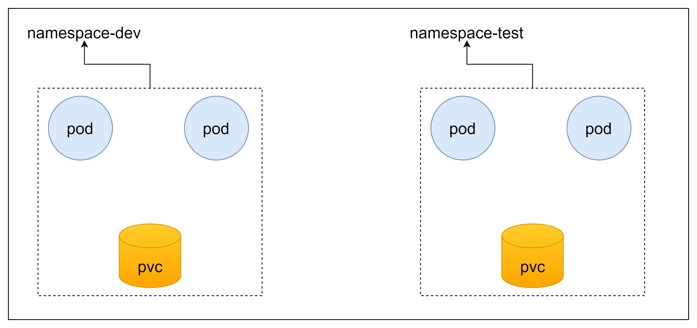

[TOC]


# Namespace命名空间

Namespace（命名空间）是Kubernetes系统中的另一个非常重要的概念，它的主要作用是:

- **资源隔离：**可为不同的团队/用户（或项目）提供虚拟的集群空间，共享同一个Kubernetes集群的资源。比如可以为团队A创建一个Namespacens-a，团队A的项目都部署运行在 ns-a 中，团队B创建另一个Namespacens-b，其项目都部署运行在 ns-b 中，或者为开发、测试、生产环境创建不同的Namespace，以做到彼此之间相互隔离，互不影响。我们可以使用 ResourceQuota 与 Resource LimitRange 来指定与限制 各个namesapce的资源分配与使用。
- **权限控制：**可以指定某个namespace哪些用户可以访问，哪些用户不能访问。

大多数的Kubernetes中的集群默认会有一个叫default的namespace。实际上，应该是3个：

- default：你的service和app默认被创建于此。
- kube-system：kubernetes系统组件使用。
- kube-public：公共资源使用。但实际上现在并不常用。

这个默认（default）的namespace并没什么特别，但不能删除它。这很适合刚刚开始使用kubernetes和一些小的产品系统。但不建议应用于大型生产系统。

此时还能结合k8s的资源配额机制，限定不同租户能占用的资源，例如cpu使用量，内存使用量等，来实现租户可用资源的管理：



  

# 1 Namespace资源的具体操作


## 1.1 查看namespace

k8s集群启动之后，默认会创建几个namespace：

```bash
$ kubectl get ns
NAME                   STATUS   AGE
default                Active   134d   #所有未指定namespace的对象都会被分配在default命名空间
kube-node-lease        Active   134d   #集群节点之间的心跳维护，v1.13开始引入
kube-public            Active   134d   #此命名空间下的资源可以被所有人访问（包括未认证用户）
kube-system            Active   134d   #所有由k8s系统创建的资源都处于这个命名空间

```

查看指定的ns:

```bash
#命令：kubectl get ns ns名称 -o 格式参数
#k8s支持的格式很多，比较常见的是wide、json、yaml

$ kubectl get ns default -o yaml
apiVersion: v1
kind: Namespace
metadata:
  creationTimestamp: "2021-04-06T09:11:44Z"
  managedFields:
  - apiVersion: v1
    fieldsType: FieldsV1
    fieldsV1:
      f:status:
        f:phase: {}
    manager: kube-apiserver
    operation: Update
    time: "2021-04-06T09:11:44Z"
  name: default
  resourceVersion: "158"
  selfLink: /api/v1/namespaces/default
  uid: 73980ea9-63d9-4a6d-b953-c09bddb5262d
spec:
  finalizers:
  - kubernetes
status:
  phase: Active

```

查看ns详情：

```bash
kubectl describe ns default
Name:         default
Labels:       <none>
Annotations:  <none>
Status:       Active     #Active 命名空间正在使用中，Terminating 正在删除命名空间
No resource quota.       #Resource quota 针对namespace做的资源限制
No LimitRange resource.  #LimitRange针对namespace的每个组件做的资源限制

```

查看ns关联的标签：

```bash
$ kubectl get ns  --show-labels
NAME                   STATUS   AGE    LABELS
default                Active   134d   <none>
kube-node-lease        Active   134d   <none>
kube-public            Active   134d   <none>
kube-system            Active   134d   <none>
kubernetes-dashboard   Active   133d   <none>
monitoring             Active   133d   <none>

```


## 1.2 创建使用

创建namespace只需一个很简单的命令，例如，创建一个名字为：test的namespace，执行：

```
kubectl create namespace test
```

或者使用yaml文件：

```yaml
  #test.yaml:

   kind: Namespace
   apiVersion: v1
   metadata:
    name: test
   labels:
    name: test

```

在namespace中创建资源，如下是一个简单的 Pod YAML文件:

```
apiVersion: v1
kind: Pod
metadata:
  name: mypod
  labels:
    name: mypod
spec:
  containers:
  - name: mypod
    image: nginx

```

你会发现没有提到namespace。如果你通过命令`kubectl apply` 来创建pod，它会在当前的命名空间中创建pod。这个命名空间就是defaut，除非你更改过。

有2种方法来指定资源的namespace：

1. `kubectl apply -f pod.yaml --namespace=test`
2. 在yaml中指定：

```yaml
apiVersion: v1
kind: Pod
metadata:
  name: mypod
  namespace: test
  labels:
    name: mypod
spec:
  containers:
  - name: mypod
    image: nginx

```


# 2 跨namespace通信

> Kubernetes的两个Service（ServiceA、ServiceB）和对应的Pod（PodA、PodB）分别属于不同的namespace名称空间，现需要PodA和PodB跨namespace名称空间并通过Service实现互访。应该如何实现？


